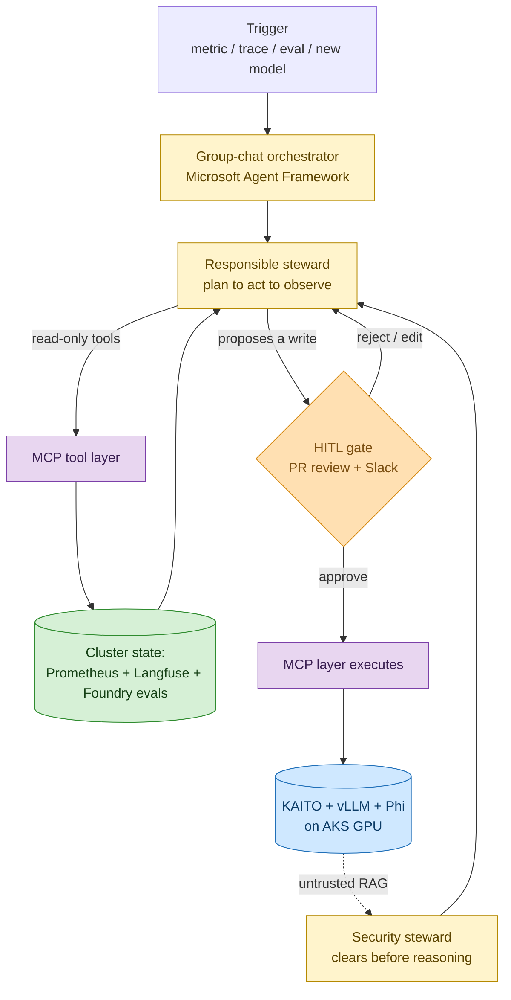
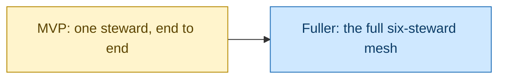
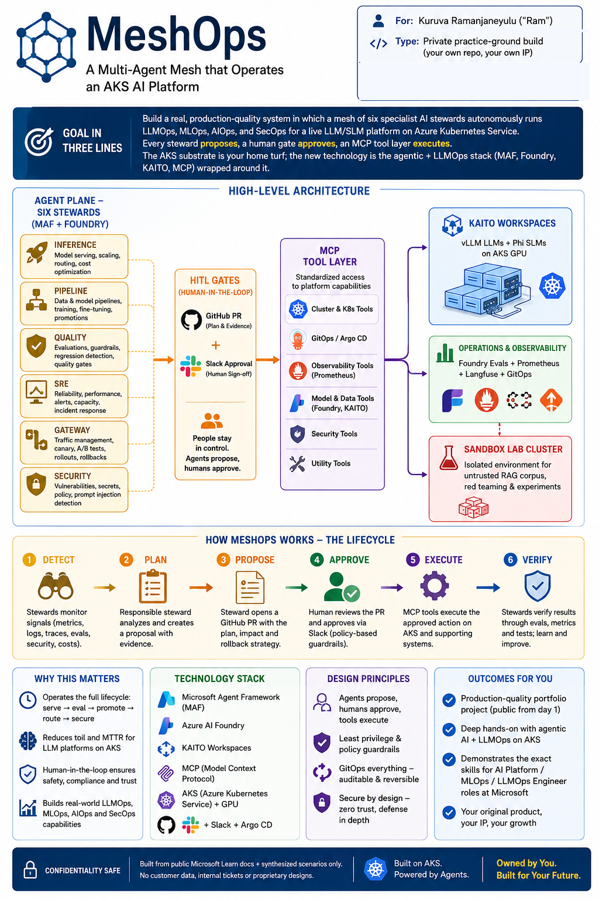

# MeshOps — A Mesh of AI Stewards That Runs an AKS AI Platform

**For:** Kuruva Ramanjaneyulu ("Ram") · **Type:** Private practice-ground build — your own repo, your own IP

> **Goal:** Build a real, production-quality system where a mesh of six specialist AI **stewards** runs the day-to-day operations of a live LLM/SLM platform on **Azure Kubernetes Service** — each one watching, reasoning, and proposing fixes, with a human always holding the final yes.
>
> **Why this one:** Kubernetes is your home turf after eleven years and a Kubestronaut belt. So the *new* thing you're learning here isn't the cluster — it's the agentic AI layer and the LLMOps/MLOps craft that sits on top of it. That's exactly the muscle an AI Platform / MLOps / LLMOps role screens for.
>
> **Outcome:** A public, whiteboard-ready portfolio piece — plus AI-300 and a couple of merged KAITO contributions — that makes the internal switch into an AI Platform role at Microsoft an easy story to tell.

---

## A 2 a.m. story

Picture the on-call engineer. It's the middle of the night and a pager goes off. A production LLM platform on AKS is misbehaving: p95 latency just doubled, a fine-tuned model is queued for promotion, a RAG corpus refreshed an hour ago, and the GPU nodepool is creeping toward saturation. Four different problems, four different specialties — serving, model lifecycle, reliability, security — and one tired human trying to context-switch between four dashboards while the clock runs.

This is not a rare night. **Operating an LLM platform is not one job; it's four jobs braided together** — LLMOps, MLOps, AIOps, and SecOps — and the questions arrive faster than any one person can answer them. *Is this fine-tune safe to promote? Should this traffic go to the small model or the large one? Why did latency jump? Did that RAG update just smuggle in a prompt injection?* These are the questions you already field at work every week. The painful part isn't that they're unanswerable. It's that they all land at once, on one person, with no help that actually *reasons*.

That's the problem MeshOps exists to solve.

## The insight

Years ago, the service-mesh idea solved a similar mess: instead of every microservice re-solving retries, routing, and security on its own, those cross-cutting concerns were lifted into a shared infrastructure plane. MeshOps borrows that exact move and applies it to *operations*. Instead of one overloaded human juggling four disciplines, MeshOps lifts each operational concern into its own small, sharp **AI steward** — an autonomous agent that watches its corner of the platform, reasons about what it sees, and proposes a fix.

But here's the line that makes this safe enough to be real: **autonomy lives at the *proposal* layer, never at the *actuation* layer.** A steward can investigate all night and draft a perfect remediation — but nothing touches the cluster until a human reviews it and clicks approve. The agents are tireless analysts; the human stays the decision-maker.

## Meet the six stewards

MeshOps is a *mesh* of six specialists, not one do-everything bot. Each owns a single operational concern, stays small enough to test on its own, and only teams up with the others when a job genuinely spans concerns. Here is the whole system in one picture before we walk through it.


*The whole-system picture: six stewards cover four operational disciplines, each running a plan → act → observe loop and proposing actions that a human gate approves before anything executes.*

The roster is locked at six, and each one maps cleanly onto a slice of your skills — some building on what you already know cold, two pushing you into deliberate new territory:

- **Inference** keeps the models served: KAITO workspace lifecycle, vLLM tuning, KV-cache routing, choosing the small model versus the large one. *Builds straight on your GPU-nodepool depth.*
- **Pipeline** runs the model lifecycle: fine-tune → evaluate → promote into the registry. *Builds on your GitOps experience.*
- **Quality** is the eval conscience: runs Ragas / Promptfoo / Foundry eval suites, catches drift, opens prompt-version PRs. *Deliberate first-time exposure to LLMOps eval.*
- **SRE** correlates the signals: Prometheus and Langfuse together, scaler tuning, drafting the postmortem. *Builds on your Prometheus/Grafana certs.*
- **Gateway** manages routing and cost: LiteLLM / Envoy AI Gateway config, A/B routes, budgets, fallback chains. *Builds on your serving and networking depth.*
- **Security** guards the trust boundary: prompt-injection-through-cluster-state, MCP confused-deputy defense, RAG-poisoning checks. *Deliberate first-time exposure to LLM security.*

Notice the design: the two stewards that stretch you most — Quality and Security — are the two that teach the genuinely new skills, while the other four let you lean on what you already do every day. Your learning budget goes where it counts.

## How a steward actually thinks

This is what makes MeshOps **genuinely agentic** and not a glorified chatbot. A steward doesn't fire off one prompt and return one answer. It runs a **plan → act → observe** loop: it forms a hypothesis, calls real tools to gather hard evidence from the cluster, looks at what came back, and iterates until it has a proposal it can defend. *Then* it stops and waits for a human.

Crucially, the stewards never poke the cluster with their own hands. Every read and every write goes through an **MCP tool layer** — a set of small, least-privilege tool servers (`AKS-MCP`, `GitHub-MCP`, `Foundry-MCP`, `Prometheus-MCP`, `Langfuse-MCP`, `LiteLLM-MCP`). MCP — the Model Context Protocol — is the 2026 standard for how agents talk to tools, and it's the single highest-signal skill this project adds to your CV. The MCP layer is the *only* thing that can change the cluster, and only after a human says yes.

Here is the lifecycle a single steward follows, from the first signal to the verified fix.



<details>
<summary>ASCII fallback</summary>

```
[Trigger: metric/trace/eval/new model]
        |
        v
[Group-chat orchestrator (MAF)] --> [Responsible steward: plan->act->observe]
        |  read-only tools                    ^
        v                                      |
   [MCP tool layer] --> [Cluster state: Prom/Langfuse/Foundry evals] ---+
        |
   steward proposes a write
        v
   {HITL gate: PR review + Slack}
        | reject/edit -> back to steward
        | approve
        v
   [MCP layer executes] --> [KAITO + vLLM + Phi on AKS GPU]
                                   : untrusted RAG
                                   v
                          [Security steward clears it before any steward reasons over it]
```

</details>

A few things hold this together. Every proposal is **grounded** in real signals — Prometheus metrics, Langfuse traces, eval scores — and in **runbook RAG** authored from public Microsoft Learn docs, so no steward acts on a hunch. The mesh keeps **memory**: short-term working state per task, plus a longer history of what was proposed, approved, or rejected, so it learns the platform's "normal." And there's a hard safety rule — **untrusted data** (the sandbox lab cluster, an external RAG update) only reaches a steward's reasoning *after* the Security steward has cleared it. That's the guardrail that stops a poisoned document from talking an agent into something stupid.

When a job spans several stewards — say, promoting a model, which needs Pipeline, Quality, Gateway, and SRE all in the loop — a thin **group-chat orchestrator** on Microsoft Agent Framework coordinates the handoff so each steward doesn't reinvent that plumbing. One steward, **Quality**, deliberately runs on the managed **Foundry Agent Service** instead of self-hosting, so your portfolio shows *both* hosting models and you can speak fluently to the trade-off.

One more deliberate choice worth saying out loud: **the stewards run on Azure OpenAI / Foundry, not on the KAITO-served models they operate.** That separation means the mesh stays alive and operable even when the workload it's babysitting is broken — exactly when you need it most.

## The stack, and why it's the right one

This is pinned to the **Microsoft / Azure first-party stack** on purpose. It *is* the toolchain an internal Microsoft AI-platform role builds on, and your tenant access — Azure OpenAI, Foundry, unlimited Copilot — means nothing here is a budget compromise.

- **Microsoft Agent Framework 1.0 (Python) + Semantic Kernel** is the agent runtime. MAF reached GA in early April 2026 (with further Agent Harness and Hosted Agent capabilities landing at Build 2026), and its group-chat and Magentic-One orchestration patterns are precisely the multi-agent shapes MeshOps needs. This is your first-time agentic exposure, on the framework Microsoft now treats as the default.
- **Azure AI Foundry + Foundry Agent Service** hosts the Quality steward and runs Foundry Evaluations for the eval gate.
- **KAITO + vLLM + the Phi family on AKS GPU** is the inference substrate being operated. KAITO v0.10.0 (released 2026-04-15) is a Microsoft-managed AKS add-on for LLM/SLM serving, fine-tuning, and RAG — sitting right next to your day-to-day.
- **The MCP tool layer** — six least-privilege tool servers — is the agent-to-tool integration standard, and the skill recruiters are scanning for.
- **Eval, observability, gateway, and lifecycle** round it out: Ragas + Promptfoo + Foundry Evals for quality gates; Prometheus + Grafana + Langfuse with OpenTelemetry for correlation; LiteLLM + Envoy AI Gateway for routing; Kubeflow / Foundry Prompt Flow + MLflow for the promotion path; GitOps for everything-as-code.

And because this is built like a real product, the **production concerns are named, not hand-waved**: identity through Microsoft Entra ID (Entra Agent ID for the stewards in the advanced track); privacy through public-data-only inputs and a sandbox resource group isolated by private endpoints and NSGs; reliability through bounded retries, the human gate, and an immutable audit log; scaling through KEDA-driven autoscaling of KAITO workloads and a GPU-spot strategy; and security modeled against the OWASP LLM Top-10 plus multi-agent extensions.

## Operational readiness — the disciplines this product lives under

Because MeshOps is itself an operations product, it has to name the operational disciplines it practices, and be honest about which the MVP tackles versus which wait. Not all seven AI \*Ops disciplines apply — these three genuinely do:

- **AgentOps** *(MVP)* — the home discipline for an agentic build. Tracing every plan → act → observe step, logging each MCP tool call, replaying a run, and evaluating multi-step behavior. The MVP wires this in from the first steward, because you can't trust what you can't trace.
- **LLMOps** *(MVP, deepening into the fuller product)* — the foundation-model layer: prompt management, eval and regression suites, guardrails, and token-cost control. The MVP exercises the eval gate and guardrails on one steward; the fuller product makes Quality's full eval-and-drift suite the spine of the mesh.
- **SecOps** *(partly MVP, mostly deferred)* — the security discipline the Security steward owns: prompt-injection-through-cluster-state, MCP confused-deputy defense, and RAG-poisoning checks. The MVP enforces the untrusted-data clearing rule as a guardrail; the full threat-model coverage and the dedicated Security steward arrive with the fuller product.

MLOps lifecycle work (Pipeline's fine-tune → promote → register path) and AIOps correlation (SRE's signal-joining) are real parts of the product, but they ride *on top of* these three operational disciplines rather than adding new \*Ops practices of their own.

## What gets built — MVP first, then the full mesh



<details>
<summary>ASCII fallback</summary>

```
[MVP: one steward, end to end] --> [Fuller: the full six-steward mesh]
```

</details>

The **MVP** is one steward — **Inference**, the natural first because it's closest to what you already know — running the whole loop on a real lab AKS cluster. It observes a genuine KAITO/vLLM symptom through MCP, plans, proposes a concrete remediation, routes it through the human gate, and lets the MCP layer apply it on approval, with the action logged immutably. That single slice proves the four things that matter: the agent loop, the MCP tool boundary, the human gate, and a system actually deployed on AKS.

The **fuller product** brings all six stewards into the mesh, with the group-chat orchestrator driving a real cross-steward flow — a model promotion that runs Pipeline → Quality eval → Gateway canary → SRE watch → human-approved ramp. The eval gate, drift detection, cost budgets, and the Security steward's clearing path all come alive. Alongside it sit the two satellite wins your goals reward: **AI-300 certification** (DP-100 retired 2026-06-01; AI-300 covers exactly this MLOps lifecycle) and **two or three merged KAITO upstream PRs** as recognized internal-mobility signal.

These are functional milestones, not a calendar. The phase-by-phase plan already lives in `035_others/ai-career-roadmap.md`; this proposal only needs you to approve the *shape*. The infographics below capture that shape end to end.



*One-page digest: the high-level architecture and the Detect → Plan → Propose → Approve → Execute → Verify lifecycle every steward runs.*

## Why you're the right person to build this

Most engineers attempting MeshOps would drown in the Kubernetes substrate and never reach the agentic layer. You start where they'd end. Eleven-plus years on AKS / ARO / GPU nodepools at Microsoft, a Kubestronaut belt (CKA / CKAD / CKS / KCNA / KCNC), Istio and Prometheus certs, AI-900 done and AI-300 in sight — the cluster is the part you don't have to learn. That's the whole point: this is a **private practice ground** where the new technology is the agentic AI and LLMOps craft, built fresh as your own original product on a foundation you already own. It's public from day one and built only from public Microsoft Learn docs and synthesized scenarios — none of your day-job tickets, customer cases, or cluster names ever appear here.

## What success looks like

Success isn't a feature count — it's your career switch. By the end you can demonstrate, on the job description's own terms, every skill these roles screen for: agentic frameworks, LLM serving on Kubernetes, the MLOps lifecycle, LLMOps eval, AIOps correlation, and LLM security — each one anchored in a steward that actually runs. You can stand at a whiteboard and explain the plane model, the proposal-versus-actuation boundary, the MCP trust boundary, and every trade-off you made — which is precisely what an AI-platform interview turns into. And you have public proof: a GitHub repo, a live demo on a real AKS lab cluster, AI-300 certified, and KAITO PRs merged. The outcome that all of it serves is the one in your goal file — the internal switch into an AI Platform / MLOps / LLMOps role at Microsoft.

## What happens next

This is the front door to a design layer that already exists in `035_others/`. Read it, and either approve the idea or send edits. On your **yes**, we move from pitch to **detailed iteration planning**: the MVP slice (Inference steward, end to end), its acceptance criteria, the lab-cluster and MCP scaffold, and the iteration-1 build docs. Then you build the MVP, prove the loop and the gate on a real cluster, and extend toward the full six-steward mesh — picking up AI-300 and the KAITO PRs along the way.

---
**Sources**

*Repo files:* `035_others/{vision,architecture,agent-catalog,tech-stack,eval-and-llmops,threat-model,cost-and-deployment}.md` · `035_others/ai-career-roadmap.md` · `README.md` · `CLAUDE.md`

*Web:*
- [Microsoft Agent Framework 1.0 GA — DevBlogs](https://devblogs.microsoft.com/agent-framework/microsoft-agent-framework-version-1-0/)
- [Microsoft Agent Framework at Build 2026 — Agent Harness, Hosted Agents, CodeAct](https://devblogs.microsoft.com/agent-framework/microsoft-agent-framework-at-build-2026-announce/)
- [microsoft/agent-framework (GitHub)](https://github.com/microsoft/agent-framework)
- [KAITO project (GitHub) — v0.10.0, 2026-04-15](https://github.com/kaito-project/kaito)
- [AKS AI toolchain operator (KAITO) add-on — Microsoft Learn](https://learn.microsoft.com/en-us/azure/aks/ai-toolchain-operator)
- [Autoscale KAITO inference on AKS with KEDA — AKS Engineering Blog](https://blog.aks.azure.com/2026/02/03/autoscale-inference-workloads-with-kaito)
- [New AI-300 MLOps Engineer Associate certification (DP-100 retires 2026-06-01)](https://techcommunity.microsoft.com/blog/skills-hub-blog/new-certification-for-machine-learning-operations-mlops-engineers/4494111)
- [Model Context Protocol](https://modelcontextprotocol.io)

*Stack default:* Microsoft Agent Framework 1.0 + Semantic Kernel · Azure OpenAI / Foundry (steward substrate) · KAITO + vLLM + Phi on AKS GPU (workload) · MCP tool layer · Foundry Evals / Ragas / Promptfoo · Prometheus + Grafana + Langfuse · LiteLLM + Envoy AI Gateway · KEDA autoscaling · GitOps
