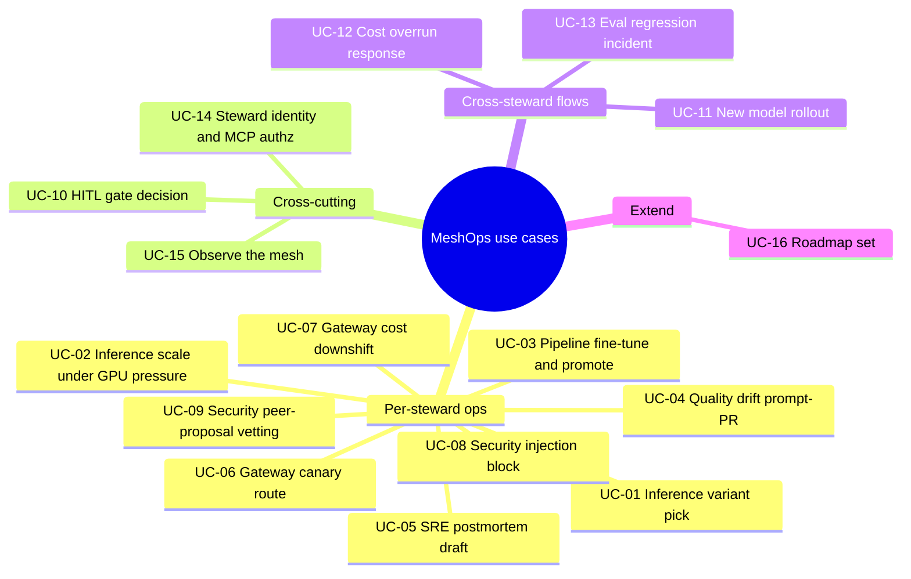
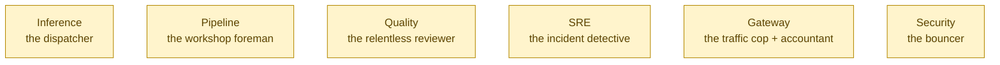
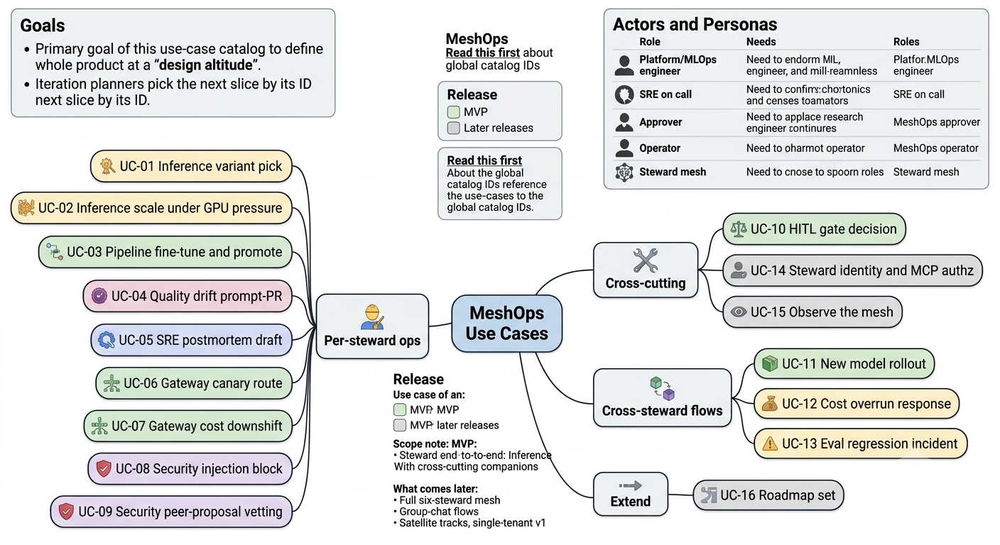
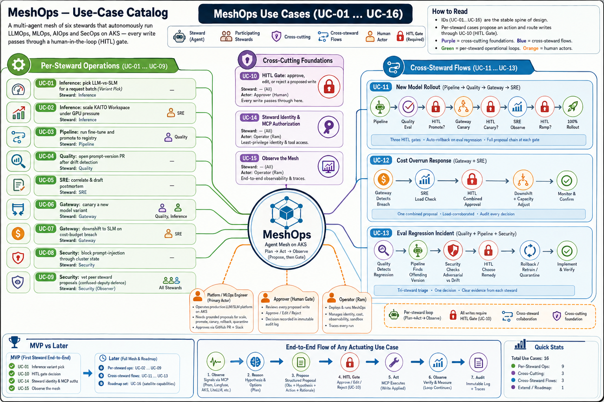

# MeshOps — Use-Case Catalog (The Storybook)

> **Document:** MeshOps use-case catalog — the whole-product catalog of what the mesh does, every case at design altitude.
>
> **Audience:** Ram, who is building MeshOps, and the iteration planner that slices one use case at a time.
>
> **Goal:** by the end of this doc you should be able to *tell the story* of every job MeshOps does — who triggers it, which steward owns it, where the plan→act→observe loop runs, and where the human gate sits — without yet writing a line of code. The iteration planner picks the next slice **by ID** and expands it into a full per-slice spec.

---

> **Read this first.** Picture this catalog as a cast list with scene summaries, not a screenplay. The IDs below (`UC-01 … UC-16`) are the **stable spine** of the whole `030_design/` layer — the PRD, the architecture, and the tech-stack docs all point back to these same IDs. They are **global catalog IDs**. The older steward IDs in `035_others/use-cases.md` (`UC-1…UC-6`, `X-1…X-3`) map onto this catalog (see §6); per-iteration docs under `040_iterations/` mint their own *local* IDs — those are different and live inside each iteration folder. Once an iteration has been sliced from a catalog ID, that ID never gets renumbered; we only ever append new ones.

<!-- export-png: 01_use_cases-mindmap.png -->



<details>
<summary>ASCII fallback</summary>

```
MeshOps use cases
├── Per-steward ops
│   ├── UC-01 Inference variant pick            (Inference)
│   ├── UC-02 Inference scale under GPU pressure (Inference → SRE escalation)
│   ├── UC-03 Pipeline fine-tune and promote     (Pipeline + Quality)
│   ├── UC-04 Quality drift prompt-PR            (Quality)
│   ├── UC-05 SRE postmortem draft               (SRE)
│   ├── UC-06 Gateway canary route               (Gateway + Quality, Inference)
│   ├── UC-07 Gateway cost downshift             (Gateway)
│   ├── UC-08 Security injection block           (Security)
│   └── UC-09 Security peer-proposal vetting     (Security observer)
├── Cross-cutting
│   ├── UC-10 HITL gate decision                 (all stewards)
│   ├── UC-14 Steward identity and MCP authz     (all stewards)
│   └── UC-15 Observe the mesh                   (operator)
├── Cross-steward flows
│   ├── UC-11 New model rollout      (Pipeline → Quality → Gateway → SRE)
│   ├── UC-12 Cost overrun response  (Gateway + SRE)
│   └── UC-13 Eval regression incident (Quality + Pipeline + Security)
└── Extend
    └── UC-16 Roadmap set (AI-300, KAITO PRs, Entra Agent ID, multi-tenant, multi-cluster)
```

</details>

## 1. The cold open

It's 2 a.m. A batch of two hundred requests lands on the platform, and a GPU-utilisation alert fires almost at the same moment — the served LLM is starting to choke. Somewhere a model that shipped last week has quietly begun drifting in quality, its answers slowly drifting away from the source. And in a third corner, a freshly opened pull request adds an innocent-looking runbook to the knowledge base — except buried in its prose is a sentence that, if any agent reads it as an instruction, would hand an attacker the keys.

Three crises, three completely different disciplines, all at once, and one tired human who can't possibly hold serving, lifecycle, incidents, *and* security in their head at the same time.

That's the world MeshOps lives in. Instead of one overworked generalist, MeshOps fields **six specialist stewards** — each one wide awake, each one watching a single slice of the platform, each one able to *propose* a fix but never to *pull the trigger alone*. This document is the cast list and the scene catalog: every job the mesh knows how to do, told as a short scene so you can picture it before you build it.

## 2. Meet the six stewards

Before the scenes, meet the characters. Each steward is a small, sharp AI agent that owns exactly one operational surface and speaks one operational language fluently.

**Inference** is the front-line dispatcher — the one who decides, request by request, whether a job goes to the powerful-but-pricey LLM or the lean-and-fast SLM, and when to ask for more GPU. Inference is the MVP steward and the one closest to Ram's day-job home turf. **Pipeline** is the workshop foreman: it takes a new dataset, runs a fine-tune, and only ever *proposes* promoting the result once Quality has signed off. **Quality** is the relentless reviewer — it watches yesterday's traces, smells drift before anyone else, and never edits a prompt by hand; every prompt change it wants becomes a pull request with the before/after numbers attached. **SRE** is the incident detective: when p95 spikes or a pod OOMs, SRE correlates metrics and traces and writes the postmortem draft while the trail is still warm. **Gateway** is the traffic cop and the accountant rolled into one — it canaries new variants in careful stages and downshifts expensive traffic to cheaper models when the budget is bleeding. And **Security** is the bouncer at the door: every scrap of untrusted data passes through Security's scan before any other steward is allowed to reason over it, and Security quietly vets every proposal its peers make before a human ever sees it.



<details>
<summary>ASCII fallback</summary>

```
Inference — the dispatcher (LLM vs SLM, GPU pressure)         [MVP steward]
Pipeline  — the workshop foreman (fine-tune, propose promote)
Quality   — the relentless reviewer (drift, prompt-as-code PRs)
SRE       — the incident detective (correlate, postmortem)
Gateway   — the traffic cop + accountant (canary, cost downshift)
Security  — the bouncer (clear untrusted data, vet peer proposals)
```

</details>

The one rule that binds all six: **autonomy lives at the *proposal* layer, never at the *actuation* layer.** A steward can observe, reason, and propose all day long on its own. But the moment it wants to *write* anything to the cluster, that write stops dead at a human-in-the-loop gate — a GitHub PR plus a Slack approval — before the tool layer is ever allowed to execute it (ADR-0001, planned ADR-0011).

## 3. Why these scenes exist

Every scene in this catalog earns its place by teaching Ram something on the way to a specific career goal: reach proficient **AI/ML + MLOps/LLMOps** depth, build a strong public GitHub portfolio, and switch into an **AI Platform / MLOps / LLMOps Engineer** role with a Microsoft/Azure focus — most likely an internal Microsoft switch. The AKS substrate underneath is already Ram's home turf (11+ years, Kubestronaut); the genuinely *new* learning lives in the **agentic + LLMOps layer**. So each use case is chosen to exercise one teachable operational surface end to end, from observation all the way to the gate.

"Design altitude" is the height we're flying at here. Each scene names its driving steward and any participating stewards, who triggers it, the one-line happy path, the alternates and exceptions *by name only*, the **agentic behavior** it exercises (where the plan→act→observe loop runs, which MCP tools ground it, which guardrails fence it), and **coarse, testable acceptance criteria**. The iteration planner is the one who later swoops down low, refines those criteria, and expands the flows when it slices a scene into a build.

## 4. The cast on stage — the use-case map

Here is the whole cast in one frame. The platform engineer, the operator (Ram), and the approver each reach into the mesh from different angles; every steward loop that proposes a write funnels into the single amber gate (UC-10); and the cross-steward flows stitch several stewards into one story.

```mermaid
flowchart TB
    classDef agent fill:#FFF4CC,stroke:#B58900,color:#5C4400
    classDef workload fill:#CFE8FF,stroke:#1F6FB8,color:#0B3B66
    classDef ops fill:#D6F0D6,stroke:#2E8B2E,color:#143F14
    classDef mcp fill:#E8D6F0,stroke:#7B3FA8,color:#3A1F52
    classDef gate fill:#FFE0B2,stroke:#D68910,color:#7B4F12
    classDef sandbox fill:#FFD6D6,stroke:#B22222,color:#5A0F0F

    ENG([Platform/MLOps engineer]):::ops
    OPS([Operator / Ram]):::ops
    APP([Approver]):::gate

    subgraph Stewards["Agent plane — six stewards"]
        UC01[UC-01 Inference variant pick]:::agent
        UC02[UC-02 Inference scale]:::agent
        UC03[UC-03 Pipeline fine-tune+promote]:::agent
        UC04[UC-04 Quality drift prompt-PR]:::agent
        UC05[UC-05 SRE postmortem]:::agent
        UC06[UC-06 Gateway canary]:::agent
        UC07[UC-07 Gateway cost downshift]:::agent
        UC08[UC-08 Security injection block]:::agent
        UC09[UC-09 Security peer-vetting]:::agent
    end
    subgraph Gate["Cross-cutting"]
        UC10[UC-10 HITL gate decision]:::gate
        UC14[UC-14 Identity + MCP authz]:::mcp
        UC15[UC-15 Observe the mesh]:::ops
    end
    subgraph Flows["Cross-steward flows"]
        UC11[UC-11 New model rollout]:::workload
        UC12[UC-12 Cost overrun]:::workload
        UC13[UC-13 Eval regression]:::workload
    end
    UC16[UC-16 Roadmap set]:::sandbox

    ENG --> UC01 & UC03 & UC06
    OPS --> UC14 & UC15 & UC16
    APP --> UC10
    UC01 --> UC02
    UC03 --> UC11
    UC06 --> UC11 --> UC10
    UC04 --> UC13
    UC07 --> UC12 --> UC10
    UC08 --> UC09
    UC01 & UC03 & UC04 & UC05 & UC06 & UC07 & UC08 --> UC10
    UC14 --> UC10
```



<details>
<summary>ASCII fallback</summary>

```
Platform engineer ─> UC-01 variant pick / UC-03 fine-tune / UC-06 canary
Operator (Ram)    ─> UC-14 identity+authz / UC-15 observe / UC-16 roadmap
Approver          ─> UC-10 HITL gate decision

Per-steward loops (UC-01..UC-09) all funnel proposed WRITES into → UC-10 HITL gate.
Cross-steward flows: UC-03→UC-11 rollout; UC-07→UC-12 cost; UC-04→UC-13 eval regression.
Cross-cutting: UC-14 identity gates every MCP call; UC-15 traces every loop.
Every write action passes through UC-10 before MCP executes it.
```

</details>

And here are two at-a-glance infographics of the same cast — scan these first, then read the scenes. The first is the compact overview: the four UC groups, the actors, and the MVP-vs-later split on a single screen.



The second is the full catalog: every case from UC-01 to UC-16, with driving and participating stewards, the cross-steward flows, the HITL gates, and the end-to-end actuation flow drawn out.



## 5. The actors

A quick who's-who of the people (and the one non-person actor) who set these scenes in motion.

The **Platform / MLOps engineer** is our protagonist — they run a production LLM/SLM platform on AKS and live with GPU pressure, serving regressions, model promotions, cost drift, and prompt changes. What they want from MeshOps is a mesh that watches the platform, surfaces grounded *proposals* (scale, promote, canary, rollback, quarantine), and always lets a human approve before anything is applied. The **SRE on call** owns the dreaded "why did p95 jump?" question and the postmortem that follows; they want correlated Prometheus and Langfuse evidence and a drafted incident doc fast, without dashboard-hopping across four specialties. The **Approver** is the human gate — often the same engineer wearing a different hat — who reviews and approves, rejects, or edits every proposed write; they want a clear proposal (observation, hypothesis, concrete action, rationale, evidence) to act on over a GitHub PR plus Slack, backed by an immutable audit trail. The **Operator** is Ram himself: he deploys and runs the mesh and owns identity, cost, observability, and the lab-sandbox isolation; he wants a reproducible Azure deploy, scale-to-zero GPU, per-steward least-privilege identity, and a traceable run history for every decision.

And then there's the **steward mesh** — the six stewards plus a thin group-chat orchestrator. They aren't people, but they genuinely *act*: they plan, call tools, observe, iterate, and then stop at the gate. What they need is grounded signals (Prometheus, Langfuse, Foundry evals), runbook-RAG context, least-privilege MCP tools, durable working state, and a hard stop at the HITL gate.

> **Scope note (MVP vs. later).** The MVP is **one steward end-to-end** — **Inference**, because it sits closest to Ram's GPU-nodepool depth — running the full observe→propose→gate→act loop on a real lab AKS cluster, with the HITL gate (UC-10), steward identity (UC-14), and run observability (UC-15) as its cross-cutting companions. The full six-steward mesh, the cross-steward flows (UC-11..UC-13), and the satellite tracks (UC-16) come **later**. Single tenant in v1 (ADR-0001 roster locked at six; multi-tenant is roadmap). Confidentiality is bound by design: the runbook RAG corpus is **public Microsoft Learn docs + synthesized scenarios only** — never proprietary day-job content (`CLAUDE.md` §Confidentiality).

## 6. The scenes

Each scene below opens on a moment, then tells you who handles it and how. **Release** tags: `MVP` is the first-steward-end-to-end committed path; `Later` is the fuller six-steward mesh and the roadmap. Every steward scene that proposes a *write* ends at **UC-10 (the HITL gate)**; read-only conclusions ("cluster looks healthy") skip the gate entirely.

### UC-01 — Inference picks LLM-vs-SLM for an incoming batch

*A wave of two hundred requests hits the platform and the GPU starts to sweat. Inference leans in.*

- **Driving steward:** Inference · **Participating:** — · **-Ops surface:** LLMOps (serving) · **Primary actor:** Inference Steward · **Release:** MVP
- **The scene:** A batch arrives (or a GPU-utilisation alert fires), and Inference has to decide how to split the work between the served LLM (vLLM) and the SLM (Phi-4-mini).
- **How it plays out:** Inference reads KV-cache utilisation, p95 latency, and the current variant through read-only MCP tools, reasons over which requests an SLM can serve without quality loss, and **proposes** a route split (say, 130 to the SLM, 70 to the LLM) plus a scale change. The human approves, and only then does MCP apply the routing and the scale.
- **When the plot twists (named):** the proposed scale exceeds GPU quota (escalate to SRE, UC-02); the SLM is projected to regress quality (hand off to Quality); there's no batch and the system is steady (read-only "healthy", no gate); an MCP read fails (surface it, never guess).
- **The agentic move:** this is the canonical **plan→act→observe** loop — read-only tool calls (`AKS-MCP`, `Prom-MCP`, `Langfuse-MCP`) gather the evidence, the steward emits a structured `{observation, hypothesis, proposed_actions[], rationale, requires_hitl}` proposal, and the actual write (`AKS-MCP` scale + `LiteLLM-MCP` route) is **gated**. It grounds on live signals, never on memory.
- **How we'll know it works (coarse):** given real KV-cache and latency signals, Inference returns a concrete route/scale proposal with rationale; the write applies **only** after HITL approval; a quota-exceeding proposal escalates instead of applying; the action lands in the immutable audit log.

### UC-02 — Inference scales a KAITO Workspace under GPU pressure

*The queue depth keeps climbing and won't come down. Inference needs more muscle.*

- **Driving steward:** Inference · **Participating:** SRE (on quota escalation) · **-Ops surface:** LLMOps (serving) · **Primary actor:** Inference Steward · **Release:** Later
- **The scene:** Sustained GPU pressure or queue depth on a KAITO Workspace.
- **How it plays out:** Inference observes the pressure via `Prom-MCP` and `AKS-MCP`, proposes a replica scale (or a KAITO Workspace CR patch), the human approves, MCP patches the Workspace, and KEDA/NAP provisions GPU.
- **When the plot twists (named):** the scale would blow past the subscription GPU quota (SRE escalation + cost check); a spot eviction strikes mid-scale; cold-start latency on scale-from-zero; downscale-to-zero when idle.
- **The agentic move:** plan→act→observe with a **bounded** action — the scale is hard-capped by GPU quota *server-side at the MCP layer*, not by trusting the prompt. Escalation to SRE is a structured steward-to-steward handoff.
- **How we'll know it works (coarse):** a real pressure signal yields a bounded scale proposal that never exceeds quota; approval applies the patch and the change shows up in Prometheus; downscale-to-zero returns the spot GPU node.

### UC-03 — Pipeline runs a fine-tune and proposes a promotion

*A new dataset version lands in the bucket. The workshop foreman rolls up its sleeves.*

- **Driving steward:** Pipeline · **Participating:** Quality (eval gate) · **-Ops surface:** MLOps · **Primary actor:** Pipeline Steward · **Release:** Later
- **The scene:** A new dataset version arrives (or a retraining cron fires).
- **How it plays out:** Pipeline launches a QLoRA fine-tune (Foundry Prompt Flow → Kubeflow GPU-spot job); the trained adapter comes back; Pipeline hands it to **Quality** for the gate suite; on a pass, Pipeline **proposes** registry promotion with a `staging` tag; the human approves; it registers in MLflow.
- **When the plot twists (named):** the eval regresses (abandon, make no proposal); the fine-tune job fails (SRE); a duplicate or identical adapter; a GPU-spot eviction mid-training.
- **The agentic move:** a multi-stage loop with a **participating-steward handoff** (Pipeline → Quality) — Pipeline only *proposes* promotion after Quality returns a pass. The experiment runs are ungated; the registry write is **gated**. It grounds on real eval scores, not assumptions.
- **How we'll know it works (coarse):** a dataset bump triggers a fine-tune; promotion is proposed **only** after a Quality pass; a failing eval abandons cleanly with no registry write; an approved promotion appears in MLflow with full lineage.

### UC-04 — Quality opens a prompt-version PR after spotting drift

*Overnight, the answers have been getting a little less faithful to the source. Quality noticed.*

- **Driving steward:** Quality · **Participating:** — · **-Ops surface:** LLMOps (quality) · **Primary actor:** Quality Steward · **Release:** Later
- **The scene:** A daily drift scan over the last 24 hours of Langfuse traces.
- **How it plays out:** Quality (running on **Foundry Agent Service**) runs Ragas + Promptfoo over a trace batch, detects faithfulness drift past threshold, hypothesises a prompt fix, and **proposes** a PR carrying the new system prompt plus the before/after eval delta. The human approves, and the PR opens via `GitHub-MCP`.
- **When the plot twists (named):** drift is within tolerance (read-only, no PR); the drift traces back to adversarial input (hand off to Security, UC-13); the eval suite itself is stale; the PR-merge CI (Promptfoo) fails.
- **The agentic move:** plan→act→observe grounded in **Foundry Evaluations + Ragas/Promptfoo** scores. This is also the **managed-runtime** steward — Quality runs on Foundry Agent Service (ADR-0002), contrasting with the MAF-on-AKS stewards. Every prompt change is a **PR — prompt-as-code**, never an edit-and-save.
- **How we'll know it works (coarse):** a real drift signal past threshold yields a prompt-PR proposal with a before/after delta; the PR opens only after HITL approval; sub-threshold drift opens no PR; adversarial-suspected drift escalates to Security.

### UC-05 — SRE correlates the signals and drafts a postmortem

*A pod just OOM'd and an alert is screaming. The detective starts pulling threads.*

- **Driving steward:** SRE · **Participating:** — (escalates to Security/Inference) · **-Ops surface:** AIOps · **Primary actor:** SRE Steward · **Release:** Later
- **The scene:** A Prometheus alert or SLO breach — say, a GPU OOM on an inference pod.
- **How it plays out:** SRE pulls the metrics, the last 30 minutes of Langfuse traces, and the recent deploys via MCP, correlates the root cause, drafts a timeline and recommendation, and **proposes** an incident-doc PR. Postmortem drafts are ungated; any *remediation* write is gated, so on remediation the human approves.
- **When the plot twists (named):** the root cause crosses into security (Security, UC-13); the cause is a serving change (Inference/Gateway); there's no correlatable signal; the alert was a false positive.
- **The agentic move:** AIOps correlation as a plan→act→observe loop over **Prom-MCP + Langfuse-MCP**, using Semantic Kernel skills to render the incident doc. The postmortem *draft* is read-only and ungated; only a proposed config change touches the gate.
- **How we'll know it works (coarse):** a real alert yields a correlated draft postmortem that cites the metrics and traces it used; the draft is human-rated for accuracy; any remediation write routes through HITL; a security-suspected cause escalates.

### UC-06 — Gateway canaries a newly promoted variant

*A new model just reached the registry. The traffic cop waves it through one careful lane at a time.*

- **Driving steward:** Gateway · **Participating:** Quality, Inference · **-Ops surface:** LLMOps (routing/cost) · **Primary actor:** Gateway Steward · **Release:** Later
- **The scene:** A new variant reaches the registry and is ready to roll out.
- **How it plays out:** Gateway **proposes** a 5% KV-cache-aware canary; the human approves; LiteLLM routing applies; Quality runs the canary-eval policy at 24 hours; on a pass, Gateway **proposes** a ramp to 50%; the human approves; it ramps.
- **When the plot twists (named):** the canary-eval regresses (**auto-rollback** on faithfulness regression > 0.03); cost-per-token spikes at canary; a latency anomaly appears; the ramp is rejected at the gate.
- **The agentic move:** a **multi-gate** flow — the canary policy has exactly three HITL gates (0%→5%→50%→100%) — paired with an **automated guardrail** (auto-rollback on eval regression) that needs *no* human because it's a safety stop, not a write toward riskier state. Participating: Quality (eval) and Inference (variant readiness).
- **How we'll know it works (coarse):** a promoted variant triggers a canary proposal; each ramp stage needs its own HITL approval; an eval regression past threshold auto-rolls-back without ramping; the cost-per-token delta is reported at each stage.

### UC-07 — Gateway downshifts to the SLM on a cost-budget breach

*The monthly bill is running hot and a route just blew its budget cap. The accountant steps in.*

- **Driving steward:** Gateway · **Participating:** SRE (load correlation) · **-Ops surface:** LLMOps (cost) / FinOps · **Primary actor:** Gateway Steward · **Release:** Later
- **The scene:** A sustained breach of a per-route token/cost budget cap (or an 80%-MTD spend alert).
- **How it plays out:** Gateway observes the breach via `LiteLLM-MCP` and `Prom-MCP`, **proposes** a downshift (route eligible traffic LLM→SLM) plus a capacity adjustment; SRE confirms there's no correlated load spike masking it; one combined HITL approves; MCP applies.
- **When the plot twists (named):** the breach is a legitimate load spike, not waste (SRE veto); the downshift would regress quality (Quality); a hard cost cap is reached (cordon the GPU pool, per the cost-and-deployment guardrails).
- **The agentic move:** plan→act→observe grounded in **LiteLLM per-route budget telemetry**; a **cross-steward combined proposal** (Gateway + SRE) routed through a single HITL gate — this *is* cross-steward flow UC-12.
- **How we'll know it works (coarse):** a sustained budget breach yields a downshift proposal that SRE has corroborated; the downshift applies only after a combined approval; a load-driven (non-waste) breach is not downshifted; the action is audited.

### UC-08 — Security blocks a prompt-injection-through-cluster-state attempt

*A new runbook PR looks helpful. Hidden in its text is a sentence meant to hijack another steward's reasoning. The bouncer reads it first.*

- **Driving steward:** Security · **Participating:** — · **-Ops surface:** SecOps · **Primary actor:** Security Steward · **Release:** Later
- **The scene:** A PR adds a runbook to the RAG corpus, **or** a sandbox resource carries crafted metadata that another steward would read as an "observation".
- **How it plays out:** Security scans the new corpus content or cluster-state read, classifies it as instruction-smuggling / RAG-poisoning, and **proposes** quarantine plus a label. The human approves; Security reverts the index or labels the PR via `GitHub-MCP`; the poisoned data **never reaches another steward's reasoning prompt** until cleared.
- **When the plot twists (named):** a false positive (low-confidence, high false-positive cost → flag, don't quarantine); a confirmed live attack (bypass the HITL queue, page human on-call); injection embedded in K8s resource annotations (not just doc text); provenance metadata missing.
- **The agentic move:** the **untrusted-data clearing path** — the hard invariant that untrusted inputs (sandbox lab cluster, external RAG updates) cross *only* into Security's scanning path first. Maps OWASP **LLM01** (prompt injection), **LLM04** (data poisoning), and **MAS01** (cross-agent injection) from the threat model.
- **How we'll know it works (coarse):** a seeded injection (in doc text *or* resource metadata) is detected against the red-team suite at ≥95% recall; a detected injection is quarantined only after HITL (or auto-paged if confirmed live); a clean PR passes untouched; the false-positive rate is measured.

### UC-09 — Security vets a peer steward's proposal (confused-deputy defence)

*A proposal is heading for the gate. Before any human sees it, Security gives it a hard look — is the steward being used?*

- **Driving steward:** Security · **Participating:** the proposing steward · **-Ops surface:** SecOps · **Primary actor:** Security Steward (observer) · **Release:** Later
- **The scene:** Any steward emits a proposal awaiting the HITL gate.
- **How it plays out:** Security observes every group-chat handoff and pending proposal, checks for confused-deputy / high-blast-radius patterns (a Quality prompt-PR that itself smuggles an injection, or an SRE rollback justified by a forged "prior decision"), and annotates the proposal "high-blast-radius" or flags it for block before it reaches a human.
- **When the plot twists (named):** the proposal is clean (annotate "reviewed", pass through); the proposal exploits a capability the proposer shouldn't have (the MCP capability-manifest check already blocks it; Security records); a collusion/quorum-gaming pattern across stewards.
- **The agentic move:** the **cross-cutting Security observer** — a defence that doesn't actuate but *vets*, layered on the MCP server-side capability whitelist. Maps **MAS02** (confused deputy), **MAS03** (impersonation), **MAS04** (quorum gaming). The schema-validated inter-steward message contract (Pydantic) is what Security inspects.
- **How we'll know it works (coarse):** every pending write-proposal is annotated by Security before a human sees it; a seeded confused-deputy proposal is flagged or blocked; a clean proposal is annotated and passes; the annotations appear in the HITL proposal chain.

### UC-10 — The HITL gate: approve, edit, or reject a proposed write

*This is the door every actuating loop ends at. A human looks at the proposal and decides.*

- **Driving steward:** — (cross-cutting) · **Participating:** all stewards · **-Ops surface:** governance · **Primary actor:** Approver · **Release:** MVP
- **The scene:** A steward has produced a write-proposal (any of UC-01..UC-09, UC-11..UC-13).
- **How it plays out:** the proposal materialises as a **GitHub PR + Slack interactive approval** carrying observation, hypothesis, action, rationale, and evidence. The approver **approves** (MCP executes), **edits** (the steward revises and re-proposes), or **rejects** (the steward logs and learns, no write). The decision is written to the **immutable audit log**.
- **When the plot twists (named):** the approval arrives after the proposing steward's run context has recycled (resume from durable state); the approver lacks the bound approver identity; a combined cross-steward proposal (one gate, full chain shown); a confirmed-live-attack auto-bypass (UC-08).
- **The agentic move:** none of its own — this is the **guardrail** every actuating loop terminates at. It's the living realization of the proposal-vs-actuation autonomy boundary (ADR-0001, planned ADR-0011). The audit log is immutable Azure Storage; the approver identity is OIDC-bound.
- **How we'll know it works (coarse):** no steward write reaches the cluster without a recorded approval; approve→executes; reject→no write plus a logged reason; edit→the re-validated proposal returns to the gate; only the bound approver identity can approve; every decision is in the immutable audit log.

### UC-11 — The mesh rolls out a new model (Pipeline → Quality → Gateway → SRE)

*A new version reaches `staging`. Four stewards pass the baton in turn, with a human nod at each handoff.*

- **Driving steward:** Pipeline · **Participating:** Quality, Gateway, SRE · **-Ops surface:** MLOps + LLMOps · **Primary actor:** Group-chat orchestrator · **Release:** Later
- **The scene:** A new model version reaches MLflow `staging`.
- **How it plays out:** the **MAF group-chat orchestrator** routes the flow: Pipeline → Quality eval → **HITL (promote?)** → Gateway canary → **HITL (canary?)** → SRE watches → **HITL (ramp?)** → 100%. Three gates, four stewards, one rollout.
- **When the plot twists (named):** the eval fails at the gate (abandon); the canary regresses (auto-rollback, UC-06); SRE detects an incident mid-ramp; a gate is rejected.
- **The agentic move:** the flagship **multi-agent collaboration** — Microsoft Agent Framework **group-chat** orchestration, so stewards hand off without each re-implementing handoff state; the orchestrator is itself a thin agent. It demonstrates judgement-per-surface, not a linear script.
- **How we'll know it works (coarse):** a staged model drives the full Pipeline→Quality→Gateway→SRE sequence; each of the three gates is independently honoured; any rejection or eval/canary failure stops the rollout cleanly; the full proposal chain is visible at each gate.

### UC-12 — The mesh responds to a cost overrun (Gateway + SRE)

*The budget alarm is real this time. Two stewards combine their judgement into one decision.*

- **Driving steward:** Gateway · **Participating:** SRE · **-Ops surface:** FinOps + AIOps · **Primary actor:** Group-chat orchestrator · **Release:** Later
- **The scene:** A sustained per-route budget breach or an MTD-spend guardrail trip.
- **How it plays out:** Gateway proposes the downshift (UC-07); SRE checks correlated load; one **combined** HITL approves the downshift plus the capacity adjustment.
- **When the plot twists (named):** the breach is legitimate load (SRE veto); a hard cap is reached (cordon GPU pool); the downshift regresses quality (Quality loops in).
- **The agentic move:** a **two-steward combined proposal** through a single gate — proving cross-steward jobs collapse to one human decision, not N. Grounds in Azure Cost Management budget signals + LiteLLM telemetry.
- **How we'll know it works (coarse):** a budget breach produces a Gateway+SRE combined proposal with SRE's load corroboration attached; the combined action applies on one approval; a load-driven breach is not actioned as waste.

### UC-13 — The mesh triages an eval regression (Quality + Pipeline + Security)

*Something regressed. Three stewards each answer a different question before a human chooses the fix.*

- **Driving steward:** Quality · **Participating:** Pipeline, Security · **-Ops surface:** LLMOps + MLOps + SecOps · **Primary actor:** Group-chat orchestrator · **Release:** Later
- **The scene:** Quality detects an eval regression that crosses concerns.
- **How it plays out:** Quality detects the regression → Pipeline identifies the offending model version → Security checks whether it's adversarial (RAG poisoning) versus legitimate drift → one combined HITL chooses **rollback / retrain / quarantine corpus**.
- **When the plot twists (named):** the regression is benign drift (retrain path); confirmed poisoning (quarantine, UC-08); the offending version is unclear; multiple candidate causes.
- **The agentic move:** **three-steward triage** where each steward contributes its surface's judgement before a single human decision — the clearest proof that "mesh > script": Quality owns *what regressed*, Pipeline owns *which version*, Security owns *whether it's an attack*.
- **How we'll know it works (coarse):** a regression drives a Quality→Pipeline→Security triage; the combined proposal names a single remedy with each steward's evidence; the remedy applies on one approval; an adversarial cause routes to quarantine rather than retrain.

### UC-14 — The operator gives each steward an identity and least-privilege tools

*Before any steward can touch a tool, it has to prove who it is — and it can only ever reach for the tools it was issued.*

- **Driving steward:** — (cross-cutting platform) · **Participating:** all stewards, MCP layer · **-Ops surface:** platform/security · **Primary actor:** Operator (Ram) · **Release:** MVP
- **The scene:** Every steward must call MCP tools under a least-privilege, attributable identity.
- **How it plays out:** each steward runs under a per-namespace **Entra Workload Identity** federated to an AKS service account; MCP servers enforce the steward's **signed capability manifest** server-side (R/W per tool, HITL flags); every call is audited (steward → tool → args → result) to immutable Storage + Langfuse.
- **When the plot twists (named):** a steward attempts a tool outside its manifest (MCP denies, Security records — UC-09); a manifest signature is invalid; an impersonation attempt (MAS03); a secret rotation.
- **The agentic move:** none — this is the **trust boundary** that makes every other scene's guardrail enforceable. It's what guarantees "even a fully-fooled steward is blocked" (the confused-deputy defence). It realises the Steward↔MCP boundary from the architecture.
- **How we'll know it works (coarse):** each steward authenticates with a distinct Entra identity; an out-of-manifest tool call is denied server-side regardless of prompt content; every MCP call is attributable in the audit log; manifests are signed and verified.

### UC-15 — The operator watches a steward run end-to-end

*Ram opens a run and wants to see exactly what the steward saw, thought, and did — and why.*

- **Driving steward:** — (cross-cutting) · **Participating:** all stewards · **-Ops surface:** observability · **Primary actor:** Operator (Ram) · **Release:** MVP
- **The scene:** the operator needs to see what a steward did and why — for debugging and for the "whiteboard the flow" career goal.
- **How it plays out:** Ram opens a run and sees the plan→act→observe trace — each MCP tool call and observation, the reasoning, the proposal, the gate decision, the retries — via **OpenTelemetry GenAI traces** to Langfuse plus agent metrics in Managed Prometheus/Grafana.
- **When the plot twists (named):** a run that errored; a run paused at the gate; a sensitive value in a trace (redaction; `ENABLE_SENSITIVE_DATA=false`, 30-day retention); a long-running cross-steward flow.
- **The agentic move:** observability over the **plan→act→observe trace itself** — `gen_ai.*` + `agent_framework.*` spans/metrics make the loop inspectable. This is the same AIOps muscle the SRE steward (UC-05) consumes.
- **How we'll know it works (coarse):** for any run, the operator can see ordered steps, tool calls and results, the proposal, retries, and the gate outcome; traces carry no secrets; agent metrics (`gen_ai.client.token.usage`, operation duration) are scraped and dashboarded.

### UC-16 — The operator grows the mesh (roadmap capability set)

*The MVP is live. Now the mesh grows — more stewards, real collaboration, and the career-signal satellites.*

- **Driving steward:** — · **Participating:** — · **-Ops surface:** all · **Primary actor:** Operator (Ram) · **Release:** Later
- **The scene:** grow MeshOps from the first-steward MVP into the full mesh and the career-signal satellites.
- **The catalogued (not expanded) set** — the planner slices these in order after the MVP is live: bring the **full six-steward mesh** live (Pipeline, Quality, SRE, Gateway, Security — UC-02..UC-09); wire the **group-chat cross-steward flows** (UC-11..UC-13) through the MAF orchestrator; activate the **eval + drift + cost + security tracks** (Ragas/Promptfoo/Foundry Evals gate, drift thresholds, per-route budgets, red-team suite); earn the **AI-300 certification** (DP-100 retired 2026-06-01; AI-300 covers exactly this lifecycle — a goal-file career signal); land **2–3 KAITO upstream PRs** (a recognized internal-mobility signal, planned ADR-0012; candidate MCP-server contributions); adopt **Entra Agent ID** to replace per-steward Workload Identity with first-class agent identity; and reach **multi-tenant + multi-cluster** (per-tenant isolation and cross-cluster federation, post-P4).
- **The agentic move:** each item deepens the existing mesh (more stewards, real collaboration, an alternative identity model) rather than replacing it.
- **How we'll know it works (coarse):** each sub-item is independently sliceable and traces back to an MVP case it extends; none is a prerequisite for the MVP path.

## 7. MVP vs. later — at a glance

The mapping column ties each catalog ID back to the older `035_others/use-cases.md` IDs so nothing is lost in translation.

| ID | Title | Driving steward | Maps to (035_others) | Release |
|---|---|---|---|---|
| UC-01 | Inference variant pick | Inference | UC-1 | **MVP** |
| UC-02 | Inference scale under GPU pressure | Inference | UC-1 (escalation) | Later |
| UC-03 | Pipeline fine-tune + promote | Pipeline | UC-2 | Later |
| UC-04 | Quality drift prompt-PR | Quality | UC-3 | Later |
| UC-05 | SRE postmortem draft | SRE | UC-4 | Later |
| UC-06 | Gateway canary route | Gateway | UC-5 | Later |
| UC-07 | Gateway cost downshift | Gateway | (cost path of UC-5 / X-2) | Later |
| UC-08 | Security injection block | Security | UC-6 | Later |
| UC-09 | Security peer-proposal vetting | Security | UC-6 note (observer) | Later |
| UC-10 | HITL gate decision | — (all) | §1 HITL pattern | **MVP** |
| UC-11 | New model rollout | Pipeline→Quality→Gateway→SRE | X-1 | Later |
| UC-12 | Cost overrun response | Gateway + SRE | X-2 | Later |
| UC-13 | Eval regression incident | Quality + Pipeline + Security | X-3 | Later |
| UC-14 | Steward identity + MCP authz | — (all) | planes-and-mcp permission matrix | **MVP** |
| UC-15 | Observe the mesh | — (all) | eval-and-llmops / architecture §4 | **MVP** |
| UC-16 | Roadmap set | — | non-goals + roadmap | Later |

**The MVP is the first steward end-to-end:** UC-01 (the Inference loop) + UC-10 (the HITL gate) + UC-14 (identity/authz) + UC-15 (observe). Everything else is the fuller six-steward mesh.

## 8. What MeshOps deliberately does *not* do

- **No closed-loop autonomous actuation.** Every write has a HITL gate (ADR-0001 / planned ADR-0011) — including "obvious" actions like scaling.
- **No multi-tenancy per customer.** Single tenant in v1; the upgrade path is roadmap (UC-16).
- **No pre-training / RLHF / DPO of foundation models.** Only QLoRA/LoRA fine-tunes on open-weights bases; DPO is an advanced-track stretch.
- **No bespoke human-operator UI.** HITL gates use GitHub PR review + Slack approval — plus an interactive in-steward chat approval channel for synchronous/operator-facing actions (ADR-0011 makes approval channels pluggable on one shared gate + audit; the chat card is a channel, not a separate console).
- **No cross-cloud portability.** Azure-only by design (ADR-0003).
- **No monetization / pricing / sales.** This is a career-portfolio build; the focus is the product, not a commercial offering.

## 9. Limitations / when this changes

The catalog is the *boundary*, not the build order — it says *what* the product is; the iteration planner decides slice order and depth from these IDs, and the coarse acceptance criteria here are deliberately loose so the planner can tighten them. Re-catalog only if the product boundary moves: if a second steward is pulled into the MVP, promote its UC (relabel the release, never renumber the ID). A roster change (a 7th steward) requires its own ADR (ADR-0001) and would append new UCs without renumbering existing ones. And a framework or runtime swap (say, moving a steward off Foundry Agent Service) changes the *how* of UC-04/UC-11 but not their IDs — the goal stays put while its realization moves to the architecture doc.

## 10. Your challenge, Ram

This is your cast list — learn it cold, because every later doc speaks in these IDs. Your first real build is **UC-01 + UC-10 + UC-14 + UC-15**: the Inference steward running its full observe→propose→gate→act loop on a real lab AKS cluster, behind a least-privilege identity, with every step traced. Get that one scene playing end-to-end and you'll have proven the agent loop, the MCP tool boundary, the human gate, and a deployed system on AKS — the four moves every other steward reuses.

---
**Sources**

*Repo files:* `020_project_proposal/proposal.md` · `035_others/use-cases.md` · `035_others/agent-catalog.md` · `035_others/architecture.md` · `035_others/planes-and-mcp.md` · `035_others/eval-and-llmops.md` · `035_others/threat-model.md` · `035_others/cost-and-deployment.md` · `035_others/glossary.md` · `035_others/decisions/0001..0006` · `CLAUDE.md`

*Web:*
- [Microsoft Agent Framework 1.0 GA — group-chat / Magentic / MCP](https://devblogs.microsoft.com/agent-framework/microsoft-agent-framework-version-1-0/)
- [Microsoft Foundry Agent Service (GA 2026-03-16; renamed from Azure AI Foundry)](https://learn.microsoft.com/en-us/azure/foundry/agents/overview)
- [KAITO releases — v0.10.0 (2026-04-15)](https://github.com/kaito-project/kaito/releases)
- [AKS ai-toolchain-operator add-on (KAITO v0.6.0)](https://learn.microsoft.com/en-us/azure/aks/ai-toolchain-operator)
- [AI-300 MLOps Engineer Associate; DP-100 retires 2026-06-01](https://techcommunity.microsoft.com/blog/skills-hub-blog/new-certification-for-machine-learning-operations-mlops-engineers/4494111)
- [Model Context Protocol](https://modelcontextprotocol.io)
- [Azure/aks-mcp](https://github.com/Azure/aks-mcp)

