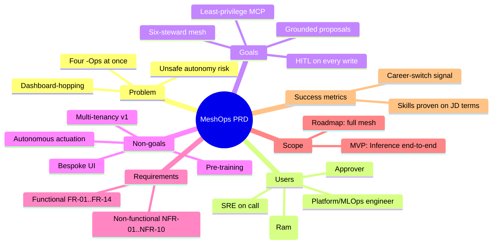
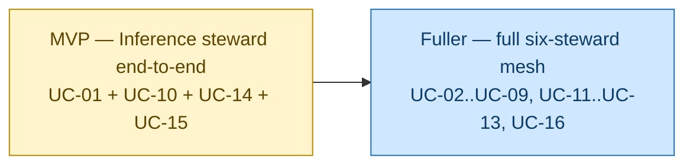

# MeshOps — Product Requirements Document (The Storybook)

> **Document:** MeshOps PRD — what the product must do and why, with each requirement traced to a use-case ID.
>
> **Audience:** Ram (the builder) and the iteration planner.
>
> **Goal:** by the end of this doc you should know exactly *what* MeshOps must do and *why*, with every functional requirement linked to a use-case ID, concrete non-functional targets, and a clear MVP-vs-roadmap split — enough to plan and slice from, not so deep it pre-writes the code. No monetization, pricing, marketing, or sales — MeshOps is a career-portfolio build; the focus is the product and the skills it proves. Use-case IDs (`UC-01 … UC-16`) come from [`01_use_cases.md`](01_use_cases.md) and are the shared spine across all four design docs.

<!-- export-png: 02_prd-mindmap.png -->



<details>
<summary>ASCII fallback</summary>

```
MeshOps PRD
├─ Problem        four -Ops at once · dashboard-hopping · unsafe-autonomy risk
├─ Users          platform/MLOps engineer · SRE on call · approver · operator (Ram)
├─ Goals          grounded proposals · HITL every write · least-privilege MCP · six-steward mesh
├─ Non-goals      autonomous actuation · multi-tenancy v1 · pre-training · bespoke UI
├─ Requirements   functional FR-01..FR-14 · non-functional NFR-01..NFR-10
├─ Scope          MVP: Inference steward end-to-end · roadmap: full mesh
└─ Success        career-switch signal · skills proven on JD terms
```

</details>

## 1. The problem, told straight

Picture the engineer who runs a production LLM/SLM platform on Kubernetes. Their job sounds like one thing but is secretly *four* things at once. There's **LLMOps** — keeping serving healthy, quality high, routing sane. There's **MLOps** — the whole fine-tune → eval → promote lifecycle. There's **AIOps** — correlating metrics and traces when something breaks and writing the postmortem. And there's **SecOps** — watching for prompt injection and supply-chain poisoning. The questions arrive faster than any one human can context-switch between them: *is this fine-tune safe to promote? Route this batch to the SLM or the LLM? Why did p95 jump? Did that RAG corpus update smuggle in a prompt injection?*

Today, every available answer fails in its own specific way. **One human wearing four hats** is slow, error-prone, and impossible to keep current across four fast-moving surfaces. **A single "ops copilot" agent** can't hold serving *and* lifecycle *and* incident *and* security judgement in one prompt — it collapses into a shallow generalist (this was the archived single-agent "AKS Copilot", deliberately re-thought). And **autonomous remediation** is fast but unsafe: an agent that *applies* changes to a production cluster on its own judgement becomes a liability the instant it's wrong.

The gap that's left is shaped exactly like MeshOps: a **coordinated mesh of specialist agents**, where each steward owns one -Ops surface, every steward *proposes* rather than *acts*, a human gate *approves*, and a least-privilege MCP layer *executes* — with a complete immutable audit trail behind it all. MeshOps fills that gap as a portfolio-grade artifact that proves the system can be built end-to-end on the exact Microsoft/Azure stack an internal AI-platform role uses.

## 2. Who this is for

Four people stand around this product, and one of them isn't a person at all.

The **Platform / MLOps engineer** is the protagonist and the **priority persona** for every design trade-off. They own the LLM/SLM platform on AKS — GPU, serving, promotions, cost, prompts — and they want grounded *proposals* they can approve, edit, or reject, never an autonomous change to their cluster. The **SRE on call** owns "why did it break?" and the postmortem; they want correlated Prometheus + Langfuse evidence and a drafted incident doc without dashboard-hopping across four specialties. The **Approver** — often the same engineer with the gate hat on — owns the approve/reject/edit decision on every write, and wants a clear proposal (observation, hypothesis, action, rationale, evidence) over a GitHub PR + Slack, backed by an immutable audit trail and a bound approver identity. And the **Operator (Ram)** owns identity, cost, observability, lab/sandbox isolation, and the deploy itself; he wants a reproducible Azure deploy, scale-to-zero GPU, per-steward least-privilege identity, and a traceable run history for every decision.

The priority order for trade-offs runs: platform/MLOps engineer first (their cluster is what's at stake), then SRE (incident quality), then the operator (operability). The mesh itself is an autonomous *actor*, not a persona.

## 3. What it must achieve — and what it must not

Here are the seven goals MeshOps commits to, each tied to the scenes that prove it. Every steward **proposes from grounded evidence** — real Prometheus/Langfuse/Foundry-eval signals and runbook-RAG, never model memory (UC-01..UC-09). Every write is **HITL-gated** — GitHub PR + Slack approval, with an immutable audit log; autonomy lives at the *proposal* layer only (UC-10; ADR-0001, planned ADR-0011). There are **six specialist stewards, one mesh** — Inference, Pipeline, Quality, SRE, Gateway, Security — each owning one surface and collaborating via MAF group-chat on cross-steward jobs (UC-01..UC-13; ADR-0001/0002). Tool access is **least-privilege through MCP** — stewards never touch the cluster directly; every call is scoped by a signed capability manifest enforced server-side and fully audited (UC-14; ADR-0004). The mesh stays **operable when the workload is broken** — stewards reason on Azure OpenAI, not on the KAITO-served models they operate (UC-01..UC-09; ADR-0003). **Untrusted data is cleared before it reaches reasoning** — sandbox/external inputs pass through the Security steward first (UC-08, UC-09). And **every run is observable** — the plan→act→observe trace is captured end-to-end (OTel GenAI → Langfuse; agent metrics → Managed Prometheus/Grafana) (UC-15).

And just as importantly, here's what MeshOps refuses to be. It will **never do closed-loop autonomous actuation** — every write is gated, even scaling. It is **single-tenant in v1** — multi-tenancy is a roadmap upgrade path only (UC-16). It does **no pre-training / RLHF / DPO** of foundation models — QLoRA/LoRA fine-tunes on open-weights bases only. It builds **no bespoke human-operator UI** — HITL runs over GitHub PR + Slack. It is **Azure-only** (ADR-0003; a LangGraph portability *demo* is the only nod to portability). And it has **no monetization, pricing, marketing, or sales** — this is a portfolio build.

## 4. Functional requirements

Each requirement links to the use-case IDs it covers; the iteration planner expands the linked UCs into buildable slices.

| FR | Requirement | Use cases |
|---|---|---|
| **FR-01** | A steward observes platform signals via read-only MCP tools and emits a structured proposal `{observation, hypothesis, proposed_actions[], rationale, requires_hitl}`. | UC-01, UC-02, UC-04, UC-05, UC-07 |
| **FR-02** | The Inference steward proposes an LLM↔SLM route split + scale from live KV-cache/latency signals. | UC-01 |
| **FR-03** | The Inference steward proposes a bounded KAITO Workspace scale under GPU pressure, capped at GPU quota, with SRE escalation on breach. | UC-02 |
| **FR-04** | The Pipeline steward runs a QLoRA fine-tune and proposes registry promotion **only after** a Quality eval pass. | UC-03 |
| **FR-05** | The Quality steward detects faithfulness drift and proposes a prompt-version PR with before/after eval deltas (prompt-as-code). | UC-04 |
| **FR-06** | The SRE steward correlates Prom + Langfuse + recent deploys and drafts a postmortem; remediation writes are gated. | UC-05 |
| **FR-07** | The Gateway steward canaries a variant through a 3-gate policy (0→5→50→100%) with auto-rollback on eval regression > 0.03. | UC-06 |
| **FR-08** | The Gateway steward proposes an LLM→SLM cost downshift on a sustained budget breach, corroborated by SRE. | UC-07, UC-12 |
| **FR-09** | The Security steward detects prompt-injection / RAG-poisoning (in doc text *and* cluster-state metadata) and proposes quarantine; untrusted data never reaches another steward's prompt until cleared. | UC-08 |
| **FR-10** | The Security steward vets every peer proposal for confused-deputy / high-blast-radius patterns before it reaches the gate. | UC-09 |
| **FR-11** | Every proposed write surfaces as a GitHub PR + Slack approval; approve→executes, edit→re-validates, reject→logs; the decision is written to an immutable audit log. | UC-10 |
| **FR-12** | The MAF group-chat orchestrator runs cross-steward flows (rollout, cost overrun, eval regression) with one combined HITL decision per stage. | UC-11, UC-12, UC-13 |
| **FR-13** | Each steward runs under a per-namespace Entra Workload Identity; MCP servers enforce its signed capability manifest server-side and audit every call. | UC-14 |
| **FR-14** | Every steward run emits OTel GenAI traces to Langfuse and agent metrics to Managed Prometheus/Grafana, inspectable end-to-end. | UC-15 |

## 5. Non-functional requirements

This is where the AI \*Ops disciplines the proposal named turn into hard operational targets. MeshOps runs **AgentOps** (every plan→act→observe step is traced and replayable), **LLMOps** (the eval gates, the guardrails, the prompt store), **MLOps** (the fine-tune→eval→promote lifecycle and model governance), **AIOps** (metric/trace correlation), and **SecOps** (the OWASP LLM + multi-agent threat coverage) — and the requirements below are how each becomes measurable rather than aspirational.

| NFR | Area | Requirement / target |
|---|---|---|
| **NFR-01** | **Auth / identity** | Per-steward Entra Workload Identity (federated AKS SA per namespace); OIDC-bound approver identity at the HITL gate; secrets in Key Vault via Secrets Store CSI driver. Entra Agent ID is the advanced-track upgrade. *(UC-14)* |
| **NFR-02** | **Authorization** | Stewards call tools only through MCP; a **signed capability manifest** (R/W per tool, HITL flags) is enforced **server-side**, not by the prompt — an out-of-manifest call is denied regardless of prompt content. *(UC-14; ADR-0004)* |
| **NFR-03** | **Safety / autonomy boundary** | **No autonomous write.** Every cluster-mutating action passes a HITL gate (ADR-0001 / planned ADR-0011). Only safety *stops* (e.g. canary auto-rollback) act without a human, because they revert toward safe state, never toward riskier state. *(UC-06, UC-10)* |
| **NFR-04** | **Privacy / data handling** | Public Microsoft Learn docs + synthesized scenarios only in the RAG corpus; no proprietary day-job content, no real cluster/customer names. Langfuse runs self-hosted with `ENABLE_SENSITIVE_DATA=false` and **30-day** trace retention. Public repo from day 1. *(CLAUDE.md §Confidentiality)* |
| **NFR-05** | **Reliability (AgentOps)** | Bounded retry loops on every steward; durable proposal state so an approval that arrives after a run-context recycle still resumes; immutable audit log in Azure Storage (immutability policy). *(UC-10, UC-15)* |
| **NFR-06** | **Scaling** | KAITO workloads autoscale via KEDA, bounded by subscription GPU quota; GPU nodepool **scales to zero** when idle (spot `Standard_NC4as_T4_v3`, ~2–4 min cold start accepted for a demo). *(UC-02)* |
| **NFR-07** | **Latency** | Steward p95 latency tracked as an eval signal (≤ baseline + 20% drift threshold, an SRE-owned P0 gate). Steward reasoning is not on the latency-critical request path — it operates the platform, it does not serve user traffic. *(UC-05, UC-15)* |
| **NFR-08** | **Cost** | Target ~$500/mo idle-friendly, ~$900/mo burst cap (placeholder). GPU nodepool scale-to-zero; spot-first GPU strategy; per-route LiteLLM budget caps; Azure Cost Management budget alerts at 50/80/100% MTD that trip the Gateway downshift flow. **Steward reasoning on Azure OpenAI is $0 to Ram (Microsoft tenant quota)** — without it the AOAI line would dominate. *(UC-07, UC-12)* |
| **NFR-09** | **Security posture (SecOps)** | OWASP **LLM Top-10** + **MAS01–MAS05** multi-agent extensions covered in the threat model; ACR image scanning + Trivy in CI; pinned MCP versions; embedding model pinned (`text-embedding-3-large`); sandbox RG network-isolated (private endpoints + NSG deny-by-default). *(UC-08, UC-09, UC-14)* |
| **NFR-10** | **Observability + eval gates (AgentOps / LLMOps / RAGOps)** | OTel GenAI semantic conventions (`gen_ai.*`, `agent_framework.*`) across all stewards and MCP calls; traces to self-hosted Langfuse; metrics on `:9464` scraped by Azure Managed Prometheus, dashboarded in Managed Grafana. Eval pass-bars: Promptfoo CI gate at **100% golden / ≥80% adversarial**; canary auto-rollback at faithfulness regression **> 0.03**; injection-detection recall **≥95%**; RAG retrieval grounded only on cleared corpus content. *(UC-04, UC-06, UC-08, UC-15)* |

## 6. MVP scope vs. roadmap



<details>
<summary>ASCII fallback</summary>

```
[MVP: Inference steward end-to-end — UC-01 + UC-10 + UC-14 + UC-15]
        ──> [Fuller: full six-steward mesh — UC-02..UC-09, UC-11..UC-13, UC-16]
```

</details>

The **MVP is the committed path**: one steward — **Inference** — running the full **observe → propose → HITL gate → act** loop on a real lab AKS cluster, with steward identity/MCP authz (UC-14) and run observability (UC-15) as its cross-cutting companions. This single slice **proves the agent loop, the MCP tool boundary, the human gate, and a deployed system on AKS** — the four things every later steward reuses.

The **roadmap (the fuller product, UC-16)** then adds the remaining five stewards (UC-02..UC-09), the MAF group-chat cross-steward flows (UC-11..UC-13), the eval/drift/cost/security tracks, and the career-signal satellites — the **AI-300** certification (DP-100 retired 2026-06-01) and **2–3 KAITO upstream PRs** (planned ADR-0012). The advanced track adds Entra Agent ID and the multi-tenant/multi-cluster upgrade path.

## 7. How we'll know it succeeded

Success here is measured against Ram's **career-switch** goal, not feature count. It looks like **skills proven on the JD's terms** — demonstrable agentic frameworks (MAF / SK / group-chat / MCP), LLM serving on K8s (KAITO / vLLM / KV-cache routing), the MLOps lifecycle (eval → promote → register), LLMOps eval (Ragas / Promptfoo / Foundry Evals), AIOps correlation, and LLM security — each anchored in a working steward. It looks like **a defensible system Ram can whiteboard** — the plane model, the proposal-vs-actuation boundary, the MCP trust boundary, and every trade-off explained at a board, which is the exact AI-platform-interview conversation. It looks like **real, public artifacts** — a public GitHub repo (design docs + ADRs + working mesh), a live demo on a real AKS lab cluster, AI-300 certified, and 2–3 KAITO PRs merged. And the outcome it serves is **the internal switch into an AI Platform / MLOps / LLMOps role.**

The operational health metrics (per-steward KPIs — % SLM-served without regression, eval-pass rate, time-to-postmortem, injection-detection recall, HITL approve rate) are tracked per the eval-and-llmops thresholds, but they serve the career metrics above, not a product SLA.

## 8. Assumptions, constraints, dependencies

Ram has Microsoft-tenant access to Azure OpenAI + Microsoft Foundry + unlimited GitHub Copilot, so steward reasoning is cost-free and design choices aren't cost-constrained on the LLM line; AKS, GPU scheduling, and observability are existing strengths, so the learning budget goes to the agentic/LLMOps layer. The build is **Azure-only** (ADR-0003), the **six-steward roster is locked** for P0–P4 (ADR-0001), the repo is **public with a public-data-only RAG corpus** (`CLAUDE.md`), and **Markdown is the only doc artifact** — no `.docx`/PNG exports. One sharp constraint to watch: `gpt-4.1` (the steward reasoning model) **retires 2026-10-14**, so a migration plan is a constraint on any long-lived deployment.

The dependencies are Microsoft Agent Framework 1.0 (GA 2026-04-03); Microsoft Foundry Agent Service (GA 2026-03-16) for the Quality steward; KAITO via the AKS `ai-toolchain-operator` add-on (the managed add-on currently pins **v0.6.0**, behind upstream v0.10.0 — plan against the add-on's pin); MCP servers (`Azure/aks-mcp` and others, some community/may-need-authoring); Langfuse self-hosted; and Azure Managed Prometheus/Grafana. See [`04_tech_stack.md`](04_tech_stack.md) for pinned versions.

## 9. Limitations / when this changes

This PRD scopes *what*, not *how much code* — requirements are design-altitude, and the iteration planner turns each FR/UC into a buildable slice with refined acceptance criteria. Re-open the doc when the boundary moves: a steward pulled into the MVP, a non-Azure dependency forced in, or the multi-tenant line crossed each change FR/NFR scope. Watch for model-currency drift, too — `gpt-4.1` sunsets 2026-10-14 and the KAITO add-on lags upstream, so revisit the FR/NFR set and the tech stack when either moves. And keep an eye on ADR alignment: ADR-0001–0006 are written and `Proposed`, while the heavily-cited HITL ADR (planned ADR-0011) and the eval/gateway/security ADRs aren't authored yet — when they land, re-check the NFR-02/NFR-03 wording against them.

## 10. Your challenge, Ram

These requirements are the contract your code has to honour — read FR-01, FR-11, FR-13, and FR-14 closely, because the MVP lives or dies on them. Your job is to make the Inference steward satisfy FR-02 while UC-10's gate (FR-11), UC-14's identity boundary (FR-13), and UC-15's traces (FR-14) all hold true at once. If you can point at a real run where a proposal was grounded in live signals, stopped at the gate, ran under a least-privilege identity, and was fully traced, you've shipped the MVP.

---
**Sources**

*Repo files:* `020_project_proposal/proposal.md` · `035_others/{vision,use-cases,architecture,agent-catalog,planes-and-mcp,eval-and-llmops,threat-model,tech-stack,cost-and-deployment,glossary}.md` · `035_others/decisions/0001..0006` · `CLAUDE.md` · [`01_use_cases.md`](01_use_cases.md)

*Web:*
- [Microsoft Agent Framework 1.0 GA](https://devblogs.microsoft.com/agent-framework/microsoft-agent-framework-version-1-0/)
- [Microsoft Foundry Agent Service GA](https://learn.microsoft.com/en-us/azure/foundry/agents/overview)
- [KAITO v0.10.0](https://github.com/kaito-project/kaito/releases) / [AKS ai-toolchain-operator add-on (v0.6.0)](https://learn.microsoft.com/en-us/azure/aks/ai-toolchain-operator)
- [gpt-4.1 retirement 2026-10-14](https://learn.microsoft.com/en-us/azure/ai-foundry/concepts/model-lifecycle-retirement)
- [AI-300 / DP-100 retirement](https://techcommunity.microsoft.com/blog/skills-hub-blog/new-certification-for-machine-learning-operations-mlops-engineers/4494111)
- [Model Context Protocol](https://modelcontextprotocol.io)

