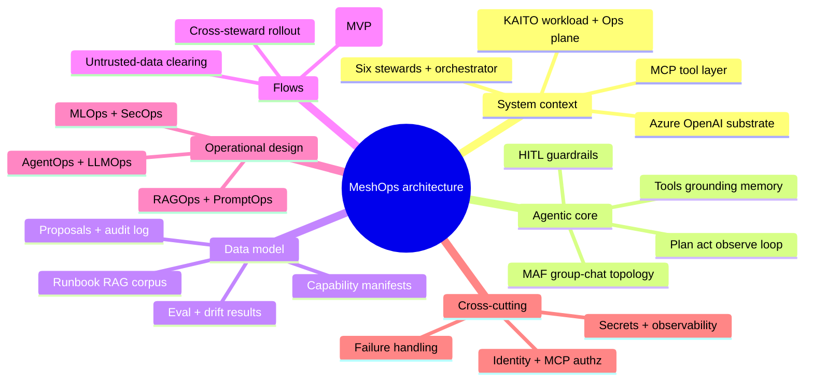
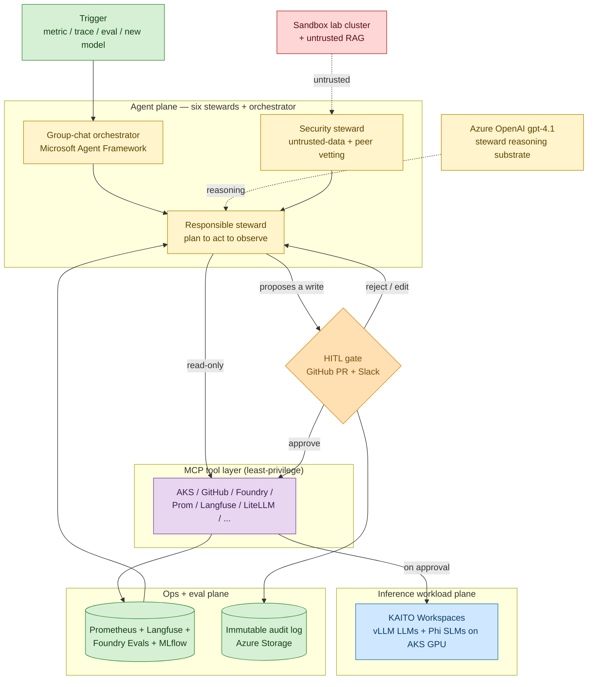
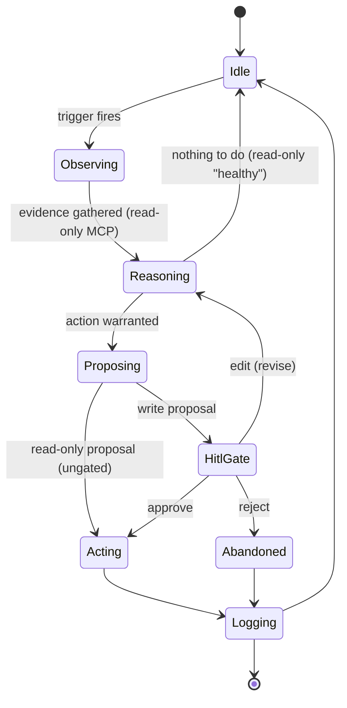
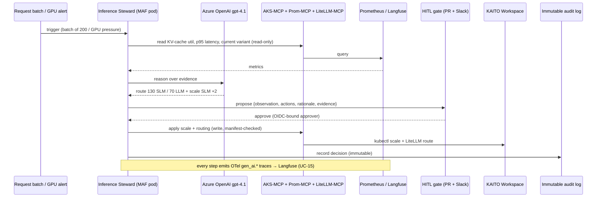
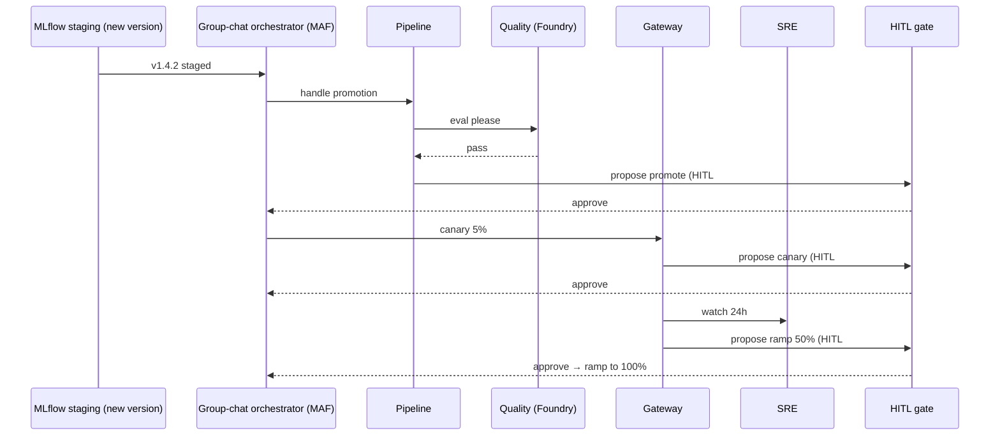
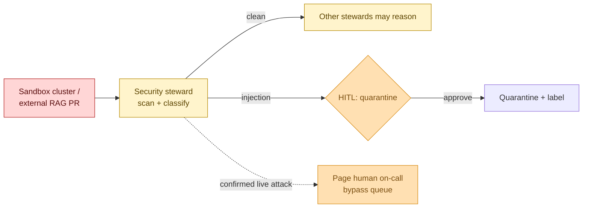

# MeshOps — Architecture (The Storybook)

> **Document:** MeshOps architecture — how the agentic system is *shaped*, at design altitude, not source code.
>
> **Audience:** Ram (the builder) and the iteration planner.
>
> **Goal:** by the end of this doc you should be able to picture how MeshOps is built — the planes, the agent loop, the trust boundaries, the data model, the main end-to-end flows, and the cross-cutting concerns — well enough to slice iterations from, but not so deep it pre-writes the implementation. Components and flows reference use-case IDs (`UC-01 … UC-16`) from [`01_use_cases.md`](01_use_cases.md) and satisfy the requirements in [`02_prd.md`](02_prd.md). The deeper canonical reference is `035_others/architecture.md`; this doc is the design-altitude projection of it.

**Plane palette (MeshOps house colours):** yellow = agent plane (the six stewards); blue = inference workload plane (KAITO/vLLM/Phi); green = ops & eval plane; purple = MCP tool layer; amber = HITL gates / human-in-the-loop; red = sandbox / untrusted.

<!-- export-png: 03_architecture-mindmap.png -->



<details>
<summary>ASCII fallback</summary>

```
MeshOps architecture
├─ System context  6 stewards + orchestrator · Azure OpenAI substrate · MCP layer · KAITO + Ops plane
├─ Agentic core    plan-act-observe · MAF group-chat · tools/grounding/memory · HITL guardrails
├─ Data model      proposals + audit log · eval/drift results · capability manifests · runbook RAG
├─ Flows           Inference loop (MVP) · cross-steward rollout · untrusted-data clearing
├─ Operational     AgentOps + LLMOps · RAGOps + PromptOps · MLOps + SecOps
└─ Cross-cutting   identity + MCP authz · secrets + observability · failure handling
```

</details>

## 1. The shape of it, in one breath

Imagine the platform as a busy hospital. The patients are the LLM/SLM workloads running on AKS GPU. The specialists are six MeshOps stewards — but here's the twist that makes the whole thing safe: **the doctors don't operate on their own patients with their own hands.** They examine, they diagnose, they write up a recommended procedure — and then a human signs the consent form before anyone picks up a scalpel.

Concretely: MeshOps is a **mesh of six MAF stewards** (Inference, Pipeline, SRE, Gateway, Security run on Microsoft Agent Framework as AKS pods; **Quality runs on Microsoft Foundry Agent Service**, managed) plus a thin **group-chat orchestrator**. Each steward runs a **plan → act → observe** loop: it observes a trigger (a metric, a trace, an eval, a new model), calls **read-only MCP tools** to gather grounded evidence, reasons over it, and emits a **proposal**. Nothing actuates on its own — a proposed write surfaces at a **HITL gate** (GitHub PR + Slack), and only on approval does the **MCP tool layer** execute it.

Three facts anchor the whole shape. First, **the stewards reason on Azure OpenAI (`gpt-4.1`), not on the KAITO-served models they operate** (ADR-0003) — the doctors aren't anaesthetised by the same drugs they're administering, so the mesh stays operable even when the workload is broken. Second, **MCP is the only write path** (ADR-0004) — stewards never touch the cluster directly; every tool call is scoped by a signed capability manifest enforced server-side (UC-14). Third, **untrusted data is cleared by the Security steward first** — sandbox/external inputs reach no steward's reasoning prompt until Security vets them (UC-08).



<details>
<summary>ASCII fallback</summary>

```
Trigger ─> Group-chat orchestrator (MAF) ─> Responsible steward (plan→act→observe)
                                              ^   |  read-only tools
  Azure OpenAI gpt-4.1 (reasoning) ┄┄┄┄┄┄┄┄┄┄┘   v
                                          MCP layer ─> Ops+eval plane (Prom/Langfuse/Foundry/MLflow) ─┐
                                              ^                                                        |
                                              └────────────────────────────────────────── observed ───┘
  steward proposes a WRITE ─> {HITL gate: GitHub PR + Slack}
        reject/edit ─> back to steward
        approve ─> MCP executes ─> KAITO + vLLM + Phi (AKS GPU)
                 └─> immutable audit log (Azure Storage)

  Sandbox lab cluster + untrusted RAG ┄(untrusted)┄> Security steward ─> clears before any steward reasons
```

</details>

And if a single picture would help it land, here is the whole system drawn out as an infographic — the planes, the stewards, and the proposal-to-gate flow in one frame:


## 2. The five neighbourhoods (planes)

The mesh lives in five **responsibility** neighbourhoods. They aren't deployment units — most run on the same AKS cluster — but they tell you who can read what, who can write where, and what crosses a trust boundary.

The **agent plane** (yellow) is where the six stewards and the group-chat orchestrator live; they reason and *propose*, but never write directly. The **inference workload plane** (blue) holds the KAITO Workspaces, vLLM LLMs, Phi SLMs, and the runbook RAG corpus — this is the platform being *operated*, not the operator. The **ops + eval plane** (green) is Prometheus + Grafana, Langfuse, Foundry Evals, the MLflow registry, GitOps, and the immutable audit log — the source of grounded evidence and the audit record. The **MCP tool layer** (purple) is the AKS/GitHub/Foundry/Prom/Langfuse/LiteLLM/Kubeflow/MLflow/Defender MCP servers — the **only** write path, capability-gated and fully audited. And the **sandbox** (red) is the lab AKS cluster plus untrusted RAG sources in a separate resource group — untrusted, crossing only into the Security steward's scanning path.

## 3. The agentic core

### 3.1 The steward loop (plan → act → observe)

Every steward is a small, sharp, independently testable agent with the same lifecycle. It's genuinely agentic — not a single prompt→answer call — because the steward iterates over real tool calls until it has a defensible proposal, then **stops at the gate**.



<details>
<summary>ASCII fallback</summary>

```
Idle → Observing → Reasoning ─┬─> Idle            (nothing to do)
                              └─> Proposing ─┬─> Acting        (read-only, ungated)
                                             └─> HitlGate ─┬─> approve → Acting
                                                           ├─> edit    → Reasoning
                                                           └─> reject  → Abandoned
Acting / Abandoned → Logging → Idle
```

</details>

Read that loop as four beats. In **plan**, the steward forms a hypothesis from the trigger and decides which evidence it needs. In **act (read-only)**, it calls scoped MCP tools (`AKS-MCP`, `Prom-MCP`, `Langfuse-MCP`, …) to gather grounded state. In **observe**, it reads the tool results, revises, and either concludes "healthy" (read-only, ungated) or forms a concrete write-proposal. And in **propose → gate → act**, that write-proposal — a structured `{observation, hypothesis, proposed_actions[], rationale, requires_hitl}` envelope — materialises at the HITL gate (UC-10), and only on approval does the MCP layer execute the write.

### 3.2 Topology — one steward, or a roomful

Single-steward jobs (UC-01..UC-09) run one steward's loop end-to-end, and **Inference is the MVP steward** (UC-01) because it sits closest to Ram's GPU-nodepool depth. Cross-steward jobs (UC-11..UC-13) run on the **MAF group-chat** orchestration pattern: the thin orchestrator routes handoffs so stewards collaborate without each re-implementing handoff state, and the inter-steward messages are **schema-validated Pydantic envelopes** — the very contract the Security steward inspects (UC-09). One combined HITL decision covers a multi-steward stage, not N separate gates. There's a deliberate runtime split here too (ADR-0002): five stewards run on **MAF (Python) as AKS pods**, while **Quality runs on Microsoft Foundry Agent Service** (managed) — showing off both self-hosted and managed agent hosting so Ram can defend the trade-off.

### 3.3 Tools, grounding, memory, guardrails

Each steward declares a least-privilege **capability manifest** — which MCP tools, R versus W, which HITL-gated — and the MCP server enforces it **server-side**, so an out-of-manifest call is denied no matter what the prompt says (UC-14; ADR-0004; the per-steward matrix lives in `035_others/planes-and-mcp.md`). Every proposal is **grounded** in real signals — Prometheus metrics, Langfuse traces, Foundry/Ragas eval scores — and in **runbook RAG** (`040-runbooks/`, public Microsoft Learn docs + synthesized scenarios, embedded with `text-embedding-3-large`); no steward acts on memory alone. For **memory**, short-term working state lives in the steward's run context (durable, so an approval after a context recycle still resumes), while long-term operational history (past proposals, eval trends, approve/reject outcomes) persists so the mesh learns the platform's normal. And the **guardrails** are layered: a HITL gate on every write (UC-10), bounded retry loops, a deterministic "propose-only, needs-review" fallback when retries exhaust, the untrusted-data clearing invariant (Security first), and canary auto-rollback on eval regression — a safety stop that reverts toward safe state and so needs no human.

## 4. The data model (design level)

MeshOps state is small and document-shaped. The MVP needs the first four stores; the rest land with later stewards. (The canonical persistence choices — immutable Azure Storage for audit, MLflow on Azure ML for the registry, Langfuse Postgres/Clickhouse for traces — live in `035_others/architecture.md` and `cost-and-deployment.md`.)

| Store | Shape (key fields) | Plane | Used by |
|---|---|---|---|
| **Proposals** | `proposal_id`, `steward`, `trigger`, `observation`, `hypothesis`, `proposed_actions[]`, `rationale`, `evidence_refs[]`, `requires_hitl`, `status` (proposed/approved/edited/rejected) | Agent → Ops | UC-01..UC-13, UC-10 |
| **HITL audit log** | `proposal_id`, `approver_identity` (OIDC), `decision`, `pr_url`, `slack_ref`, `timestamp`, `applied_action` — **immutable** (Azure Storage immutability policy) | Ops | UC-10 (FR-11) |
| **Capability manifests** | `steward`, `allowed_tools[]` (tool, R/W, hitl_gated), `signature` | MCP | UC-14 (FR-13) |
| **Eval / drift results** | `run_id`, `model_version`, `suite` (Ragas/Promptfoo/Foundry), `metric`, `value`, `baseline`, `drift` | Ops + eval | UC-03, UC-04, UC-06, UC-13 |
| **Runbook RAG corpus** | `doc_id`, `provenance` (public-source URL), `embedding`, `security_status` (cleared/quarantined) | Inference workload | UC-08 (FR-09) |
| **Model registry (MLflow)** | `model`, `version`, `stage` (staging/prod), `lineage`, `eval_refs[]` | Ops | UC-03, UC-11 |
| **Run traces (Langfuse)** | OTel GenAI spans: `gen_ai.*`, `agent_framework.*`; 30-day retention; `ENABLE_SENSITIVE_DATA=false` | Ops + eval | UC-15 (FR-14) |

## 5. Three flows, told as scenes

### 5.1 The MVP scene — the Inference steward loop (UC-01 + UC-10 + UC-14 + UC-15)

This is the flow the MVP must prove end-to-end. Watch how it threads identity (UC-14), the loop, the gate (UC-10), and observability (UC-15) through a single path: a batch lands, Inference reads the live signals, reasons on Azure OpenAI, proposes a route split, a human approves, MCP applies it, and the whole thing is recorded and traced.



<details>
<summary>ASCII fallback</summary>

```
Trigger ─> Inference Steward ─> MCP (read KV-cache/latency/variant) ─> Prom/Langfuse ─> metrics back
        ─> reason on Azure OpenAI gpt-4.1 ─> "route 130 SLM / 70 LLM, scale SLM +2"
        ─> propose to HITL gate (PR + Slack) ─> approve (OIDC approver)
        ─> MCP applies scale + routing (manifest-checked write) ─> KAITO Workspace
        ─> record decision in immutable audit log
   (every step traced via OTel gen_ai.* to Langfuse — UC-15)
```

</details>

### 5.2 The relay scene — a new model rollout (UC-11)

Here four stewards pass a baton, with a human nod at each handoff. The orchestrator routes; Pipeline asks Quality to eval; the first gate decides whether to promote; Gateway canaries; the second gate; SRE watches; the third gate ramps to 100%. Three gates, four stewards, one rollout — and if the canary eval regresses, the auto-rollback fires without waiting for a human.



<details>
<summary>ASCII fallback</summary>

```
MLflow staging ─> Orchestrator ─> Pipeline ─> Quality(eval) ─> pass
  ─> HITL#1 promote ─> Gateway canary 5% ─> HITL#2 canary ─> SRE watches
  ─> HITL#3 ramp 50% ─> 100%   (4 stewards, 3 gates, 1 rollout; auto-rollback on eval regression)
```

</details>

### 5.3 The bouncer scene — untrusted-data clearing (UC-08 / UC-09)

The hard invariant: untrusted inputs cross *only* into the Security steward's scanning path before any steward reasons over them. The injection can hide in a runbook PR's text **or** in a sandbox K8s resource's annotation that another steward would read as an "observation". Security scans, and routes the input: clean data flows on, an injection goes to a quarantine gate, and a confirmed live attack skips the queue and pages a human.



<details>
<summary>ASCII fallback</summary>

```
Sandbox cluster / external RAG PR ─> Security steward (scan+classify)
   ├─ clean      ─> other stewards may now reason over it
   ├─ injection  ─> HITL quarantine ─approve─> quarantine + label
   └─ confirmed live attack ─> page human on-call (bypass HITL queue)
```

</details>

For a fuller end-to-end picture of how these flows, the gates, and the cross-steward handoffs fit together, here's the detailed catalog-and-flow infographic:


## 6. Cross-cutting concerns

**Identity & authorization** (UC-14, NFR-01/02): each steward runs under a per-namespace **Entra Workload Identity** federated to a per-namespace AKS service account, and MCP servers verify the caller against the expected SA and enforce the **signed capability manifest** server-side. The trust boundaries (User↔Gateway, Steward↔MCP, Steward↔HITL, Mesh↔sandbox, Steward↔Steward) and their enforcement are tabled in `035_others/architecture.md §5`; Entra Agent ID is the advanced-track upgrade. **Secrets** live in Azure Key Vault via the Secrets Store CSI driver — never in steward prompts (the prompts are public) — and MCP credentials are least-privilege per server (read-only bearer for Prom, fork-scoped GitHub App, WI for AKS/Foundry/Defender). **Observability** (UC-15, NFR-10) runs OTel GenAI semantic conventions across all stewards and MCP calls, agent metrics on `:9464` scraped by Azure Managed Prometheus and dashboarded in Managed Grafana, with traces to self-hosted Langfuse (30-day retention, `ENABLE_SENSITIVE_DATA=false`). **Failure handling** (NFR-05) means bounded retries, durable proposal state (resume after a run-context recycle), the deterministic "propose-only, needs-review" fallback, and the immutable audit log so no decision is lost or tamperable (MAS05). And the **security posture** (NFR-09) maps OWASP LLM Top-10 + MAS01–MAS05 in `035_others/threat-model.md`, with ACR + Trivy image scanning, pinned MCP versions, the embedding pin, and sandbox network isolation (private endpoints + NSG deny-by-default).

## 7. Operational design — the AI \*Ops disciplines, made concrete

The proposal named a stack of operational disciplines; here is where each one stops being a label and becomes a place in the architecture. **AgentOps** is the default for an agentic build and lives wherever a steward runs: every plan→act→observe step emits OTel `gen_ai.*` / `agent_framework.*` spans (the tool call, its args and result, the observation, the reasoning, the proposal, the gate decision, retries) to self-hosted Langfuse, so a run is fully replayable, and the agent-eval harness (Foundry Evaluations over agent traces) scores the loop itself. **LLMOps** lives across the ops+eval plane: prompts are stored as code in the repo, the eval/regression suites are Promptfoo (CI gate) + Ragas (RAG quality) + Foundry Evals, the gates they enforce are the 100%-golden/≥80%-adversarial CI bar and the >0.03 canary auto-rollback, guardrails sit at the MCP boundary and the HITL gate, and token-cost control sits in LiteLLM per-route budgets. **RAGOps** owns the runbook corpus pipeline — ingest from public Microsoft Learn docs and synthesized scenarios → chunk → embed with `text-embedding-3-large` → index → retrieve → and crucially gate every ingest through the Security steward's clearing path (UC-08), so freshness never outpaces safety. **PromptOps** is realized as prompt-as-code: every prompt change is a versioned PR carrying a before/after eval delta (UC-04), A/B and regression-tested through the same Promptfoo gate. **MLOps** owns the model lifecycle — QLoRA fine-tune → Quality eval → MLflow registry promotion with lineage (UC-03, UC-11) — and it's in scope here precisely because the product *operates* a model lifecycle, even though it trains only adapters, not foundation models. **SecOps** is the Security steward plus the threat model: the untrusted-data clearing invariant, the confused-deputy peer-vetting, and the OWASP LLM + MAS coverage that NFR-09 pins. The one discipline MeshOps does *not* force in is **AIOps as a product** — MeshOps consumes AIOps correlation (the SRE steward) but is not itself an observability product, so there's no AIOps tooling layer beyond what the SRE steward and UC-15 already provide.

## 8. Reference — component → plane → where it runs

| Component | Plane | Where it runs | Governing ADR |
|---|---|---|---|
| Inference / Pipeline / SRE / Gateway / Security stewards | Agent | AKS pods (MAF) | ADR-0002 |
| Quality steward | Agent | Microsoft Foundry Agent Service (managed) | ADR-0002 |
| Group-chat orchestrator | Agent | AKS pod (MAF) | ADR-0002 |
| Steward reasoning model | Agent | Azure OpenAI `gpt-4.1` | ADR-0003 |
| MCP servers | MCP tool layer | AKS sidecars / shared deployment | ADR-0004 |
| KAITO Workspaces / vLLM / Phi SLMs | Inference workload | AKS GPU nodepool (spot, scale-to-zero) | ADR-0003 |
| LiteLLM + Envoy AI Gateway | Inference workload | AKS deployment | planned gateway ADR |
| Prometheus + Grafana | Ops + eval | Azure Managed Prometheus + Grafana | ADR-0006 |
| Langfuse | Ops + eval | AKS (self-hosted, Helm) | ADR-0005 |
| Foundry Evals | Ops + eval | Microsoft Foundry project | ADR-0002 |
| MLflow registry | Ops + eval | Azure ML workspace | ADR-0003 |
| HITL audit log | Ops + eval | Azure Storage (immutable) | ADR-0001 / planned ADR-0011 |
| Lab AKS cluster + untrusted RAG | Sandbox | `rg-meshops-sandbox` | ADR-0003 |

## 9. What's deliberately not designed yet

Some things are intentionally left for later, and it's worth naming them so nobody mistakes the gap for an oversight. There's **no multi-region + DR** (single region `eastus2`, best-effort recovery, no formal RTO/RPO); **no tenant-per-customer isolation** (single tenant v1, upgrade path is roadmap UC-16); **no steward-side caching of MCP responses** (all MCP calls are fresh in v1); **no inter-steward voting/consensus** (one combined HITL gate stands in for a quorum); **no steward sandboxing (gVisor/Kata) or dynamic permission elevation** (advanced track); and **no per-steward fine-tuned reasoning models** (shared Azure OpenAI in v1; Phi-distilled stewards are a post-P4 idea).

## 10. Your challenge, Ram

This is the blueprint you'll bring to life. Your first build proves the system context diagram with a single real path — the §5.1 Inference loop — running on a real lab cluster: trigger in, read-only MCP evidence, reasoning on Azure OpenAI, a proposal at the gate, an approved write through MCP, an immutable audit record, and an OTel trace you can replay. Nail the trust boundaries (the steward never touches the cluster except through a manifest-checked MCP write) and you've earned the right to whiteboard this architecture in an interview.

---
**Sources**

*Repo files:* `035_others/architecture.md` (canonical system reference) · `035_others/agent-catalog.md` · `035_others/planes-and-mcp.md` · `035_others/threat-model.md` · `035_others/eval-and-llmops.md` · `035_others/cost-and-deployment.md` · `035_others/decisions/0001..0006` · `020_project_proposal/proposal.md` · `CLAUDE.md` · [`01_use_cases.md`](01_use_cases.md) · [`02_prd.md`](02_prd.md)

*Web:*
- [Microsoft Agent Framework 1.0 — group-chat / Magentic / MCP](https://devblogs.microsoft.com/agent-framework/microsoft-agent-framework-version-1-0/)
- [Microsoft Foundry Agent Service (managed agents + Evaluations)](https://learn.microsoft.com/en-us/azure/foundry/agents/overview)
- [KAITO architecture](https://github.com/kaito-project/kaito#architecture)
- [Azure/aks-mcp](https://github.com/Azure/aks-mcp)
- [OTel GenAI semantic conventions](https://opentelemetry.io/docs/specs/semconv/gen-ai/)
- [Model Context Protocol spec](https://modelcontextprotocol.io/specification)

