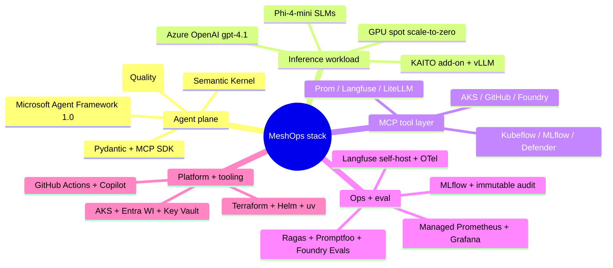

# MeshOps — Tech Stack (The Storybook)

> **Document:** MeshOps tech stack — every technology choice, why it serves *this* product, its current version/tier, and its cost/posture implication.
>
> **Audience:** Ram (the builder) and the iteration planner.
>
> **Goal:** by the end of this doc you should know every technology MeshOps is built on, why each one earns its place, its current version/model/tier, and what it costs to run. Each choice realizes the architecture in [`03_architecture.md`](03_architecture.md) and the requirements in [`02_prd.md`](02_prd.md). The exhaustive per-library pin list lives in `035_others/tech-stack.md`; this doc is the design-altitude justification layer over it.

**Cost posture:** ~$500/mo idle-friendly, ~$900/mo burst cap. MeshOps is **not** a zero-idle-cost serverless product — it's a *Kubernetes platform*, so the AKS system pool, Langfuse, Prometheus, and the lab cluster run continuously. The GPU nodepool **scales to zero**; the steward reasoning model (Azure OpenAI) is **$0 to Ram** on Microsoft tenant quota. The leaks to watch aren't serverless cold-path billing — they're the GPU spot strategy, Langfuse's Postgres/Clickhouse footprint, and the always-on sandbox cluster.

<!-- export-png: 04_tech_stack-mindmap.png -->



<details>
<summary>ASCII fallback</summary>

```
MeshOps stack
├─ Agent plane       MAF 1.0 · Semantic Kernel · Foundry Agent Service (Quality) · Pydantic + MCP SDK
├─ Inference         Azure OpenAI gpt-4.1 · KAITO add-on + vLLM · Phi-4-mini · GPU spot scale-to-zero
├─ MCP layer         AKS/GitHub/Foundry/Prom/Langfuse/LiteLLM/Kubeflow/MLflow/Defender MCP servers
├─ Ops + eval        Managed Prom+Grafana · Langfuse + OTel · Ragas+Promptfoo+Foundry Evals · MLflow + audit
└─ Platform+tooling  AKS + Entra WI + Key Vault · Terraform + Helm + uv · GitHub Actions + Copilot
```

</details>

> **Verification note (read before building).** The repo's `035_others/` was pinned 2026-05-26. This doc re-verified the moving pieces on **2026-06-12** and records three currency facts the earlier docs couldn't have known: (1) **"Azure AI Foundry" was renamed to "Microsoft Foundry"** — the agent runtime is **Microsoft Foundry Agent Service** (GA 2026-03-16); (2) the **AKS `ai-toolchain-operator` add-on currently pins KAITO v0.6.0**, *behind* upstream **v0.10.0** (2026-04-15) — plan against the add-on's pin, not upstream's feature list; (3) **`gpt-4.1` has a firm retirement date of 2026-10-14** — pin a migration plan. None of these contradict ADR-0001–0006; they sharpen them.

## 1. Why this stack, in one breath

Here's the through-line for every choice below: MeshOps is pinned to the **Microsoft / Azure first-party stack on purpose.** It *is* the toolchain a Microsoft internal AI-platform role builds on, and Ram's tenant access (Azure OpenAI + Microsoft Foundry + unlimited Copilot) removes any cost reason to substitute. The AKS substrate is Ram's home turf, so the stack's *learning* weight sits deliberately in the **agentic + LLMOps layer** — MAF, Foundry Agent Service, KAITO, MCP — wrapped around it.

## 2. The agent plane — the stewards' toolkit

This is where the six stewards actually think. **Microsoft Agent Framework (MAF) 1.0** (`agent-framework`, Python; GA 2026-04-03) is the agent runtime for the five MAF stewards and the group-chat orchestrator — chosen because its **group-chat** and **Magentic** orchestration patterns are exactly the multi-agent shapes MeshOps needs (UC-11..UC-13), it registers MCP servers declaratively, it unifies Semantic Kernel + AutoGen, and it's the Microsoft-blessed default and so the highest-signal agentic framework for Ram's CV. It's a library that runs in AKS pods reasoning against Azure OpenAI; pin `agent-framework==1.0.*` + `agent-framework-azure-ai==1.0.*` (which brings `AzureOpenAIChatClient`). **Microsoft Foundry Agent Service** (GA 2026-03-16; renamed from "Azure AI Foundry") hosts the **Quality steward** as a *managed* agent (ADR-0002) and runs **Foundry Evaluations** for the LLMOps eval gate (UC-04) — deliberately demonstrating managed-vs-self-hosted hosting so Ram can defend the trade-off; it's managed, Standard tier (~$20/mo in the cost model), and the currency note is to use the new name, not "Azure AI Agent Service". **Semantic Kernel** (latest stable) renders the SRE steward's incident-doc/postmortem (UC-05) with mature templating and planning utilities that compose cleanly with MAF. **Pydantic** (`>=2.7,<3.0`) carries the schemas for the `Observation` / `Proposal` / `HitlEnvelope` contracts and the **schema-validated inter-steward messages** the Security steward vets (UC-09, MAS01). And the **MCP Python SDK** (`mcp >=1.6,<2.0`) provides the stdio + streamable-http transports for steward↔MCP-server calls.

## 3. The inference workload plane — the patient, not the doctor

This is the plane being *operated*, kept carefully distinct from the substrate the stewards reason on. **Azure OpenAI `gpt-4.1`** (v1 GA API) is the **steward reasoning model for all six stewards** (ADR-0003): high-quality reasoning keeps proposals defensible, and running the operators on AOAI rather than on KAITO-served models keeps the mesh operable when the workload is broken. It's **$0 to Ram** via Microsoft tenant quota (without it this line would dominate at ~$300–800/mo) — but ⚠️ **`gpt-4.1` retires 2026-10-14**, so pin a migration plan and don't anchor a long-lived deployment on it without one. **Azure OpenAI `text-embedding-3-large`** is the RAG embedding for the runbook corpus (UC-08) — the current most-capable Azure embedding, pinned because an embedding swap is an LLM08 adversarial-similarity risk; it runs on tenant quota.

The serving side runs on **KAITO via the AKS `--enable-ai-toolchain-operator` add-on** for LLM/SLM serving, fine-tuning, and RAG on AKS GPU — a Microsoft-managed add-on right next to Ram's GPU-nodepool day-to-day. ⚠️ **The managed add-on pins KAITO v0.6.0** while upstream is **v0.10.0** (2026-04-15, which adds vLLM 0.17.1 / Qdrant RAG / spot / LoRA volumes), so **build against the add-on's v0.6.0 feature set** unless self-managing KAITO — this is the most likely silent error to inherit from the older docs. **vLLM** (bundled by KAITO) is the OpenAI-compatible serving engine inside KAITO Workspaces. **Phi-4-mini-instruct** (a KAITO preset) is the demo SLM — T4-friendly, the "small/cheap" side of the LLM↔SLM route decision (UC-01), evolving Phi-4-mini → Phi-4 across phases. And the GPU nodepool itself is **`Standard_NC4as_T4_v3`** (spot, ~$0.07/hr, scale-to-zero) — the cheapest viable T4 for Phi serving, spot-first with an on-demand ($0.31/hr) fallback for demos; it **scales to zero** at idle (10-min drain → spot node returned; ~2–4 min cold start accepted) and is the primary cost lever (~$120/mo at ~40% util).

## 4. The MCP tool layer — the single write path (ADR-0004)

This is the only door to the cluster: nine least-privilege servers, each scoped tight. Status reflects 2026-06-12 — some are upstream, some community or may-need-authoring, which is a deliberate KAITO-PR-track opportunity for Ram.

| MCP server | Source / status | Scope (least-privilege) | Phase |
|---|---|---|---|
| **AKS-MCP** | `github.com/Azure/aks-mcp` (real; Helm + Workload Identity) | AKS read; scale + Workspace-CR patch (HITL-gated) | P0 |
| **GitHub-MCP** | `github.com/github/github-mcp-server` | PR write **scoped to a fork** in v1 | P1 |
| **Foundry-MCP** | Microsoft Foundry MCP slice (full Azure MCP ~276 tools — Foundry subset only) | Prompt Flow + evals | P1 |
| **Prom-MCP** | in-repo shim (read-only Prom HTTP API) → upstream candidate | metrics read | P0 |
| **Langfuse-MCP** | community / may author (KAITO-PR-track candidate) | trace read + annotation write | P2 |
| **LiteLLM-MCP** | LiteLLM project | routes + budgets (HITL-gated) | P3 |
| **Kubeflow-MCP** | community / uncertain (may fall back to direct API) | training jobs (HITL-gated) | P2 |
| **MLflow-MCP** | community / uncertain | register + tag (HITL-gated) | P2 |
| **Defender-MCP** | Azure MCP Defender slice | security signals read | P4 |

Why MCP rather than bespoke wrappers? Uniform capability tokens, server-side auditability (steward→tool→args→result), a centralised confused-deputy defence (UC-09), and an upstream-contribution path. Capability manifests are **signed and enforced server-side** (UC-14) — never by the prompt.

## 5. The ops + eval plane — evidence and judgement

This plane is where MeshOps' AI \*Ops disciplines get their tooling. **Azure Managed Prometheus + Azure Managed Grafana** (ADR-0006) are the metrics backend and dashboards — Azure-native, no self-hosted Prom to operate; the currency note is to scrape via `PodMonitor`/`ServiceMonitor` on group **`azmonitoring.coreos.com/v1`** (NOT upstream `monitoring.coreos.com/v1`), with agent metrics on `:9464` (`gen_ai.client.operation.duration`, `gen_ai.client.token.usage`, `agent_framework.function.invocation.duration`). **Langfuse** (`>=3.0,<4.0`, self-hosted on AKS via Helm; ADR-0005) is the AgentOps/LLMOps observability surface — stewards emit OTel GenAI traces to its in-cluster OTLP endpoint; self-hosted (not Cloud) for confidentiality, with `ENABLE_SENSITIVE_DATA=false` and **30-day retention**; it adds Postgres + Clickhouse + Redis, a real always-on footprint (a watch-item, not a leak) and a multi-container v3 self-host, so budget AKS resources for it. **OpenTelemetry** (`opentelemetry-sdk >=1.30`, OTLP gRPC exporter `>=1.30`, Prometheus exporter `>=0.51b0`) is the GenAI-semantic-convention pipe from stewards to Langfuse/Prom (UC-15).

The eval gate — the heart of LLMOps and PromptOps here — is **Ragas + Promptfoo + Foundry Evaluations** (planned eval ADR; UC-04, UC-06): Ragas for RAG quality (runs in the Quality steward on Foundry), Promptfoo as the prompt-version CI gate in GitHub Actions (100% golden / ≥80% adversarial), Foundry Evals for managed agent-trace eval, plus a **custom AKS-fact-check** ("did the steward read the cluster correctly?"). **MLflow on Azure ML** is the model registry and lineage for MLOps (UC-03, UC-11). And the **immutable audit log** — Azure Storage Std LRS + immutability policy — is the HITL decision record (UC-10; MAS05 tamper-resistance).

## 6. The gateway & lifecycle layer

**LiteLLM proxy** (P3, planned gateway ADR) handles multi-model routing, **per-route budget caps**, and fallback chains (UC-07) — the cost lever the Gateway steward operates. **Envoy AI Gateway** (P3) handles TLS, rate-limiting, and **KV-cache-aware routing** via InferencePool/EPP (the Gateway API Inference Extension) — the routing skill that builds on Ram's Istio depth. And **Foundry Prompt Flow + Kubeflow on AKS + QLoRA/LoRA** (P2) is the MLOps promotion path (UC-03): QLoRA on Phi bases plus adapters, with **no pre-training/RLHF/DPO** (DPO is advanced-track).

## 7. The platform & tooling layer

The **AKS managed cluster** runs a system pool of **2 × Standard_D4as_v5** and a GPU pool of **1 × Standard_NC4as_T4_v3 spot, scale-to-zero**, in region `eastus2`, across two resource groups (`rg-meshops-portfolio`, `rg-meshops-sandbox`). Identity is **Entra ID + AKS Workload Identity** (federated per-steward SA; UC-14), with **Entra Agent ID** as the advanced-track upgrade. Secrets live in **Azure Key Vault + Secrets Store CSI driver**; images in **ACR Basic** (+ Trivy scanning in CI); the MLflow backend in **Azure ML basic**. The IaC and packaging are **Terraform `>=1.7`** (AKS, monitoring, budgets, storage), **Helm `>=3.14`** (KAITO Workspaces, stewards, MCP, observability, Langfuse), **`uv`** (Python deps; `uv.lock` is the source of truth inside major bands), and **Python `3.12`**. CI runs on **GitHub Actions** (PR gates: Promptfoo, pytest, eval gate, prompt-version diff) with **GitHub Copilot** (unlimited MS quota) and **`git secrets`**.

## 8. Reference table — technology → role → version/tier → why

| Technology | Role | Version / tier | Why for MeshOps |
|---|---|---|---|
| Microsoft Agent Framework | Agent runtime (5 stewards + orchestrator) | `agent-framework==1.0.*` (GA 2026-04-03) | Group-chat/Magentic + MCP; MS-blessed default; the new-tech CV signal |
| Microsoft Foundry Agent Service | Managed runtime (Quality) + Foundry Evals | GA 2026-03-16 (renamed from Azure AI Foundry) | Managed-vs-self-hosted demo; eval gate |
| Semantic Kernel | SRE postmortem rendering | latest stable | Templating/planning composes with MAF |
| Azure OpenAI `gpt-4.1` | Steward reasoning (all six) | v1 GA API; **retires 2026-10-14** | High-quality proposals; $0 on tenant quota; operable when workload broken |
| `text-embedding-3-large` | RAG embedding | current | Best Azure embedding; pinned for LLM08 |
| KAITO (AKS add-on) | LLM/SLM serving substrate | **add-on v0.6.0** (upstream v0.10.0, 2026-04-15) | MS-managed, GPU-nodepool-adjacent; build to add-on pin |
| vLLM | Serving engine | bundled by KAITO | OpenAI-compatible inference inside Workspaces |
| Phi-4-mini-instruct | Demo SLM | KAITO preset | T4-friendly; the SLM side of UC-01 |
| GPU `Standard_NC4as_T4_v3` | GPU nodepool | spot ~$0.07/hr, scale-to-zero | Cheapest viable T4; primary cost lever |
| MCP (Python SDK) | Tool transport | `mcp >=1.6,<2.0` | Single write path; least-privilege; auditable |
| Azure/aks-mcp | AKS tool server | real (Helm + WI) | Cluster read + gated writes |
| Azure Managed Prometheus + Grafana | Metrics + dashboards | Azure-native | No self-hosted Prom; `azmonitoring.coreos.com/v1` |
| Langfuse (self-host) | LLM observability | `>=3.0,<4.0`, Helm | Confidential self-host; OTel GenAI traces |
| OpenTelemetry SDK + exporters | Trace/metric pipe | `>=1.30` / `>=0.51b0` | GenAI semconv across stewards + MCP |
| Ragas / Promptfoo / Foundry Evals | Eval gate | current | RAG quality / prompt-CI / agent-trace eval |
| MLflow on Azure ML | Model registry | Azure ML basic | Promotion + lineage |
| Azure Storage (immutable) | HITL audit log | Std LRS + immutability policy | Tamper-resistant decision record |
| LiteLLM + Envoy AI Gateway | Routing / cost / KV-cache | current (P3) | Budget caps + KV-cache-aware routing |
| Entra ID + Workload Identity | Steward identity | per-namespace federated SA | Least-privilege, attributable MCP calls |
| Terraform / Helm / uv / Python | IaC / packaging / deps / lang | `>=1.7` / `>=3.14` / latest / `3.12` | Reproducible Azure deploy |
| GitHub Actions + Copilot | CI gates / authoring | unlimited MS quota | Promptfoo + eval + prompt-diff gates |

## 9. What's deliberately *not* in the stack

A few things are out by design, and naming them keeps the choices honest. **No OpenAI-direct / Anthropic / Bedrock** — Azure-first (ADR-0003). **No self-hosted OSS LLM for *steward reasoning*** — AOAI is free to Ram and keeps the mesh operable when the workload breaks (OSS LLMs *are* the workload, via KAITO). **No Datadog / New Relic / Honeycomb** — Managed Prometheus + Grafana + Langfuse instead. **No pre-training / RLHF / DPO** — QLoRA/LoRA only. **No multi-cloud (GCP/AWS)** — Azure-only (ADR-0003). **No HolmesGPT / K8sGPT fork** — compared in `related-work.md`, not extended. **No bespoke human-operator UI** — HITL is GitHub PR + Slack. And **no `.docx` / PNG doc exports** — Markdown-on-GitHub is the only artifact (`CLAUDE.md`).

## 10. Cost & the silent leaks to watch

The money story is simple to state and easy to get wrong. The **GPU nodepool (~$120/mo)** is the biggest lever — scale-to-zero is the control, spot-first the strategy, on-demand only for demos; a GPU pool left non-zero is the biggest leak. The **AKS system pool (~$240/mo) + sandbox cluster (~$70/mo)** are always-on by nature, and the sandbox is the cheapest cut if budget tightens. The **Langfuse footprint** runs Postgres + Clickhouse + Redis continuously — size it to demo load, not idle. **Azure OpenAI is $0 to Ram** on tenant quota — the line that would otherwise dominate. The guardrails are Azure Cost Management budgets at 50/80/100% MTD: 80% trips the Gateway SLM-downshift flow (UC-07/UC-12) and 100% cordons the GPU pool, with a ~$900/mo burst cap (placeholder).

## 11. Limitations / when this changes

Watch the model currency — `gpt-4.1` sunsets 2026-10-14, so revisit the steward reasoning model and the migration note before then. Watch the KAITO add-on lag — the managed add-on (v0.6.0) trails upstream (v0.10.0); when the add-on advances, re-verify the Workspace CR shape and available presets. Watch the Foundry rename churn — docs are mid-migration ("Azure AI Foundry" → "Microsoft Foundry"), and some classic links persist under `/foundry-classic/`, so verify the current name when authoring iteration docs. Watch the community MCP servers — Langfuse/Kubeflow/MLflow-MCP may need authoring (each a candidate upstream PR and career signal), so plan a direct-API fallback. And remember that library minors are governed by `uv.lock` inside the major bands above; this doc pins *intent*, not every patch.

## 12. Your challenge, Ram

This stack is your shopping list, but the MVP only needs a slice of it: MAF + Azure OpenAI for the Inference steward, AKS-MCP + Prom-MCP for grounding, GitHub + Slack for the gate, Entra Workload Identity for the boundary, and OTel + Langfuse for the trace. Stand those up — to the add-on's KAITO v0.6.0 pin, on the spot T4 that scales to zero — and you'll have a real, low-cost, defensible system, plus a clear runway toward the AI-300 cert and your first KAITO PR.

---
**Sources**

*Repo files:* `035_others/tech-stack.md` (exhaustive pin list) · `035_others/cost-and-deployment.md` · `035_others/eval-and-llmops.md` · `035_others/planes-and-mcp.md` · `035_others/architecture.md` · `035_others/decisions/0001..0006` · `020_project_proposal/proposal.md` · `CLAUDE.md` · [`03_architecture.md`](03_architecture.md) · [`02_prd.md`](02_prd.md)

*Web:*
- [Microsoft Agent Framework 1.0 GA](https://devblogs.microsoft.com/agent-framework/microsoft-agent-framework-version-1-0/) · [microsoft/agent-framework](https://github.com/microsoft/agent-framework)
- [Microsoft Foundry Agent Service GA (renamed)](https://learn.microsoft.com/en-us/azure/foundry/agents/overview)
- [KAITO v0.10.0 release](https://github.com/kaito-project/kaito/releases) · [AKS ai-toolchain-operator add-on (v0.6.0)](https://learn.microsoft.com/en-us/azure/aks/ai-toolchain-operator)
- [gpt-4.1 lifecycle / retirement 2026-10-14](https://learn.microsoft.com/en-us/azure/ai-foundry/concepts/model-lifecycle-retirement)
- [text-embedding-3-large (models sold directly by Azure)](https://learn.microsoft.com/en-us/azure/foundry/foundry-models/concepts/models-sold-directly-by-azure)
- [Azure/aks-mcp](https://github.com/Azure/aks-mcp) · [AKS MCP server how-to](https://learn.microsoft.com/en-us/azure/aks/aks-model-context-protocol-server)
- [Model Context Protocol](https://modelcontextprotocol.io)
- [Autoscale KAITO inference with KEDA](https://blog.aks.azure.com/2026/02/03/autoscale-inference-workloads-with-kaito)
- [AI-300 / DP-100 retirement](https://techcommunity.microsoft.com/blog/skills-hub-blog/new-certification-for-machine-learning-operations-mlops-engineers/4494111)

