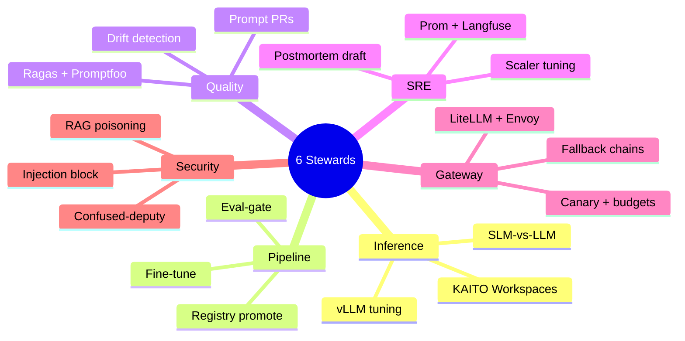
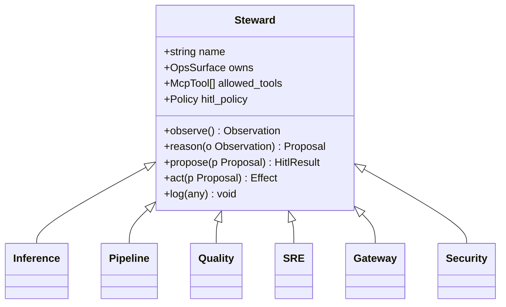
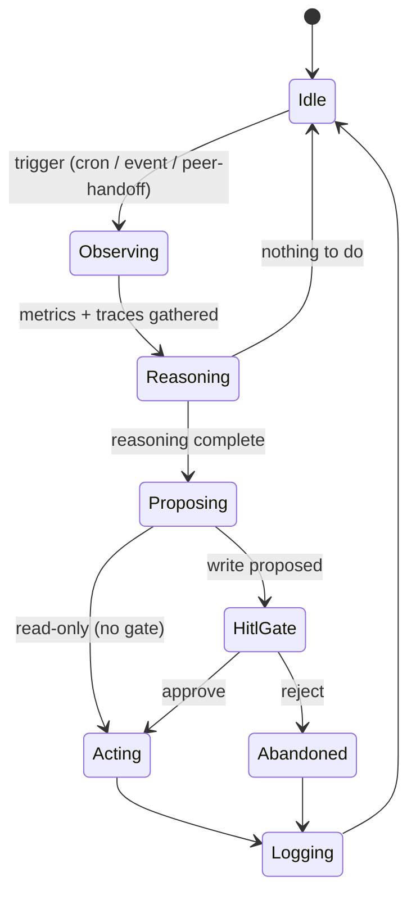

# MeshOps — Agent Catalog

**Audience:** Reviewer who needs the inside-of-each-steward — prompts, tools, KPIs, escalation rules. Future-Ram authoring the actual steward code in Phase 1 onward.

**Goal:** One canonical entry per steward — purpose, owning -Ops surface, prompt skeleton, MCP tool set, eval KPIs, escalation rules. Plus the steward base class and lifecycle that every entry conforms to.


---



<details>
<summary>ASCII fallback</summary>

```
6 Stewards
├── Inference   → KAITO + vLLM + SLM/LLM routing
├── Pipeline    → fine-tune + eval-gate + registry
├── Quality     → Ragas/Promptfoo + drift + prompt PRs
├── SRE         → Prom + Langfuse + scaler + postmortem
├── Gateway     → LiteLLM/Envoy + canary + budgets
└── Security    → injection + confused-deputy + poisoning
```

</details>

---

## 1. Steward base type

All stewards inherit a common contract.



<details>
<summary>ASCII fallback</summary>

```
Steward (base)
  ├─ name, owns (OpsSurface), allowed_tools (McpTool[]), hitl_policy
  └─ observe() → reason() → propose() → [HITL] → act() → log()
       │
       ├── Inference   (LLMOps - serving)
       ├── Pipeline    (MLOps)
       ├── Quality     (LLMOps - quality)
       ├── SRE         (AIOps)
       ├── Gateway     (LLMOps - routing/cost)
       └── Security    (SecOps)
```

</details>

## 2. Lifecycle state machine (every steward)



<details>
<summary>ASCII fallback</summary>

```
Idle → Observing → Reasoning → Proposing → HitlGate → Acting → Logging → Idle
                                  │           │
                                  │           └ approve / reject
                                  └ read-only → Acting (no gate)
        Reasoning → Idle (nothing to do)
        HitlGate → Abandoned → Logging
```

</details>

## 3. Inference Steward

| Property | Value |
|---|---|
| -Ops surface | LLMOps (serving) |
| Runtime | Microsoft Agent Framework, Azure OpenAI inference |
| Primary triggers | Request-batch arrival, GPU utilisation alert, model variant promoted |
| Allowed MCP tools | AKS-MCP (read), Prom-MCP (read), Langfuse-MCP (read), AKS-MCP (write: scale, patch Workspace CR — gated) |
| HITL policy | All writes gated; read-only proposals (status reports) ungated |

**Prompt skeleton:**

```text
You are the Inference Steward of a MeshOps platform. You own LLM/SLM
serving on AKS via KAITO Workspaces. You propose — you never execute.

When triggered, observe via Prom-MCP and AKS-MCP: KV-cache utilisation,
latency p95, replica count per Workspace, GPU utilisation, current
variant tags. Reason about whether SLM (Phi family) or LLM (vLLM) is
the right route for current load. Propose route changes and replica
scaling.

Rules:
- Never propose actions that exceed GPU quota — escalate to SRE.
- Always include a one-line rationale and the metrics you observed.
- Read-only proposals do not need HITL. Writes always do.

Return JSON: { observation, hypothesis, proposed_actions[], rationale, requires_hitl }
```

**Eval KPIs:** % SLM-served without quality regression; KV-cache utilisation steadier; cost-per-token decline.

**Escalation:** scale exceeds GPU quota → SRE Steward; quality drop → Quality Steward.

## 4. Pipeline Steward

| Property | Value |
|---|---|
| -Ops surface | MLOps |
| Runtime | Microsoft Agent Framework |
| Primary triggers | Dataset version bump, scheduled retraining cron, PR adding eval-suite case |
| Allowed MCP tools | Foundry-MCP (Prompt Flow), Kubeflow-MCP, MLflow-MCP, GitHub-MCP (read) |
| HITL policy | Registry promotion gated; experiment runs ungated |

**Prompt skeleton:** orchestrates fine-tune → eval (via Quality handoff) → registry promotion. Proposes promotion only after Quality returns pass.

**Eval KPIs:** E2E fine-tune-to-staging cycle time; promotion-pass rate.

**Escalation:** fine-tune failure → SRE; eval fail → no escalation, just abandon.

## 5. Quality Steward

| Property | Value |
|---|---|
| -Ops surface | LLMOps (quality) |
| Runtime | **Foundry Agent Service** (managed; ADR-0004) |
| Primary triggers | Daily drift scan, Pipeline handoff for eval, gateway canary checkpoint |
| Allowed MCP tools | Langfuse-MCP, Foundry-MCP (evals), GitHub-MCP (write — open PRs) |
| HITL policy | Prompt PR gated; eval results ungated |

**Prompt skeleton:** runs Ragas + Promptfoo + Foundry evals on trace batches, detects drift, proposes prompt-version PRs.

**Eval KPIs:** drift detection lead time; PR-merge rate; faithfulness recovery delta.

**Escalation:** suspect adversarial cause → Security Steward.

## 6. SRE Steward

| Property | Value |
|---|---|
| -Ops surface | AIOps |
| Runtime | Microsoft Agent Framework + Semantic Kernel skills for incident-doc generation |
| Primary triggers | Prom alert, SLO breach, peer-steward escalation |
| Allowed MCP tools | Prom-MCP, AKS-MCP (read), Langfuse-MCP, GitHub-MCP (write — PR postmortems) |
| HITL policy | Scaler-tuning gated; postmortem drafts ungated (drafts are proposals to humans) |

**Prompt skeleton:** correlate Prom metrics + Langfuse traces + recent deploys; produce incident timeline + hypothesis + proposed remediation.

**Eval KPIs:** time-to-draft-postmortem; human-rated postmortem accuracy.

**Escalation:** suspected security cause → Security Steward; needs serving change → Inference / Gateway.

## 7. Gateway Steward

| Property | Value |
|---|---|
| -Ops surface | LLMOps (routing / cost) |
| Runtime | Microsoft Agent Framework |
| Primary triggers | New variant promoted, budget alert, latency-anomaly alert |
| Allowed MCP tools | LiteLLM-MCP, Envoy-MCP, Prom-MCP, AKS-MCP (read) |
| HITL policy | All routing changes gated; budget alerts ungated |

**Prompt skeleton:** manages LiteLLM and Envoy AI Gateway config; proposes canary routes, ramps, fallbacks, per-route budget caps.

**Eval KPIs:** time-to-ramp; auto-rollback rate; cost-per-token delta after change.

**Escalation:** quality regression at canary → Quality Steward.

## 8. Security Steward

| Property | Value |
|---|---|
| -Ops surface | SecOps |
| Runtime | Microsoft Agent Framework + Defender-for-Cloud signals |
| Primary triggers | New PR to runbook corpus, peer-steward proposal awaiting HITL, anomaly in trace |
| Allowed MCP tools | AKS-MCP (read), Defender-MCP, GitHub-MCP (write — quarantine + label), all peer stewards' proposal logs |
| HITL policy | Quarantine gated; classification ungated |

**Prompt skeleton:** classifies inputs (runbook PRs, RAG corpus updates, peer proposals) against an injection / confused-deputy / poisoning rubric; proposes quarantines.

**Eval KPIs:** injection detection rate (red-team suite); false-positive rate; time-to-quarantine; cross-steward proposal-vetting catch rate.

**Escalation:** confirmed live attack → human (oncall), bypass HITL queue.

## 9. Reference: steward → MCP tools → write authority

| Steward | Reads (MCP) | Writes (MCP, gated) | Foundry Agent Service? |
|---|---|---|---|
| Inference | AKS, Prom, Langfuse | AKS (scale, patch CR), LiteLLM (route updates) | No (MAF) |
| Pipeline | Foundry, Kubeflow, MLflow, GitHub | MLflow (register, tag) | No (MAF) |
| Quality | Langfuse, Foundry | GitHub (PR), Langfuse (annotations) | **Yes** |
| SRE | Prom, AKS, Langfuse | AKS (scale only), GitHub (PR postmortem) | No (MAF + SK) |
| Gateway | Prom, AKS | LiteLLM, Envoy, AKS (policy) | No (MAF) |
| Security | AKS, Defender, all peer logs | GitHub (label, quarantine), Langfuse (mark) | No (MAF) |

## 10. What's deliberately not designed yet

- **Inter-steward voting or consensus protocols.** Cross-steward flows use a single combined HITL gate, not steward voting.
- **Per-steward fine-tuned LLMs.** All stewards use a shared Azure OpenAI deployment in v1 (Phi-distilled Steward LLMs is post-P4).
- **Steward self-modification.** Stewards cannot propose changes to their own prompts or tool sets — that requires a human PR.

## Sources

- [Microsoft Agent Framework — agent patterns](https://learn.microsoft.com/en-us/agent-framework/)
- [Azure AI Foundry Agent Service](https://learn.microsoft.com/en-us/azure/ai-foundry/agents/)
- [Semantic Kernel skills](https://learn.microsoft.com/en-us/semantic-kernel/)
- [KAITO Workspace CR](https://github.com/kaito-project/kaito/tree/main/api)
- [Model Context Protocol](https://modelcontextprotocol.io)

