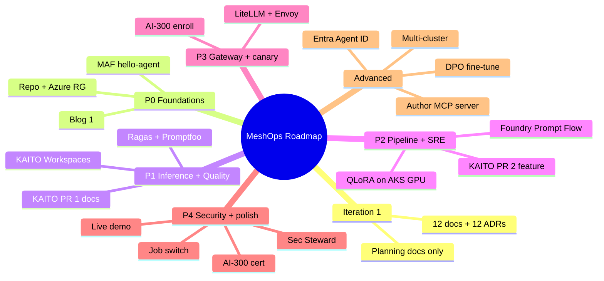
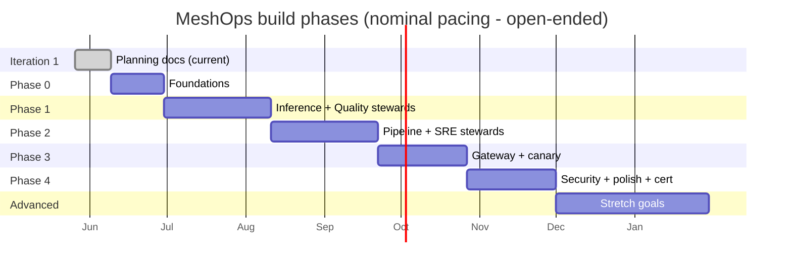
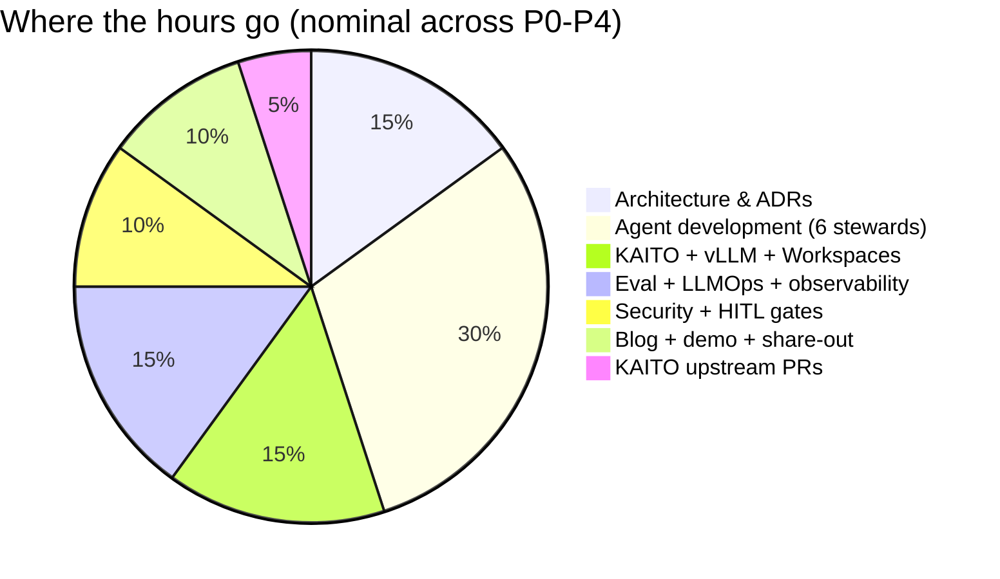
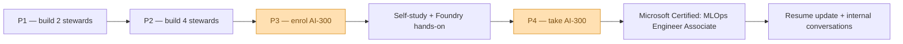

# MeshOps — AI Career Roadmap

**Audience:** Ram (build owner); future-Ram tracking progress against a plan.

**Goal:** Sequence the MeshOps build into phases that each ship a deliverable across **all four -Ops surfaces** (LLMOps, MLOps, AIOps, SecOps) from day 1 — closing Ram's skill gap to AI Platform / MLOps / LLMOps roles while preserving his AKS depth as the moat.


---



<details>
<summary>ASCII fallback</summary>

```
MeshOps Roadmap
├── Iteration 1: planning docs only (12 docs + 12 ADRs)
├── P0 Foundations:    Repo + Azure RG, MAF hello-agent, Blog #1
├── P1 Inference+Qual: KAITO Workspaces, Ragas+Promptfoo, KAITO PR #1
├── P2 Pipeline+SRE:   Foundry Prompt Flow, QLoRA on GPU, KAITO PR #2
├── P3 Gateway+canary: LiteLLM+Envoy, AI-300 enroll
├── P4 Security+poly:  Sec Steward, AI-300 cert, demo, job switch
└── Advanced:          Entra Agent ID, multi-cluster, MCP authoring, DPO
```

</details>

---

## 1. Phase-at-a-glance



<details>
<summary>ASCII fallback</summary>

```
Iteration 1 (current)  [██] 2 weeks
P0 Foundations             [███] 3 weeks
P1 Inference+Quality          [██████] 6 weeks
P2 Pipeline+SRE                     [██████] 6 weeks
P3 Gateway+canary                          [█████] 5 weeks
P4 Security+polish+cert                         [█████] 5 weeks
Advanced (open-ended)                                [█████████] 8+ weeks
```

</details>

Timeline is **open-ended** by author decision (2026-05-26). Phase durations are nominal at ~5–7 hrs/wk; calendar is not locked.

## 2. Every phase ships on every -Ops surface

The hard constraint: no phase punts a surface. The mesh narrative falls apart if a hiring manager opens the repo at any phase and sees "LLMOps only, MLOps coming later."

| Phase | LLMOps | MLOps | AIOps | SecOps | Agentic milestone | Cert / blog / KAITO |
|---|---|---|---|---|---|---|
| **P0** Foundations | Langfuse trace of one agent call | Repo scaffold, ADRs 0001–0006 Accepted | Prometheus scrape of Foundry call counts | Repo public, secrets in Key Vault, threat-model v0 | MAF "hello-agent" calling AKS-MCP read-only | Blog #1: "Why a mesh of stewards beats one supervisor" |
| **P1** Inference + Quality stewards | KAITO Workspace serving Phi-4-mini + a vLLM LLM; Ragas + Promptfoo eval gate | KAITO Workspace as code (CR in Helm); model registry in MLflow on Azure ML | Prom rules for KAITO pod restarts / GPU utilisation | Threat-model v1 covering MAS01–MAS03 | Two stewards live (Inference + Quality), one on MAF + one on Foundry Agent Service | KAITO PR #1 (docs or small fix); Blog #2: "Two stewards, one Foundry, why" |
| **P2** Pipeline + SRE stewards | Drift detection on fine-tuned variant | QLoRA pipeline via Foundry Prompt Flow + Kubeflow on AKS GPU spot | Postmortem-draft skill on SRE Steward; OTel propagated through MCP calls | Cross-steward audit log; HITL gate logs immutable in Azure Storage | All four stewards in MAF group-chat | KAITO PR #2 (feature, e.g. KV-cache metric exporter); Blog #3: "MLOps pipeline as a steward" |
| **P3** Gateway Steward + canary | LiteLLM + Envoy AI Gateway w/ KV-cache routing; A/B route SLM↔LLM; cost-budget guardrails | Canary eval policy: 5% traffic, auto-rollback on faithfulness regression | Gateway-Steward auto-tunes scalers based on Prom signals | Gateway RBAC + per-route budget cap as policy | Five stewards live; cross-steward incident demo recorded | **AI-300 enroll**; Blog #4: "Routing tokens like packets — InferencePool/EPP" |
| **P4** Security Steward + polish | Eval scorecard published | Full GitOps repo readable top-to-bottom | SLO dashboard + alert policy | Prompt-injection-through-cluster-state detection live; MAS04–MAS05 mitigated | Six-steward mesh complete; live demo URL | **AI-300 certification**; KAITO PR #3 merged; Tech talk; **Job-switch conversations** |

## 3. Effort split



<details>
<summary>ASCII fallback</summary>

```
Architecture & ADRs            ████ 15%
Agent development              ████████ 30%
KAITO/vLLM/Workspaces          ████ 15%
Eval/LLMOps/observability      ████ 15%
Security + HITL gates          ███ 10%
Blog/demo/share-out            ███ 10%
KAITO upstream PRs             █ 5%
```

</details>

## 4. AI-300 placement (deferred to P3/P4)



<details>
<summary>ASCII fallback</summary>

```
P1 → P2 → P3 enrol AI-300 → study → P4 take exam → cert → job
                ▲                              ▲
                amber milestone               amber milestone
```

</details>

**Rationale:** Author decision 2026-05-26 — build before certify. By the time Ram sits AI-300, MeshOps's MLOps surfaces (Pipeline Steward + Foundry Prompt Flow + Kubeflow on AKS) are already shipped, so the cert reinforces *demonstrated* knowledge instead of leading it. The risk — hiring conversations in P3 happening without the cert on the resume — is accepted; the repo + KAITO PRs carry the signal.

## 5. KAITO upstream PR track

Three PRs across P1–P4, escalating in depth:

| PR | Phase | Scope | Why this one |
|---|---|---|---|
| **#1** | P1 | Docs or small fix (e.g., README clarification, sample improvement, minor bug) | Lowers the bar to first contribution; gets Ram into the contributor workflow before P2's heavier feature work |
| **#2** | P2 | Substantive feature (candidate: KV-cache metric exporter for `vllm:` series; or a new RAGEngine vector-store backend integration) | Demonstrates Ram can ship to a Microsoft OSS project; the artifact survives him; correlates with Inference Steward's needs |
| **#3** | P3-P4 | Opportunistic (driven by what MeshOps surfaces upstream) | Closes the loop — MeshOps consuming KAITO surfaces gaps that get fixed upstream |

Each PR gets a one-page write-up in `030-experiments/kaito-prs/PR-XX/README.md` covering the upstream context, the fix, the review thread, and the merge.

## 6. Reference: phase → cert/blog/PR/demo deliverables

| Phase | Cert milestone | Blog post | KAITO PR | Demo artefact |
|---|---|---|---|---|
| P0 | — | "Why a mesh of stewards beats one supervisor" | — | Repo public, screencast of MAF hello-agent |
| P1 | — | "Two stewards, one Foundry, why" | #1 docs/fix | Inference + Quality stewards on lab cluster |
| P2 | — | "MLOps pipeline as a steward" | #2 feature | All 4 stewards in MAF group-chat (recording) |
| P3 | **AI-300 enrol** | "Routing tokens like packets — InferencePool/EPP" | — | Gateway + canary demo |
| P4 | **AI-300 cert** | "Security Steward — defending an agent mesh" | #3 opportunistic | Live demo URL + tech talk |
| Adv | (post-cert) | "Authoring a MCP server upstream" | (advanced contribs) | Entra Agent ID + multi-cluster sketch |

## 7. Advanced track (post-P4)

- Entra Agent ID for stewards (production-grade agent identity).
- Multi-cluster federation of stewards across AKS clusters in different regions.
- DPO fine-tune to demonstrate preference-tuning beyond LoRA.
- llm-d disaggregated serving evaluation against KAITO+vLLM.
- Author and publish a custom MCP server (candidate: `langfuse-mcp` or `kaito-ops-mcp`).
- Red-team eval suite for prompt-injection through cluster state.

## 8. What's deliberately not designed yet

- **Exact calendar dates.** Phases are open-ended; durations nominal.
- **External demo hosting cost cap.** Awaits ADR (placeholder for cost-and-deployment.md decisions).
- **Speaking-engagement targets.** Tech talk is a P4 deliverable; venue is author-decided when the time comes.
- **Whether to attempt AI-102 (Azure AI Engineer Associate)** in addition to AI-300. Currently no — AI-300 is the right credential for MLOps positioning.

## Sources

- [Microsoft Certified: MLOps Engineer Associate (AI-300)](https://learn.microsoft.com/en-us/credentials/certifications/operationalizing-machine-learning-and-generative-ai-solutions/)
- [Microsoft Certifications Retiring in 2026 (DP-100 → AI-300)](https://www.certificationcamps.com/microsoft-certifications-retiring/)
- [KAITO releases](https://github.com/kaito-project/kaito/releases)
- [Microsoft AI — MLOps Engineer role](https://microsoft.ai/job/machine-learning-operations-mlops-engineer/)

