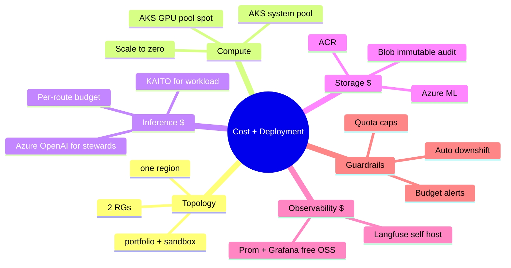
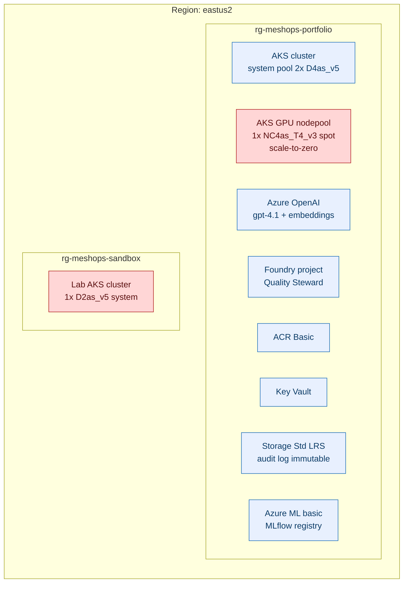
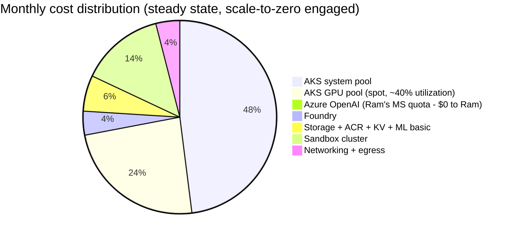
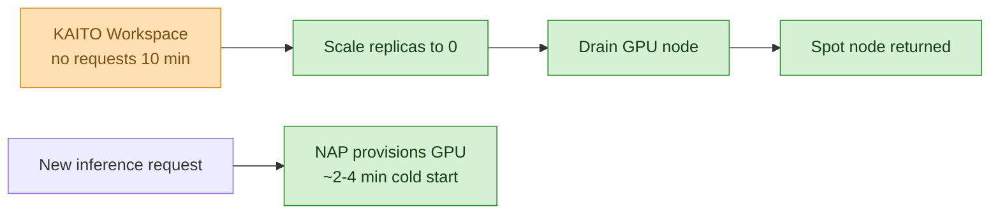
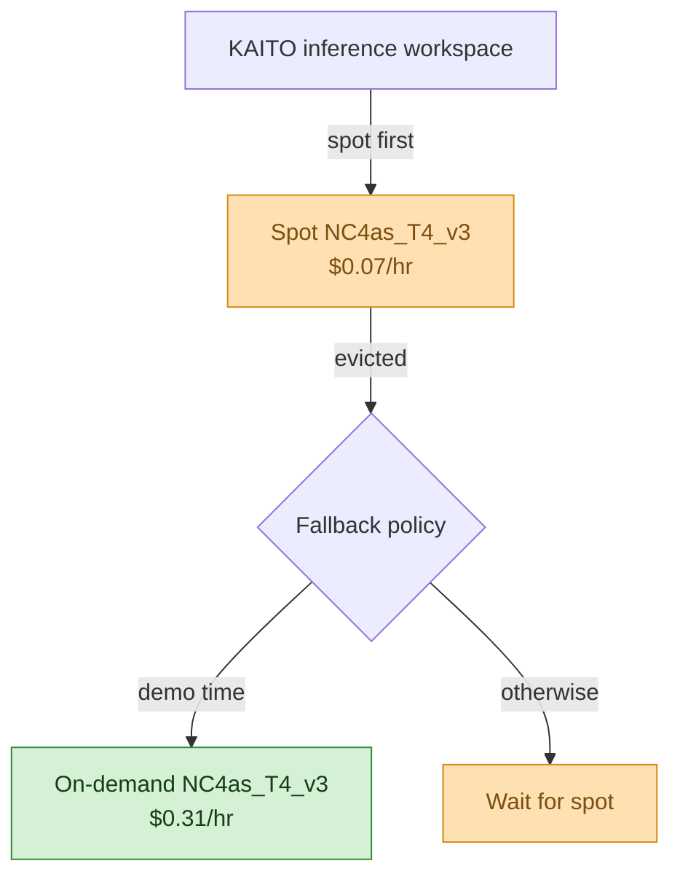
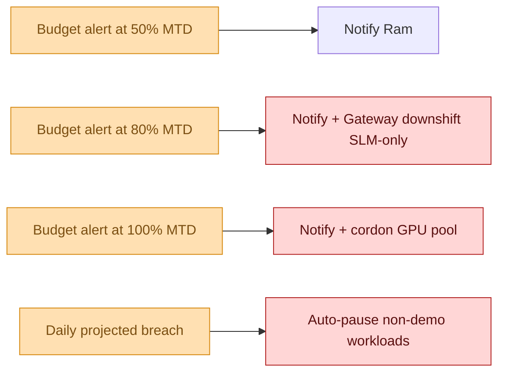

# MeshOps — Cost and Deployment

**Audience:** Reviewer evaluating whether this is operationally realistic for a portfolio project; future-Ram defending the cost story.

**Goal:** Azure topology, GPU-spot strategy, scale-to-zero rules, monthly budget projection, overage guardrails. What the dollars look like, and where they go.


---



<details>
<summary>ASCII fallback</summary>

```
Cost + Deployment
├── Topology:        2 RGs (portfolio + sandbox), one region (eastus2)
├── Compute:         AKS system pool + GPU pool (spot) + scale-to-zero
├── Inference $:     Azure OpenAI (stewards) + KAITO (workload) + per-route budget
├── Storage $:       ACR + Blob (immutable audit) + Azure ML
├── Observability $: Prom + Grafana (OSS) + Langfuse (self-hosted)
└── Guardrails:      Budget alerts + auto-downshift + quota caps
```

</details>

---

## 1. Topology



<details>
<summary>ASCII fallback</summary>

```
Region: eastus2
├── rg-meshops-portfolio:
│     AKS system pool (2 × D4as_v5)
│     AKS GPU nodepool (1 × NC4as_T4_v3, SPOT, scale-to-zero)
│     Azure OpenAI (gpt-4.1 + embeddings)
│     Foundry project (Quality Steward + evals)
│     ACR Basic
│     Key Vault
│     Storage Std LRS (audit log immutable)
│     Azure ML basic (MLflow registry)
│
└── rg-meshops-sandbox:
      Lab AKS cluster (1 × D2as_v5 system)
```

</details>

| Component | SKU / size | Why this size |
|---|---|---|
| AKS system pool | 2× D4as_v5 (4 vCPU, 16 GB) | Holds stewards + MCP servers + Langfuse + LiteLLM + Prom-Grafana. Two nodes for HA. |
| AKS GPU pool | 1× NC4as_T4_v3 spot | T4 fits Phi-4-mini easily; spot pricing ~70% lower; scale-to-zero when no Workspace requests |
| Azure OpenAI | gpt-4.1 + text-embedding-3-large | Stewards run on AOAI; tenant-paid by Microsoft (Ram's quota) |
| Foundry project | Standard | Quality Steward + managed evals |
| ACR | Basic | Sufficient for portfolio scale |
| Storage | Standard LRS, immutable container for audit | Audit is the only data with strict integrity needs |
| Azure ML | Basic | MLflow registry; no compute |
| Sandbox AKS | 1× D2as_v5 | Minimal — only runs the RAG corpus ingester + a few attack-simulation workloads |

## 2. Cost projection (monthly, USD; rough order)



<details>
<summary>ASCII fallback</summary>

```
AKS system pool                          $240   (D4as_v5 × 2, on-demand)
AKS GPU pool (spot, ~40% util)           $120   (NC4as_T4_v3 spot, scale-to-zero)
Azure OpenAI (Ram's MS tenant quota)     $  0   (covered by MS internal)
Foundry                                  $ 20   (project + small eval runs)
Storage + ACR + KV + Azure ML basic      $ 30
Sandbox cluster                          $ 70   (D2as_v5)
Networking + egress                      $ 20
─────────────────────────────────────────────
Total (idle-friendly, scale-to-zero)     ~$500/mo
With heavy demo days (GPU pool +30h)     ~$650/mo
Burst (training + eval marathon)          ~$900/mo (cap)
```

</details>

**Key assumption:** Azure OpenAI usage by stewards is **$0 to Ram** because of Microsoft tenant quota (see auto-memory `ram-microsoft-resources`). Without that lever the AOAI line would dominate (~$300–800/mo depending on steward activity).

**Hard cap target:** ~$900/mo. Any month projected above this triggers the Gateway Steward's budget-overrun flow (UC X-2) — automatic SLM-downshift + alert.

## 3. Scale-to-zero rules



<details>
<summary>ASCII fallback</summary>

```
KAITO Workspace idle 10 min → scale replicas to 0 → drain GPU node → spot node returned
New inference request → NAP provisions GPU (~2-4 min cold start)
```

</details>

Cold start of 2–4 min is acceptable for a portfolio demo. Production users would want a warm-pool of one — explicit tradeoff in ADR-0009 vicinity.

## 4. GPU spot strategy



<details>
<summary>ASCII fallback</summary>

```
KAITO inference workspace → spot first ($0.07/hr)
       Evicted → if demo time → fallback to on-demand ($0.31/hr)
                otherwise        → wait for spot
```

</details>

Spot eviction is acceptable for non-demo workloads (eval runs, fine-tunes). For live demos, Gateway Steward switches to on-demand for the demo window only.

## 5. Overage guardrails



<details>
<summary>ASCII fallback</summary>

```
50% MTD  → notify Ram
80% MTD  → notify + Gateway downshift to SLM-only
100% MTD → notify + cordon GPU pool
Daily projected breach → auto-pause non-demo workloads
```

</details>

Microsoft cost-management budgets configure these alerts. The 80% / 100% actions are not just notifications — they trigger automation paths the Gateway Steward owns.

## 6. Reference: deployment artefact → tool → where defined

| Artefact | Tool | Location |
|---|---|---|
| AKS cluster + nodepools | Terraform | `terraform/aks/` (Phase 0) |
| KAITO add-on | AKS managed add-on | enabled at cluster creation |
| KAITO Workspaces | Helm + Workspace CRs | `helm/kaito-workspaces/` (Phase 1) |
| Stewards | Helm | `helm/stewards/` (Phase 1+) |
| MCP servers | Helm | `helm/mcp/` (Phase 0+) |
| LiteLLM + Envoy | Helm | `helm/gateway/` (Phase 3) |
| Prom-Grafana | kube-prometheus-stack Helm | `helm/observability/` (Phase 0) |
| Langfuse | Helm | `helm/langfuse/` (Phase 0) |
| MLflow | Azure ML workspace | Terraform |
| HITL audit log | Azure Storage + immutability policy | Terraform |
| Budgets + alerts | Terraform + Azure Cost Management | `terraform/budgets/` |
| GitOps repo | GitHub | top-level + Helm chart values |

## 7. What's deliberately not designed yet

- **Hard $/mo cap value.** Open question for Ram; placeholder $900/mo.
- **Multi-region deployment cost model.** Single region in v1.
- **Reserved instance pricing.** Pay-as-you-go in v1; no RIs until predictable load.
- **Detailed FinOps integration.** Cost-management budgets only; no FinOps tooling yet.
- **Per-tenant cost attribution.** Single tenant in v1.

## Sources

- [Azure VM pricing](https://azure.microsoft.com/en-us/pricing/details/virtual-machines/linux/)
- [Azure Spot VM pricing](https://azure.microsoft.com/en-us/pricing/spot-advisor/)
- [Azure OpenAI pricing](https://azure.microsoft.com/en-us/pricing/details/cognitive-services/openai-service/)
- [KAITO scale-to-zero](https://github.com/kaito-project/kaito/blob/main/docs/scaling.md)
- [Azure Cost Management — budgets](https://learn.microsoft.com/en-us/azure/cost-management-billing/costs/tutorial-acm-create-budgets)

