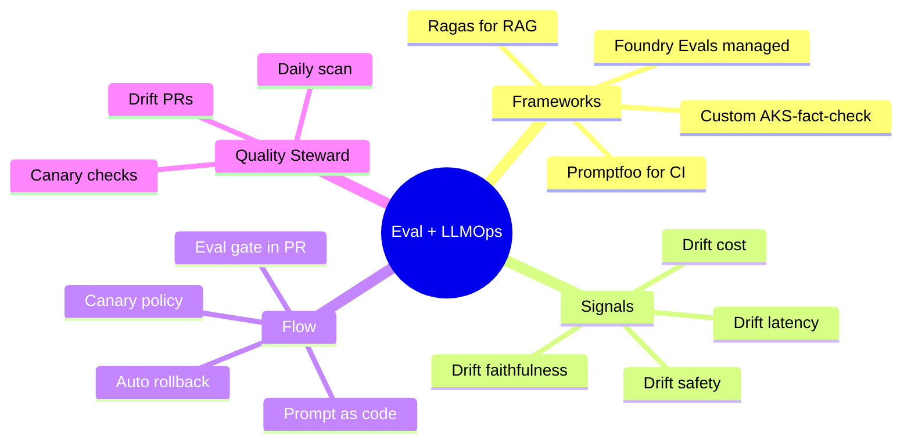
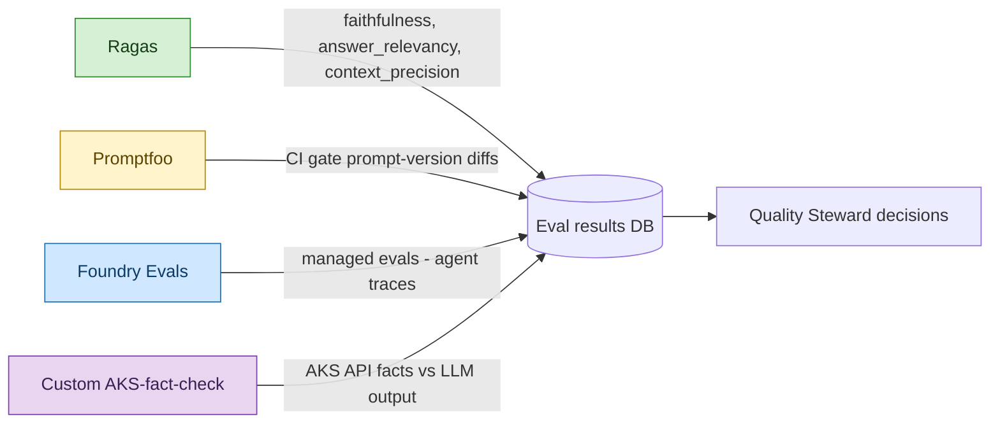
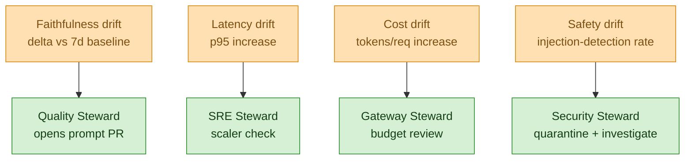
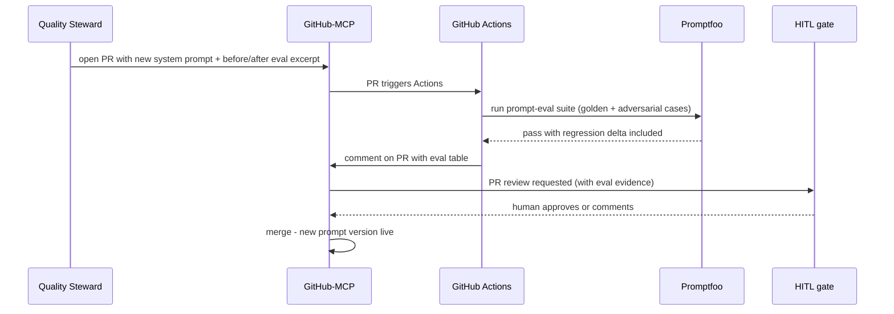
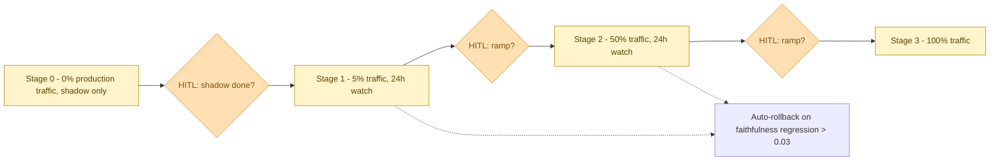

# MeshOps — Eval and LLMOps

**Audience:** Reviewer who wants to know *how* MeshOps proves the platform works — what's measured, where, by whom, and what fails a build.

**Goal:** The eval-and-LLMOps spine — frameworks, drift signals, prompt-as-code PR flow, canary policy, and the cross-cutting role of Quality Steward.


---



<details>
<summary>ASCII fallback</summary>

```
Eval + LLMOps
├── Frameworks: Ragas (RAG) | Promptfoo (CI) | Foundry Evals (managed) | AKS-fact-check (custom)
├── Signals:    faithfulness drift | latency drift | cost drift | safety drift
├── Flow:       prompt-as-code → eval gate in PR → canary → auto-rollback
└── Quality Steward: daily scan | drift PRs | canary checks
```

</details>

---

## 1. Eval framework split (ADR-0007)



<details>
<summary>ASCII fallback</summary>

```
Ragas       → faithfulness / answer_relevancy / context_precision   ─┐
Promptfoo   → CI gate on prompt-version diffs                       │→ Eval DB → Quality Steward
Foundry Evals → managed evals on agent traces                       │
AKS-fact-check (custom) → API facts vs LLM output                   ─┘
```

</details>

| Framework | Best for | Where it runs | Decision driver |
|---|---|---|---|
| **Ragas** | RAG quality on the runbook corpus | Quality Steward (Foundry Agent Service) | Faithfulness drift signal |
| **Promptfoo** | Prompt-version CI gate (PR-time) | GitHub Actions | Pass/fail on PR merge |
| **Foundry Evaluations** | Agent-trace eval, managed | Foundry project | Drift + agent quality |
| **Custom AKS-fact-check** | "Did the steward correctly read the cluster?" | Steward sidecar | Ground-truth check against AKS API responses |

The split is deliberate — no single framework covers RAG quality + prompt CI + agent-trace eval + cluster-fact grounding equally well. Forcing one would mean overspending on test infrastructure for the wrong things.

## 2. Drift signals



<details>
<summary>ASCII fallback</summary>

```
Faithfulness drift  → Quality opens prompt PR
Latency drift       → SRE scaler check
Cost drift          → Gateway budget review
Safety drift        → Security quarantine + investigate
```

</details>

| Signal | Source | Threshold (v1 starting point) | Owning steward |
|---|---|---|---|
| Faithfulness drift | Ragas on Langfuse trace batch | -0.03 vs 7d rolling baseline | Quality |
| Answer-relevancy drift | Ragas | -0.05 vs baseline | Quality |
| Latency p95 drift | Prometheus | +20% vs baseline | SRE |
| Tokens-per-request drift | LiteLLM + Prom | +15% vs baseline | Gateway |
| Injection detection rate | Security Steward eval suite | <95% recall | Security |
| HITL approve rate | Audit log analysis | <70% (means steward proposals are low quality) | Quality + per-owning-steward |

Thresholds are starting points — Phase 2 will tune them with real data.

## 3. Prompt-as-code PR flow



<details>
<summary>ASCII fallback</summary>

```
Quality Steward → GitHub-MCP opens PR with new prompt + eval excerpt
                → GitHub Actions triggers
                → Promptfoo runs (golden + adversarial)
                → CI comments with eval table
                → HITL approves via GitHub PR review
                → Merge → new prompt version live
```

</details>

**Key rule:** prompts are versioned the same way code is. No "edit and save" prompts — every change is a PR, every PR runs eval, every merge is auditable.

## 4. Canary policy (Gateway Steward owns)



<details>
<summary>ASCII fallback</summary>

```
Stage 0: shadow (0% traffic) → HITL → Stage 1: 5% → HITL → Stage 2: 50% → HITL → Stage 3: 100%
Auto-rollback at any stage if faithfulness regression > 0.03
```

</details>

Three HITL gates — never more, never fewer. Each gate has explicit eval evidence attached.

## 5. Reference: metric → tool → threshold → owner

| Metric | Tool | Threshold (v1) | Owner | Phase live |
|---|---|---|---|---|
| Faithfulness | Ragas | ≥ baseline-0.03 | Quality | P1 |
| Answer relevancy | Ragas | ≥ baseline-0.05 | Quality | P1 |
| Context precision | Ragas | ≥ baseline-0.05 | Quality | P1 |
| Prompt-version CI pass | Promptfoo | 100% golden, ≥80% adversarial | Quality + CI | P1 |
| Agent trace quality | Foundry Evals | (Foundry-managed thresholds) | Quality | P2 |
| AKS-fact correctness | Custom check | 100% pass | Each steward sidecar | P2 |
| Latency p95 | Prom | ≤ baseline+20% | SRE | P0 |
| Tokens/req | LiteLLM | ≤ baseline+15% | Gateway | P3 |
| Cost-per-route $ | LiteLLM | per-route budget cap | Gateway | P3 |
| Injection recall | Security eval suite | ≥ 95% | Security | P4 |
| HITL approve rate | Audit log | ≥ 70% per steward | Quality + per steward | P2 onward |

## 6. What's deliberately not designed yet

- **A/B test of stewards' own prompts.** Stewards run one prompt version each in v1.
- **Reward-model-based eval.** Custom reward models are out of scope; rely on Ragas + Foundry.
- **Cross-model leaderboards.** No "GPT vs Phi-distilled steward" comparisons in v1.
- **Synthetic-data-generated eval suites.** All eval suites are hand-curated + sampled real traces in v1.

## Sources

- [Ragas — RAG eval framework](https://docs.ragas.io/)
- [Promptfoo — prompt CI](https://www.promptfoo.dev/docs/)
- [Azure AI Foundry — Evaluations](https://learn.microsoft.com/en-us/azure/ai-foundry/concepts/evaluation-approach-gen-ai)
- [Langfuse — drift detection](https://langfuse.com/docs/scores/overview)

