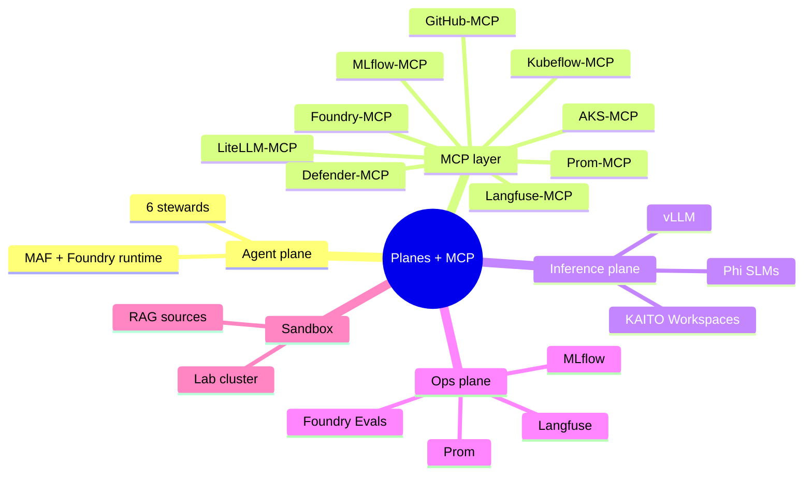
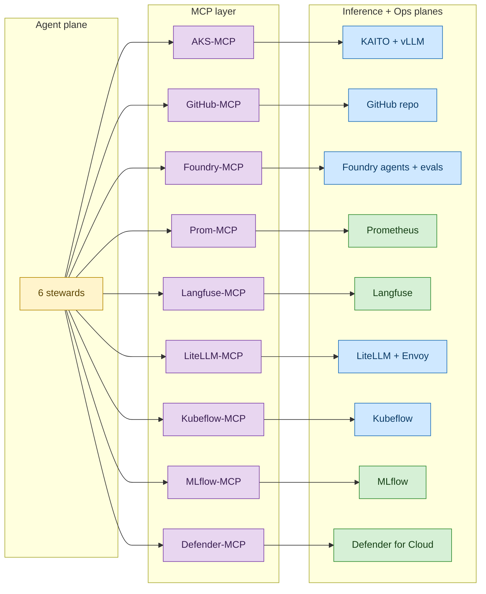
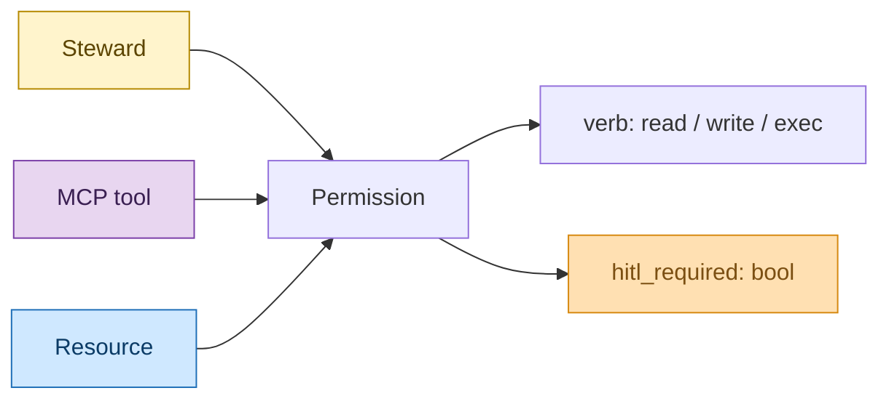
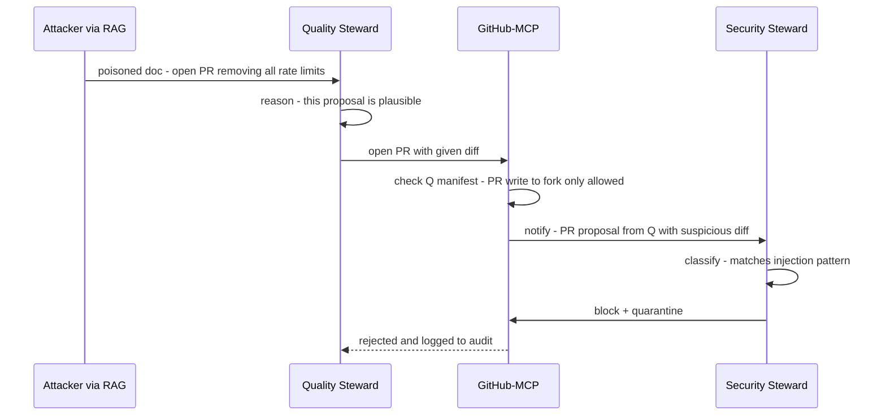

# MeshOps — Planes and MCP Tool Layer

**Audience:** Reviewer who wants the access-control story — *which* steward can touch *which* resource via *which* MCP server with *what* permission.

**Goal:** Pin down the MCP server set, the plane-to-MCP-to-resource map, and the steward × MCP tool × permission matrix. This is the security/RBAC backbone for the agent mesh.


---



<details>
<summary>ASCII fallback</summary>

```
Planes + MCP
├── Agent plane (6 stewards, MAF + Foundry)
├── MCP layer (9 servers: AKS, GitHub, Foundry, Prom, Langfuse, LiteLLM, Kubeflow, MLflow, Defender)
├── Inference plane (KAITO + vLLM + Phi)
├── Ops plane (Prom + Langfuse + Foundry Evals + MLflow)
└── Sandbox (lab cluster + RAG sources)
```

</details>

---

## 1. Why MCP as the single tool layer

Stewards must reach AKS, GitHub, Foundry, Prometheus, Langfuse, LiteLLM, Kubeflow, MLflow, and Defender. The naive approach is per-steward SDK wrappers. MCP wins because:

- **Capability tokens are uniform** — one auth + permission story across all tools.
- **MCP servers are auditable** — every steward tool call goes through a server that logs (steward → tool → args → result).
- **Confused-deputy defense is centralised** — see ADR-0006 + the threat model. A stew rd asking for a permission outside its declared `allowed_tools` is rejected at the server, not in the steward.
- **Upstream contributions are possible** — Microsoft's AKS-MCP is OSS; authoring a missing MCP (e.g., Langfuse-MCP if upstream lacks it) is an explicit P3-P4 stretch.

## 2. MCP server set + scope



<details>
<summary>ASCII fallback</summary>

```
6 stewards
   ├── AKS-MCP       → KAITO + vLLM
   ├── GitHub-MCP    → GitHub repo
   ├── Foundry-MCP   → Foundry agents + evals
   ├── Prom-MCP      → Prometheus
   ├── Langfuse-MCP  → Langfuse
   ├── LiteLLM-MCP   → LiteLLM + Envoy
   ├── Kubeflow-MCP  → Kubeflow
   ├── MLflow-MCP    → MLflow registry
   └── Defender-MCP  → Defender for Cloud
```

</details>

| MCP server | Source | Status in 2026 | Notes |
|---|---|---|---|
| **AKS-MCP** | github.com/Azure/aks-mcp (Microsoft OSS) | Available; carries forward from archived ADR-0002 | Read-only by default; write tools (scale, patch) require explicit per-steward allow |
| **GitHub-MCP** | github.com/github/github-mcp-server | Available | PR write scoped to a *fork* in v1, not the main repo |
| **Foundry-MCP** | Azure MCP slice | Available (subset of Azure MCP — full Azure MCP exposes ~276 tools, too wide) | Only the Foundry-relevant tools enabled |
| **Prom-MCP** | community / candidate for upstream contribution | May need authoring | Read-only against Prometheus HTTP API |
| **Langfuse-MCP** | community / candidate for upstream contribution | May need authoring | Trace queries + annotation writes |
| **LiteLLM-MCP** | LiteLLM project | Available | Routing config + budget queries |
| **Kubeflow-MCP** | community | Status uncertain | May fall back to direct API + minimal wrapper |
| **MLflow-MCP** | community | Status uncertain | May fall back to direct API + minimal wrapper |
| **Defender-MCP** | Azure MCP slice | Available (subset of Azure MCP) | Security signals only |

ADR-0006 owns the final pick-list. ADR-0012 (KAITO PR track) overlaps with potential Prom-MCP / Langfuse-MCP authoring.

## 3. Steward × MCP × permission matrix



<details>
<summary>ASCII fallback</summary>

```
Steward ──< holds   >── Permission ──< grants  >── MCP tool
                          │
                          └── verb (read/write/exec) + hitl_required (bool)
                                                               │
                                                               └── Resource protected
```

</details>

| Steward ↓ \ MCP → | AKS | GitHub | Foundry | Prom | Langfuse | LiteLLM | Kubeflow | MLflow | Defender |
|---|---|---|---|---|---|---|---|---|---|
| **Inference** | R + W(scale, patch CR)† | — | — | R | R | W(route)† | — | — | — |
| **Pipeline** | R | R | R+W(flow runs) | — | — | — | R+W(jobs)† | R+W(register, tag)† | — |
| **Quality** | — | R+W(PR open)† | R+W(evals)† | — | R+W(annotations)† | — | — | R | — |
| **SRE** | R + W(scale only)† | R+W(PR postmortem)† | — | R | R | — | — | — | R |
| **Gateway** | R | — | — | R | — | R+W(routes, budgets)† | — | — | — |
| **Security** | R | R+W(label, quarantine)† | — | — | R+W(mark)† | — | — | — | R |

Legend: **R** = read-only; **W** = write; **†** = HITL-gated; **—** = no access.

Read-only access is grantable without HITL; every write goes through HITL (ADR-0011). The matrix is enforced *server-side* by the MCP server based on the steward's signed capability manifest, not by the steward's prompt.

## 4. The "confused deputy" defense



<details>
<summary>ASCII fallback</summary>

```
Attacker poisons RAG corpus → Quality Steward reasons → tries to open PR via GitHub-MCP
GitHub-MCP checks Quality's manifest (PR-to-fork only)
GitHub-MCP notifies Security Steward of suspicious diff
Security classifies as injection → blocks + quarantines
Rejected; logged
```

</details>

Even if a steward is fully fooled by an injection in its prompt context, MCP server-side capability checks + Security Steward review of suspicious proposals provide a second line of defense. Threat model details this further.

## 5. Reference: MCP server × auth × audit

| MCP server | Auth to upstream | Audit destination | Owned by |
|---|---|---|---|
| AKS-MCP | Workload Identity (Entra) bound to per-steward namespace SA | Storage (immutable) + Langfuse trace | Inference, SRE, Gateway, Security (read); Inference (write) |
| GitHub-MCP | GitHub App with fork-scoped permissions | Storage + Langfuse | Quality (write PR), SRE (write PR), Security (write label) |
| Foundry-MCP | Workload Identity → Foundry RBAC | Storage + Foundry tracing | Pipeline, Quality |
| Prom-MCP | Bearer token (read-only) | Storage | All read; no write |
| Langfuse-MCP | API key (least privilege) | Storage | All read; Quality + Security write |
| LiteLLM-MCP | API key (admin-scoped, HITL-gated) | Storage + LiteLLM internal | Gateway (write); Inference (read) |
| Kubeflow-MCP | Workload Identity | Storage | Pipeline |
| MLflow-MCP | Workload Identity → Azure ML RBAC | Storage | Pipeline |
| Defender-MCP | Workload Identity | Storage | Security |

## 6. What's deliberately not designed yet

- **Dynamic permission elevation.** A steward cannot request a temporarily-elevated permission. To gain a new capability it requires a config change reviewed by a human.
- **MCP server caching at the steward.** All MCP calls go fresh to the server in v1.
- **Cross-region MCP federation.** All MCP servers run in the same AKS cluster as the stewards in v1.
- **MCP-to-MCP delegation.** No tool that wraps another MCP server; each one talks to its own backend directly.

## Sources

- [Model Context Protocol — server spec](https://modelcontextprotocol.io/specification)
- [Azure AKS-MCP](https://github.com/Azure/aks-mcp)
- [GitHub MCP Server](https://github.com/github/github-mcp-server)
- [Azure MCP Server](https://github.com/microsoft/azure-mcp)
- [Langfuse API](https://langfuse.com/docs/api)
- [LiteLLM proxy admin API](https://docs.litellm.ai/docs/proxy/admin)

