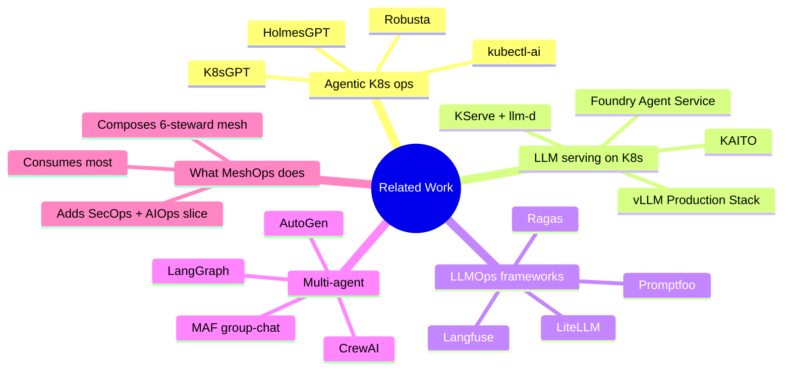
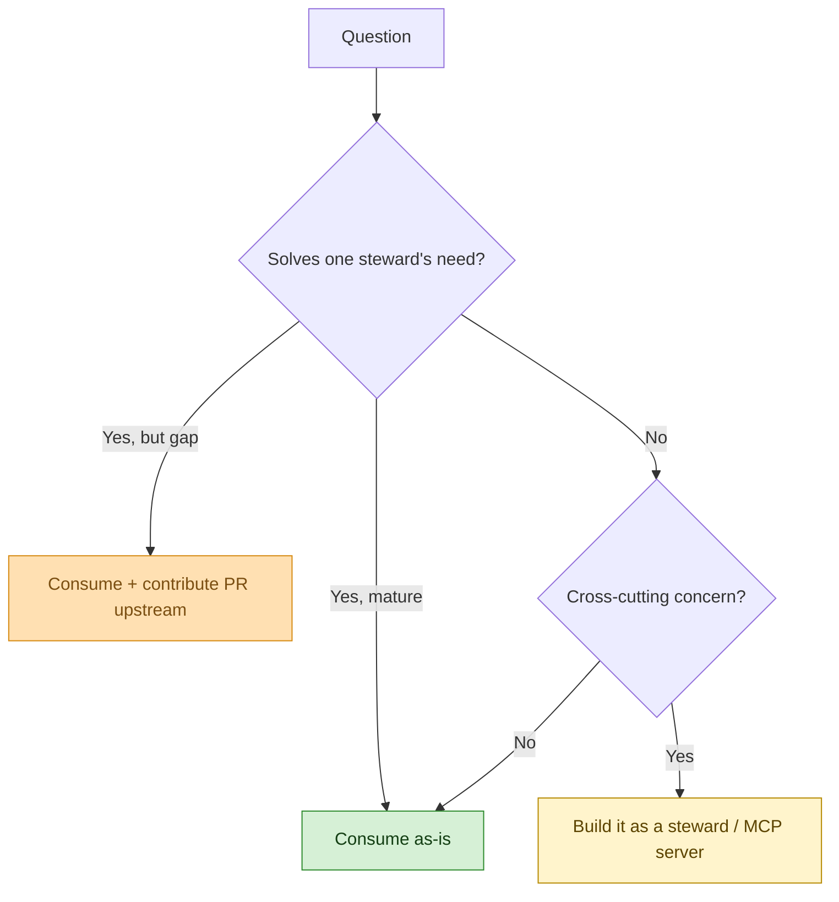

# MeshOps — Related Work

**Audience:** Reviewer asking "why doesn't this exist already?" — and rightly skeptical. Future-Ram fielding the same question in interviews.

**Goal:** Position MeshOps against the existing landscape (agentic-ops tools, LLM-on-K8s reference stacks, AgentOps frameworks). Where MeshOps consumes vs. competes vs. extends. Honest comparison, not a sales pitch.


---



<details>
<summary>ASCII fallback</summary>

```
Related Work
├── Agentic K8s ops:    HolmesGPT | K8sGPT | Robusta | kubectl-ai
├── LLM serving:        KAITO | KServe+llm-d | vLLM Production Stack | Foundry Agent Service
├── LLMOps frameworks:  Langfuse | Ragas | Promptfoo | LiteLLM
├── Multi-agent:        MAF group-chat | AutoGen | LangGraph | CrewAI
└── MeshOps: consumes most + composes 6-steward mesh + adds SecOps+AIOps slice
```

</details>

---

## 1. Build-vs-buy decision



<details>
<summary>ASCII fallback</summary>

```
Question
  └─ Solves one steward's need?
       ├─ Yes, mature           → Consume as-is (green)
       ├─ Yes, but gap          → Consume + contribute PR upstream (amber)
       └─ No → Cross-cutting concern?
                  ├─ Yes → Build it as a steward / MCP server (yellow)
                  └─ No  → Consume
```

</details>

The MeshOps build is mostly *composition*, not invention. The novelty is the **steward partition + HITL gate pattern + cross-cutting Security observer** — not any individual component.

## 2. Landscape comparison

| Project | What it does | LLMOps | MLOps | AIOps | SecOps | Multi-agent | MeshOps relationship |
|---|---|:-:|:-:|:-:|:-:|:-:|---|
| **HolmesGPT** (Robusta) | LLM-powered K8s incident root-cause | – | – | ✓ | – | single | Inspiration for SRE Steward; MeshOps generalises beyond incidents |
| **K8sGPT** | LLM-assisted K8s diagnostics | – | – | partial | – | single | Inspiration only; CLI tool, not an agent mesh |
| **Robusta** | K8s monitoring + automation engine | – | – | ✓ | – | rule-based | MeshOps replaces rules with stewards |
| **kubectl-ai** | LLM-augmented kubectl | – | – | partial | – | single | One small tool, not a platform |
| **KAITO** | LLM/SLM/RAG operator for AKS | partial (serving) | partial | – | – | – | MeshOps **consumes** KAITO (ADR-0005) and **contributes** upstream (ADR-0012) |
| **KServe + llm-d** | K8s-native LLM serving | partial (serving) | partial | – | – | – | Alternative to KAITO — rejected in ADR-0005 (Foundry adjacency wins) |
| **vLLM Production Stack** | Reference vLLM-on-K8s deployment | partial | – | – | – | – | Inside KAITO Workspaces |
| **Foundry Agent Service** | Managed agent runtime | – | – | – | – | ✓ | MeshOps uses for Quality Steward (ADR-0004); not for the whole mesh |
| **Langfuse** | LLM observability | ✓ | – | partial | – | – | MeshOps **consumes** (ADR-0010) |
| **Ragas / Promptfoo** | LLM eval frameworks | ✓ | – | – | – | – | MeshOps **consumes** (ADR-0007) |
| **LiteLLM** | LLM gateway | ✓ (routing) | – | – | – | – | MeshOps **consumes** (ADR-0008) |
| **MAF group-chat** | Multi-agent orchestration | – | – | – | – | ✓ | MeshOps **builds on top of** (ADR-0003) |
| **AutoGen** | Multi-agent framework | – | – | – | – | ✓ | Considered in ADR-0003; rejected in favor of MAF |
| **LangGraph** | Graph-based agent workflows | – | – | – | – | ✓ | Used in ADR-0003 as a portability demo, not primary runtime |
| **CrewAI** | Role-based multi-agent | – | – | – | – | ✓ | Considered, rejected — too generic, not K8s-aware |

The matrix shows the same shape repeatedly: every existing project covers *one* -Ops surface or *one* concern. **No existing project covers LLMOps + MLOps + AIOps + SecOps as a coordinated mesh of specialist agents on AKS.** That gap is MeshOps's positioning.

## 3. What MeshOps is and isn't

| MeshOps **is** | MeshOps **is not** |
|---|---|
| A composition pattern across mature OSS + Microsoft tooling | A new LLM, fine-tune method, or model architecture |
| A 6-steward mesh with explicit -Ops surface partition | A general-purpose AgentOps framework |
| AKS-native (Foundry / KAITO / Azure OpenAI first) | Cloud-agnostic — Azure-only by design (ADR-0005) |
| HITL-gated by default — autonomy is at the *proposal* layer | Autonomous remediation / closed-loop |
| Public OSS portfolio project | A productized SaaS or commercial offering |
| Inspired by HolmesGPT / K8sGPT but with broader scope | A HolmesGPT / K8sGPT fork |

## 4. Reference: what we consume vs extend vs build

| Component | Consume | Contribute upstream | Build new |
|---|:-:|:-:|:-:|
| KAITO | ✓ | ✓ (ADR-0012 — 2-3 PRs) | – |
| MAF group-chat | ✓ | – | – |
| Foundry Agent Service | ✓ (Quality Steward only) | – | – |
| Semantic Kernel skills | ✓ | – | – |
| LangGraph | ✓ (portability demo) | – | – |
| AKS-MCP | ✓ | (possibly) | – |
| GitHub-MCP | ✓ | – | – |
| Foundry-MCP (Azure MCP slice) | ✓ | – | – |
| LiteLLM-MCP | ✓ | – | – |
| Prom-MCP, Langfuse-MCP | (if available) | – | possibly (advanced track) |
| Ragas, Promptfoo, Foundry Evals | ✓ | – | – |
| Custom AKS-fact-check eval | – | – | ✓ |
| LiteLLM + Envoy AI Gateway | ✓ | – | – |
| Prometheus + Grafana + Langfuse | ✓ | – | – |
| Steward base + lifecycle | – | – | ✓ |
| HITL gate flow | – | – | ✓ |
| Security Steward observer | – | – | ✓ |
| Six steward prompts + manifests | – | – | ✓ |

## 5. What's deliberately not designed yet

- **Detailed comparison against any project that emerges between iteration-1 and Phase 4.** Re-verify at the start of each phase.
- **Performance benchmarking against HolmesGPT or K8sGPT.** Different scope — not apples-to-apples.

## Sources

- [HolmesGPT (Robusta)](https://github.com/robusta-dev/holmesgpt)
- [K8sGPT](https://k8sgpt.ai/)
- [KAITO](https://github.com/kaito-project/kaito)
- [KServe + llm-d](https://llm-d.ai/)
- [vLLM Production Stack](https://github.com/vllm-project/production-stack)
- [Microsoft Agent Framework](https://learn.microsoft.com/en-us/agent-framework/)
- [AutoGen](https://microsoft.github.io/autogen/)
- [LangGraph](https://langchain-ai.github.io/langgraph/)
- [Langfuse](https://langfuse.com/)
- [LiteLLM](https://docs.litellm.ai/)

