# MeshOps — Tech Stack

**Audience:** Reviewer who wants the "what runs where, on top of what" picture in one read; future-Ram defending technology choices to a hiring manager; new contributor onboarding to the repo.

**Goal:** Catalogue every named technology MeshOps depends on across **all phases (P0–P4 + Advanced)**, grouped by plane, with version pins where they exist and a "phase-introduced" column so a reader can tell what's needed *now* vs *later*. Per-iteration tech stacks live next to their iteration (`iterations/iteration-NN/09-tech-stack.md`).


---

## 1. Top-of-doc map

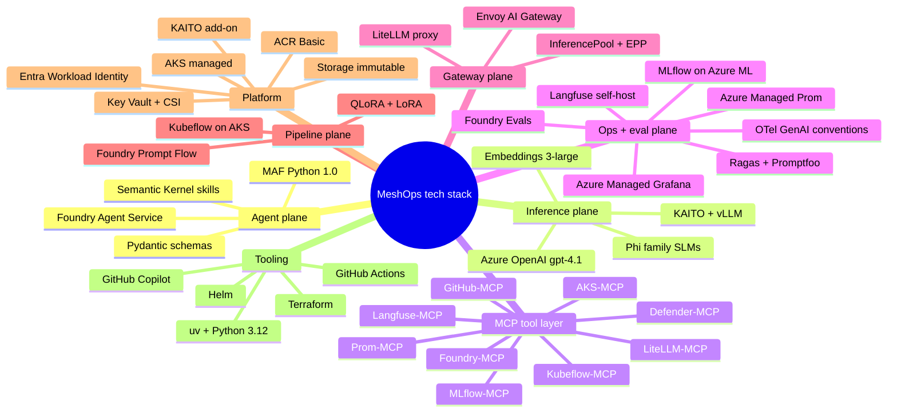

<details>
<summary>ASCII fallback</summary>

```
MeshOps tech stack
├── Agent plane:     MAF 1.0 (Python) + Foundry Agent Service + SK skills + Pydantic
├── Inference plane: KAITO + vLLM + Phi SLMs + Azure OpenAI gpt-4.1 + text-embedding-3-large
├── MCP layer:       AKS / GitHub / Foundry / Prom / Langfuse / LiteLLM / Kubeflow / MLflow / Defender
├── Ops + eval:      Managed Prom + Grafana + Langfuse + Foundry Evals + Ragas/Promptfoo + MLflow + OTel
├── Gateway:         LiteLLM + Envoy AI Gateway + InferencePool/EPP
├── Pipeline:        Foundry Prompt Flow + Kubeflow on AKS + QLoRA/LoRA
├── Platform:        AKS + KAITO add-on + ACR + Key Vault + Storage + Entra Workload Identity
└── Tooling:         uv + Python 3.12 + Terraform + Helm + GitHub Actions + Copilot
```

</details>

---

## 2. The five planes — at a glance

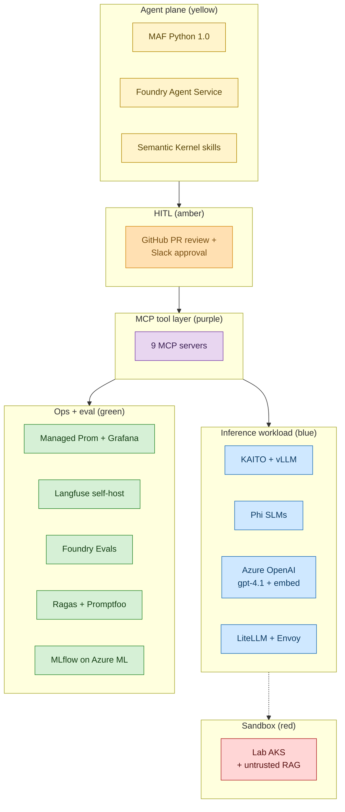

<details>
<summary>ASCII fallback</summary>

```
Agent plane (MAF + Foundry Agent Service + SK)
        │
        ▼
  HITL gates (GitHub PR + Slack)
        │
        ▼
  MCP tool layer (9 servers)
        ├──► Inference plane (KAITO+vLLM, Phi, AOAI, LiteLLM+Envoy)
        └──► Ops+eval plane (Managed Prom+Grafana, Langfuse, Foundry Evals,
                              Ragas+Promptfoo, MLflow)
                  │
                  └──► Sandbox (lab AKS + RAG sources, red zone)
```

</details>

Colour key: yellow = agent plane; blue = inference workload; green = ops/eval; purple = MCP tools; amber = HITL gates; red = sandbox / untrusted.

---

## 3. Agent plane — runtimes & libraries

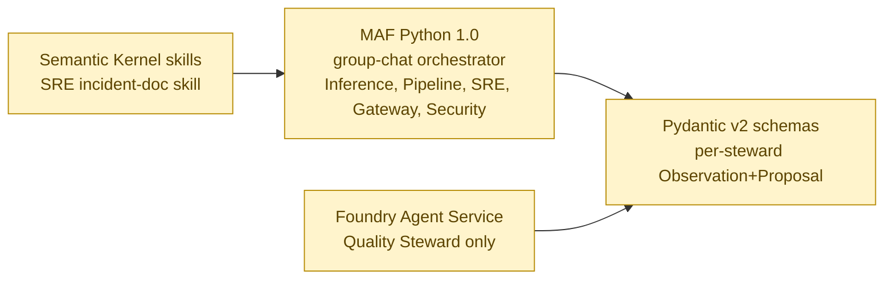

<details>
<summary>ASCII fallback</summary>

```
MAF Python 1.0 ──► Pydantic v2 schemas
   ▲                     ▲
   │                     │
SK skills (SRE)     Foundry Agent Service (Quality)
```

</details>

| Library | Pin | Why this choice | Phase introduced |
|---|---|---|---|
| Python | `3.12` | LTS-aligned with AKS base images and Azure Functions; MAF supports 3.10+ | P0 |
| `agent-framework` (MAF) | `==1.0.*` | 1.0 GA April 2026; group-chat, MCP tool wrapping, OTel built-in | P0 |
| `agent-framework-azure-ai` | `==1.0.*` | brings `AzureOpenAIChatClient` for steward inference | P0 |
| Foundry Agent Service | (managed) | Quality Steward only; demonstrates managed-vs-self-hosted fluency (ADR-0002) | P1 |
| `semantic-kernel` | latest stable | SK skills used by SRE Steward for postmortem template rendering | P2 |
| `pydantic` | `>=2.7,<3.0` | Schema validation for `Observation`, `Proposal`, `HitlEnvelope`; MAF requires v2 | P0 |
| `mcp` (Python SDK) | `>=1.6,<2.0` | stdio + streamable-http transports for MCP clients | P0 |

**Why MAF for five stewards and Foundry Agent Service for one:** ADR-0002 codifies the split. Five stewards run on MAF inside AKS for full control + lower latency; Quality Steward runs on Foundry Agent Service to showcase managed-agent fluency and tap into Foundry's built-in eval surface.

---

## 4. Inference plane — workload models & substrate

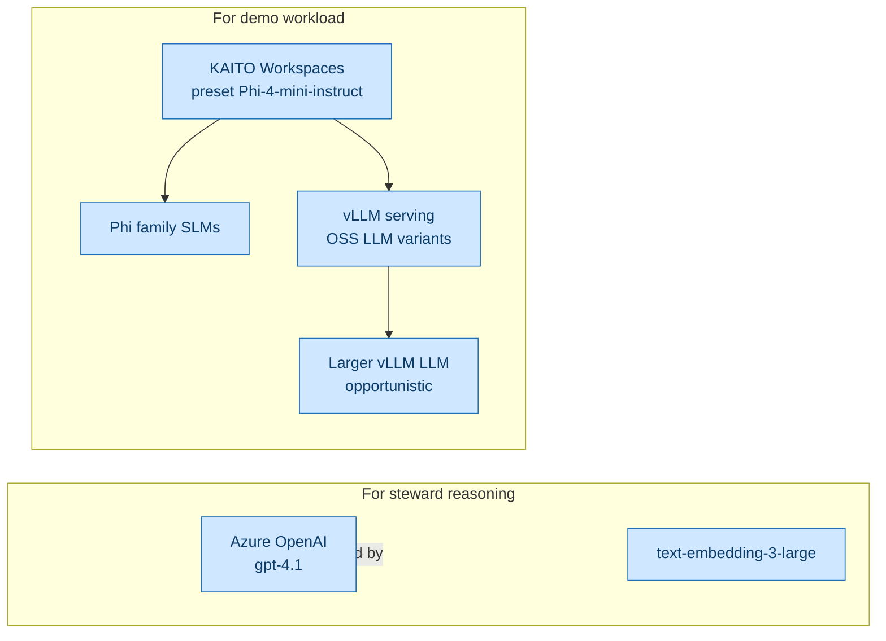

<details>
<summary>ASCII fallback</summary>

```
For steward reasoning:  Azure OpenAI gpt-4.1 + text-embedding-3-large
For demo workload:      KAITO Workspaces → Phi family SLMs (preset)
                                        └─► vLLM serving larger LLM variants
```

</details>

| Component | Pin / variant | Role | Phase introduced |
|---|---|---|---|
| Azure OpenAI deployment | `gpt-4.1` (v1 API) | Inference engine for **all six stewards**; not the demo workload | P0 |
| Azure OpenAI embeddings | `text-embedding-3-large` | RAG embedding for runbook corpus | P1 |
| KAITO add-on | `--enable-ai-toolchain-operator` | AKS managed add-on; declarative `Workspace` CR | P0 |
| KAITO preset | `phi-4-mini-instruct` | SLM workload demo; T4-friendly | P0 |
| vLLM | bundled by KAITO | Higher-throughput serving for larger LLMs | P1 |
| Phi family SLMs | Phi-4-mini → Phi-4 | Smaller-is-cheaper demo; SLM/LLM routing comparison | P0–P2 |
| GPU SKU | `Standard_NC4as_T4_v3` (spot) | $0.07/hr spot price; scale-to-zero between requests | P0 |

**Rule of thumb:** the stewards' **reasoning** never runs on KAITO. KAITO is the workload being operated, not the substrate the operators run on (`035_others/architecture.md` §6). This separation lets the mesh remain operable when KAITO is broken.

---

## 5. MCP tool layer — all nine servers

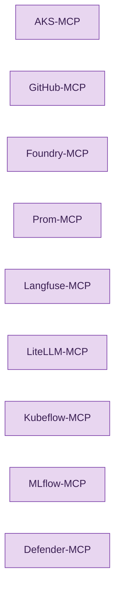

<details>
<summary>ASCII fallback</summary>

```
9 MCP servers: AKS, GitHub, Foundry, Prom, Langfuse, LiteLLM, Kubeflow, MLflow, Defender
```

</details>

| MCP server | Upstream source | Status | Phase live |
|---|---|---|---|
| **AKS-MCP** | `github.com/Azure/aks-mcp` v0.0.18 | Available; Microsoft OSS | P0 |
| **GitHub-MCP** | `github.com/github/github-mcp-server` | Available | P1 |
| **Foundry-MCP** | Azure MCP (Foundry slice) | Available | P1 |
| **Prom-MCP** | In-repo shim (P0) → community / upstream candidate | Authored in-repo for P0; potential upstream PR | P0 |
| **Langfuse-MCP** | Community / candidate for upstream contribution | May need authoring (KAITO PR track candidate) | P2 |
| **LiteLLM-MCP** | LiteLLM project | Available | P3 |
| **Kubeflow-MCP** | Community | Status uncertain; may fall back to direct API | P2 |
| **MLflow-MCP** | Community | Status uncertain; may fall back to direct API | P2 |
| **Defender-MCP** | Azure MCP (Defender slice) | Available | P4 |

ADR-0004 (MCP as the tool layer) is the governing decision; per-steward × per-MCP read/write capability matrix lives in `035_others/planes-and-mcp.md` §3.

---

## 6. Gateway plane — routing & policy

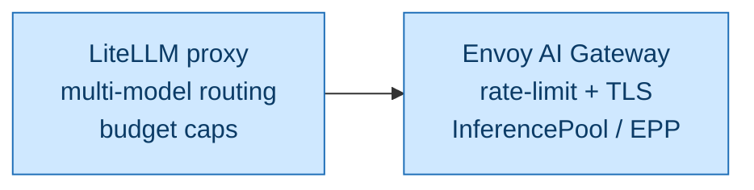

<details>
<summary>ASCII fallback</summary>

```
LiteLLM proxy (routing + budget) ─► Envoy AI Gateway (TLS + rate-limit + InferencePool/EPP)
```

</details>

| Component | Role | Phase introduced |
|---|---|---|
| LiteLLM proxy | Multi-model routing, per-route budget caps, fallback chains | P3 |
| Envoy AI Gateway | TLS termination, rate-limit, KV-cache-aware routing via InferencePool / EPP | P3 |
| Gateway Steward | Owns LiteLLM + Envoy config via MCP | P3 |

P0–P2 has **no gateway**; stewards call KAITO Workspaces directly. The gateway is the P3 introduction that lets Gateway Steward demonstrate canary, cost-routing, and budget guardrails.

---

## 7. Pipeline plane — training & registry

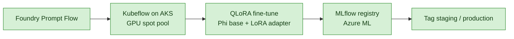

<details>
<summary>ASCII fallback</summary>

```
Foundry Prompt Flow → Kubeflow on AKS (GPU spot) → QLoRA fine-tune → MLflow registry (Azure ML) → tag
```

</details>

| Component | Role | Phase introduced |
|---|---|---|
| Foundry Prompt Flow | Declarative fine-tune + eval pipelines | P2 |
| Kubeflow on AKS | Spot GPU job execution for QLoRA runs | P2 |
| QLoRA + LoRA | Parameter-efficient fine-tune; Phi base + adapters | P2 |
| MLflow on Azure ML | Model registry + lineage | P2 |
| Pipeline Steward | Drives Foundry Prompt Flow + Kubeflow runs via MCP | P2 |

Pre-training, RLHF, and DPO are out of scope for P0–P4. DPO appears in the Advanced track (post-P4) as a stretch.

---

## 8. Ops + eval plane — observability & quality

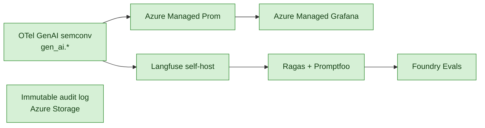

<details>
<summary>ASCII fallback</summary>

```
OTel GenAI semconv (gen_ai.*)
  ├──► Langfuse self-host  ──► Ragas + Promptfoo ──► Foundry Evals
  └──► Azure Managed Prom  ──► Azure Managed Grafana

Immutable audit log on Azure Storage (HITL approvals + write actions)
```

</details>

| Component | Pin | Role | Phase introduced |
|---|---|---|---|
| OpenTelemetry SDK | `opentelemetry-sdk >=1.30` | Tracing for every steward call; emits `gen_ai.*` attributes | P0 |
| OTLP exporter (gRPC) | `opentelemetry-exporter-otlp-proto-grpc >=1.30` | Ships spans to Langfuse | P0 |
| OTel Prom exporter | `opentelemetry-exporter-prometheus >=0.51b0` | `/metrics` on port 9464; scraped by Managed Prom | P0 |
| Langfuse | `>=3.0,<4.0` (Python SDK); `langfuse/langfuse-k8s` Helm chart | LLM observability — traces, scores, prompt-version diff | P0 |
| Azure Managed Prometheus | `az aks update --enable-azure-monitor-metrics` | Cluster + agent metrics; `PodMonitor` CRD | P0 |
| Azure Managed Grafana | Azure managed service | Dashboards for agent runs + workload health | P0 |
| Ragas | `docs.ragas.io` | RAG quality eval — faithfulness, answer relevancy, context precision | P1 |
| Promptfoo | `promptfoo.dev` | Prompt-version CI gate (GitHub Actions PR check) | P1 |
| Foundry Evaluations | Foundry project | Managed eval surface for agent traces | P2 |
| Custom AKS fact-check | In-repo Python | "Did the steward correctly read the cluster?" ground truth | P2 |
| MLflow | Azure ML workspace | Model registry, lineage | P2 |
| Immutable audit log | Azure Storage Std LRS with immutability policy | HITL approvals + write-action provenance | P0 |

---

## 9. Platform plane — Azure & identity

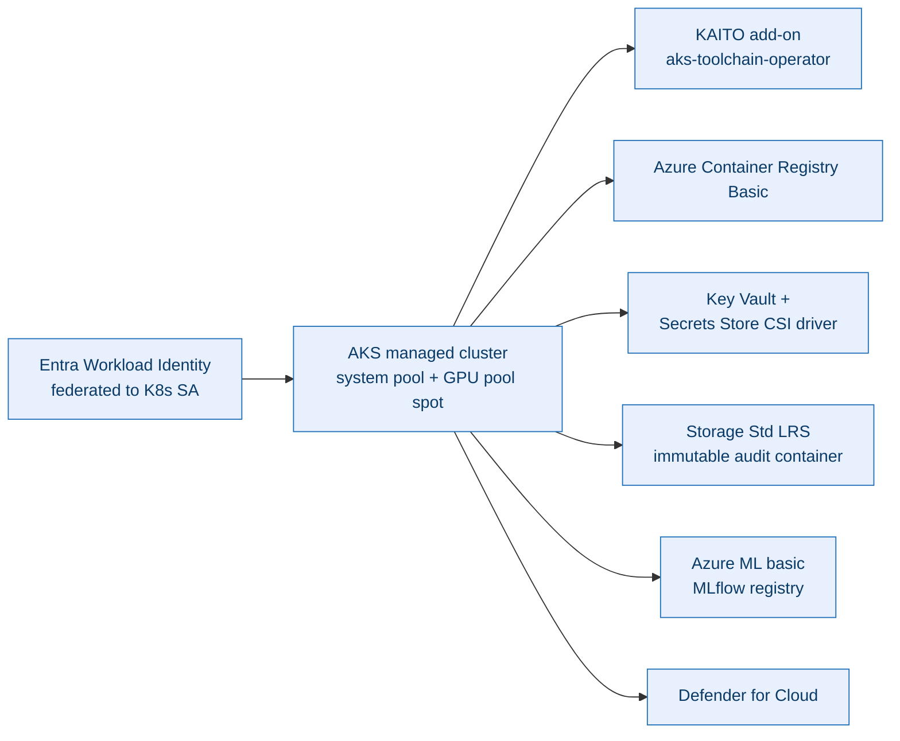

<details>
<summary>ASCII fallback</summary>

```
Entra Workload Identity (federated to K8s ServiceAccounts)
       │
       ▼
   AKS managed cluster (system + GPU spot pools)
       ├── KAITO add-on (aks-toolchain-operator)
       ├── ACR Basic
       ├── Key Vault + Secrets Store CSI driver
       ├── Storage Std LRS (immutable audit container)
       ├── Azure ML basic (MLflow registry)
       └── Defender for Cloud
```

</details>

| Component | Why this choice | Phase introduced |
|---|---|---|
| AKS managed cluster | Ram's depth; "production-realistic" K8s; KAITO add-on lives only on AKS | P0 |
| AKS system pool | `2 × Standard_D4as_v5` for stewards + MCP + Langfuse + LiteLLM | P0 |
| AKS GPU pool | `1 × Standard_NC4as_T4_v3` spot, scale-to-zero between requests | P0 |
| KAITO add-on | Native `Workspace` CR; AKS managed; declarative model serving | P0 |
| Entra Workload Identity | Federated to K8s ServiceAccount per steward; no static secrets | P0 |
| Key Vault + CSI driver | Per-pod secret projection; Langfuse + Foundry keys; no `.env` baked into images | P0 |
| ACR Basic | Steward container images | P0 |
| Azure Storage (immutable) | HITL audit log; locked container; ADR-0011 requires immutability | P0 |
| Azure ML basic | MLflow tracking + model registry backend | P2 |
| Defender for Cloud | Signals for Security Steward (via Defender-MCP) | P4 |
| Entra Agent ID | Steward identity primitive (replaces workload-identity per-SA model) | Advanced |

ADR-0003 (Azure-first stack) is the governing decision. Ram has unlimited Microsoft tenant Azure quota — Azure-native is the *default* choice unless there is a technical reason to deviate.

---

## 10. Tooling — repo, build, and developer experience

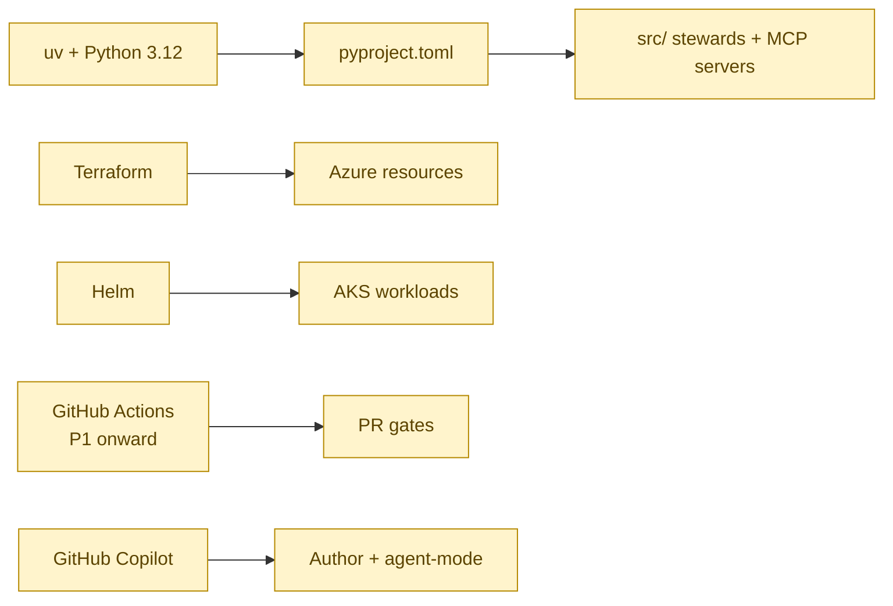

<details>
<summary>ASCII fallback</summary>

```
uv + Python 3.12 + pyproject.toml ──► src/ (stewards + MCP servers)
Terraform ──► Azure resources (subscription, RG, AKS, KV, AMP, ACR, Storage, AML)
Helm ──► AKS workloads (stewards, MCP servers, Langfuse, LiteLLM, observability)
GitHub Actions (P1+) ──► PR gates (Promptfoo, pytest, eval gate)
GitHub Copilot ──► Author + agent-mode for code generation
```

</details>

| Tool | Pin | Role | Phase introduced |
|---|---|---|---|
| `uv` | latest | Python package & venv manager; faster than pip; one-binary install | P0 |
| Python | `3.12` | Steward runtime | P0 |
| Terraform | `>=1.7` | Azure subscription, RG, AKS, KV, AMP, ACR, Storage, Azure ML | P0 |
| Helm | `>=3.14` | All AKS workloads (stewards, MCP sidecars, Langfuse, observability, LiteLLM) | P0 |
| GitHub Actions | n/a | PR gates: Promptfoo eval, pytest unit, eval gate, prompt-version diff | P1 |
| GitHub Copilot | unlimited (Ram's MS quota) | Author + Copilot Chat + agent mode for steward code | P0 |
| `git secrets` (or equivalent) | latest | Pre-commit scan for leaked secrets | P0 |

ADR-0006 (Azure Managed Prometheus over self-hosted), ADR-0005 (Langfuse for LLM observability) and the Helm-first deployment posture (`035_others/cost-and-deployment.md` §6) anchor these choices.

---

## 11. Phase-by-phase introduction timeline

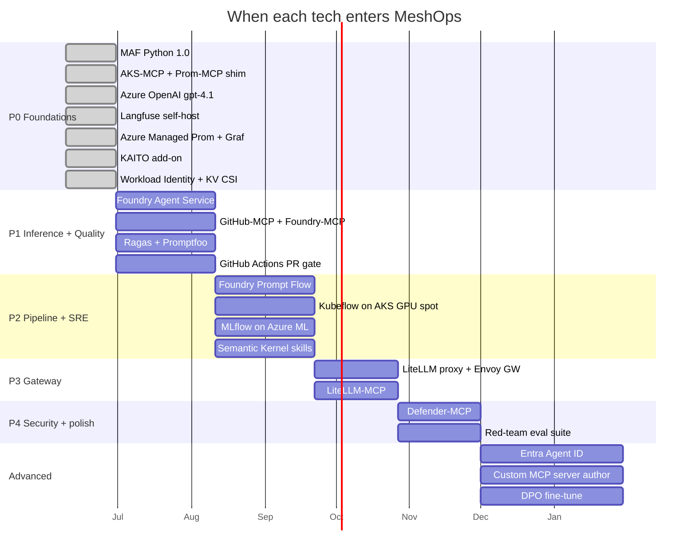

<details>
<summary>ASCII fallback</summary>

```
P0 Foundations    [████] MAF 1.0, AKS-MCP, Prom-MCP shim, AOAI gpt-4.1, Langfuse,
                        Managed Prom+Grafana, KAITO add-on, Workload Identity, KV CSI
P1 Inference+Q       [██████] Foundry Agent Service, GitHub-MCP, Foundry-MCP,
                              Ragas, Promptfoo, GitHub Actions PR gate
P2 Pipeline+SRE            [██████] Foundry Prompt Flow, Kubeflow, MLflow,
                                    Semantic Kernel skills (SRE)
P3 Gateway                       [█████] LiteLLM, Envoy AI Gateway, LiteLLM-MCP
P4 Security+polish                   [█████] Defender-MCP, red-team eval suite
Advanced                                  [█████████] Entra Agent ID,
                                                       custom MCP server authoring, DPO
```

</details>

---

## 12. Reference — flat lookup (technology → role → phase → ADR)

| Tech | Plane | Role | Phase | Governing ADR |
|---|---|---|---|---|
| AKS managed cluster | Platform | Cluster substrate for all workloads | P0 | ADR-0003 |
| KAITO add-on | Inference | Declarative model-serving operator | P0 | ADR-0003 |
| Azure OpenAI gpt-4.1 | Agent | Steward reasoning LLM | P0 | ADR-0003 |
| MAF Python 1.0 | Agent | Five-steward runtime + group-chat | P0 | ADR-0002 |
| Foundry Agent Service | Agent | Quality Steward runtime | P1 | ADR-0002 |
| Semantic Kernel skills | Agent | SRE postmortem rendering | P2 | ADR-0002 |
| Pydantic v2 | Agent | Schema validation | P0 | (no ADR; library detail) |
| AKS-MCP | MCP | Cluster read + scoped write tools | P0 | ADR-0004 |
| Prom-MCP (in-repo shim) | MCP | Prom HTTP API wrapper | P0 | ADR-0004 |
| GitHub-MCP | MCP | PR open + label + quarantine | P1 | ADR-0004 |
| Foundry-MCP | MCP | Foundry evals + agents | P1 | ADR-0004 |
| Langfuse-MCP | MCP | Trace query + annotation writes | P2 | ADR-0004 |
| LiteLLM-MCP | MCP | Routing + budget queries | P3 | ADR-0004 |
| Kubeflow-MCP | MCP | Pipeline job control | P2 | ADR-0004 |
| MLflow-MCP | MCP | Registry register + tag | P2 | ADR-0004 |
| Defender-MCP | MCP | Security signals | P4 | ADR-0004 |
| Azure Managed Prometheus | Ops | Cluster + agent metrics scrape | P0 | ADR-0006 |
| Azure Managed Grafana | Ops | Dashboards | P0 | ADR-0006 |
| Langfuse self-host | Ops | LLM observability + prompt versioning | P0 | ADR-0005 |
| OTel GenAI semantic conventions | Ops | `gen_ai.*` attribute standard | P0 | ADR-0005 |
| Ragas | Eval | RAG faithfulness / relevancy / precision | P1 | (eval ADR — pending) |
| Promptfoo | Eval | Prompt-version CI gate | P1 | (eval ADR — pending) |
| Foundry Evals | Eval | Managed agent-trace eval | P2 | (eval ADR — pending) |
| Custom AKS-fact-check | Eval | Ground-truth cluster facts | P2 | (eval ADR — pending) |
| MLflow on Azure ML | Pipeline | Registry + lineage | P2 | (pipeline ADR — pending) |
| Foundry Prompt Flow | Pipeline | Declarative fine-tune | P2 | (pipeline ADR — pending) |
| Kubeflow on AKS | Pipeline | Spot-GPU job runner | P2 | (pipeline ADR — pending) |
| LiteLLM proxy | Gateway | Multi-model routing + budgets | P3 | (gateway ADR — pending) |
| Envoy AI Gateway | Gateway | TLS + rate-limit + InferencePool/EPP | P3 | (gateway ADR — pending) |
| Defender for Cloud | Security | Signals to Security Steward | P4 | (security ADR — pending) |
| Entra Workload Identity | Platform | Per-SA federated identity | P0 | ADR-0003 |
| Key Vault + Secrets Store CSI | Platform | Per-pod secret projection | P0 | ADR-0003 |
| ACR Basic | Platform | Steward + MCP container images | P0 | ADR-0003 |
| Storage Std LRS (immutable) | Platform | HITL audit log container | P0 | (HITL ADR — pending; placeholder ADR-0011 in roadmap) |
| Azure ML basic | Platform | MLflow backend | P2 | ADR-0003 |
| `uv` + Python 3.12 | Tooling | Python env + dep mgr | P0 | (no ADR; tooling detail) |
| Terraform | Tooling | Azure IaC | P0 | (no ADR; tooling detail) |
| Helm | Tooling | K8s workload deploy | P0 | (no ADR; tooling detail) |
| GitHub Actions | Tooling | CI eval gates | P1 | (no ADR; CI lands with P1) |
| GitHub Copilot | Tooling | Code-author productivity | P0 | (no ADR; developer tool) |

---

## 13. What's deliberately not in the stack (and why)

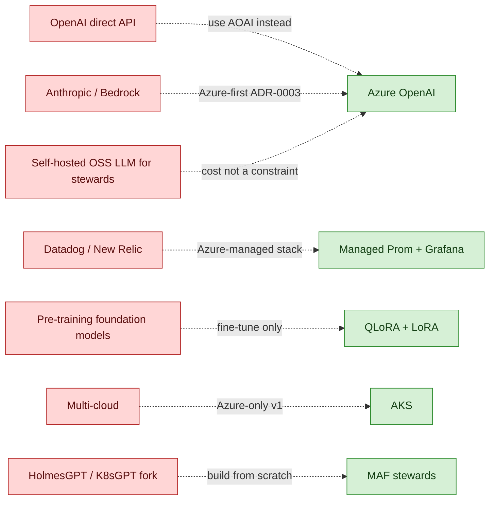

<details>
<summary>ASCII fallback</summary>

```
NOT in the stack:                       Used instead:
  OpenAI direct API           ─►  Azure OpenAI (gpt-4.1)         (ADR-0003)
  Anthropic / Bedrock         ─►  Azure OpenAI                   (ADR-0003)
  Self-hosted OSS LLM for     ─►  Azure OpenAI                   (Ram's MS quota; cost-free)
   steward reasoning
  Datadog / New Relic / etc.  ─►  Managed Prom + Grafana + Langfuse  (ADR-0006/0005)
  Pre-training foundation     ─►  QLoRA + LoRA only              (out of scope)
   models
  Multi-cloud / GCP / AWS     ─►  AKS / Azure only               (ADR-0003, v1)
  HolmesGPT / K8sGPT fork     ─►  MAF stewards built from scratch (`related-work.md`)
```

</details>

Explicit non-stack items (full rationale in linked docs):

- **OpenAI direct API, Anthropic, Bedrock** — ADR-0003 picks Azure-native; Ram has Azure quota; deviation requires a *technical* reason, not a cost one.
- **Self-hosted OSS LLM for steward reasoning** — Azure OpenAI is free to Ram and higher quality than a self-hosted equivalent; KAITO is the *workload* being demoed, not the reasoning substrate.
- **Datadog / New Relic / Honeycomb** — Azure Managed Prom + Grafana + Langfuse fully cover metrics + LLM observability; no third-party SaaS observability for v1.
- **Pre-training of foundation models** — out of scope; only fine-tunes (QLoRA / LoRA, DPO in Advanced).
- **Multi-cloud, GCP, AWS** — Azure-only by design (ADR-0003); cross-cloud is not a portfolio differentiator for Ram's MS-internal job target.
- **HolmesGPT or K8sGPT fork** — those are *compared* in `035_others/related-work.md`, not extended.
- **Bespoke human-operator UI** — HITL gates use GitHub PR review + Slack approval; no custom front-end (`use-cases.md` §5).

---

## 14. Per-iteration tech-stack docs

| Iteration | Tech stack doc | Phase mapping |
|---|---|---|
| iteration-01 | [`iterations/iteration-01/09-tech-stack.md`](../iterations/iteration-01/09-tech-stack.md) | P0 Foundations |
| iteration-02 (TBD) | `iterations/iteration-02/09-tech-stack.md` | P1 Inference + Quality |
| iteration-03 (TBD) | `iterations/iteration-03/09-tech-stack.md` | P2 Pipeline + SRE |
| iteration-04 (TBD) | `iterations/iteration-04/09-tech-stack.md` | P3 Gateway + canary |
| iteration-05 (TBD) | `iterations/iteration-05/09-tech-stack.md` | P4 Security + polish |

Per-iteration docs are the source of truth for *exactly what is installed in that iteration*. This overall document is the union across all phases.

---

## 15. What's deliberately not pinned yet

- **Library minor versions inside the floor pins.** `>= ` floors are pinned; ceilings are bounded to the major. Inside the major-band the lockfile (`uv.lock`) is the source of truth.
- **Helm chart versions.** Recorded in per-iteration tech-stack docs as the iteration is implemented, not pre-pinned here.
- **Terraform provider versions.** Recorded in `infra/terraform/versions.tf` per iteration, not pre-pinned here.
- **AKS Kubernetes minor version.** Will be pinned to the AKS LTS line current at iteration-01 build time; recorded in iteration-01's tech-stack doc.

---

## Sources

- [Microsoft Agent Framework — Observability (Python)](https://learn.microsoft.com/en-us/agent-framework/agents/observability).
- [Microsoft Agent Framework 1.0 announcement](https://devblogs.microsoft.com/agent-framework/microsoft-agent-framework-version-1-0/).
- [`agent-framework` on PyPI](https://pypi.org/project/agent-framework/).
- [Azure AI Foundry Agent Service](https://learn.microsoft.com/en-us/azure/ai-foundry/agents/).
- [Semantic Kernel skills](https://learn.microsoft.com/en-us/semantic-kernel/).
- [Azure AKS Model Context Protocol Server](https://learn.microsoft.com/en-us/azure/aks/aks-model-context-protocol-server).
- [`aks-mcp` GitHub release v0.0.18](https://github.com/Azure/aks-mcp/releases).
- [GitHub MCP Server](https://github.com/github/github-mcp-server).
- [Azure MCP Server](https://github.com/microsoft/azure-mcp).
- [Model Context Protocol — specification](https://modelcontextprotocol.io/specification).
- [KAITO on AKS managed add-on](https://learn.microsoft.com/en-us/azure/aks/ai-toolchain-operator).
- [KAITO Workspace CR](https://github.com/kaito-project/kaito/tree/main/api).
- [Langfuse — MAF integration](https://langfuse.com/integrations/frameworks/microsoft-agent-framework).
- [Langfuse Helm chart](https://langfuse.com/self-hosting/deployment/kubernetes-helm).
- [Azure Managed Prometheus — PodMonitor CRD](https://learn.microsoft.com/en-us/azure/azure-monitor/containers/prometheus-metrics-scrape-crd).
- [Azure Managed Grafana](https://learn.microsoft.com/en-us/azure/managed-grafana/overview).
- [OpenTelemetry GenAI semantic conventions](https://opentelemetry.io/docs/specs/semconv/gen-ai/).
- [Ragas — RAG evaluation framework](https://docs.ragas.io/).
- [Promptfoo — prompt CI](https://www.promptfoo.dev/docs/).
- [Azure AI Foundry — Evaluations](https://learn.microsoft.com/en-us/azure/ai-foundry/concepts/evaluation-approach-gen-ai).
- [Envoy AI Gateway](https://aigateway.envoyproxy.io/).
- [LiteLLM proxy](https://docs.litellm.ai/).
- [Azure Key Vault Provider for Secrets Store CSI Driver on AKS](https://learn.microsoft.com/en-us/azure/aks/csi-secrets-store-driver).
- [AKS Workload Identity](https://learn.microsoft.com/en-us/azure/aks/workload-identity-overview).
- [Azure VM pricing — NC4as_T4_v3](https://azure.microsoft.com/en-us/pricing/details/virtual-machines/linux/).

