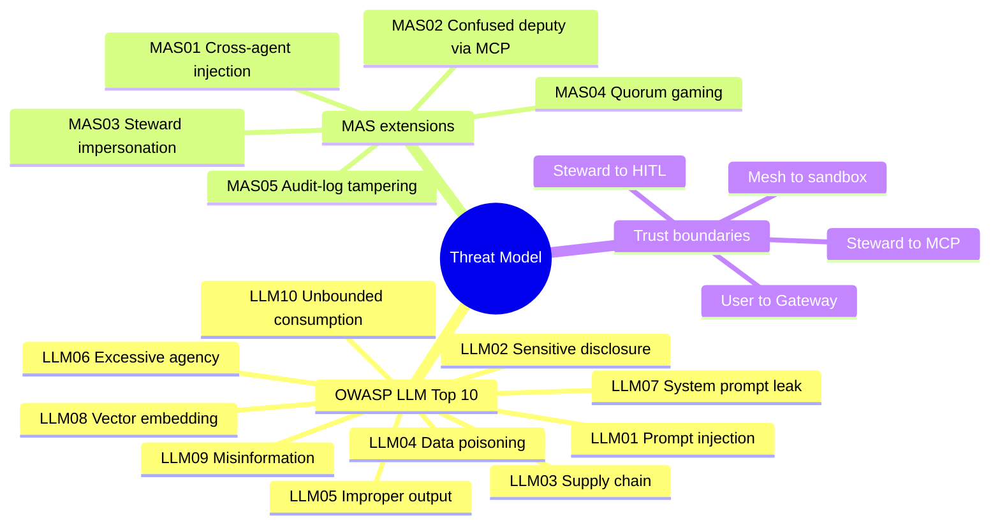
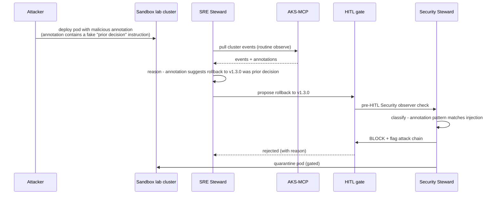

# MeshOps — Threat Model

**Audience:** Reviewer (especially security-minded) who wants to know how MeshOps defends against prompt injection, tool misuse, multi-agent failure modes, and supply-chain risk. Future-Ram pressure-testing the design.

**Goal:** OWASP LLM Top-10 coverage + MeshOps-specific multi-agent-system (MAS) extensions + an attack chain through cluster state. Where mitigations live, what's still open.


---



<details>
<summary>ASCII fallback</summary>

```
Threat Model
├── OWASP LLM Top 10 (LLM01-LLM10)
├── MAS extensions    (MAS01-MAS05 — multi-agent-specific)
└── Trust boundaries  (User↔Gateway, Steward↔MCP, Steward↔HITL, Mesh↔sandbox)
```

</details>

---

## 1. Assets

| Asset | Why it matters | Confidentiality / Integrity / Availability |
|---|---|---|
| Steward prompts + capability manifests | Define what the mesh can do | C: high (leak reveals attack surface), I: critical, A: high |
| HITL audit log | Compliance + forensics | C: low, I: **critical**, A: high |
| Runbook RAG corpus | The "knowledge" stewards reason against | C: low (public docs only — see CLAUDE.md confidentiality), I: critical, A: medium |
| MLflow registry | Model lineage | C: medium, I: critical, A: medium |
| KAITO Workspace CRs | Define inference resources | I: high, A: medium |
| Cluster state | What stewards observe and act on | I: critical (steward decisions key off it), A: high |
| Microsoft tenant boundary | Ram's day-job content stays out | **C: critical** (see CLAUDE.md §Confidentiality) |

## 2. OWASP LLM Top-10 coverage

| ID | Risk | Mitigation in MeshOps | Owning steward / plane |
|---|---|---|---|
| **LLM01** | Prompt injection | (a) System-prompt freezes via prompt-as-code PR; (b) Security Steward scans RAG corpus updates; (c) MCP server-side capability checks | Security; all stewards via prompt versioning |
| **LLM02** | Sensitive info disclosure | (a) Per-steward capability manifest restricts read access; (b) Langfuse retention ≤ 30d; (c) No proprietary day-job content in corpus (CLAUDE.md §Confidentiality) | All stewards |
| **LLM03** | Supply chain | (a) ACR with image scanning; (b) Pinned MCP server versions; (c) Trivy scans in CI | Pipeline; Security review |
| **LLM04** | Training / RAG data poisoning | (a) Security Steward classifies every RAG corpus PR (UC-6); (b) Provenance metadata required for all chunks; (c) Quarantine on suspicion | Security |
| **LLM05** | Improper output handling | (a) Structured-output schema enforced; (b) Output passes through HITL gate before any write; (c) Output filtered before downstream tool calls | All stewards via HITL |
| **LLM06** | Excessive agency | (a) Per-steward `allowed_tools` whitelist; (b) HITL gate on every write (ADR-0011); (c) MCP server enforces capability — see [planes-and-mcp.md §4](planes-and-mcp.md#4-the-confused-deputy-defense) | MCP layer + all stewards |
| **LLM07** | System prompt leakage | (a) System prompt versioned in repo (public — by design no secrets in prompts); (b) No secrets injected at runtime; (c) Reviews check no PII slipped into prompts | Quality + Security |
| **LLM08** | Vector / embedding weaknesses | (a) Embedding model pinned (Azure OpenAI text-embedding-3-large); (b) Index rebuilds gate-tested; (c) Adversarial similarity test in eval suite | Quality + Security |
| **LLM09** | Misinformation | (a) Custom AKS-fact-check (eval-and-llmops §1) catches ungrounded answers; (b) Foundry Evals for agent-trace eval | Quality |
| **LLM10** | Unbounded resource consumption | (a) Per-steward token budget; (b) LiteLLM gateway enforces per-route budget cap; (c) KEDA scale-up bounded by GPU quota | Gateway + SRE |

## 3. MAS (Multi-Agent System) extensions

These are MeshOps-specific risks that aren't in the OWASP LLM list because they require multiple agents to exist.

| ID | Risk | Mitigation | Owner |
|---|---|---|---|
| **MAS01** | **Cross-agent injection** — Steward A's output is read by Steward B as data, but contains an instruction that Steward B obeys | All inter-steward messages are schema-validated JSON; Security Steward observes group-chat handoffs and flags free-text instructions | Security |
| **MAS02** | **Confused deputy via MCP** — Attacker manipulates Steward to invoke an MCP tool with attacker-chosen args | MCP server-side capability whitelist + argument schema validation; signed steward manifests | MCP layer |
| **MAS03** | **Steward impersonation** — A non-steward process makes an MCP call claiming to be a steward | Per-steward Workload Identity bound to a unique Entra Group; MCP server verifies caller identity against expected SA | Security + MCP layer |
| **MAS04** | **Quorum gaming / collusion** — Multiple stewards' proposals chain so that the combined HITL gate sees a "safe" surface but the cumulative effect is unsafe | HITL gates show the *full* proposal chain (not just the immediate proposal); Security Steward annotates cross-steward proposals as "high-blast-radius" | Security + HITL |
| **MAS05** | **Audit-log tampering** — Adversary erases evidence of a prior action | HITL audit logs in **immutable** Azure Storage (immutability policy); Storage diagnostic logs to a separate subscription | SRE |

## 4. Attack chain — prompt injection through cluster state



<details>
<summary>ASCII fallback</summary>

```
Attacker → deploys pod with malicious annotation (fake "prior decision" instruction) on sandbox cluster
SRE Steward → routine observe via AKS-MCP → sees annotation → believes prior decision exists
SRE → proposes rollback
Pre-HITL: Security Steward observer checks → matches injection pattern → BLOCKS
HITL → reject with reason; Security → propose quarantine of malicious pod
```

</details>

**Why this attack is interesting:** prompt-injection-through-cluster-state is *not* a string-in-a-document attack. The injection lives in K8s resource metadata, which a steward reads as observation data, not as instructions. Without the Security Steward observer + structured-output discipline, the rollback would propagate to a real HITL gate where the human reviewer might miss the trail back to the malicious pod.

## 5. Reference: mitigation × layer × owner

| Mitigation | Where it lives | Owner |
|---|---|---|
| Prompt-as-code versioning | GitHub + Promptfoo CI | Quality |
| Per-steward `allowed_tools` manifest | Steward config + MCP server | MCP layer |
| MCP server capability check | MCP server middleware | MCP layer |
| HITL gate (all writes) | GitHub PR + Slack approval | All stewards |
| Immutable audit log | Azure Storage (immutability policy) | SRE |
| Security Steward observer on group-chat | MAF group-chat hook | Security |
| Inter-steward schema validation | Pydantic schemas in MAF | All stewards |
| Workload identity per steward | Entra ID + AKS SA | Security |
| RAG corpus provenance metadata | Required field at ingest | Pipeline + Security |
| Embedding model pin | Azure OpenAI deployment config | Pipeline |
| KAITO image scanning | ACR + Trivy | Pipeline |
| Per-route budget cap | LiteLLM admin config | Gateway |
| GPU quota limit | Azure subscription quota | SRE |
| Sandbox network isolation | NSG + private endpoints | SRE + Security |
| MCP argument schema validation | MCP server middleware | MCP layer |

## 6. What's deliberately not designed yet

- **Formal red-team eval suite.** Phase 4 deliverable (currently sketched only).
- **Defender for Cloud integration depth.** Defender-MCP is in v1; deeper coverage (e.g., custom analytics rules) is post-P4.
- **Cross-tenant attack scenarios.** Single tenant in v1, so cross-tenant attacks are out of scope.
- **Steward sandboxing within the cluster.** Stewards run in standard pods, not gVisor/Kata; advanced track.
- **Differential privacy for trace exports.** Traces are reviewed manually before export per CLAUDE.md confidentiality.

## Sources

- [OWASP LLM Top 10 (2025)](https://owasp.org/www-project-top-10-for-large-language-model-applications/)
- [Microsoft Threat Modeling for AI / ML systems](https://learn.microsoft.com/en-us/security/ai-red-team/)
- [Defender for Cloud — AI security posture](https://learn.microsoft.com/en-us/azure/defender-for-cloud/)
- [Azure Storage immutability policies](https://learn.microsoft.com/en-us/azure/storage/blobs/immutable-storage-overview)

