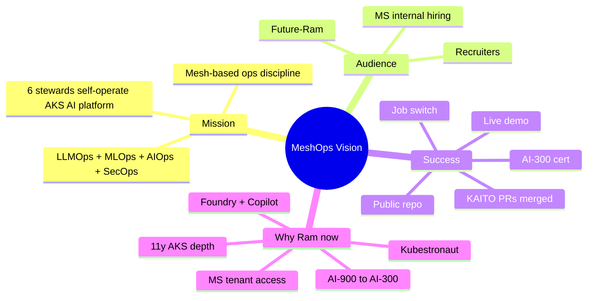
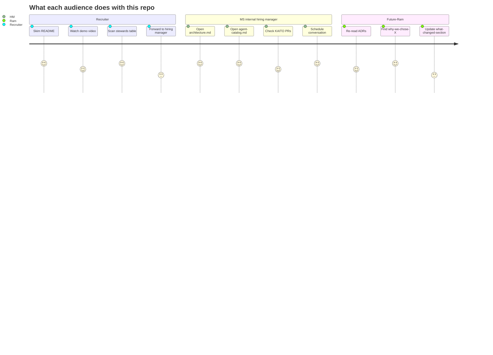
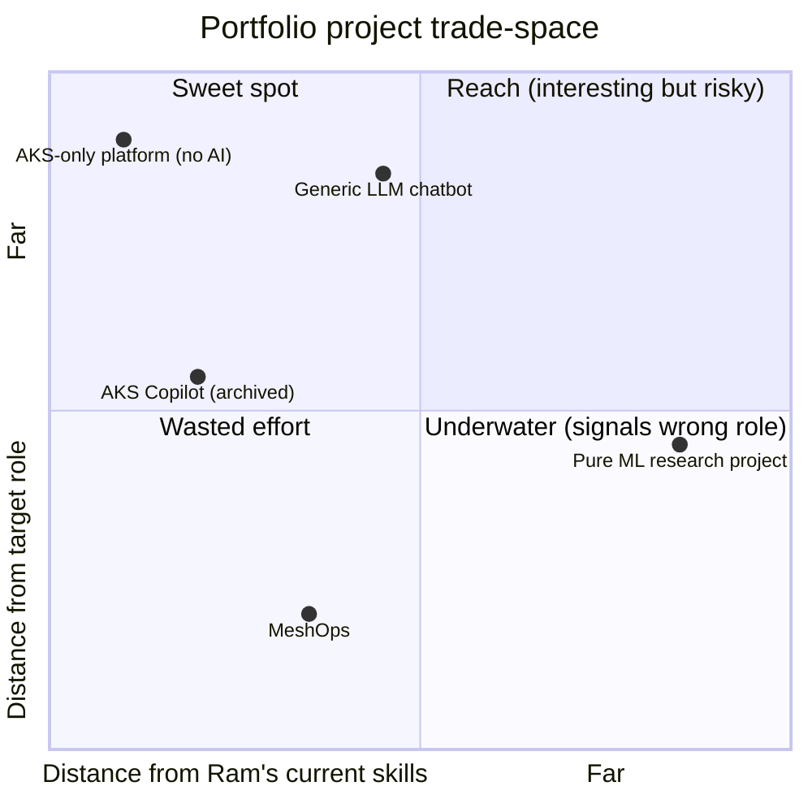

# MeshOps — Vision

**Audience:** Future-Ram revisiting his own design rationale; recruiters and Microsoft internal contacts who want the "why" before the "what."

**Goal:** Lock the *why now, why this, why Ram* of MeshOps in one place so every downstream doc inherits the same north star.


---



<details>
<summary>ASCII fallback</summary>

```
MeshOps Vision
├── Mission
│   ├── Mesh-based ops discipline
│   ├── 6 stewards self-operate AKS AI platform
│   └── LLMOps + MLOps + AIOps + SecOps
├── Audience
│   ├── Recruiters
│   ├── MS internal hiring
│   └── Future-Ram
├── Success
│   ├── Public repo
│   ├── Live demo
│   ├── KAITO PRs merged
│   ├── AI-300 cert
│   └── Job switch
└── Why Ram now
    ├── 11y AKS depth
    ├── Kubestronaut
    ├── MS tenant access
    ├── Foundry + Copilot
    └── AI-900 → AI-300
```

</details>

---

## 1. Mission

MeshOps is a **mesh-based operations discipline** — analogous to how *service mesh* solved per-service cross-cutting concerns by promoting them to an infrastructure plane, *MeshOps* promotes per-platform operational concerns (LLMOps, MLOps, AIOps, SecOps) into a coordinated mesh of specialist AI stewards. The headline novelty is **autonomy at the proposal layer, never at the actuation layer** — every steward proposes, a human-in-the-loop gate approves, an MCP tool layer executes.

> *Multi-agent mesh runs AKS LLMOps, MLOps, AIOps, security autonomously.*

This is a career-portfolio project, not a product. The substance is real — six functioning stewards on a real AKS cluster operating a real LLM/SLM platform — but the *primary user* is the hiring conversation it unlocks, not an enterprise customer.

## 2. Audience (in priority order)



<details>
<summary>ASCII fallback</summary>

```
Recruiter        → README → demo → stewards table → forward
MS hiring mgr    → architecture → catalog → KAITO PRs → talk
Future-Ram       → ADRs → "why X?" → "what changed?"
```

</details>

| Audience | What they need from the repo | Where they look first |
|---|---|---|
| **Recruiter** scanning a resume | "Is this real? Does it match a JD?" | README, proposal.docx, stewards table |
| **MS internal hiring manager** | "Could this person ship inside my org?" | architecture.md, agent-catalog.md, KAITO PR history |
| **Future-Ram** in 18 months | "Why did I make this choice?" | ADRs, eval-and-llmops, threat-model |

## 3. Success criteria

| Tier | Looks like | Verified by |
|---|---|---|
| **Baseline** | Public repo with 12 design docs + 12 ADRs + working .docx renders | Iteration 1 ship (current) |
| **Mid** | 3 of 6 stewards live in lab cluster; 1 KAITO PR merged; AI-300 enrolled | End of Phase 2 |
| **Target** | All 6 stewards in mesh; live demo URL; 2-3 KAITO PRs merged; AI-300 certified; 4-6 blog posts | End of Phase 4 |
| **Stretch** | One MCP server authored upstream; Entra Agent ID integration; multi-cluster sketch | Post-P4 advanced track |
| **Outcome** | Job switch into AI Platform / MLOps / LLMOps role at Microsoft | The actual goal |

## 4. Why this — why Ram — why now



<details>
<summary>ASCII fallback</summary>

```
                Far from target role
                        ▲
                        │
       Underwater       │   Reach
       ┌────────────────┼────────────────┐
       │ AKS-only       │  Pure ML       │
       │ platform       │  research      │
       │                │                │
       │ Generic LLM    │                │
       │ chatbot        │                │
       │                │                │
  ─────┼────────────────┼────────────────┼──→ Far from Ram skills
       │                │                │
       │                │  ★ MeshOps     │
       │  AKS Copilot   │                │
       │  (archived)    │                │
       │                │                │
       │ Wasted effort  │  Sweet spot    │
       └────────────────┴────────────────┘
                        │
                        ▼
                Close to target role
```

</details>

Ram is an 11-year AKS / ARO / GPU-nodepool specialist at Microsoft. His Kubestronaut credential, Istio cert, and Prometheus cert mean the *substrate* of an AI platform is not a learning curve — it's where he already lives. The gap to his target roles (AI Platform Engineer / MLOps / LLMOps Engineer, Microsoft internal switch) is **agentic AI fluency + LLMOps/MLOps conventions**, not Kubernetes.

MeshOps closes that gap by making every steward a thin slice of the gap surface:

| Gap surface | Steward that closes it | Existing lever |
|---|---|---|
| Agentic frameworks (MAF / SK / LangGraph) | All 6, but Quality is on Foundry Agent Service to demo managed-vs-self-hosted | First-time exposure — no overlap with current role |
| LLM serving on K8s (KAITO, vLLM, KV-cache routing) | Inference, Gateway | **AKS GPU nodepool troubleshooting** already in resume |
| MLOps lifecycle (Foundry Prompt Flow, Kubeflow on AKS, MLflow) | Pipeline | **GitOps + ArgoCD + Jenkins** experience transfers |
| LLMOps eval (Ragas, Promptfoo, Foundry Evals) | Quality | First-time exposure |
| AIOps observability + correlation | SRE | **Prometheus Certified + Grafana** transfers directly |
| LLM security (prompt injection, MCP confused-deputy, RAG poisoning) | Security | **CKS + banking-domain** customer experience transfers |

**Why now:** KAITO hit v0.10.0 in April 2026 and is a Microsoft-managed AKS add-on; Microsoft launched AI-300 (MLOps Engineer Associate) as the successor to DP-100 (retires 2026-06-01); the LLMOps reference stack (vLLM + KServe + LiteLLM + KEDA) has stabilized; Microsoft AI is actively hiring MLOps engineers. The window is open.

## 5. Reference: project's defining qualities (lookup table)

| Quality | MeshOps | Not MeshOps |
|---|---|---|
| Agent count | 6 stewards (locked roster for P0–P4) | 1 supervisor with tools (that was AKS Copilot) |
| Autonomy boundary | Proposal autonomous, actuation HITL-gated | Closed-loop remediation |
| Inference for stewards | Azure OpenAI / Foundry | Self-hosted (the platform serves; the agents consume) |
| Workload served | LLMs (vLLM via KAITO) + SLMs (Phi family via KAITO) | Pre-trained foundation models from scratch |
| Tool layer | MCP servers only | Hand-rolled SDK wrappers |
| -Ops coverage | LLMOps + MLOps + AIOps + SecOps from day 1 | LLMOps-only |
| Tenancy | Single-tenant v1, namespace-per-steward | Multi-tenant v1 |
| Cluster scope | One AKS cluster | Multi-cluster federation |
| Cloud | Azure (AKS, AOAI, Foundry) | Multi-cloud |

## 6. What's deliberately not designed yet

- **Closed-loop autonomous remediation.** Every write goes through HITL (ADR-0011). Closing the loop is a deliberate non-goal for v1.
- **Multi-tenancy per customer.** v1 is single-tenant with namespace-per-steward; per-customer tenancy is post-P4 (ADR-0009 captures the upgrade path).
- **Pre-training or DPO of foundation models.** Only fine-tunes on open-weights bases (Phi). Pre-training is out of scope.
- **Multi-cluster steward federation.** One AKS cluster is the scope. Federation is post-P4.
- **Production SLA or commercial support.** Portfolio project — best-effort, not a product.

## Sources

- [Microsoft Agent Framework](https://learn.microsoft.com/en-us/agent-framework/)
- [Azure AI Foundry](https://learn.microsoft.com/en-us/azure/ai-foundry/)
- [KAITO (Kubernetes AI Toolchain Operator)](https://github.com/kaito-project/kaito)
- [Microsoft Certified: MLOps Engineer Associate (AI-300)](https://learn.microsoft.com/en-us/credentials/certifications/operationalizing-machine-learning-and-generative-ai-solutions/)
- [Model Context Protocol](https://modelcontextprotocol.io)

