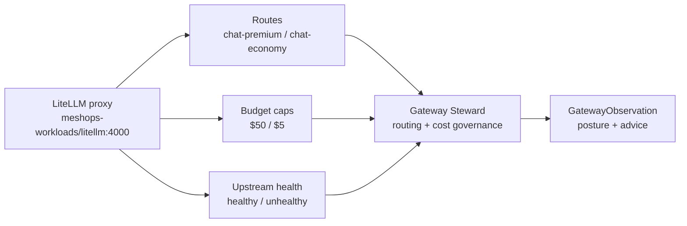
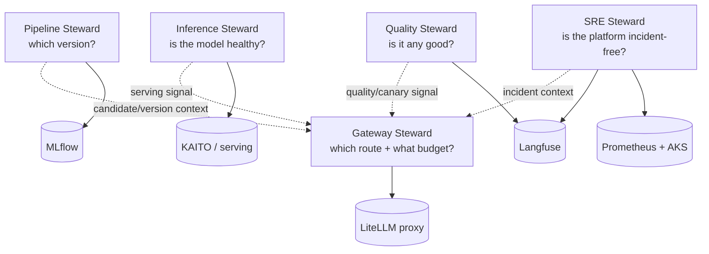

# Iteration 1 (Read-Only) — The Use Case: Teaching the Gateway Steward to Read the Routing Plane

*Audience: Ram (builder). Read this first — it is the story of what the Gateway steward actually does, and why it is the first **LLM routing / cost-governance** steward in the portfolio.*

You already have stewards for serving, registry state, trace quality, and AIOps correlation. The **Gateway Steward** watches a different surface: the platform's LiteLLM proxy. It asks, *"which route serves, what budget cap governs it, and is the upstream healthy?"*

> **UC — Gateway reads LLM routing posture (read-only `observe → reason → report` slice)**
>
> **Why this slice:** Gateway is the first steward for routing and cost governance. It proves the mesh can reason about named LLM routes and budget policy without touching the proxy config: the steward reads LiteLLM route definitions, budget caps, and upstream health, then reports posture and advice-only adjustments. It never changes a budget, route, fallback, or upstream.
>
> **Actor:** The `hello-gateway` agent (Gateway Steward, MAF Python, on the lab AKS cluster), triggered by Ram or a periodic cycle.
>
> **Preconditions:** AKS lab cluster, in-cluster LiteLLM proxy in `meshops-workloads`, Azure OpenAI `gpt-4.1`, Workload Identity, Langfuse for the steward's own traces, and the read-only `litellm-mcp` shim. · **Out of scope:** any write; per-route budget-cap change arrives in Iteration 2 behind ADR-0011's HITL gate.

---

## 1. The one-paragraph version (read this if you read nothing else)

The `hello-gateway` agent observes the platform's **LiteLLM proxy** through `litellm-mcp`. It reads `/model/info` for configured routes and per-route budget caps, and `/health` for upstream health. It turns that into a `GatewayObservation`: routes observed, healthy/unhealthy counts, min/max budget cap, budget-policy concern, posture, suspected issue, advice-only adjustment, summary, and `requires_hitl=false`. **No budget proposal is made, no HITL gate is crossed, no write-capable tool exists.**

**Checkpoint:** One steward, one routing-plane read shim, one posture report, zero writes.

---

## 2. Why Gateway is not "just another read-only steward"

The earlier read-only stewards each answer a different platform question:

| Steward | Substrate | Question |
|---|---|---|
| Inference | KAITO / serving metrics | *Is the live model serving healthily?* |
| Pipeline | MLflow Model Registry | *Which model version should be live?* |
| Quality | Langfuse traces + scores | *Is the output quality healthy?* |
| SRE | Prometheus + AKS + Langfuse | *Do infra, cluster, and LLM signals correlate into an incident?* |
| **Gateway** | **LiteLLM routes + budget caps + health** | *Which route serves, at what budget cap, and is the upstream healthy?* |

That is the unique value. A healthy model can still be expensive. A good prompt can still be routed through the wrong lane. A budget cap can be too low or too high for a route's intended use. Gateway is the steward that sees the routing/cost surface directly.

***Figure 1: Gateway reads the routing plane directly, without Kubernetes read RBAC.***

---

## 3. How the Five Stewards Connect

Where the other stewards each own a lane, Gateway is the cost/routing governance lens of the mesh:

Read it as a sentence:

> **Inference** sees whether the model is serving. **Pipeline** sees which version should be live. **Quality** sees whether outputs are good. **SRE** sees whether the platform is incident-free. **Gateway** sees which route serves the traffic and at what budget cap.

For example: if Quality sees a canary degradation, SRE sees no platform incident, and Inference says the model is healthy, Gateway is where a human checks whether traffic should stay on `chat-economy`, move to `chat-premium`, or simply keep the current caps.

---

## 4. The Three No-Write Guarantees

The Gateway Steward cannot mutate the platform in Iteration 1, enforced three independent ways:

1. **Tools.** `litellm-mcp` exposes only read verbs: `list_routes` and `route_health`. The shim issues only HTTP `GET`s to LiteLLM.
2. **Persona.** `gateway-steward.system.md` and `gateway-steward.chat.md` say the steward observes, reports, and declines budget/route/fallback/weight changes.
3. **Schema.** `GatewayObservation.requires_hitl` must be `False`; the Pydantic validator rejects `True`. The schema has no field that can express a write.

**Checkpoint:** tools can't, persona won't, schema forbids.

---

## 5. Acceptance Criteria

| # | Criterion |
|---|---|
| AC-1 | Boots under Workload Identity and resolves Azure OpenAI, Langfuse, and LiteLLM master-key secrets from Key Vault. |
| AC-2 | Connects the read-only `litellm-mcp` shim. |
| AC-3 | Lists LiteLLM routes from `/model/info`, including `chat-premium` and `chat-economy`. |
| AC-4 | Reports per-route budget caps (`chat-premium` $50, `chat-economy` $5 in baseline). |
| AC-5 | Reads LiteLLM `/health` and reports upstream healthy/unhealthy counts. |
| AC-6 | Produces a valid `GatewayObservation` v1.0.0 with `requires_hitl=false`. |
| AC-7 | Correctly distinguishes `healthy`, `degraded`, and `misconfigured`; `misconfigured` requires `budget_policy_concern=true`. |
| AC-8 | **No-write:** declines budget/route/fallback/weight changes and never opens a proposal. |
| AC-9 | Self-identifies as the **Gateway Steward**, never a generic assistant/model name. |
| AC-10 | Is honest that live per-request spend is not read because LiteLLM spend endpoints require a database that is not deployed. |

---

## 6. What You'll Read Next

- **`02_implementation_guide.md`** — the real files behind the build.
- **`03_test_cases_manual.md`** — prompt playbook against `http://48.192.170.188:8080/`.
- **`05_deployment_guide.md`** — deployment, NSG, Workload Identity, Key Vault, and gotchas.
