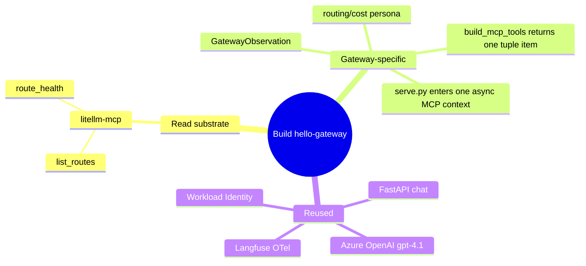

# Iteration 1 (Read-Only) — Implementation Guide: Building the Gateway Steward

*Audience: Ram. Read `01_use_case.md` first for the "what/why"; this is the "how it's built" — with the real committed code excerpts that make Gateway a routing/cost steward over LiteLLM.*

The Gateway Steward reuses the same agent skeleton as the other stewards, but its substrate is the platform's **LiteLLM proxy**. The new thing is not a new write surface — it is a narrow read shim over routes, per-route budget caps, and upstream health.

## Map of the build



## Files this build writes

| Area | File | Shown in |
|---|---|---|
| Config | `src/stewards/gateway/settings.py` | §1 |
| Contract | `src/stewards/gateway/schemas.py` | §2 |
| Agent | `src/stewards/gateway/agent.py` | §3 |
| Chat | `src/stewards/gateway/serve.py` | §4 |
| Persona | `prompts/gateway-steward.system.md`, `.chat.md` | §5 |
| Chart | `helm/gateway/values.yaml`, `templates/deployment.yaml`, `templates/secretproviderclass.yaml` | §6 |
| Read tools | `mcp_servers.litellm_mcp` | §7 |

---

## 1. Config — `src/stewards/gateway/settings.py`

*Purpose: load all configuration at boot, including LiteLLM read settings and the Iteration-2 flags that stay off for this read-only deployment.*

```python
class Settings(BaseSettings):
    model_config = SettingsConfigDict(env_file=".env", extra="ignore")

    azure_openai_endpoint: str = Field(...)
    azure_openai_chat_deployment_name: str = Field("gpt-4.1")

    langfuse_host: str = Field("http://langfuse-web.langfuse.svc.cluster.local:3000")
    langfuse_public_key: str = Field(...)
    langfuse_secret_key: str = Field(...)

    litellm_base_url: str = Field("http://litellm.meshops-workloads.svc.cluster.local:4000")
    litellm_master_key: str = Field(...)

    chat_enabled: bool = Field(False)
    chat_port: int = Field(8080)

    write_enabled: bool = Field(False)
    budget_namespace: str = Field("meshops-workloads")
    budget_configmap: str = Field("litellm-config")
    budget_config_key: str = Field("config.yaml")
    budget_deployment: str = Field("litellm")
```

**What this buys you:** Gateway has explicit configuration for the LiteLLM proxy and master-key secret. `write_enabled` defaults to `False`, so the read-only deployment has no `propose_budget` tool and no writer RBAC.

---

## 2. Contract — `src/stewards/gateway/schemas.py`

*Purpose: the output schema for one routing-plane posture assessment, with no language to express a write.*

```python
SCHEMA_VERSION: str = "1.0.0"
Posture = Literal["healthy", "degraded", "misconfigured"]

class GatewayObservation(BaseModel):
    routes_observed: int = Field(..., ge=0, le=10000)
    routes_healthy: int = Field(..., ge=0, le=10000)
    routes_unhealthy: int = Field(..., ge=0, le=10000)
    min_budget_cap: float | None = Field(None, ge=0.0)
    max_budget_cap: float | None = Field(None, ge=0.0)
    budget_policy_concern: bool = Field(False)
    posture: Posture = Field("healthy")
    suspected_issue: str = Field(..., min_length=3, max_length=600)
    proposed_adjustment: str = Field(..., min_length=3, max_length=600)
    summary: str = Field(..., min_length=20, max_length=1000)
    requires_hitl: bool = Field(False)

    @model_validator(mode="after")
    def _no_write_intent(self) -> Self:
        if self.requires_hitl:
            raise ValueError("requires_hitl=True is not allowed in the read-only iteration. ...")
        if self.posture == "misconfigured" and not self.budget_policy_concern:
            raise ValueError("posture='misconfigured' requires budget_policy_concern=True.")
        if self.routes_healthy + self.routes_unhealthy > self.routes_observed:
            raise ValueError("routes_healthy + routes_unhealthy cannot exceed routes_observed.")
        return self
```

**What this buys you:** `proposed_adjustment` is advice text only. There is no `proposed_budget` field, and `requires_hitl=True` fails closed.

#### Example observe-cycle JSON

````json
{
  "routes_observed": 2,
  "routes_healthy": 2,
  "routes_unhealthy": 0,
  "min_budget_cap": 5.0,
  "max_budget_cap": 50.0,
  "budget_policy_concern": false,
  "posture": "healthy",
  "suspected_issue": "none — routing plane healthy",
  "proposed_adjustment": "continue monitoring route health and budget caps; no change recommended",
  "summary": "LiteLLM exposes chat-premium and chat-economy, both over Azure OpenAI gpt-4.1. Both upstreams are healthy and the configured budget caps are visible.",
  "requires_hitl": false
}
````

---

## 3. Agent — `src/stewards/gateway/agent.py`

*Purpose: build the read-only LiteLLM MCP tool, enter its context, run the observe → assess → report turn, and validate the JSON into `GatewayObservation`.*

### 3.1 `build_mcp_tools` — the one-tool tuple

```python
def build_mcp_tools(settings: Settings) -> tuple[MCPStdioTool]:
    child_env = dict(os.environ)
    litellm_tool = MCPStdioTool(
        name="litellm-mcp",
        command="python",
        args=["-m", "mcp_servers.litellm_mcp"],
        env={
            **child_env,
            "LITELLM_BASE_URL": settings.litellm_base_url,
            "LITELLM_MASTER_KEY": settings.litellm_master_key,
        },
    )
    return (litellm_tool,)
```

**What this buys you:** the child process receives exactly the LiteLLM URL and master key it needs. Gateway reads over HTTP; it does not need Kubernetes read RBAC for Iteration 1.

### 3.2 `run_cycle` — one routing-plane picture

```python
(litellm_tool,) = build_mcp_tools(settings)
async with litellm_tool:
    agent = chat.as_agent(
        name="hello-gateway",
        id="hello-gateway",
        instructions=system_prompt,
        tools=[litellm_tool],
    )
    user_turn = (
        "Assess the LLM routing plane and report its posture.\n\n"
        "1. Use litellm-mcp `list_routes` to read the configured routes ...\n"
        "2. Use litellm-mcp `route_health` to read each route's upstream health.\n"
        "3. Assess routing + cost governance, then respond ONLY with a JSON object..."
    )
    result = await agent.run(user_turn)
    payload = json.loads(_extract_json(raw_text))
    observation = GatewayObservation.model_validate(payload)
```

**What this buys you:** the LLM is forced into one schema-validated output. Bad JSON, `requires_hitl=True`, inconsistent health counts, or `misconfigured` without a policy concern all fail closed.

---

## 4. Chat server — `src/stewards/gateway/serve.py`

*Purpose: long-lived FastAPI chat endpoint. Iteration 1 loads the read-only persona and exactly the LiteLLM read MCP tool; Iteration 2 branches are behind `WRITE_ENABLED=true`.*

```python
stack = AsyncExitStack()
(litellm_tool,) = agent_module.build_mcp_tools(settings)
await stack.enter_async_context(litellm_tool)
chat = agent_module._build_chat_client(settings)

tools: list[Any] = [litellm_tool]
if settings.write_enabled:
    ... # Iteration 2 only: gate + propose_budget
else:
    state["gate"] = None
    state["channel"] = None
    persona = agent_module._read_prompt("gateway-steward.chat.md")

agent = chat.as_agent(
    name="hello-gateway-chat",
    id="hello-gateway-chat",
    instructions=persona,
    tools=tools,
)
```

**What this buys you:** the live `hello-gateway-iter1` pod has no `propose_budget` tool and no gate endpoints with state. Reads are conversational; writes are declined by persona and impossible through the tool list.

---

## 5. Persona prompts — `prompts/gateway-steward.*.md`

*Purpose: identity and guardrails for observe cycles and chat.*

The system prompt identifies the steward and constrains output:

```markdown
You are the **Gateway Steward** of a MeshOps platform.

You own the **LLM routing plane**: a LiteLLM proxy that fronts the platform's
models as named **routes** (model groups), each with a per-route **budget cap**
and an upstream deployment. Your product is a **routing-plane posture report**...
In this iteration you are **read-only**: you observe and report.
You do **not** propose any action.
You do **not** call any write tool.
```

The chat persona keeps the same identity but speaks naturally:

```markdown
You may call this MCP tool, all operations read-only:

- `litellm-mcp` — read-only view of the LiteLLM proxy:
  - `list_routes` — configured routes, their upstream model, and each route's
    per-route budget cap (`max_budget`).
  - `route_health` — LiteLLM's health view of each route's upstream deployment.
```

**What this buys you:** the model stays on-persona and declines budget/route/fallback/weight changes even in chat.

---

## 6. Chart and read RBAC — `helm/gateway/*`

*Purpose: run the steward in AKS with Workload Identity, Key Vault CSI secrets, prompt ConfigMap, no broad Kubernetes read RBAC, and a public chat Service.*

### 6.1 `values.yaml`

```yaml
image:
  repository: ""
  tag: "0.1.0"
namespace: meshops
chat:
  enabled: true
  port: 8080
serviceAccount:
  name: hello-gateway
  clientId: ""
litellm:
  baseUrl: "http://litellm.meshops-workloads.svc.cluster.local:4000"
writeEnabled: false
writeNamespace: meshops-workloads
budget:
  configmap: litellm-config
  configKey: config.yaml
  deployment: litellm
  allowedRoutes: ""
  minBudget: 0.0
  maxBudget: 1000.0
```

### 6.2 `templates/deployment.yaml`

```yaml
- name: AZURE_OPENAI_ENDPOINT
  value: {{ .Values.env.azureOpenAiEndpoint | quote }}
- name: LITELLM_BASE_URL
  value: {{ .Values.litellm.baseUrl | quote }}
- name: CHAT_ENABLED
  value: "true"
- name: LITELLM_MASTER_KEY
  valueFrom:
    secretKeyRef:
      name: {{ .Values.serviceAccount.name }}-secrets
      key: LITELLM_MASTER_KEY
```

### 6.3 `templates/secretproviderclass.yaml`

```yaml
objects: |
  array:
    - |
      objectName: langfuse-public-key
      objectType: secret
    - |
      objectName: langfuse-secret-key
      objectType: secret
    - |
      objectName: litellm-master-key
      objectType: secret
```

**What this buys you:** the steward gets the LiteLLM master key through the same Key Vault CSI path as Langfuse keys, without committing credentials.

---

## 7. The read MCP shim — `src/mcp_servers/litellm_mcp/server.py`

| Tool | Endpoint | What Gateway reads |
|---|---|---|
| `list_routes` | `GET /model/info` | route name (`model_name`), upstream model, API base/version, `model_info.max_budget` |
| `route_health` | `GET /health` | healthy/unhealthy endpoint lists and counts |

Auth is the LiteLLM master key from `LITELLM_MASTER_KEY` against `LITELLM_BASE_URL`. The live proxy fronts `chat-premium` and `chat-economy`, both over Azure OpenAI `gpt-4.1`, with baseline budget caps $50 and $5.

**Important honesty point:** live per-request spend is not read. LiteLLM's `/spend` and `/global/spend` endpoints require a connected Postgres database, which is not deployed for this substrate. Iteration 1 deliberately reads **routes + per-route budget caps + upstream health** only; live spend is DB-gated future work.

---

## File → Purpose map

| File | Purpose |
|---|---|
| `src/stewards/gateway/settings.py` | environment contract for AOAI, Langfuse, LiteLLM, chat, and disabled write flags |
| `src/stewards/gateway/schemas.py` | `GatewayObservation` v1.0.0; third no-write validator |
| `src/stewards/gateway/agent.py` | LiteLLM MCP tuple, observe/assess/report cycle, schema validation |
| `src/stewards/gateway/serve.py` | FastAPI chat; enters one async MCP context; read-only persona when `WRITE_ENABLED=false` |
| `src/mcp_servers/litellm_mcp/server.py` | read-only HTTP shim over LiteLLM `/model/info` and `/health` |
| `prompts/gateway-steward.system.md` | JSON observe-cycle persona |
| `prompts/gateway-steward.chat.md` | conversational read-only persona |
| `helm/gateway/values.yaml` | deploy-time config and `writeEnabled=false` default |
| `helm/gateway/templates/deployment.yaml` | SA, prompts, env, Key Vault CSI, chat Service |
| `helm/gateway/templates/secretproviderclass.yaml` | Langfuse + LiteLLM master-key projection |

## Sources

- Repo: `src/stewards/gateway/{settings,schemas,agent,serve}.py`, `src/mcp_servers/litellm_mcp/server.py`, `prompts/gateway-steward.{system,chat}.md`, `helm/gateway/{values.yaml,templates/deployment.yaml,templates/secretproviderclass.yaml}`.
- Substrate: `helm/gateway/extras/litellm-substrate.yaml`.
- [ADR-0004 — MCP as the tool layer](../../../035_others/decisions/0004-mcp-as-tool-layer.md); [ADR-0011 — no autonomous actuation](../../../035_others/decisions/0011-no-autonomous-actuation-hitl.md).
