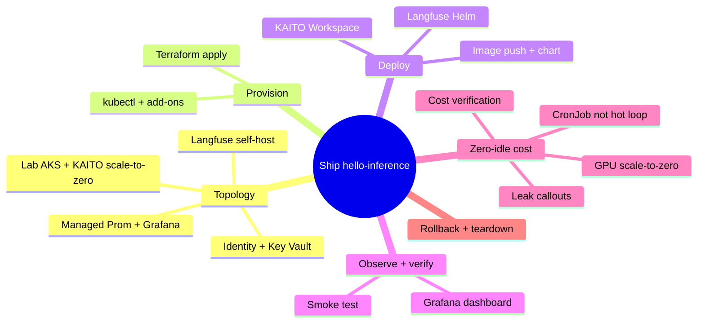
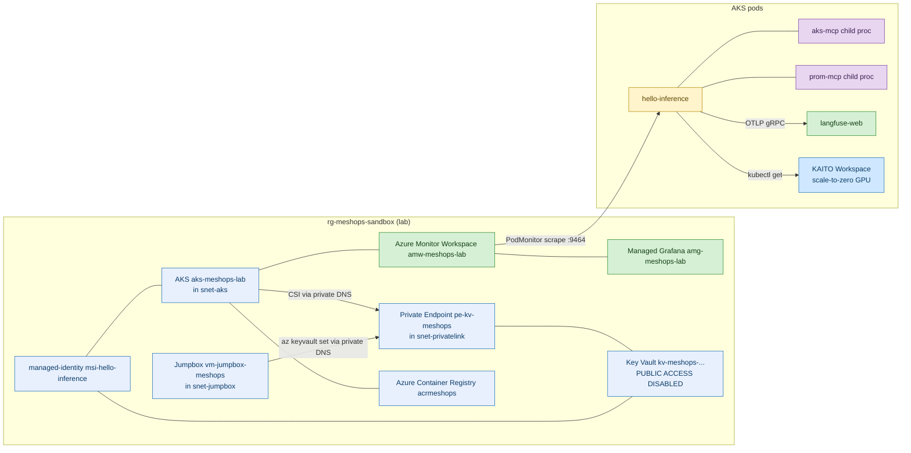
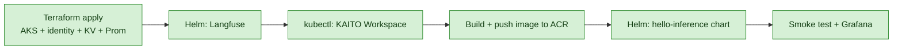

# Iteration 1 (Read-Only) — Deployment Guide: Shipping It to Azure for ~$0 at Idle

*Audience: Ram provisioning Azure and installing the chart; topology and cost line. Read this as the moment you take the tested code and put it on a real cluster — and prove it costs almost nothing while it sleeps.*

The tests are green. The image is built. Now comes the part that makes it real: you open the Azure portal, run `terraform apply`, watch a lab AKS cluster spin into existence, deploy Langfuse, push the image, `helm install`, and tail the logs until that first JSON observation scrolls by. But there's a second, quieter goal threaded through every command here — **when nobody is watching, this should cost almost nothing.** The GPU node scales to zero, the agent runs on a schedule instead of a hot loop, and the steward's `gpt-4.1` reasoning is usage-metered — so with the CronJob paused the LLM line is $0, and at the `*/15` demo cadence it's only a few dollars a month. By the end you'll have a running slice *and* a cost-verification step that proves idle ≈ $0.

## Map of This Guide



<details>
<summary>ASCII fallback</summary>

```
Ship hello-inference
├─ Topology        : lab AKS + KAITO scale-to-zero · identity + KV · Managed Prom/Grafana · Langfuse
├─ Provision       : terraform apply · kubectl + add-ons
├─ Deploy          : Langfuse Helm · KAITO Workspace · image push + chart
├─ Observe + verify: Grafana dashboard · smoke test
├─ Zero-idle cost  : GPU scale-to-zero · CronJob not hot loop · leak callouts · cost verification
└─ Rollback + teardown
```

</details>

---

## 1. The Topology You're Building

Where we are in the story: before running anything, picture the shape — one sandbox resource group holding a small AKS cluster, an identity, a vault, the monitoring stack, and the pods.



***Figure 1: The deployment topology. The Key Vault has public access disabled and is reached only through the private endpoint (from AKS pods and the jumpbox via private DNS). The KAITO GPU Workspace (blue) scales to zero when idle — the single biggest cost lever in the whole iteration.***

<details>
<summary>ASCII fallback</summary>

```
rg-meshops-sandbox (lab):
  vnet-meshops-lab (10.20.0.0/16)
    ├── snet-aks           → AKS aks-meshops-lab
    ├── snet-privatelink   → pe-kv-meshops (private endpoint → Key Vault)
    └── snet-jumpbox       → vm-jumpbox-meshops (SSH from WSL; writes KV secrets)
  AKS aks-meshops-lab
    ├── pods: hello-inference (agent) · aks-mcp/prom-mcp (children)
    │         langfuse-web (ops) · KAITO Workspace (scale-to-zero GPU)
    ├── managed-identity msi-hello-inference → Key Vault (Reader, KV Secrets User), AKS (Reader), AMW (Monitoring Data Reader)
    ├── Azure Monitor Workspace amw-meshops-lab → Managed Grafana amg-meshops-lab
    └── ACR acrmeshops (image pull)
  Key Vault kv-meshops-... : PUBLIC ACCESS DISABLED, private endpoint only
    └── private DNS zone privatelink.vaultcore.azure.net linked to the VNet
```

</details>

The deployment flow you'll follow, Hosting → compute → data → model:



***Figure 2: The provision → deploy → verify sequence, left to right.***

<details>
<summary>ASCII fallback</summary>

```
Terraform apply ─► Helm Langfuse ─► kubectl KAITO Workspace ─► image push to ACR ─► Helm chart ─► smoke + Grafana
```

</details>

**Checkpoint:** You can picture the cluster and the order. Next, provision Azure.

---

## 2. Provisioning Azure with Terraform

Where we are in the story: everything starts with `terraform apply`. The full `.tf` source is embedded in `02_implementation_guide.md` §10 (*The Infrastructure*) and lives in the `infra/terraform/` set. Here is the run.

```bash
# 2.1 Log in and pick the subscription
az login
az account set --subscription "<MeshOps subscription id>"

# 2.2 Provision the cluster, identity, Key Vault, Managed Prometheus + Grafana
cd infra/terraform
terraform init
terraform plan -var "subscription_id=$(az account show --query id -o tsv)" -out tfplan
terraform apply tfplan
```

The Terraform you apply does the cost-critical thing for you: the AKS cluster enables `workload_identity_enabled` and `oidc_issuer_enabled`, and `monitor_metrics {}` turns on Managed Prometheus. The managed **KAITO add-on** is enabled by a `null_resource` `local-exec` that runs `az aks update --enable-ai-toolchain-operator` (the `azurerm` provider doesn't yet expose it as a cluster argument), so **you must be `az login`'d before `terraform apply`**. The GPU node is **not** provisioned up front — KAITO provisions a spot `Standard_NC4as_T4_v3` only when the Workspace needs it, and returns it when idle. That is scale-to-zero, baked into the infrastructure.

Terraform also stands up the **private-networking layer**: a `vnet-meshops-lab` VNet with `snet-aks` / `snet-privatelink` / `snet-jumpbox` subnets, a **Key Vault with public network access disabled** reached through a private endpoint, the `privatelink.vaultcore.azure.net` private DNS zone linked to the VNet, and a small **jumpbox VM** (the only place from which you can write the Langfuse secrets — see §3.1). It also assigns the AKS kubelet `AcrPull` on the registry, so no manual role assignment is needed later.

It also creates the **Azure OpenAI** account and a `gpt-4.1` chat deployment (`infra/terraform/openai.tf`), and grants the steward's managed identity the *Cognitive Services OpenAI User* data-plane role — so the agent authenticates with Workload Identity (no API key). There is no pre-existing free Microsoft-tenant quota; this account bills to the sandbox subscription (usage-metered, a few $/mo at the demo cadence). You feed its endpoint into Helm via the `azure_openai_endpoint` output below.

The outputs you'll feed into Helm:

| Terraform output | Used for |
|---|---|
| `aks_resource_id` | Helm `env.aksResourceId` |
| `hello_inference_client_id` | Helm `serviceAccount.clientId` |
| `key_vault_name` | Helm `keyVault.name` |
| `key_vault_tenant_id` | Helm `keyVault.tenantId` |
| `azure_openai_endpoint` | Helm `env.azureOpenAiEndpoint` |
| `azure_openai_chat_deployment_name` | Helm `env.azureOpenAiChatDeploymentName` |
| `amp_query_url` | Helm `env.azureMonitorWorkspaceQueryUrl` |
| `aks_kubelet_object_id` | Reference only — `AcrPull` already assigned by Terraform |
| `acr_login_server` | `docker build`/`push` target |
| `jumpbox_public_ip` | SSH target for writing KV secrets |
| `jumpbox_ssh_command` | Ready-to-run SSH command (uses the generated key) |
| `write_secrets_hint` | The `az keyvault secret set` commands to run on the jumpbox |

Then connect kubectl and enable the two add-ons Terraform doesn't:

```bash
az aks get-credentials -g rg-meshops-sandbox -n aks-meshops-lab --overwrite-existing
kubectl get nodes
az aks enable-addons -g rg-meshops-sandbox -n aks-meshops-lab \
    --addons azure-keyvault-secrets-provider
```

**Checkpoint:** The cluster, identity, vault, and monitoring stack exist. Next, deploy Langfuse and the Workspace.

---

## 3. Deploying Langfuse, the Workspace, and the Chart

Where we are in the story: the substrate is up; now the moving parts go on. First the observability backend (Langfuse), then the thing the agent watches (the Workspace), then the agent itself.

### 3.1 Langfuse — the observability backend

Langfuse's `values.yaml` keeps **no plaintext secrets** — every credential is a
`secretKeyRef`/`existingSecret` pointing at a Kubernetes Secret named
`langfuse-secrets`. Create that Secret first with the helper script (it generates
`openssl rand -hex` values — URL-safe, so the DB connection strings need no
URL-encoding — and is idempotent, so it won't clobber an existing Secret):

```bash
helm repo add langfuse https://langfuse.github.io/langfuse-k8s
helm repo update

# Creates namespace `langfuse` + the `langfuse-secrets` Secret (no secrets in git):
./helm/langfuse/create-langfuse-secret.sh

helm install langfuse langfuse/langfuse -n langfuse -f helm/langfuse/values.yaml
kubectl rollout status -n langfuse deploy/langfuse-web --timeout=10m
```

> **Two things the stock chart gets wrong for a small lab, already fixed in our
> `values.yaml`:** (1) ClickHouse defaults to a 3-replica cluster with ZooKeeper
> and a `2xlarge` resource preset — we run a single standalone node
> (`clusterEnabled: false`, `zookeeper.enabled: false`), which also matches the
> app's `CLICKHOUSE_CLUSTER_ENABLED=false` and avoids a startup deadlock where the
> native `9000` port never opens. (2) The `langfuse-web` pod (Next.js 16) OOMs
> under the default heap — we give it a 2 Gi limit and
> `NODE_OPTIONS=--max-old-space-size=1536`.
>
> Langfuse is heavy (ClickHouse + Postgres + Redis + MinIO + web + worker). It is
> the main reason the AKS system pool is **autoscaled (min 2)** rather than a
> single node — a lone 8 GB node leaves those pods `Pending` and later starves the
> KAITO controller install.

Once Langfuse is up, port-forward and create a project to get its API keys. Because the Key Vault has **public access disabled**, you cannot write the secrets from WSL — you write them **from the jumpbox**, which reaches the vault through the private endpoint:

```bash
# On WSL: get the keys from the Langfuse UI (port-forward hits the K8s API, not KV)
kubectl port-forward -n langfuse svc/langfuse-web 3000:3000 &
# http://localhost:3000 → Settings → API Keys → create → copy pk-lf-... and sk-lf-...

# SSH into the jumpbox. The output emits an ABSOLUTE path to the generated key,
# so it works from any directory:
eval "$(terraform -chdir=infra/terraform output -raw jumpbox_ssh_command)"

# On the jumpbox: auth as the VM's managed identity, then write the secrets.
# (cloud-init already installed the Azure CLI; the vault name resolves via private DNS)
az login --identity
KV_NAME=$(az keyvault list --query "[?starts_with(name,'kv-meshops')].name | [0]" -o tsv)
az keyvault secret set --vault-name "$KV_NAME" --name langfuse-public-key --value "pk-lf-..."
az keyvault secret set --vault-name "$KV_NAME" --name langfuse-secret-key --value "sk-lf-..."
exit
```

> The agent pods read these back through the Key Vault CSI driver, which resolves
> the same private endpoint from inside `snet-aks`. If SSH **times out**, your WSL
> egress IP rotated out of the allow-list — this box egresses through a rotating
> Microsoft NAT pool, so `allowed_ssh_source_cidrs` defaults to the whole
> `74.162.222.0/24` block; if yours differs, update it in Terraform and re-apply
> just the NSG: `terraform apply -target=azurerm_network_security_group.jumpbox`.

This is the **AgentOps observability backend wired the zero-idle way**: Langfuse self-hosts in-cluster (no third-party SaaS collector, no per-seat bill), and the agent metrics ride Azure Managed Prometheus + Managed Grafana — both on the free/included tier for this volume. There is no always-on external collector to pay for.

### 3.2 The synthetic KAITO Workspace — scale-to-zero

```bash
kubectl create namespace meshops-workloads
kubectl apply -f helm/stewards/extras/workspace.yaml
# KAITO provisions a T4 spot GPU node — ~5 min cold start the first time.
kubectl wait workspace/lab-phi-4-mini-eus2-01 -n meshops-workloads \
    --for=condition=WorkspaceReady --timeout=20m
```

> **If the KAITO add-on itself won't install** (`az aks update
> --enable-ai-toolchain-operator` hangs, and the activity log shows
> `ExtensionOperationFailed … Helm installation failed : context deadline
> exceeded`), it's almost always **node capacity** — the controller pods can't
> schedule. Check `kubectl get pods -A --field-selector=status.phase=Pending`.
> Our autoscaled system pool (min 2) normally prevents this, but if you pinned it
> to one node you can get wedged: the cluster sits in `Updating` and won't accept
> a scale op. Break the deadlock with
> `az aks operation-abort -g rg-meshops-sandbox -n aks-meshops-lab`, then
> `az aks nodepool scale … --node-count 3`, then re-run the enable. Because the
> `azurerm` provider's cluster PUT silently disables the add-on on any in-place
> update, our `null_resource.kaito_addon` re-asserts it on every `terraform apply`
> (skipping the slow call when it's already on).

### 3.2a GPU utilization metrics — the DCGM exporter

The KAITO GPU node ships only the **nvidia device plugin** (it advertises
`nvidia.com/gpu` to the scheduler) — it exports **no** GPU utilization metrics.
So the Inference Steward's *"what's the current GPU utilization?"* query
(`DCGM_FI_DEV_GPU_UTIL`) returns nothing until you add an exporter. Deploy the
NVIDIA **DCGM exporter** (a small DaemonSet on GPU nodes) plus a PodMonitor so
Azure Managed Prometheus scrapes it:

```bash
kubectl apply -f helm/stewards/extras/dcgm-exporter.yaml
# Lands only on GPU nodes (nodeSelector kubernetes.azure.com/accelerator=nvidia,
# tolerates the sku=gpu taint). One tiny pod per GPU node; idle-cheap.
```

Two gotchas baked into that manifest:

- **`azmonitoring.coreos.com/v1` PodMonitor**, not the upstream
  `monitoring.coreos.com` one — Azure Managed Prometheus only scrapes the former.
- **`honorLabels: true`** on the scrape endpoint. The exporter attributes GPU
  metrics to the *model* pod (`pod=lab-phi-4-mini-eus2-01-0`) via the kubelet
  pod-resources API. Without `honorLabels`, Azure Managed Prometheus renames
  those to `exported_pod`/`exported_namespace` (the exporter pod's own labels
  win), so the steward's natural scope
  `DCGM_FI_DEV_GPU_UTIL{namespace="meshops-workloads"}` matches nothing and it
  reports **0%**. With it on, the intuitive query works.

`DCGM_FI_DEV_GPU_UTIL` is a gauge that reads **~0% at idle by design** (the GPU
only burns compute while generating) and ~100% under load — GPU *memory*
(`DCGM_FI_DEV_FB_USED`) stays high because the weights are resident. Because the
exporter lives on the GPU node, it disappears when the Workspace scales to zero;
**re-apply it after each cluster start**, alongside the Workspace.

### 3.3 The image and the chart

```bash
ACR_LOGIN_SERVER=$(terraform -chdir=infra/terraform output -raw acr_login_server)
az acr login -n acrmeshops
docker build -t "${ACR_LOGIN_SERVER}/meshops/hello-inference:0.0.1" .
docker push "${ACR_LOGIN_SERVER}/meshops/hello-inference:0.0.1"

# NOTE: the AKS kubelet already has AcrPull (assigned by Terraform), so no
# manual `az role assignment create` is needed here.

kubectl create namespace meshops
helm install hello-inference helm/stewards -n meshops \
    --set image.repository="${ACR_LOGIN_SERVER}/meshops/hello-inference" \
    --set image.tag="0.0.1" \
    --set serviceAccount.clientId="$(terraform -chdir=infra/terraform output -raw hello_inference_client_id)" \
    --set keyVault.name="$(terraform -chdir=infra/terraform output -raw key_vault_name)" \
    --set keyVault.tenantId="$(terraform -chdir=infra/terraform output -raw key_vault_tenant_id)" \
    --set env.azureOpenAiEndpoint="$(terraform -chdir=infra/terraform output -raw azure_openai_endpoint)" \
    --set env.azureOpenAiChatDeploymentName="$(terraform -chdir=infra/terraform output -raw azure_openai_chat_deployment_name)" \
    --set env.aksResourceId="$(terraform -chdir=infra/terraform output -raw aks_resource_id)" \
    --set env.azureMonitorWorkspaceQueryUrl="$(terraform -chdir=infra/terraform output -raw amp_query_url)"

kubectl rollout status -n meshops deploy/hello-inference --timeout=5m
```

**Checkpoint:** Everything is deployed. Next, smoke-test and read the trace.

> **Persona prompts (how they reach the pod).** The chart ships the persona
> files into the pod via the `inference-steward-prompts` ConfigMap, rendered with
> `.Files.Get "prompts/..."`. Helm's `.Files.Get` can only read files **inside**
> the chart directory, so the repo-root `prompts/` is exposed to the chart through
> the committed symlink `helm/stewards/prompts -> ../../prompts`. Keep that symlink
> intact — without it the ConfigMap renders empty and the steward loses its
> persona (it answers as a generic assistant). As a safety net, `_read_prompt`
> ignores an empty `/etc/prompts` file and falls back to the image-baked prompt.
> To ship a persona edit **without rebuilding the image**, just
> `helm upgrade hello-inference helm/stewards -n meshops --reuse-values` and
> `kubectl rollout restart deploy/hello-inference -n meshops`.

### 3.4 Exposing the chat UI

By default the chat Service is a **`LoadBalancer`** (`chat.service.type`), so you
get a public IP instead of needing `kubectl port-forward`:

```bash
kubectl get svc -n meshops hello-inference-chat -w   # wait for EXTERNAL-IP
LB_IP=$(kubectl get svc -n meshops hello-inference-chat -o jsonpath='{.status.loadBalancer.ingress[0].ip}')
echo "Chat UI: http://${LB_IP}:8080/"
```

> **One-time NSG rule (BYO-subnet gotcha).** Because AKS runs in our own
> `snet-aks`, that subnet has an AKS-auto-created NSG
> (`vnet-meshops-lab-snet-aks-nsg-<region>`, *not* Terraform-managed). The Azure
> cloud-controller adds the LB allow rule to the **node** NSG
> (`aks-agentpool-*-nsg`), but the **subnet** NSG's default `DenyAllInbound` still
> blocks it — so the public IP times out until you open the port there:
>
> ```bash
> az network nsg rule create -g rg-meshops-sandbox \
>   --nsg-name vnet-meshops-lab-snet-aks-nsg-southcentralus \
>   --name allow-chat-lb-inbound --priority 500 \
>   --direction Inbound --access Allow --protocol Tcp \
>   --source-address-prefixes Internet --source-port-ranges '*' \
>   --destination-address-prefixes "${LB_IP}" --destination-port-ranges 8080
> ```
>
> ⚠️ The chat endpoint has **no authentication**. Scope it by setting
> `chat.service.loadBalancerSourceRanges` (list of CIDRs) and narrowing the
> `--source-address-prefixes` above to your egress IPs, or keep it `ClusterIP`
> (`--set chat.service.type=ClusterIP`) and port-forward.

**Ingress (optional).** If the cluster has an ingress controller (e.g. the AKS
app-routing add-on), set `chat.ingress.enabled=true`, `chat.ingress.className`,
and `chat.ingress.host`, and switch the Service back to `ClusterIP`. The chart
renders an `Ingress` routing `/` to the chat Service on port 8080.

---

## 4. The Smoke Test

Where we are in the story: the proof. Tail the pod and watch one observation appear.

```bash
POD=$(kubectl get pod -n meshops -l app.kubernetes.io/name=hello-inference -o jsonpath='{.items[0].metadata.name}')
kubectl logs -n meshops -f "$POD"
```

Expected — the listener line, a trace id, the human summary, and the JSON line:

```
trace_id=8af2e91...
Prometheus exporter listening on :9464/metrics
[hello-inference] Workspace lab-phi-4-mini-eus2-01 is healthy at 1 replica with GPU utilisation about 6 percent; below the 70 percent scale-up threshold.
{"workspace_name":"lab-phi-4-mini-eus2-01","replica_count":1,"gpu_util_percent":6.4,"summary":"...","requires_hitl":false}
```

Then open Langfuse (`kubectl port-forward -n langfuse svc/langfuse-web 3000:3000`, browse to `http://localhost:3000`) and confirm a `inference.steward.cycle` trace, and import `dashboards/meshops-p0-hello-agent.json` into Managed Grafana via *Dashboards → Import → JSON* to see the invocation/token/latency panels.

**Checkpoint:** The slice runs live and is observable. Next — the headline — make it cost ~$0 at idle.

---

## 5. Zero When Idle: The Headline Constraint

Where we are in the story: a portfolio lab that quietly burns money is a liability. This section is where you make idle ≈ $0 — and where you hunt the silent leaks.

The single biggest lever, shown first:

```bash
# Run the agent on a SCHEDULE, not a hot loop. The repo already ships a complete
# CronJob at k8s/cronjob.yaml that mirrors the Deployment's identity, env, prompt
# ConfigMap, and Key Vault CSI secret. (A bare `kubectl create cronjob --image=...`
# would omit all of that and crash at boot.)
#
# 1. Edit k8s/cronjob.yaml and replace every REPLACE_ME with the SAME values you
#    passed to `helm install` (Terraform outputs: image repo, AOAI endpoint,
#    AKS_RESOURCE_ID, AMP query URL).
# 2. Apply it, then scale the Deployment to zero:
kubectl apply -f k8s/cronjob.yaml
kubectl scale deploy/hello-inference -n meshops --replicas=0
```

Here is how each cost source is driven toward zero, in plain terms:

1. **The GPU node — the expensive one — scales to zero.** KAITO returns the spot `Standard_NC4as_T4_v3` when the Workspace is idle. No GPU node sitting hot is the difference between dollars-per-hour and zero. (Equivalent to the serverless `min-instances=0` rule on a container platform: never pin a GPU replica above zero "for convenience.")
2. **The agent runs on a CronJob, not an always-on Deployment.** A pod that lives ~20 seconds every 15 minutes draws negligible CPU/memory on the small system node you already pay a flat rate for. No hot reasoning loop.
3. **Steward reasoning on Azure OpenAI `gpt-4.1` is metered, not free.** The account is created by `infra/terraform/openai.tf` and bills to *this* sandbox subscription (there was no pre-existing Microsoft-tenant $0 quota available). At demo volume — a ~20 s call every 15 min — the token spend is a few dollars a month, but it is **not zero**; the `*/15` schedule and the scale-to-zero Deployment are what keep it small.
4. **Langfuse, Managed Prometheus, and Managed Grafana** self-host on the cluster / sit on included tiers at this volume — no per-seat SaaS bill, no external collector instance.

Now the **silent leaks** — the things that cost money even when "nothing is running" — and how to plug each:

| Leak | Why it bills at idle | How to plug it |
|---|---|---|
| **Azure Container Registry** image storage | Every pushed tag accrues storage; old revisions pile up | Keep one tag; `az acr repository delete` stale digests. Use the Basic SKU. |
| **The system node pool** | AKS always runs ≥1 system node | One `Standard_D2as_v5` is the floor; do not add user pools you don't need. Stop the cluster when not demoing: `az aks stop -g rg-meshops-sandbox -n aks-meshops-lab`. |
| **Langfuse Postgres/Clickhouse/Redis PVCs** | Managed disks bill while provisioned | Demo-grade only; `helm uninstall langfuse` + delete PVCs between demos if cost-sensitive. |
| **Outbound egress** | Cross-region / internet egress bills | Everything stays in `eastus2`; no scheduled internet jobs. |
| **A scheduled job you didn't need** | A CronJob firing too often = more cycles = more compute + AOAI | `*/15` is plenty for a demo; don't drop to `* * * * *`. |

The one thing iteration-01 deliberately does **not** add: no Azure Cost Management *scheduled export*, no extra Container-Apps job, no always-on third-party trace collector — each would be a standing charge for a read-only demo slice.

**Checkpoint:** Every cost source is driven to its floor. Next, prove it.

---

## 6. Cost Verification: Proving Idle ≈ $0

Where we are in the story: claims are cheap; show the numbers. After the cluster has sat idle (CronJob paused, no demo running) for a day, run the checks.

```bash
# 6.1 Confirm no GPU node is running while idle.
kubectl get nodes -l accelerator=nvidia   # expect: no resources (GPU returned)

# 6.2 Confirm the agent is not running a hot loop.
kubectl get deploy/hello-inference -n meshops -o jsonpath='{.spec.replicas}'   # expect: 0
kubectl get cronjob hello-inference -n meshops                                  # the only thing scheduled

# 6.3 Confirm the steward reasoning line stays small (metered on this sub).
# Azure OpenAI usage shows tokens consumed; at */15 volume this is a few $/mo, not $0.

# 6.4 Read yesterday's actual cost for the sandbox RG.
az consumption usage list \
    --start-date $(date -u -d 'yesterday' +%Y-%m-%d) \
    --end-date $(date -u +%Y-%m-%d) \
    --query "[?contains(instanceName, 'meshops')].{svc:meterName, cost:pretaxCost}" -o table
```

Attach a budget so a leak pages you before it grows:

```bash
az consumption budget create \
    --budget-name meshops-iter01 \
    --resource-group rg-meshops-sandbox \
    --amount 200 --time-grain Monthly \
    --category cost \
    --time-period startDate=2026-06-01 endDate=2026-12-01
```

The idle expectation: with the GPU returned, the Deployment at zero, and the CronJob paused, the only standing charges are the one system node, the jumpbox (if left running), a static public IP, the private endpoint, and a few provisioned managed disks — `az aks stop` plus `az vm deallocate -g rg-meshops-sandbox -n vm-jumpbox-meshops` remove the compute charges between demos. The steward's Azure OpenAI reasoning is *usage*-metered, so it costs nothing while the CronJob is paused and only a few dollars a month when it runs on the `*/15` schedule (~2880 short calls/mo). All of it is bounded by the `$200` budget alert. **Idle ≈ $0** once the jumpbox is deallocated and the CronJob is paused.

**Checkpoint:** You've proven the cost line. Next, how to roll back or tear down cleanly.

---

## 7. Rollback and Teardown

Where we are in the story: when the demo's done, or a cost spike or incident hits, you want one clean path down.

```bash
# Roll back just the agent (keep the cluster):
helm rollback hello-inference -n meshops      # to the previous chart revision
# or remove it entirely:
helm uninstall hello-inference -n meshops

# Full teardown:
helm uninstall langfuse -n langfuse
kubectl delete -f helm/stewards/extras/workspace.yaml
kubectl delete -f helm/stewards/extras/dcgm-exporter.yaml   # GPU metrics exporter (harmless if the GPU node is already gone)
terraform -chdir=infra/terraform destroy -var "subscription_id=$(az account show --query id -o tsv)"
```

`terraform destroy` removes the jumpbox (and its public IP), the private endpoint and private DNS zone, the VNet, the AKS cluster, Key Vault (purge-protection lift is a manual step), the Managed Prometheus workspace, Managed Grafana, ACR (if empty), and the federated identity. Soft-deleted Key Vault objects need `az keyvault purge` to fully clear (7-day default retention). For a *pause* rather than a teardown, prefer `az aks stop` (stops node-pool billing) and `az vm deallocate -g rg-meshops-sandbox -n vm-jumpbox-meshops` (stops jumpbox compute billing) — both keep your config.

**Checkpoint:** You can take it up, roll it back, pause it, or destroy it. Reference and limitations follow.

---

## 8. Reference: Artefact → Manifest → Cost Behaviour at Idle

| Artefact | Manifest path | Cost at idle |
|---|---|---|
| AKS cluster + KAITO add-on | `infra/terraform/main.tf` | One system node (floor); GPU = $0 (scaled to zero) |
| VNet + subnets + private DNS | `infra/terraform/network.tf` | $0 |
| Workload Identity + federation | `infra/terraform/identity.tf` | $0 |
| Private Key Vault + endpoint + RBAC | `infra/terraform/keyvault.tf` | Private endpoint (small hourly); vault ops negligible |
| Azure OpenAI + gpt-4.1 deployment | `infra/terraform/openai.tf` | Usage-metered; ~few $/mo at `*/15`, $0 while paused |
| Jumpbox VM + public IP + NSG | `infra/terraform/vm.tf` | VM compute + static IP — `az vm deallocate` to zero |
| Managed Prometheus + Grafana | `infra/terraform/monitoring.tf` | Included/free tier at this volume |
| KAITO Workspace CR | `helm/stewards/extras/workspace.yaml` | $0 GPU when idle |
| DCGM GPU-metrics exporter | `helm/stewards/extras/dcgm-exporter.yaml` | One tiny pod per GPU node; $0 when GPU scaled to zero |
| Langfuse | `helm/langfuse/values.yaml` (+ `create-langfuse-secret.sh`) | PVC disk only (demo-grade) |
| hello-inference CronJob | `k8s/cronjob.yaml` | ~20 s every 15 min; AOAI usage a few $/mo |
| Container image | `Dockerfile` + ACR `acrmeshops` | ACR Basic storage (prune old tags) |

---

## 9. Limitations / What's Not Deployed Yet

The agent runs as a CronJob (the read-only demo cadence); a durable, retrying scheduler with backoff is a P1 refinement. There is no multi-replica steward (one is enough for P0), and no backup/restore for Langfuse's Postgres/Clickhouse (demo-grade in P0). The Key Vault is private (public access disabled, private endpoint only) and secrets are written from an in-VNet jumpbox; however the **jumpbox exposes SSH on a public IP** restricted by NSG to the operator's egress IP — a P1+ hardening would move this behind Azure Bastion and drop the public IP. A Kubernetes `NetworkPolicy` isolating the agent pods from the public internet still arrives with the Security Steward in P4. Single region (`eastus2`), best-effort recovery, no formal RTO/RPO.

---

**Sources**

*Repo files:* `040_iterations/iteration-01-read-only/inference/01_use_case.md` · `040_iterations/iteration-01-read-only/inference/02_implementation_guide.md` · `030_design/02_prd.md`

*Web:*
- [AKS — enable managed Prometheus + Grafana](https://learn.microsoft.com/en-us/azure/azure-monitor/containers/kubernetes-monitoring-enable)
- [AKS — ai-toolchain-operator (KAITO) add-on](https://learn.microsoft.com/en-us/azure/aks/ai-toolchain-operator)
- [AKS — stop and start a cluster](https://learn.microsoft.com/en-us/azure/aks/start-stop-cluster)
- [Azure Key Vault CSI driver on AKS](https://learn.microsoft.com/en-us/azure/aks/csi-secrets-store-driver)
- [Azure Key Vault — private link / private endpoint](https://learn.microsoft.com/en-us/azure/key-vault/general/private-link-service)
- [Azure Private DNS zones for private endpoints](https://learn.microsoft.com/en-us/azure/private-link/private-endpoint-dns)
- [Azure Workload Identity federation on AKS](https://learn.microsoft.com/en-us/azure/aks/workload-identity-overview)
- [Langfuse self-host (Helm)](https://langfuse.com/self-hosting/deployment/kubernetes-helm)
- [Azure Cost Management — budgets via CLI](https://learn.microsoft.com/en-us/cli/azure/consumption/budget)

</content>
