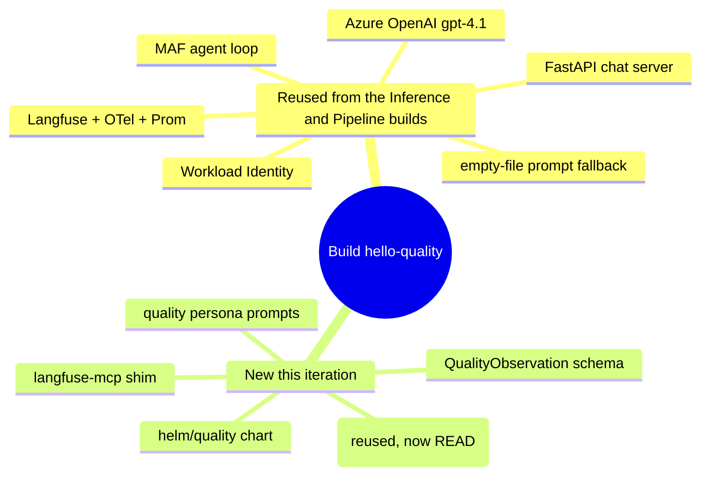

# Iteration 1 (Read-Only) — Implementation Guide: Building the Quality Steward

*Audience: Ram. You already built the Inference and Pipeline Stewards, so this guide leans on both: it calls out only what's **different** and reuses everything that's the same. Read `01_use_case.md` first for the "what/why"; this is the "how it's built."*

The Quality Steward is the same skeleton for the third time, with three organs swapped: a new **substrate** (a Langfuse project — LLM traces + eval scores), a new **tool** (`langfuse-mcp`), and a new **schema** (`QualityObservation`). Everything else — the MAF agent loop, Azure OpenAI reasoning, Langfuse tracing, the FastAPI chat server, Workload Identity, the empty-file prompt fallback, the three no-write guarantees — is the exact code shape you already know.

## Map of the build

---

## 1. The code (`src/stewards/quality/`)

| File | What it does | Mirrors |
|---|---|---|
| `settings.py` | pydantic-settings: AOAI, `LANGFUSE_HOST` / `LANGFUSE_PUBLIC_KEY` / `LANGFUSE_SECRET_KEY`, `trace_sample_limit` (1..100, default 50), chat/loop knobs. **No MLflow or AKS/Prom vars.** | pipeline `settings.py` |
| `schemas.py` | `QualityObservation` — narrow output (`traces_observed`, `scored_traces`, `total_scores`, `mean_quality_score` `[0,1]∣null`, `drift_suspected`, `summary`, `requires_hitl=False`) with a `requires_hitl` no-write validator. | pipeline `schemas.py` |
| `agent.py` | MAF agent with **one** tool (`langfuse-mcp`). `run_cycle` asks the model to sample recent traces + scores and return a `QualityObservation`. Reuses `_read_prompt`, `_build_chat_client`, `_enable_langfuse_and_otel`, `_start_prom_exporter`, and the chat/loop/one-shot `run()` selector verbatim. | pipeline `agent.py` |
| `serve.py` | FastAPI chat server (`/chat`, `/`, `/healthz`) with per-session memory and a Langfuse span per turn. | pipeline `serve.py` |
| `__main__.py` | `python -m stewards.quality` entry. | pipeline `__main__.py` |

**The only structural difference in `agent.py`** is `build_mcp_tools`: it returns a single `MCPStdioTool` launching `python -m mcp_servers.langfuse_mcp`, forwarding the pod env (including the `LANGFUSE_*` triple). No `mlflow-mcp`, no `aks-mcp`, no `prom-mcp`.

> **A neat property of this steward:** Langfuse is *already* wired in as the OTel export target (every steward emits spans to it). The Quality Steward simply **reads the same project it writes to** — its substrate and its trace sink are one and the same. That's why `settings.py` has no separate "substrate URL": `LANGFUSE_HOST` serves double duty.

---

## 2. The tool (`src/mcp_servers/langfuse_mcp/`)

A tiny FastMCP shim — the read-only doorway to the Langfuse project. It exposes exactly three tools, each a single `httpx` GET against the **Langfuse public REST API** (`<LANGFUSE_HOST>/api/public`):

| Tool | Langfuse endpoint | Returns |
|---|---|---|
| `list_traces(limit, page)` | `GET /traces` | recent traces (`id`, `name`, `timestamp`, top-level `scores`) + pagination `meta` |
| `get_trace(trace_id)` | `GET /traces/{id}` | one trace's full detail — observations + attached scores |
| `list_scores(limit, page, name?)` | `GET /scores` | recent eval scores (`name`, `value`, `dataType`), optionally filtered by name |

There is **no write verb** — this is no-write guarantee #1 enforced in code. **Authentication is HTTP Basic**: the project's **public key is the username** and the **secret key is the password** (`httpx.BasicAuth` from the `LANGFUSE_PUBLIC_KEY` / `LANGFUSE_SECRET_KEY` env vars the steward already holds from Key Vault). Base URL is derived by appending `/api/public` to `LANGFUSE_HOST`, which defaults to the in-cluster service `http://langfuse-web.langfuse.svc.cluster.local:3000`.

---

## 3. The persona (`prompts/quality-steward.{system,chat}.md`)

Two prompts mirroring the earlier personas:

- **`.system.md`** — the observe/report persona that emits one `QualityObservation` JSON object.
- **`.chat.md`** — the conversational persona with the **non-negotiable Identity** block (always "Quality Steward," never "an AI assistant"/model name) and an **Environment** section stating the Langfuse host, what traces/scores are, the score `dataType`s, and that **`drift_suspected` is a read-only signal, not an action**.

Both forbid any write and instruct the steward to **decline** requests to open a prompt-version PR, edit a dataset, create a score, or delete a trace — no-write guarantee #2.

Prompts reach the pod via a ConfigMap built with `.Files.Get`, which only reads inside the chart dir — hence the committed symlink `helm/quality/prompts → ../../prompts` (git mode `120000`), the same trick as the Inference and Pipeline builds. The `_read_prompt`/`_read_system_prompt` helpers ignore an **empty** `/etc/prompts` file and fall back to the image-baked persona, so a blank ConfigMap can never wipe the identity.

`prompts/CHANGELOG.md` is bumped to **1.3.0** for the Quality persona addition.

---

## 4. Packaging (shared image, dedicated chart)

- **Dockerfile / pyproject** are shared. The image bakes **all** stewards (`src/stewards`, `src/mcp_servers`); `pyproject` adds `hello-quality` and `langfuse-mcp` console scripts. The Helm `command:` picks `python -m stewards.quality`.
- **`helm/quality/`** is a **dedicated chart**, deliberately isolated from the steward-1/2 charts so it can't regress them. Templates mirror the Pipeline build (`deployment`, `service`, `ingress`, `secretproviderclass`, `podmonitor`) with two key differences:
  - **No `rbac.yaml`.** The Quality steward reads Langfuse over HTTP, not the Kubernetes API, so it needs **zero** cluster RBAC. Its ServiceAccount exists only to carry Workload Identity (AOAI + Key Vault for the `LANGFUSE_*` secrets).
  - **env / secrets** carry the `LANGFUSE_*` triple (host as a plain value; public/secret keys mounted from Key Vault via the CSI `SecretProviderClass`) instead of the MLflow or AKS/Prom vars.

---

## 5. The substrate (already in-cluster — nothing to stand up)

Unlike the Pipeline steward (which had to deploy and seed MLflow), the Quality Steward's substrate **already exists**: the `langfuse` namespace has been running since the Inference steward as the OTel sink. So there is **no `extras/` substrate manifest to apply** — the `helm/quality/extras/` dir is empty.

The one caveat is **data**: traces are plentiful (every steward emits them), but *evaluation scores* only exist once something writes them. On a fresh lab, expect the steward to honestly report `total_scores: 0` and `mean_quality_score: null`. Seeding real scores — via the Langfuse API or a Ragas/Promptfoo/Foundry eval job — is a later iteration's job (see `05_deployment_guide.md` §"Seeding eval scores").

---

## 6. Tests

`pytest -q` — **38 pass total** (was 26 after the Pipeline build; +12 Quality). Quality-specific:

- `tests/unit/test_quality_schemas.py` — round-trip, `mean_quality_score` bounds + `null`, `requires_hitl=True` rejected (no-write layer #3), extra fields dropped.
- `tests/unit/test_quality_settings.py` — required-env enforcement, `trace_sample_limit` bounds.
- `tests/unit/test_quality_prompt_loading.py` — persona loads; empty in-cluster file falls back.
- `tests/integration/test_quality_boot.py` — steward module + `langfuse-mcp` shim import cleanly.

**Ruff** is at parity with the pipeline/inference baseline (select `E,F,W,I,B,UP,S,RUF`, line-length 110) — the new code is actually cleaner, with one `E501` on the identical HTML placeholder line the earlier stewards also carry.

`helm lint helm/quality` and `helm template helm/quality` are both clean (ConfigMap prompts populated, LoadBalancer service, SA with WI annotations, KV CSI for `LANGFUSE_*`).

---

## 7. What carried over from the Pipeline build's lessons

- **Empty-file prompt fallback** — kept, so a blank ConfigMap can't erase the persona (the Inference build's root-cause bug).
- **Dedicated chart + no shared RBAC** — kept; HTTP-only substrate means no kube API access.
- **Content-filter rough edge** — the same Azure OpenAI `ContentFiltered` behaviour applies here (an aggressive jailbreak may surface a raw error rather than a graceful refusal; the write still never happens). Catching `ContentFiltered` in `serve.py` for a friendly message remains a cross-steward future hardening.

Next: `05_deployment_guide.md` to ship it, `03_test_cases_manual.md` to prove it.
