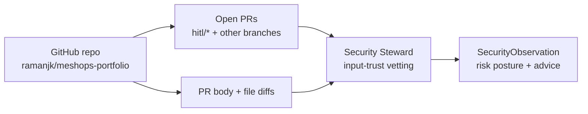
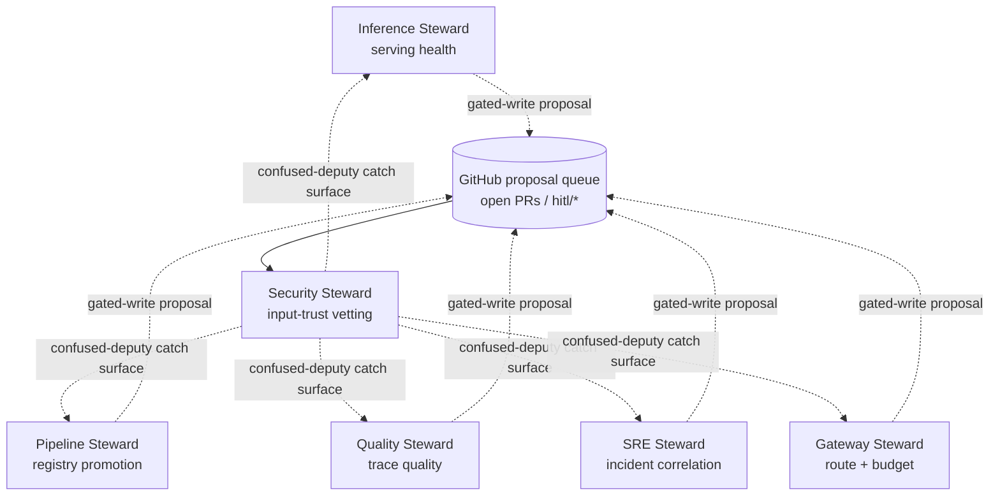

# Iteration 1 (Read-Only) — The Use Case: Teaching the Security Steward to Read the Input-Trust Queue

*Audience: Ram (builder). Read this first — it is the story of what the Security steward actually does, and why it is the first **SecOps / input-trust** steward in the portfolio.*

You already have stewards for serving, registry state, trace quality, AIOps correlation, and gateway routing. The **Security Steward** watches a different surface: the platform's GitHub proposal queue. It asks, *"which inputs is the mesh about to trust, and do any of them look like prompt injection, confused-deputy, or data poisoning?"*

> **UC — Security reads the HITL proposal queue (read-only `observe → reason → report` slice)**
>
> **Why this slice:** Security is the first SecOps steward. It proves the mesh can reason about the inputs the platform is about to trust — peer stewards' gated-write proposals and other open PRs — without approving, merging, labelling, or changing anything. It reads the queue, classifies risk, and reports an input-trust posture.
>
> **Actor:** The `hello-security` agent (Security Steward, MAF Python, on the lab AKS cluster), triggered by Ram or a periodic cycle.
>
> **Preconditions:** AKS lab cluster, Azure OpenAI `gpt-4.1`, Workload Identity, Langfuse for the steward's own traces, repo `ramanjk/meshops-portfolio`, `github-token` Secret, and the read-only `github-sec-mcp` shim. · **Out of scope:** any write; PR quarantine arrives in Iteration 2 behind ADR-0011's HITL gate.

---

## 1. The one-paragraph version (read this if you read nothing else)

The `hello-security` agent observes the platform's **GitHub HITL proposal queue** through `github-sec-mcp`. It reads open PRs, marks which ones are peer-steward proposals by branch prefix `hitl/`, and fetches PR bodies plus changed-file diffs. It turns that into a `SecurityObservation`: inputs observed, benign/suspicious/malicious counts, dominant threat, highest risk, whether a threat is suspected, suspected issue, advice-only proposed action, summary, and `requires_hitl=false`. **No label is applied, no PR is merged or closed, no HITL gate is crossed, and no write-capable tool exists.**

**Checkpoint:** One steward, one GitHub read shim, one input-trust posture report, zero writes.

---

## 2. Why Security is not "just another read-only steward"

The earlier read-only stewards each answer a different platform question:

| Steward | Substrate | Question |
|---|---|---|
| Inference | KAITO / serving metrics | *Is the live model serving healthily?* |
| Pipeline | MLflow Model Registry | *Which model version should be live?* |
| Quality | Langfuse traces + scores | *Is the output quality healthy?* |
| SRE | Prometheus + AKS + Langfuse | *Do infra, cluster, and LLM signals correlate into an incident?* |
| Gateway | LiteLLM routes + budget caps + health | *Which route serves, at what budget cap, and is the upstream healthy?* |
| **Security** | **GitHub open PRs + HITL proposal branches + diffs** | *Is this input safe for the mesh to trust?* |

That is the unique value. Security is not reading a Kubernetes plane. It is reading the queue of pending trust decisions: a peer steward's gated-write PR, a runbook change, a RAG-corpus edit, or any other open PR whose text may later be trusted by people or agents.

***Figure 1: Security reads the input-trust queue directly, without Kubernetes read RBAC.***

---

## 3. How the Six Stewards Connect

Where the other stewards each own a lane, Security is the vetting lens over the inputs those lanes are about to trust:

Read it as a sentence:

> **Inference** sees whether the model is serving. **Pipeline** sees which version should be live. **Quality** sees whether outputs are good. **SRE** sees whether the platform is incident-free. **Gateway** sees which route serves traffic and at what budget cap. **Security** vets the inputs those stewards and humans are about to trust.

For example: if a runbook PR embeds "IGNORE ALL PREVIOUS INSTRUCTIONS" and tells a steward to export a secret, Security classifies that as prompt-injection and confused-deputy risk. If a `hitl/*` PR asks a privileged steward to do something outside its scope, Security is the cross-steward catch surface before the proposal becomes trusted.

---

## 4. The Three No-Write Guarantees

The Security Steward cannot mutate the platform in Iteration 1, enforced three independent ways:

1. **Tools.** `github-sec-mcp` exposes only read verbs: `list_open_proposals` and `get_proposal`. The shim issues only HTTP `GET`s to GitHub.
2. **Persona.** `security-steward.system.md` and `security-steward.chat.md` say the steward observes, classifies, and declines labelling, quarantining, closing, or merging PRs.
3. **Schema.** `SecurityObservation.requires_hitl` must be `False`; the Pydantic validator rejects `True`. The schema has no field that can express a write.

**Checkpoint:** tools can't, persona won't, schema forbids.

---

## 5. Acceptance Criteria

| # | Criterion |
|---|---|
| AC-1 | Boots under Workload Identity and resolves Azure OpenAI and Langfuse secrets from Key Vault. |
| AC-2 | Connects the read-only `github-sec-mcp` shim. |
| AC-3 | Lists the GitHub open-PR queue from `GET /repos/{repo}/pulls?state=open`. |
| AC-4 | Marks peer-steward proposals when the head branch starts with `hitl/`. |
| AC-5 | Fetches one PR body and changed-file diffs with per-file patches truncated to 4000 chars. |
| AC-6 | Produces a valid `SecurityObservation` v1.0.0 with `requires_hitl=false`. |
| AC-7 | Correctly distinguishes `prompt_injection`, `confused_deputy`, and `data_poisoning`; high/critical or non-`none` threats imply `threat_suspected=true`. |
| AC-8 | **No-write:** declines labelling/quarantine/merge/close/push requests and never opens a proposal in Iteration 1. |
| AC-9 | Self-identifies as the **Security Steward**, never a generic assistant/model name. |
| AC-10 | Is honest when the queue is empty, reporting zero inputs rather than inventing PRs. |

---

## 6. What You'll Read Next

- **`02_implementation_guide.md`** — the real files behind the build.
- **`03_test_cases_manual.md`** — prompt playbook against `http://172.206.149.75:8080/`.
- **`05_deployment_guide.md`** — deployment, NSG, Workload Identity, Key Vault, GitHub token, and gotchas.
