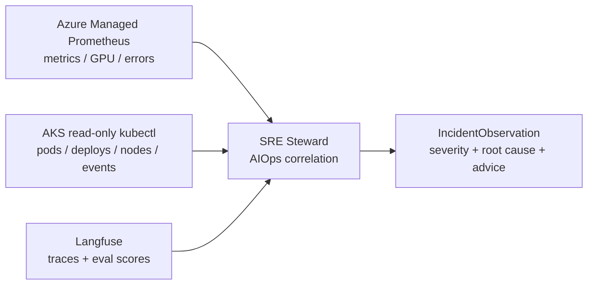
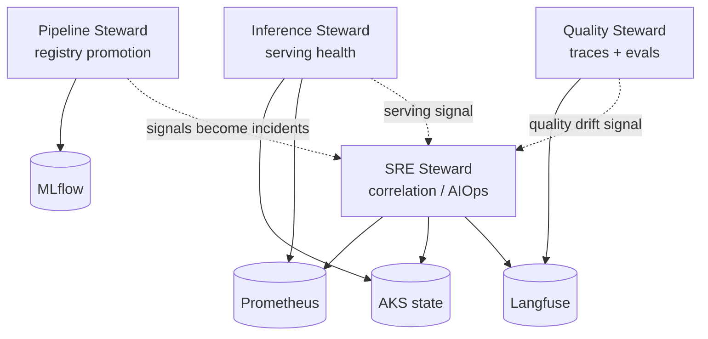

# Iteration 1 (Read-Only) — The Use Case: Teaching the SRE Steward to Correlate Incidents

*Audience: Ram (builder). Read this first — it is the story of what the SRE steward actually does, and why it is the first **AIOps correlation** steward rather than another one-substrate watcher.*

You already have stewards that watch one substrate at a time. Inference watches the live serving surface. Pipeline watches the registry. Quality watches traces and evals. The **SRE Steward** is different: it opens all three operational windows in one reasoning cycle and asks, *"do these signals line up into an incident?"*

> **UC — SRE correlates platform health (read-only `observe → reason → report` slice)**
>
> **Why this slice:** SRE is the first cross-substrate steward. It proves the mesh can do AIOps-style correlation without adding any blast radius: the steward reads Prometheus, AKS, and Langfuse, reasons across them, and reports a suspected root cause plus advice-only remediation. It never scales, restarts, patches, or deletes.
>
> **Actor:** The `hello-sre` agent (SRE Steward, MAF Python, on the lab AKS cluster), triggered by Ram or a periodic cycle.
>
> **Preconditions:** AKS lab cluster, Azure Managed Prometheus workspace, Langfuse in-cluster, Azure OpenAI `gpt-4.1`, Workload Identity, and three read-only MCP tools. · **Out of scope:** any write; Deployment scale arrives in Iteration 2 behind ADR-0011's HITL gate.

---

## 1. The one-paragraph version (read this if you read nothing else)

The `hello-sre` agent observes **Azure Managed Prometheus** through `prom-mcp`, the **AKS cluster** through read-only `aks-mcp`/kubectl, and **Langfuse traces + scores** through `langfuse-mcp`. It correlates metrics × cluster-state × LLM-traces into an `IncidentObservation`: services observed, firing alerts, GPU/error signals, traces observed, severity, suspected root cause, advice-only remediation, summary, and `requires_hitl=false`. **No scaling proposal is made, no HITL gate is crossed, no write-capable tool exists.**

**Checkpoint:** One steward, three reads, one incident picture, zero writes.

---

## 2. Why SRE is not "just another read-only steward"

The earlier read-only stewards each read one substrate:

| Steward | Substrate | Question |
|---|---|---|
| Inference | KAITO / serving metrics | *Is the live model serving healthily?* |
| Pipeline | MLflow Model Registry | *Which model version should be live?* |
| Quality | Langfuse traces + scores | *Is the output quality healthy?* |
| **SRE** | **Prometheus + AKS + Langfuse** | *Do infra, cluster, and LLM signals correlate into an incident?* |

That join is the unique value. A GPU utilization spike alone is not enough. A pod restart alone is not enough. A drop in evaluation scores alone is not enough. SRE reasons about whether they are related.

***Figure 1: Unlike its peers, the SRE steward joins three read substrates in one reasoning cycle.***

---

## 3. How the Four Stewards Connect

Where the other stewards each own a lane, SRE is the correlation lens across the lanes:

Read it as a sentence:

> **Inference** sees the serving workload. **Pipeline** sees the model lifecycle. **Quality** sees LLM behaviour. **SRE** correlates those operating signals when something looks wrong.

For example: Prometheus reports GPU saturation, AKS shows `demo-web` or model pods under pressure, and Langfuse traces show elevated latency or failed evals. SRE is the steward that can put those together into one incident narrative.

---

## 4. The Three No-Write Guarantees

The SRE Steward cannot mutate the platform in Iteration 1, enforced three independent ways:

1. **Tools.** `build_mcp_tools` returns only read MCP tools: `aks-mcp` in `readonly` mode, `prom-mcp` `query_promql`, and `langfuse-mcp` read verbs. No scale/restart/patch/delete tool is exposed.
2. **Persona.** `sre-steward.system.md` and `sre-steward.chat.md` say the steward observes, correlates, reports, and declines writes.
3. **Schema.** `IncidentObservation.requires_hitl` must be `False`; the Pydantic validator rejects `True`. `severity="high"` also requires `incident_suspected=True` so the report cannot contradict itself.

**Checkpoint:** tools can't, persona won't, schema forbids.

---

## 5. Acceptance Criteria

| # | Criterion |
|---|---|
| AC-1 | Boots under Workload Identity and resolves Azure OpenAI + Langfuse secrets from Key Vault. |
| AC-2 | Connects all three MCP tools: `prom-mcp`, `aks-mcp`, `langfuse-mcp`. |
| AC-3 | Reads live pod/deployment/node health across MeshOps namespaces without reading secrets. |
| AC-4 | Runs PromQL against Azure Managed Prometheus and reports platform/GPU/error signals when measurable. |
| AC-5 | Reads Langfuse traces/eval scores and includes trace count/quality context in correlation. |
| AC-6 | Produces a valid `IncidentObservation` v1.0.0 with `requires_hitl=false`. |
| AC-7 | Correctly sets `incident_suspected` and severity; `high` only when an incident is suspected. |
| AC-8 | **No-write:** declines scale/restart/patch/delete requests and never opens a proposal. |
| AC-9 | Self-identifies as the **SRE Steward**, never a generic assistant/model name. |
| AC-10 | Emits Langfuse/OTel trace context for chat and observe cycles. |

---

## 6. What You'll Read Next

- **`02_implementation_guide.md`** — the real files behind the build.
- **`03_test_cases_manual.md`** — prompt playbook against `http://20.118.97.250:8080/`.
- **`05_deployment_guide.md`** — deployment, NSG, Workload Identity, and gotchas.
