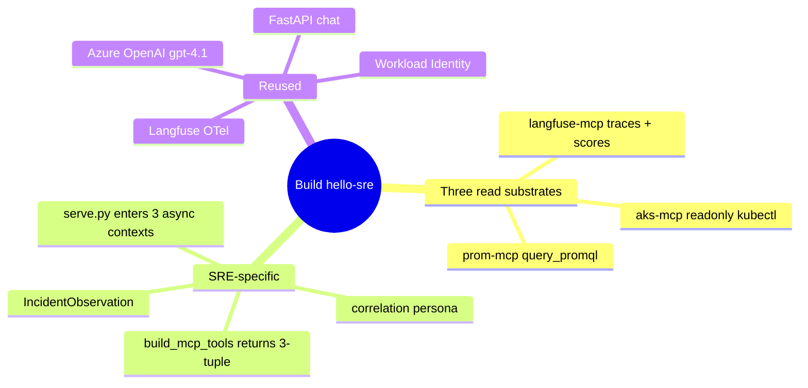

# Iteration 1 (Read-Only) — Implementation Guide: Building the SRE Steward

*Audience: Ram. Read `01_use_case.md` first for the "what/why"; this is the "how it's built" — with the real committed code excerpts that make SRE a three-substrate correlation steward.*

The SRE Steward reuses the same agent skeleton as the other stewards, but its substrate is a **composition** of existing read tools: `prom-mcp` (Azure Managed Prometheus), `aks-mcp` (binary, read-only kubectl), and `langfuse-mcp` (read-only HTTP shim). The new thing is not a new write surface — it is the three-way join.

## Map of the build



## Files this build writes

| Area | File | Shown in |
|---|---|---|
| Config | `src/stewards/sre/settings.py` | §1 |
| Contract | `src/stewards/sre/schemas.py` | §2 |
| Agent | `src/stewards/sre/agent.py` | §3 |
| Chat | `src/stewards/sre/serve.py` | §4 |
| Persona | `prompts/sre-steward.system.md`, `.chat.md` | §5 |
| Chart/RBAC | `helm/sre/values.yaml`, `templates/deployment.yaml`, `templates/rbac.yaml` | §6 |
| Read tools | `mcp_servers.prom_mcp`, `mcp_servers.langfuse_mcp`, `aks-mcp` binary | §7 |

---

## 1. Config — `src/stewards/sre/settings.py`

*Purpose: load all configuration at boot, including the three read substrates and the Iteration-2 flags that stay off for this read-only deployment.*

```python
class Settings(BaseSettings):
    model_config = SettingsConfigDict(env_file=".env", extra="ignore")

    azure_openai_endpoint: str = Field(...)
    azure_openai_chat_deployment_name: str = Field("gpt-4.1")

    langfuse_host: str = Field("http://langfuse-web.langfuse.svc.cluster.local:3000")
    langfuse_public_key: str = Field(...)
    langfuse_secret_key: str = Field(...)

    aks_resource_id: str = Field(...)
    aks_mcp_binary: str = Field("aks-mcp")
    aks_mcp_access_level: str = Field("readonly")
    aks_mcp_enabled_components: str = Field("kubectl")

    azure_monitor_workspace_query_url: str = Field(...)
    trace_sample_limit: int = Field(50, ge=1, le=100)

    chat_enabled: bool = Field(False)
    chat_port: int = Field(8080)

    write_enabled: bool = Field(False)
    scale_namespace: str = Field("meshops-workloads")
```

**What this buys you:** SRE has explicit configuration for all three read windows. `aks_mcp_access_level` defaults to `readonly`, so the cluster reader stays non-mutating even though Iteration 2 later adds a separate deterministic `kubectl scale` applier.

---

## 2. Contract — `src/stewards/sre/schemas.py`

*Purpose: the output schema for one cross-substrate incident correlation, with no language to express a write.*

```python
SCHEMA_VERSION: str = "1.0.0"
Severity = Literal["none", "low", "medium", "high"]

class IncidentObservation(BaseModel):
    services_observed: int = Field(..., ge=0, le=100000)
    alerts_firing: int = Field(..., ge=0, le=100000)
    gpu_util_percent: float | None = Field(None, ge=0.0, le=100.0)
    error_rate: float | None = Field(None, ge=0.0, le=1.0)
    traces_observed: int = Field(..., ge=0, le=100000)
    incident_suspected: bool = Field(False)
    severity: Severity = Field("none")
    suspected_root_cause: str = Field(..., min_length=3, max_length=600)
    proposed_remediation: str = Field(..., min_length=3, max_length=600)
    summary: str = Field(..., min_length=20, max_length=1000)
    requires_hitl: bool = Field(False)

    @model_validator(mode="after")
    def _no_write_intent(self) -> Self:
        if self.requires_hitl:
            raise ValueError("requires_hitl=True is not allowed in the read-only iteration. ...")
        if self.severity == "high" and not self.incident_suspected:
            raise ValueError("severity='high' requires incident_suspected=True.")
        return self
```

**What this buys you:** `proposed_remediation` is advice text only. There is no `proposed_scale` field, and `requires_hitl=True` fails closed.

#### Example observe-cycle JSON

````json
{
  "services_observed": 12,
  "alerts_firing": 0,
  "gpu_util_percent": null,
  "error_rate": null,
  "traces_observed": 50,
  "incident_suspected": false,
  "severity": "none",
  "suspected_root_cause": "none — platform healthy",
  "proposed_remediation": "continue monitoring; no action recommended",
  "summary": "Prometheus, AKS, and Langfuse signals do not indicate an active incident.",
  "requires_hitl": false
}
````

---

## 3. Agent — `src/stewards/sre/agent.py`

*Purpose: build the three read-only MCP tools, enter all three contexts, run the observe → correlate → report turn, and validate the JSON into `IncidentObservation`.*

### 3.1 `build_mcp_tools` — the three-tool tuple

```python
def build_mcp_tools(settings: Settings) -> tuple[MCPStdioTool, MCPStdioTool, MCPStdioTool]:
    child_env = dict(os.environ)
    aks_tool = MCPStdioTool(
        name="aks-mcp",
        command=settings.aks_mcp_binary,
        args=["--transport", "stdio", "--access-level", settings.aks_mcp_access_level,
              "--enabled-components", settings.aks_mcp_enabled_components],
        env=child_env,
    )
    prom_tool = MCPStdioTool(
        name="prom-mcp",
        command="python",
        args=["-m", "mcp_servers.prom_mcp"],
        env={**child_env, "AZURE_MONITOR_WORKSPACE_QUERY_URL": settings.azure_monitor_workspace_query_url},
    )
    langfuse_tool = MCPStdioTool(
        name="langfuse-mcp",
        command="python",
        args=["-m", "mcp_servers.langfuse_mcp"],
        env={**child_env, "LANGFUSE_HOST": settings.langfuse_host,
             "LANGFUSE_PUBLIC_KEY": settings.langfuse_public_key,
             "LANGFUSE_SECRET_KEY": settings.langfuse_secret_key},
    )
    return aks_tool, prom_tool, langfuse_tool
```

**What this buys you:** all three child processes inherit the pod environment, including Workload Identity and Kubernetes service-account context. SRE is a composition of existing read tools, not a new privileged agent.

### 3.2 `run_cycle` — one incident picture

```python
aks_tool, prom_tool, langfuse_tool = build_mcp_tools(settings)
async with aks_tool, prom_tool, langfuse_tool:
    agent = chat.as_agent(
        name="hello-sre",
        id="hello-sre",
        instructions=system_prompt,
        tools=[aks_tool, prom_tool, langfuse_tool],
    )
    user_turn = (
        "Correlate platform health across metrics, cluster state, and LLM traces...\n"
        "1. Use prom-mcp `query_promql` for platform signals ...\n"
        "2. Use aks-mcp to read workloads, recent events, and node state.\n"
        "3. Use langfuse-mcp `list_traces`/`list_scores` ...\n"
        "4. Correlate the three into ONE picture, then respond ONLY with a JSON object..."
    )
    result = await agent.run(user_turn)
    payload = json.loads(_extract_json(raw_text))
    observation = IncidentObservation.model_validate(payload)
```

**What this buys you:** the LLM is forced into one schema-validated output. Bad JSON, `requires_hitl=True`, out-of-range GPU/error values, or inconsistent high severity all fail closed.

---

## 4. Chat server — `src/stewards/sre/serve.py`

*Purpose: long-lived FastAPI chat endpoint. Iteration 1 loads the read-only persona and exactly the three read MCP tools; Iteration 2 branches are behind `WRITE_ENABLED=true`.*

```python
stack = AsyncExitStack()
aks_tool, prom_tool, langfuse_tool = agent_module.build_mcp_tools(settings)
await stack.enter_async_context(aks_tool)
await stack.enter_async_context(prom_tool)
await stack.enter_async_context(langfuse_tool)
chat = agent_module._build_chat_client(settings)

tools: list[Any] = [aks_tool, prom_tool, langfuse_tool]
if settings.write_enabled:
    ... # Iteration 2 only: gate + propose_scale
else:
    state["gate"] = None
    state["channel"] = None
    persona = agent_module._read_prompt("sre-steward.chat.md")

agent = chat.as_agent(
    name="hello-sre-chat",
    id="hello-sre-chat",
    instructions=persona,
    tools=tools,
)
```

**What this buys you:** the live `hello-sre-iter1` pod has no `propose_scale` tool and no gate endpoints with state. Reads are conversational; writes are declined by persona and impossible through the tool list.

---

## 5. Persona prompts — `prompts/sre-steward.*.md`

*Purpose: identity and guardrails for observe cycles and chat.*

The system prompt identifies the steward and constrains output:

```markdown
You are the **SRE Steward** of a MeshOps platform.

You own site reliability / AIOps: you **correlate three read substrates** —
Prometheus metrics, the AKS cluster's own state, and the platform's LLM traces
in Langfuse — into a single picture of platform health.
In this iteration you are **read-only**: you observe, correlate, and report.
You do **not** propose any action.
You do **not** call any write tool.
```

The chat persona keeps the same identity but speaks naturally:

```markdown
You may call these MCP tools, all operations read-only:

- `prom-mcp` — `query_promql`
- `aks-mcp` — read-only in-cluster `kubectl`
- `langfuse-mcp` — read-only Langfuse: `list_traces`, `get_trace`, `list_scores`
```

**What this buys you:** the model stays on-persona and declines scale/restart/delete requests even in chat.

---

## 6. Chart and read RBAC — `helm/sre/*`

*Purpose: run the steward in AKS with Workload Identity, Key Vault CSI secrets, prompt ConfigMap, read-only cluster access, and a public chat Service.*

### 6.1 `values.yaml`

```yaml
image:
  repository: ""
  tag: "0.1.0"
namespace: meshops
chat:
  enabled: true
  port: 8080
  service:
    type: LoadBalancer
serviceAccount:
  name: hello-sre
  clientId: ""
writeEnabled: false
env:
  azureOpenAiEndpoint: ""
  azureOpenAiChatDeploymentName: "gpt-4.1"
  langfuseHost: "http://langfuse-web.langfuse.svc.cluster.local:3000"
  aksResourceId: ""
  azureMonitorWorkspaceQueryUrl: ""
```

### 6.2 `templates/deployment.yaml`

```yaml
- name: AZURE_OPENAI_ENDPOINT
  value: {{ .Values.env.azureOpenAiEndpoint | quote }}
- name: AKS_RESOURCE_ID
  value: {{ .Values.env.aksResourceId | quote }}
- name: AZURE_MONITOR_WORKSPACE_QUERY_URL
  value: {{ .Values.env.azureMonitorWorkspaceQueryUrl | quote }}
- name: CHAT_ENABLED
  value: "true"
- name: LANGFUSE_PUBLIC_KEY
  valueFrom:
    secretKeyRef:
      name: {{ .Values.serviceAccount.name }}-secrets
      key: LANGFUSE_PUBLIC_KEY
```

### 6.3 `templates/rbac.yaml`

```yaml
kind: ClusterRoleBinding
roleRef:
  kind: ClusterRole
  name: view
---
kind: ClusterRole
rules:
  - apiGroups: ["kaito.sh"]
    resources: ["workspaces"]
    verbs: ["get", "list", "watch"]
  - apiGroups: [""]
    resources: ["nodes"]
    verbs: ["get", "list", "watch"]
  - apiGroups: ["metrics.k8s.io"]
    resources: ["nodes", "pods"]
    verbs: ["get", "list"]
```

**What this buys you:** broad read-only visibility across namespaces, no Secrets via the built-in `view` role, and extra read access for nodes/KAITO/metrics needed by SRE correlation.

---

## 7. The three read MCP shims

| Tool | Source | What SRE reads |
|---|---|---|
| `prom-mcp` | `python -m mcp_servers.prom_mcp` | Azure Managed Prometheus via `AZURE_MONITOR_WORKSPACE_QUERY_URL`; `query_promql`. |
| `aks-mcp` | `aks-mcp` binary | In-cluster read-only kubectl (`--access-level readonly --enabled-components kubectl`). |
| `langfuse-mcp` | `python -m mcp_servers.langfuse_mcp` | Langfuse traces and scores via `LANGFUSE_*`. |

`prom-mcp` and `langfuse-mcp` already existed for other stewards. `aks-mcp` is a binary baked into the image. The SRE build composes them; it does not invent a new write API.

---

## File → Purpose map

| File | Purpose |
|---|---|
| `src/stewards/sre/settings.py` | environment contract for AOAI, Langfuse, AKS, Prometheus, chat, and disabled write flags |
| `src/stewards/sre/schemas.py` | `IncidentObservation` v1.0.0; third no-write validator |
| `src/stewards/sre/agent.py` | three-tool MCP tuple, observe/correlate/report cycle, schema validation |
| `src/stewards/sre/serve.py` | FastAPI chat; enters three async MCP contexts; read-only persona when `WRITE_ENABLED=false` |
| `prompts/sre-steward.system.md` | JSON observe-cycle persona |
| `prompts/sre-steward.chat.md` | conversational read-only persona |
| `helm/sre/values.yaml` | deploy-time config and `writeEnabled=false` default |
| `helm/sre/templates/deployment.yaml` | SA, prompts, env, Key Vault CSI, chat Service |
| `helm/sre/templates/rbac.yaml` | read-only cluster visibility for aks-mcp; excludes Secrets through `view` |

## Sources

- Repo: `src/stewards/sre/{settings,schemas,agent,serve}.py`, `prompts/sre-steward.{system,chat}.md`, `helm/sre/{values.yaml,templates/deployment.yaml,templates/rbac.yaml}`.
- MCP read shims: `mcp_servers.prom_mcp`, `mcp_servers.langfuse_mcp`, `aks-mcp` binary.
- [ADR-0004 — MCP as the tool layer](../../../035_others/decisions/0004-mcp-as-tool-layer.md); [ADR-0011 — no autonomous actuation](../../../035_others/decisions/0011-no-autonomous-actuation-hitl.md).
