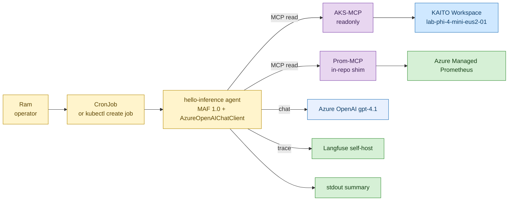
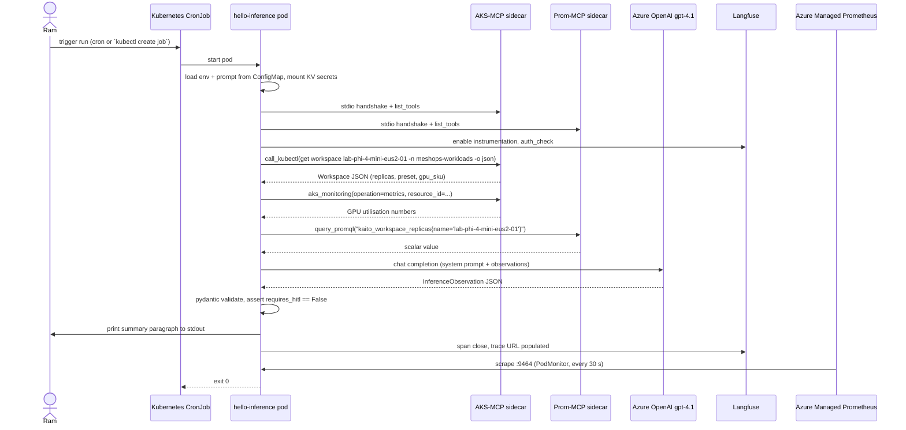
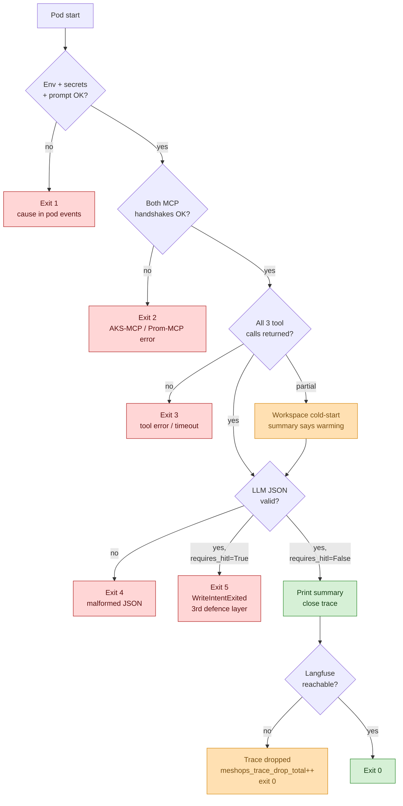

# Iteration-01 — The Use Case: Teaching the Inference Steward to Watch

*Audience: Ram (builder). Read this first — it is the story of what iteration-01's agent actually does, before you open the implementation guide, the tests, or the deployment guide.*

It is a quiet Tuesday in the lab. Somewhere on a small AKS cluster in `eastus2`, a single GPU node is humming along, serving a Phi-4-mini model out of a KAITO Workspace. Nobody is staring at a dashboard. And yet, every few minutes, a tiny agent wakes up, opens its eyes, looks at that Workspace, asks Azure OpenAI *"how does this look to you?"*, writes a one-paragraph status note, and goes back to sleep — leaving behind a perfect trace of everything it saw and thought. That agent is the **Inference Steward**, and in this iteration it is learning the very first thing every good operator learns: **how to observe without touching anything.** This is the slice you are about to build.

You are not building the whole mesh yet. You are building the *first heartbeat* of it — the read-only half of UC-01 — and proving that the substrate underneath the whole six-steward dream actually holds together.

> **UC-01 — Inference Steward: pick LLM-vs-SLM for an incoming request batch (read-only `observe → reason → report` slice)**
>
> **Why this slice:** UC-01 is the catalog's MVP steward (`030_design/01_use_cases.md` §UC-01) — Inference is closest to Ram's GPU-nodepool depth, so the *new* learning (agents, MCP, LLMOps, OTel) sits on top of familiar ground. Iteration-01 deliberately implements only the **observe → reason → report** left-half of UC-01, deferring the propose/HITL/act right-half to iteration-02. This narrowing exercises every substrate component the full mesh depends on — Microsoft Agent Framework, MCP tools, Azure OpenAI reasoning, Workload Identity, Langfuse tracing, Managed Prometheus — **with zero blast radius.** It is the foundation iteration: get this right and UC-02..UC-09 each reuse the agent loop, the MCP boundary, and the observability spine you build here.
>
> **Actor:** The `hello-inference` agent (the Inference Steward, MAF Python 1.0, on the lab AKS cluster), triggered by Ram (the Operator).
>
> **Preconditions:** A provisioned lab AKS cluster with the KAITO add-on, one synthetic KAITO Workspace, Workload Identity federated to the agent's ServiceAccount, Langfuse self-hosted in-cluster, Azure Managed Prometheus enabled, and an Azure OpenAI `gpt-4.1` deployment. · **Depends on:** UC-14 (steward identity / MCP authz) and UC-15 (observe the mesh) — both are MVP cross-cutting companions exercised in their read-only form here. · **Out of scope:** any *write* — no route split proposed, no replica scale proposed, no HITL gate crossed, no write-capable MCP tool enabled. Those land in iteration-02 alongside UC-10 (the HITL gate).

---

## 1. The one-paragraph version (read this if you read nothing else)

Where we are in the story: before you can trust an agent to *change* a cluster, you have to trust it to *describe* one honestly. That is this whole iteration.

The `hello-inference` agent — a single MAF-hosted Inference Steward — observes the state of **one synthetic KAITO Workspace** (`lab-phi-4-mini-eus2-01`) by calling the **AKS-MCP** server (launched strictly `--access-level readonly`) and an in-repo **Prom-MCP** shim that queries Azure Managed Prometheus. It reasons over those observations using **Azure OpenAI `gpt-4.1`**, and emits a one-paragraph **status report** to stdout plus a structured `InferenceObservation` JSON line, while a Langfuse trace records every step. **No proposal is made, no HITL gate is crossed, no write tool exists.** Every substrate component the full UC-01 needs in iteration-02 gets exercised — without any way to mutate the cluster.

**Checkpoint:** You now know the shape of the slice — one agent, three reads, one reasoning call, one report, zero writes. Next you'll see exactly where this sits inside the larger UC-01.

---

## 2. Where This Slice Sits in the Full UC-01

Where we are in the story: the full UC-01 is a seven-step journey from *observe* all the way to *the cluster changes*. You are building the first three steps and deliberately stopping at a cliff edge — the next step would be the agent's first *opinion about what to do*, and opinions need a human gate, which doesn't exist yet.

Picture the full loop, with this iteration's scope lit up in green and everything deferred drawn in amber (gates) and red (writes):

```mermaid
flowchart LR
    classDef done fill:#D6F0D6,stroke:#2E8B2E,color:#143F14
    classDef gate fill:#FFE0B2,stroke:#D68910,color:#7B4F12
    classDef cut fill:#FFD6D6,stroke:#B22222,color:#5A0F0F

    O[Observe<br/>read KAITO Workspace +<br/>Prom metrics via MCP]:::done
    R[Reason<br/>route SLM vs LLM,<br/>scale up or hold]:::done
    Rep[Report<br/>stdout summary +<br/>Langfuse trace]:::done
    P[Propose<br/>route change +<br/>replica scale]:::gate
    G[HITL gate<br/>GitHub PR + Slack]:::gate
    A[Act<br/>scale + update LiteLLM<br/>routing config]:::cut
    W[Workload state changes]:::cut

    O --> R --> Rep
    Rep -.->|iter-02 extends here| P --> G --> A --> W
```



***Figure 1: The full UC-01 loop. Iteration-01 builds only the three green boxes (observe → reason → report); the propose/gate/act tail is deliberately deferred so the agent has no way to change the cluster yet.***

<details>
<summary>ASCII fallback</summary>

```
Iteration-01 (green — done in this iteration):
   Observe ─► Reason ─► Report

Iteration-02+ (amber/red — deferred):
                   └─► Propose ─► [HITL gate] ─► Act ─► Workload changes
```

</details>

The colour key matters because it is the iteration boundary made visual: green is yours to build now; amber is the human gate that lands in iteration-02 the moment the first write proposal appears; red is the write-side actuation that lands behind that gate. If you find yourself building an amber or red box in iteration-01, you've gone too far.

**Checkpoint:** You've placed the slice on the map — three green steps, stopping cleanly before the first opinion. Next, meet the characters who make those three steps happen.

---

## 3. The Cast: Actors and Systems

Where we are in the story: every flow has a cast. Here the star is the `hello-inference` agent, but it leans on a small supporting ensemble — two MCP tool servers, a reasoning model, an identity, and an observability backend. Picture how they connect:



***Figure 2: The cast of iteration-01. The agent (yellow) reads through two MCP servers (purple), reasons on Azure OpenAI (blue), traces to Langfuse and Managed Prometheus (green), and prints to stdout — but never writes back to the Workspace.***

<details>
<summary>ASCII fallback</summary>

```
Ram (operator)
   └─► CronJob / `kubectl create job` (trigger)
         └─► hello-inference agent (MAF 1.0)
               ├──► AKS-MCP (readonly) ─► KAITO Workspace lab-phi-4-mini-eus2-01
               ├──► Prom-MCP (in-repo shim) ─► Azure Managed Prometheus
               ├──► Azure OpenAI gpt-4.1 (chat)
               ├──► Langfuse self-host (trace)
               └──► stdout (summary)
```

</details>

Let me introduce each character properly, because in later iterations you'll meet five more stewards and they all follow this same template:

1. **Ram, the Operator.** You trigger the run — locally with `kubectl create job`, or on a schedule via CronJob — and you read the stdout summary and the Langfuse trace URL. You are the audience for the agent's report, and the only one who decides when it runs.
2. **The `hello-inference` agent, the Inference Steward.** This is the driving steward, built on Microsoft Agent Framework 1.0 in Python. In iteration-01 its entire job is *observe + reason + report*. It owns LLM/SLM serving on AKS — but here it only watches.
3. **AKS-MCP, the read tool.** A separate process (the `aks-mcp` binary, v0.0.18) launched with `--access-level readonly`. The agent calls it to read the Workspace CR and GPU node metrics. The `readonly` flag is the **first** of three defence layers that guarantee no write can happen.
4. **Prom-MCP, the in-repo read tool.** A tiny MCP server you author yourself, exposing exactly one tool — `query_promql` — against Azure Managed Prometheus. Writing it gives you hands-on MCP-server experience early, and it doubles as a candidate upstream contribution down the road.
5. **Azure OpenAI `gpt-4.1`, the reasoning substrate.** The agent reasons here — *not* on the KAITO-served Phi model it observes. That separation (ADR-0003) is what keeps the mesh operable even when the workload it operates is broken.
6. **Langfuse and Azure Managed Prometheus, the observability backend.** One Langfuse trace per run captures the plan→act→observe steps; Managed Prometheus scrapes the agent's `gen_ai.*` metrics off port `9464`. This is UC-15 in its read-only form.

The one subtlety worth underlining: the KAITO Workspace is **observed but never invoked.** The agent reads its CR state and the related Prometheus metrics — it never sends an inference request through it. That is what makes this a *substrate-proving* slice rather than a serving slice.

**Checkpoint:** You've met the cast and know who reads what. Next, walk the happy path — the exact sequence of one successful run.

---

## 4. The Main Flow: One Successful Heartbeat

Where we are in the story: this is the happy path — the sequence of one clean run from trigger to `exit 0`. Read it top to bottom; it is the script the agent follows every cycle.



***Figure 3: The main flow — one observe→reason→report cycle. Note the validation step (`assert requires_hitl == False`): even after the LLM answers, the agent refuses to proceed if a write intent somehow appeared.***

<details>
<summary>ASCII fallback</summary>

```
Ram ─► CronJob ─► hello-inference pod
   pod: load env + prompt + secrets (KV CSI)
   pod ─► AKS-MCP stdio handshake
   pod ─► Prom-MCP stdio handshake
   pod ─► Langfuse auth_check
   pod ─► AKS-MCP: get Workspace JSON + aks_monitoring metrics
   pod ─► Prom-MCP: query_promql for replica count
   pod ─► Azure OpenAI gpt-4.1 chat
   pod ◄─ InferenceObservation JSON
   pod: pydantic validate (requires_hitl MUST be False)
   pod ─► stdout summary + Langfuse trace closes
   Azure Managed Prom ─► scrapes pod :9464 (every 30s)
   pod ─► exit 0
```

</details>

Reading the steps in plain English: the pod boots and loads its environment, its system prompt (mounted from a ConfigMap), and its Langfuse secrets (mounted from Key Vault via the CSI driver). It opens a stdio handshake to each MCP server and an auth check to Langfuse. Then comes the *observe* phase — it asks AKS-MCP for the Workspace JSON and GPU metrics, and asks Prom-MCP for the replica count. Then the *reason* phase — it hands those observations plus the system prompt to `gpt-4.1`, which returns an `InferenceObservation` JSON. Then the *report* phase — the agent validates that JSON against its narrow Pydantic schema (failing closed if `requires_hitl` is anything but `False`), prints a human summary plus the JSON line, closes the Langfuse trace, and exits 0. Managed Prometheus quietly scrapes the metrics endpoint on its own 30-second cadence throughout.

**Checkpoint:** You've walked one clean heartbeat end to end. Next, see what must be *true* after that heartbeat — the postconditions that define success.

---

## 5. Postconditions: What Must Be True After a Successful Run

Where we are in the story: a run isn't "done" because the pod exited — it's done because a specific set of facts now hold. These are the things you (and the automated tests) check.

After one successful cycle:

1. **One Langfuse trace** exists named `inference.steward.cycle`, with a non-empty trace URL printed to stdout, and `gen_ai.usage.input_tokens` plus `gen_ai.usage.output_tokens` populated on it.
2. **Stdout** contains a human-readable one-paragraph summary of the Workspace's state and the LLM's framing (for example, "below the 70% scale-up threshold").
3. **Azure Managed Prometheus** has scraped at least one data point of `gen_ai_client_token_usage{namespace="meshops"}` and the agent's process metrics from port `9464`.
4. **No write call** was issued to any MCP server — the capability manifest contains only read tools, and `InferenceObservation.requires_hitl` is `False`.
5. **The pod exits 0** and the CronJob marks the run a success.
6. **No secret string** appears anywhere in the logs, the trace, or the metric labels.

And the load-bearing invariant of the whole iteration: the agent does **not** mutate any cluster state. The Workspace's replica count, the LiteLLM config, the MLflow registry — all untouched. If a run ever changes one of them, iteration-01 has failed regardless of how nice the summary reads.

**Checkpoint:** You know what success looks like. Next, see how the agent behaves when things go *wrong* — the alternate and exception flows.

---

## 6. When Things Go Sideways: Alternate and Exception Flows

Where we are in the story: real clusters cold-start, networks blip, and prompts get tampered with. A good steward fails *closed* and fails *loud*. Here is the decision tree the agent walks on every boot:



***Figure 4: The exception ladder. Every failure exits non-zero with a distinct code, except the two benign cases (cold-start "warming up" and a dropped trace) which still exit 0.***

<details>
<summary>ASCII fallback</summary>

```
Pod start
   ▼
Env/secrets/prompt loaded? ──no─► EXIT 1
   ▼ yes
Both MCP handshakes OK?    ──no─► EXIT 2  (RBAC / Workload Identity / image misconfig)
   ▼ yes
All 3 tool calls returned? ──partial (Workspace cold-start, 0 replicas) ─► "warming up"; continue
   ▼ yes
LLM JSON valid?            ──no─► EXIT 4
   ▼ yes
requires_hitl == True ?    ──yes─► EXIT 5  (WriteIntentExited; contract violation; 3rd defence layer)
   ▼ no
Print summary + close trace
   ▼
Langfuse reachable?        ──no─► trace dropped; meshops_trace_drop_total++; EXIT 0
   ▼ yes
EXIT 0
```

</details>

The exit codes tell a precise story:

| Code | Cause | Handling |
|---|---|---|
| `Exit 0` | Happy path | CronJob marks success |
| `Exit 0` + drop | Langfuse unreachable | Run still succeeds; `meshops_trace_drop_total` increments; operator investigates |
| `Exit 1` | Missing env / unmounted secret / unreadable prompt ConfigMap | Likely CSI driver or Workload Identity misconfig |
| `Exit 2` | MCP stdio handshake failure | AKS-MCP image issue or AAD permission missing |
| `Exit 3` | Tool error / timeout (AKS-MCP unreachable, Prom 5xx) | Transient; CronJob retries next slot |
| `Exit 4` | LLM produced malformed / unparseable JSON | Pydantic validation failed; raw LLM output logged |
| `Exit 5` | LLM produced `requires_hitl: true` | **Contract violation** — agent has no write capability this iteration; exits before any tool call. The third defence layer fired |

Two of these are *not* errors and deserve calling out. The **cold-start alternate** — the Workspace exists but has 0 replicas because KAITO scaled its GPU node to zero — is a normal state; the summary simply says "warming up" and the run succeeds. And a **dropped trace** when Langfuse is briefly unreachable does not fail the run; the observation still happened, so the agent records the drop in a metric and exits 0.

**Checkpoint:** You've seen how the agent fails closed and loud. Next comes the heart of the iteration's *operational* discipline — the three-layer guarantee that it can never write.

---

## 7. The Agentic Behaviour and the No-Write Guarantee

Where we are in the story: this is the slice's defining operational character. Show, don't tell — here is the exact line of code that makes a write *physically impossible* to express:

```python
@model_validator(mode="after")
def _no_write_intent(self) -> Self:
    if self.requires_hitl:
        raise ValueError(
            "requires_hitl=True is not allowed in iteration-01 (read-only). "
            "If you see this, the third-layer defence has fired."
        )
    return self
```

That validator is the **third** of three independent defence layers, and together they are the operational (AI \*Ops) backbone of this slice. The agentic behaviour here is the canonical **plan → act → observe** loop running entirely in read-only mode: the agent forms a hypothesis about what to check, calls scoped read-only MCP tools to gather grounded evidence (never reasoning from memory), observes the results, and reports — then stops well short of any proposal. The three layers that enforce "no write, ever" are:

1. **The MCP layer (server-side).** AKS-MCP is launched `--access-level readonly`; the Prom-MCP shim exposes only `query_promql`. No write tool is even *present* for the agent to call. This is the same server-side capability boundary the architecture (UC-14) makes the whole mesh's foundation.
2. **The identity layer (Azure RBAC).** The agent's Workload Identity holds only `Reader` and `Monitoring Reader`. Even if a write tool existed and were called, Azure would deny it.
3. **The schema layer (the validator above).** The `InferenceObservation` schema has no field to express a proposed action, and `requires_hitl` must validate to `False`. If a tampered prompt ever coaxes `requires_hitl: true` out of the LLM, the agent exits non-zero *before* doing anything.

This slice also builds, as real code, the operational instrumentation it owns — the **AgentOps** half of UC-15. Every cycle emits **OpenTelemetry GenAI traces** (`gen_ai.*`, `agent_framework.*` spans) to self-hosted Langfuse, and the agent's metrics are exposed on `:9464` for Managed Prometheus. Crucially, traces run with `ENABLE_SENSITIVE_DATA=false` and 30-day retention, so prompts and responses are captured *structurally* without leaking secrets. The testable parts of all of this — read-only enforcement, the `requires_hitl=false` invariant, the trace-per-cycle, the sensitive-data guard — are folded directly into the acceptance criteria below.

**Checkpoint:** You understand the three-layer no-write guarantee and the tracing this slice owns. Next, the data it touches.

---

## 8. The Data Touched

Where we are in the story: this slice touches almost nothing persistent — which is the point. It reads two live sources and writes one trace. For completeness, here is the data model, consistent with the architecture's stores (`030_design/03_architecture.md` §4):

| Store / source | Shape (key fields) | Read or write |
|---|---|---|
| **KAITO Workspace CR** (`lab-phi-4-mini-eus2-01`) | `metadata.name`, `resource.count` (replicas), `inference.preset.name`, `resource.instanceType` | **Read** (via AKS-MCP) |
| **Azure Managed Prometheus** | `kaito_workspace_replicas{name=...}`, GPU utilisation series | **Read** (via Prom-MCP + AKS-MCP `aks_monitoring`) |
| **Azure OpenAI `gpt-4.1`** | chat request (system prompt + observations) → `InferenceObservation` JSON | **Call** (no persistence) |
| **Run traces (Langfuse)** | OTel GenAI spans: `gen_ai.*`, `agent_framework.*`; 30-day retention; `ENABLE_SENSITIVE_DATA=false` | **Write** (append-only trace; the slice's only durable output) |

The Proposals store, the immutable HITL audit log, and the MLflow registry from the architecture's data model are all untouched in iteration-01 — they arrive with the propose/gate/act half in iteration-02.

**Checkpoint:** You know what data flows in and what single artifact flows out. Next, the acceptance criteria — the contract every later document tests against.

---

## 9. Acceptance Criteria

Where we are in the story: this is the contract. Each criterion below is refined from UC-01's coarse design-level criteria and is testable; every manual case (`03_test_cases_manual.md`) and automated test (`04_test_cases_automated.md`) maps back to one of these IDs.

1. **AC-1 (Boot + identity).** Given a provisioned cluster, the `hello-inference` pod reaches `Running` and exits 0, authenticated via Workload Identity (ServiceAccount annotated `azure.workload.identity/client-id`, pod labelled `azure.workload.identity/use: "true"`) — never a hard-coded key.
2. **AC-2 (MCP read boundary).** Both MCP servers (AKS-MCP stdio launched `readonly`, Prom-MCP stdio) complete a handshake and advertise only read tools; the agent gathers Workspace state and Prometheus metrics through them.
3. **AC-3 (Grounded reasoning).** The agent reasons over the real observed signals on Azure OpenAI `gpt-4.1` and returns an `InferenceObservation` whose `workspace_name` and `replica_count` match the actual Workspace state.
4. **AC-4 (Schema correctness).** The output validates exactly against `InferenceObservation v1.0.0` — five keys, no more, no fewer (`gpu_util_percent`, `replica_count`, `requires_hitl`, `summary`, `workspace_name`); smuggled extra fields (e.g. `proposed_actions`) are dropped.
5. **AC-5 (No-write invariant, three layers).** The agent has no write capability: AKS-MCP is `readonly`, the identity holds only `Reader`/`Monitoring Reader`, and the schema rejects `requires_hitl: true` with a non-zero exit before any tool call. A run never mutates cluster state.
6. **AC-6 (Fail-soft on cold start).** When the Workspace has 0 replicas (KAITO scaled to zero), the agent reports `replica_count: 0` with a "warming up" summary and exits 0 — not an error.
7. **AC-7 (Prompt-injection resistance).** An attacker-controlled string in a tool result (e.g. a poisoned Workspace annotation) cannot make the agent emit `requires_hitl: true`; the run still ends `requires_hitl: false`, exit 0.
8. **AC-8 (Trace per cycle, no secrets).** Every cycle produces exactly one Langfuse trace named `inference.steward.cycle` with token usage populated, and no secret, token, or subscription GUID appears in any span; `ENABLE_SENSITIVE_DATA=false` is set.
9. **AC-9 (Metrics scraped).** The agent exposes `gen_ai.*` metrics on `:9464` and Managed Prometheus scrapes them, visible in the `meshops-p0-hello-agent` Grafana dashboard.
10. **AC-10 (Cycle budget).** A single cycle stays within budget: p95 end-to-end duration ≤ 20 s across 5 consecutive cycles, input tokens ≤ 4000, output tokens ≤ 400.

**Checkpoint:** You hold the contract. The remaining four documents implement, test, and ship exactly this. Next stop: the implementation guide.

---

## 10. Limitations / What This Slice Deliberately Is Not

So you never wonder whether something is missing or a scope violation, here is the boundary, drawn explicitly:

- It does **not** propose a route split or a replica scale — those need a proposer schema and a gate that arrive in iteration-02.
- It does **not** include a HITL gate (UC-10), write-capable MCP tools, SRE escalation (UC-02), or LiteLLM routing — each lands in a later iteration as its steward arrives.
- It observes **one** Workspace and never sends real inference traffic through it — one Workspace is enough to prove the substrate.
- There is **no** group-chat orchestration — only one steward exists yet.

This list is the single source of truth for the iteration boundary. If something here turns up implemented, it's a scope violation; if something *not* here is reported missing, it's already covered by an acceptance criterion above.

---

## 11. Sources

---
**Sources**

*Repo files:* `030_design/01_use_cases.md` · `030_design/02_prd.md` · `030_design/03_architecture.md`

*Web:*
- [Microsoft Agent Framework 1.0 GA](https://devblogs.microsoft.com/agent-framework/microsoft-agent-framework-version-1-0/)
- [Microsoft Learn — Agent Framework Observability](https://learn.microsoft.com/en-us/agent-framework/agents/observability)
- [AKS-MCP — Model Context Protocol server for AKS](https://learn.microsoft.com/en-us/azure/aks/aks-model-context-protocol-server)
- [AKS AI toolchain operator (KAITO add-on)](https://learn.microsoft.com/en-us/azure/aks/ai-toolchain-operator)
- [Model Context Protocol specification](https://modelcontextprotocol.io/specification)

</content>
</invoke>
