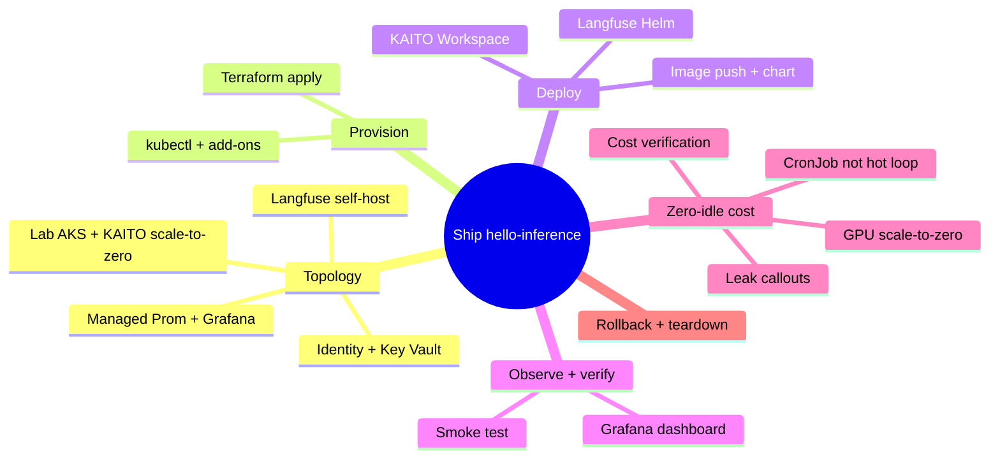
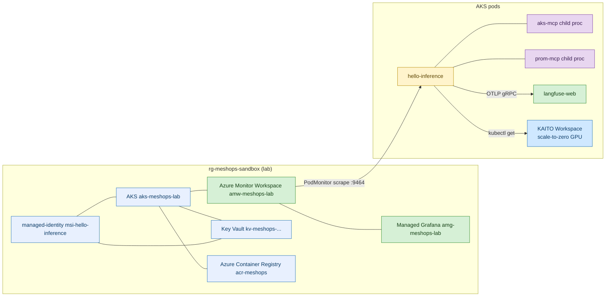
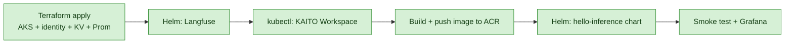

# Iteration-01 — Deployment Guide: Shipping It to Azure for ~$0 at Idle

*Audience: Ram provisioning Azure and installing the chart; topology and cost line. Read this as the moment you take the tested code and put it on a real cluster — and prove it costs almost nothing while it sleeps.*

The tests are green. The image is built. Now comes the part that makes it real: you open the Azure portal, run `terraform apply`, watch a lab AKS cluster spin into existence, deploy Langfuse, push the image, `helm install`, and tail the logs until that first JSON observation scrolls by. But there's a second, quieter goal threaded through every command here — **when nobody is watching, this should cost almost nothing.** The GPU node scales to zero, the agent runs on a schedule instead of a hot loop, and the steward's reasoning runs on Ram's Microsoft-tenant Azure OpenAI quota at $0. By the end you'll have a running slice *and* a cost-verification step that proves idle ≈ $0.

## Map of This Guide



<details>
<summary>ASCII fallback</summary>

```
Ship hello-inference
├─ Topology        : lab AKS + KAITO scale-to-zero · identity + KV · Managed Prom/Grafana · Langfuse
├─ Provision       : terraform apply · kubectl + add-ons
├─ Deploy          : Langfuse Helm · KAITO Workspace · image push + chart
├─ Observe + verify: Grafana dashboard · smoke test
├─ Zero-idle cost  : GPU scale-to-zero · CronJob not hot loop · leak callouts · cost verification
└─ Rollback + teardown
```

</details>

---

## 1. The Topology You're Building

Where we are in the story: before running anything, picture the shape — one sandbox resource group holding a small AKS cluster, an identity, a vault, the monitoring stack, and the pods.



***Figure 1: The deployment topology. The KAITO GPU Workspace (blue) scales to zero when idle — the single biggest cost lever in the whole iteration.***

<details>
<summary>ASCII fallback</summary>

```
rg-meshops-sandbox (lab):
  AKS aks-meshops-lab
    ├── pods: hello-inference (agent) · aks-mcp/prom-mcp (children)
    │         langfuse-web (ops) · KAITO Workspace (scale-to-zero GPU)
    ├── managed-identity msi-hello-inference → Key Vault (Reader, KV Secrets User), AKS (Reader, Monitoring Reader)
    ├── Azure Monitor Workspace amw-meshops-lab → Managed Grafana amg-meshops-lab
    └── ACR (image pull)
```

</details>

The deployment flow you'll follow, Hosting → compute → data → model:



***Figure 2: The provision → deploy → verify sequence, left to right.***

<details>
<summary>ASCII fallback</summary>

```
Terraform apply ─► Helm Langfuse ─► kubectl KAITO Workspace ─► image push to ACR ─► Helm chart ─► smoke + Grafana
```

</details>

**Checkpoint:** You can picture the cluster and the order. Next, provision Azure.

---

## 2. Provisioning Azure with Terraform

Where we are in the story: everything starts with `terraform apply`. The full `.tf` files live in `02_implementation_guide.md`'s companion `infra/terraform/` set. Here is the run.

```bash
# 2.1 Log in and pick the subscription
az login
az account set --subscription "<MeshOps subscription id>"

# 2.2 Provision the cluster, identity, Key Vault, Managed Prometheus + Grafana
cd infra/terraform
terraform init
terraform plan -var "subscription_id=$(az account show --query id -o tsv)" -out tfplan
terraform apply tfplan
```

The Terraform you apply does the cost-critical thing for you: the AKS cluster enables `workload_identity_enabled`, `oidc_issuer_enabled`, and `ai_toolchain_operator_enabled` (the managed KAITO add-on), and `monitor_metrics {}` turns on Managed Prometheus. The GPU node is **not** provisioned up front — KAITO provisions a spot `Standard_NC4as_T4_v3` only when the Workspace needs it, and returns it when idle. That is scale-to-zero, baked into the infrastructure.

The outputs you'll feed into Helm:

| Terraform output | Used for |
|---|---|
| `aks_resource_id` | Helm `env.aksResourceId` |
| `hello_inference_client_id` | Helm `serviceAccount.clientId` |
| `key_vault_name` | Helm `keyVault.name` |
| `key_vault_tenant_id` | Helm `keyVault.tenantId` |
| `amp_query_url` | Helm `env.azureMonitorWorkspaceQueryUrl` |
| `aks_kubelet_object_id` | ACR pull role assignment |

Then connect kubectl and enable the two add-ons Terraform doesn't:

```bash
az aks get-credentials -g rg-meshops-sandbox -n aks-meshops-lab --overwrite-existing
kubectl get nodes
az aks enable-addons -g rg-meshops-sandbox -n aks-meshops-lab \
    --addons azure-keyvault-secrets-provider
```

**Checkpoint:** The cluster, identity, vault, and monitoring stack exist. Next, deploy Langfuse and the Workspace.

---

## 3. Deploying Langfuse, the Workspace, and the Chart

Where we are in the story: the substrate is up; now the moving parts go on. First the observability backend (Langfuse), then the thing the agent watches (the Workspace), then the agent itself.

### 3.1 Langfuse — the observability backend

```bash
helm repo add langfuse https://langfuse.github.io/langfuse-k8s
helm repo update
kubectl create namespace langfuse
helm install langfuse langfuse/langfuse -n langfuse -f helm/langfuse/values.yaml
kubectl rollout status -n langfuse deploy/langfuse-web --timeout=10m
```

Once Langfuse is up, port-forward, create a project, copy its keys into Key Vault (the agent reads them via the CSI driver — never from code):

```bash
kubectl port-forward -n langfuse svc/langfuse-web 3000:3000 &
# http://localhost:3000 → Settings → API Keys → create
KV_NAME=$(terraform -chdir=infra/terraform output -raw key_vault_name)
az keyvault secret set --vault-name "$KV_NAME" --name langfuse-public-key --value "pk-lf-..."
az keyvault secret set --vault-name "$KV_NAME" --name langfuse-secret-key --value "sk-lf-..."
```

This is the **AgentOps observability backend wired the zero-idle way**: Langfuse self-hosts in-cluster (no third-party SaaS collector, no per-seat bill), and the agent metrics ride Azure Managed Prometheus + Managed Grafana — both on the free/included tier for this volume. There is no always-on external collector to pay for.

### 3.2 The synthetic KAITO Workspace — scale-to-zero

```bash
kubectl create namespace meshops-workloads
kubectl apply -f helm/stewards/extras/workspace.yaml
# KAITO provisions a T4 spot GPU node — ~5 min cold start the first time.
kubectl wait workspace/lab-phi-4-mini-eus2-01 -n meshops-workloads \
    --for=condition=WorkspaceReady --timeout=20m
```

### 3.3 The image and the chart

```bash
ACR_LOGIN_SERVER=$(az acr show -n acr-meshops --query loginServer -o tsv)
az acr login -n acr-meshops
docker build -t "${ACR_LOGIN_SERVER}/meshops/hello-inference:0.0.1" .
docker push "${ACR_LOGIN_SERVER}/meshops/hello-inference:0.0.1"

# Let the kubelet identity pull from ACR (once):
KUBE_OID=$(terraform -chdir=infra/terraform output -raw aks_kubelet_object_id)
ACR_ID=$(az acr show -n acr-meshops --query id -o tsv)
az role assignment create --assignee "$KUBE_OID" --role AcrPull --scope "$ACR_ID"

kubectl create namespace meshops
helm install hello-inference helm/stewards -n meshops \
    --set image.repository="${ACR_LOGIN_SERVER}/meshops/hello-inference" \
    --set image.tag="0.0.1" \
    --set serviceAccount.clientId="$(terraform -chdir=infra/terraform output -raw hello_inference_client_id)" \
    --set keyVault.name="$(terraform -chdir=infra/terraform output -raw key_vault_name)" \
    --set keyVault.tenantId="$(terraform -chdir=infra/terraform output -raw key_vault_tenant_id)" \
    --set env.azureOpenAiEndpoint="https://<aoai-name>.openai.azure.com/" \
    --set env.aksResourceId="$(terraform -chdir=infra/terraform output -raw aks_resource_id)" \
    --set env.azureMonitorWorkspaceQueryUrl="$(terraform -chdir=infra/terraform output -raw amp_query_url)"

kubectl rollout status -n meshops deploy/hello-inference --timeout=5m
```

**Checkpoint:** Everything is deployed. Next, smoke-test and read the trace.

---

## 4. The Smoke Test

Where we are in the story: the proof. Tail the pod and watch one observation appear.

```bash
POD=$(kubectl get pod -n meshops -l app.kubernetes.io/name=hello-inference -o jsonpath='{.items[0].metadata.name}')
kubectl logs -n meshops -f "$POD"
```

Expected — the listener line, a trace id, the human summary, and the JSON line:

```
trace_id=8af2e91...
Prometheus exporter listening on :9464/metrics
[hello-inference] Workspace lab-phi-4-mini-eus2-01 is healthy at 1 replica with GPU utilisation about 6 percent; below the 70 percent scale-up threshold.
{"workspace_name":"lab-phi-4-mini-eus2-01","replica_count":1,"gpu_util_percent":6.4,"summary":"...","requires_hitl":false}
```

Then open Langfuse (`kubectl port-forward -n langfuse svc/langfuse-web 3000:3000`, browse to `http://localhost:3000`) and confirm a `inference.steward.cycle` trace, and import `dashboards/meshops-p0-hello-agent.json` into Managed Grafana via *Dashboards → Import → JSON* to see the invocation/token/latency panels.

**Checkpoint:** The slice runs live and is observable. Next — the headline — make it cost ~$0 at idle.

---

## 5. Zero When Idle: The Headline Constraint

Where we are in the story: a portfolio lab that quietly burns money is a liability. This section is where you make idle ≈ $0 — and where you hunt the silent leaks.

The single biggest lever, shown first:

```bash
# Run the agent on a SCHEDULE, not a hot loop. Replace the always-on Deployment
# with a CronJob so the pod exists only for ~20 s every 15 min.
kubectl create cronjob hello-inference \
    --schedule="*/15 * * * *" \
    --image="${ACR_LOGIN_SERVER}/meshops/hello-inference:0.0.1" \
    -n meshops --dry-run=client -o yaml > k8s/cronjob.yaml
# Apply the CronJob, then scale the Deployment to zero:
kubectl apply -f k8s/cronjob.yaml -n meshops
kubectl scale deploy/hello-inference -n meshops --replicas=0
```

Here is how each cost source is driven toward zero, in plain terms:

1. **The GPU node — the expensive one — scales to zero.** KAITO returns the spot `Standard_NC4as_T4_v3` when the Workspace is idle. No GPU node sitting hot is the difference between dollars-per-hour and zero. (Equivalent to the serverless `min-instances=0` rule on a container platform: never pin a GPU replica above zero "for convenience.")
2. **The agent runs on a CronJob, not an always-on Deployment.** A pod that lives ~20 seconds every 15 minutes draws negligible CPU/memory on the small system node you already pay a flat rate for. No hot reasoning loop.
3. **Steward reasoning on Azure OpenAI `gpt-4.1` is $0 to Ram** — it runs on the Microsoft-tenant quota. Without that, the AOAI line would dominate; with it, the LLM cost line is zero.
4. **Langfuse, Managed Prometheus, and Managed Grafana** self-host on the cluster / sit on included tiers at this volume — no per-seat SaaS bill, no external collector instance.

Now the **silent leaks** — the things that cost money even when "nothing is running" — and how to plug each:

| Leak | Why it bills at idle | How to plug it |
|---|---|---|
| **Azure Container Registry** image storage | Every pushed tag accrues storage; old revisions pile up | Keep one tag; `az acr repository delete` stale digests. Use the Basic SKU. |
| **The system node pool** | AKS always runs ≥1 system node | One `Standard_D2as_v5` is the floor; do not add user pools you don't need. Stop the cluster when not demoing: `az aks stop -g rg-meshops-sandbox -n aks-meshops-lab`. |
| **Langfuse Postgres/Clickhouse/Redis PVCs** | Managed disks bill while provisioned | Demo-grade only; `helm uninstall langfuse` + delete PVCs between demos if cost-sensitive. |
| **Outbound egress** | Cross-region / internet egress bills | Everything stays in `eastus2`; no scheduled internet jobs. |
| **A scheduled job you didn't need** | A CronJob firing too often = more cycles = more compute + AOAI | `*/15` is plenty for a demo; don't drop to `* * * * *`. |

The one thing iteration-01 deliberately does **not** add: no Azure Cost Management *scheduled export*, no extra Container-Apps job, no always-on third-party trace collector — each would be a standing charge for a read-only demo slice.

**Checkpoint:** Every cost source is driven to its floor. Next, prove it.

---

## 6. Cost Verification: Proving Idle ≈ $0

Where we are in the story: claims are cheap; show the numbers. After the cluster has sat idle (CronJob paused, no demo running) for a day, run the checks.

```bash
# 6.1 Confirm no GPU node is running while idle.
kubectl get nodes -l accelerator=nvidia   # expect: no resources (GPU returned)

# 6.2 Confirm the agent is not running a hot loop.
kubectl get deploy/hello-inference -n meshops -o jsonpath='{.spec.replicas}'   # expect: 0
kubectl get cronjob hello-inference -n meshops                                  # the only thing scheduled

# 6.3 Confirm the steward reasoning line is $0 (Microsoft quota).
# Azure OpenAI usage shows tokens consumed but $0 billed under the MS tenant.

# 6.4 Read yesterday's actual cost for the sandbox RG.
az consumption usage list \
    --start-date $(date -u -d 'yesterday' +%Y-%m-%d) \
    --end-date $(date -u +%Y-%m-%d) \
    --query "[?contains(instanceName, 'meshops')].{svc:meterName, cost:pretaxCost}" -o table
```

Attach a budget so a leak pages you before it grows:

```bash
az consumption budget create \
    --budget-name meshops-iter01 \
    --resource-group rg-meshops-sandbox \
    --amount 200 --time-grain Monthly \
    --category cost \
    --time-period startDate=2026-06-01 endDate=2026-12-01
```

The idle expectation: with the GPU returned, the Deployment at zero, the CronJob paused, and reasoning on Microsoft quota, the only standing charges are the one system node and a few provisioned managed disks — and `az aks stop` removes even those between demos. A 15-minute CronJob over a month is ~2880 cycles at ~$0.038 list each (~$110/mo at list, **$0 to Ram** under the MS tenant), all bounded by the `$200` budget alert. **Idle ≈ $0.**

**Checkpoint:** You've proven the cost line. Next, how to roll back or tear down cleanly.

---

## 7. Rollback and Teardown

Where we are in the story: when the demo's done, or a cost spike or incident hits, you want one clean path down.

```bash
# Roll back just the agent (keep the cluster):
helm rollback hello-inference -n meshops      # to the previous chart revision
# or remove it entirely:
helm uninstall hello-inference -n meshops

# Full teardown:
helm uninstall langfuse -n langfuse
kubectl delete -f helm/stewards/extras/workspace.yaml
terraform -chdir=infra/terraform destroy -var "subscription_id=$(az account show --query id -o tsv)"
```

`terraform destroy` removes the AKS cluster, Key Vault (purge-protection lift is a manual step), the Managed Prometheus workspace, Managed Grafana, ACR (if empty), and the federated identity. Soft-deleted Key Vault objects need `az keyvault purge` to fully clear (7-day default retention). For a *pause* rather than a teardown, prefer `az aks stop` — it keeps your config but stops the node-pool billing.

**Checkpoint:** You can take it up, roll it back, pause it, or destroy it. Reference and limitations follow.

---

## 8. Reference: Artefact → Manifest → Cost Behaviour at Idle

| Artefact | Manifest path | Cost at idle |
|---|---|---|
| AKS cluster + KAITO add-on | `infra/terraform/main.tf` | One system node (floor); GPU = $0 (scaled to zero) |
| Workload Identity + federation | `infra/terraform/identity.tf` | $0 |
| Key Vault + RBAC | `infra/terraform/keyvault.tf` | Negligible (per-operation) |
| Managed Prometheus + Grafana | `infra/terraform/monitoring.tf` | Included/free tier at this volume |
| KAITO Workspace CR | `helm/stewards/extras/workspace.yaml` | $0 GPU when idle |
| Langfuse | `helm/langfuse/values.yaml` | PVC disk only (demo-grade) |
| hello-inference CronJob | `k8s/cronjob.yaml` | ~20 s every 15 min; AOAI $0 to Ram |
| Container image | `Dockerfile` + ACR `acr-meshops` | ACR Basic storage (prune old tags) |

---

## 9. Limitations / What's Not Deployed Yet

The agent runs as a CronJob (the read-only demo cadence); a durable, retrying scheduler with backoff is a P1 refinement. There is no multi-replica steward (one is enough for P0), no network policy isolating the agent from the public internet (that arrives with the Security Steward in P4), and no backup/restore for Langfuse's Postgres/Clickhouse (demo-grade in P0). Single region (`eastus2`), best-effort recovery, no formal RTO/RPO.

---

**Sources**

*Repo files:* `040_iterations/iteration-01/01_use_case.md` · `040_iterations/iteration-01/02_implementation_guide.md` · `030_design/02_prd.md`

*Web:*
- [AKS — enable managed Prometheus + Grafana](https://learn.microsoft.com/en-us/azure/azure-monitor/containers/kubernetes-monitoring-enable)
- [AKS — ai-toolchain-operator (KAITO) add-on](https://learn.microsoft.com/en-us/azure/aks/ai-toolchain-operator)
- [AKS — stop and start a cluster](https://learn.microsoft.com/en-us/azure/aks/start-stop-cluster)
- [Azure Key Vault CSI driver on AKS](https://learn.microsoft.com/en-us/azure/aks/csi-secrets-store-driver)
- [Azure Workload Identity federation on AKS](https://learn.microsoft.com/en-us/azure/aks/workload-identity-overview)
- [Langfuse self-host (Helm)](https://langfuse.com/self-hosting/deployment/kubernetes-helm)
- [Azure Cost Management — budgets via CLI](https://learn.microsoft.com/en-us/cli/azure/consumption/budget)

</content>
