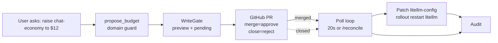

# Iteration 2 (Gated Write + HITL) — The Use Case: Teaching the Gateway Steward to Change Budgets — but Only With Approval

*Audience: Ram (builder). Read the [Iteration-1 Gateway use case](../../iteration-01-read-only/gateway/01_use_case.md) and [ADR-0011](../../../035_others/decisions/0011-no-autonomous-actuation-hitl.md) first. This is the story of the gated per-route budget-cap write.*

In Iteration 1 the Gateway Steward learned to read LiteLLM routes, budget caps, and upstream health. It could say, *"this budget cap looks worth reviewing"* — but it could not propose or execute anything. **Iteration 2 adds the smallest real Gateway actuation: change a route's per-route budget cap, behind a human gate.**

> **UC — Gateway gated cost-governance via route budget cap**
>
> **Why this slice:** changing a per-route budget cap is a real routing/cost-governance action. It is visible in `litellm-config`, reversible, low-cost in the lab, and bounded by route allowlist plus namespace/RBAC. It proves the routing steward can move from advice to gated action without autonomous actuation.
>
> **Actor:** `hello-gateway-iter2` and Ram as PR approver.
>
> **Preconditions:** read-only Gateway substrate, shared `src/stewards/hitl/` gate, GitHub token Secret, LiteLLM ConfigMap `litellm-config` in namespace `meshops-workloads`, allowlisted routes `chat-premium,chat-economy`.

---

## 1. The one-paragraph version

The `hello-gateway` agent still reads LiteLLM routes and health freely. When asked to change a budget cap for an allowed route, it may call exactly one non-mutating tool, `propose_budget`. That tool validates the route allowlist and budget bounds; asks the shared `WriteGate` for a preview; opens a GitHub PR; and returns `PENDING`. **Nothing changes until a human merges the PR.** The in-pod poll loop reconciles the merge and deterministic code patches `litellm-config`'s `config.yaml`, then runs `kubectl rollout restart deployment/litellm` so the proxy reloads.

---

## 2. Why per-route budget cap — and why not broader routing changes

| Candidate write | Decision | Why |
|---|---|---|
| LiteLLM route `model_info.max_budget` | ✅ chosen | Direct cost-governance policy, reversible, visible in the ConfigMap, bounded to one route. |
| Add/remove routes | ❌ not chosen | Larger routing-plane blast radius; not needed for the first Gateway writer. |
| Change fallbacks / weights / upstream models | ❌ out of scope | Higher operational and quality risk; later Gateway iterations can add these behind the same gate. |
| Live spend mutation | ❌ not available | The lab proxy has no Postgres DB; `/spend` and `/global/spend` are not part of this scope. |

The live targets are deliberately safe: `chat-premium` and `chat-economy`, both over Azure OpenAI `gpt-4.1`, with lab bounds `$0..$200`.

---

## 3. The three defence-in-depth layers

| # | Layer | What it enforces |
|---|---|---|
| 1 | **Persona / tool wiring** | Iteration 1 has no propose tool. Iteration 2 persona says the steward may propose only per-route budget caps and must never claim execution. |
| 2 | **`build_propose_budget_tool` domain guard** | Non-allowlisted route or budget outside `[min,max]` is denied before `gate.submit`; a denied proposal is never approvable. |
| 3 | **Namespaced writer RBAC** | The executor can only read/patch/update ConfigMaps and get/patch Deployments in `meshops-workloads`; no pods, no secrets, no cluster-scoped resources. |

> **Key Gateway contrast:** unlike SRE, Gateway's read path uses HTTP (`litellm-mcp`), not `kubectl`. This chart has **no broad read RBAC at all**. The writer Role is the only Kubernetes permission it holds, and only when `writeEnabled=true`.

---

## 4. The GitHub-PR approval channel

The channel is `github_pr`: the pod opens a PR, merge approves, close rejects, and `/reconcile` can force a poll. TTL is auto-bumped to at least 7 days for async review. The `github-token` Secret already exists in namespace `meshops`.

---

## 5. Demo definition of done

1. Ask: *"Raise chat-economy budget to $12"*.
2. Steward returns proposal `pw_aec4896a`, preview `budget cap 5.0 -> $12.00`, opens PR #15, and leaves `litellm-config` unchanged.
3. Bad asks are denied: `chat-vip` (not allowlisted) and `$5000` (`max=200`).
4. Merge PR #15. Within one poll interval, `config.yaml` changes `chat-economy` **5.0 → 12.0**, `deployment/litellm` rolls, and audit records `proposed`→`executed` with approver `ramanjk`.
5. Reset `chat-economy` to the `$5` baseline.

---

## 6. What this iteration deliberately does not do

- No autonomous budget change.
- No writes other than one route's `model_info.max_budget`.
- No adding/removing routes.
- No fallback, weight, or upstream-model changes.
- No live-spend reads or writes; those require a LiteLLM database not deployed here.
- No write through `litellm-mcp`; the read shim stays read-only.
