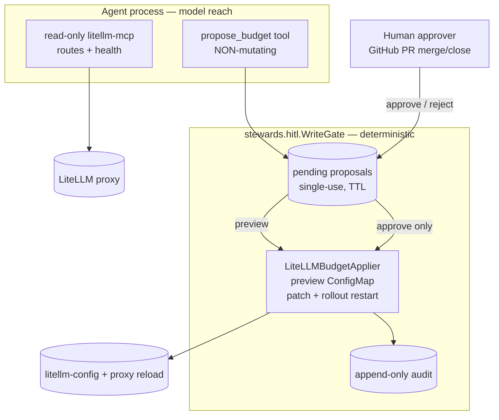

# Iteration 2 (Gated Write + HITL) — Implementation Guide: Every File Behind the Gate (Gateway)

*Audience: Ram (builder). Read [`01_use_case.md`](01_use_case.md) and [ADR-0011](../../../035_others/decisions/0011-no-autonomous-actuation-hitl.md) first. This guide mirrors Quality and SRE: it references the shared HITL spine documented in the [pipeline guide](../pipeline/02_implementation_guide.md) and focuses on the Gateway-specific domain code.*

## What Iteration 2 adds, in one diagram



## The shared HITL spine (same as pipeline / quality / SRE)

Gateway reuses `src/stewards/hitl/` — `Proposal`, `WriteGate`, `Applier`, `AuditSink`, `channels.py`, `serve_support.py`, and `session.py`. See the [pipeline implementation guide §1](../pipeline/02_implementation_guide.md) for the full walkthrough. Gateway supplies only:

| Layer | Shared `stewards.hitl` | Gateway supplies |
|---|---|---|
| Proposal schema | `Proposal` base | `BudgetProposal(route, budget)` |
| Gate | `WriteGate` | reused verbatim |
| Executor | `Applier` + `ApplyError` | `LiteLLMBudgetApplier` |
| Channels | chat / GitHub PR | reused verbatim (`github_pr` live) |
| LLM tool | — | `propose_budget` |

---

## 1. `src/stewards/gateway/write.py` — the domain pieces + the one LLM tool

### 1.1 `BudgetProposal` — the intent

```python
class BudgetProposal(Proposal):
    route: str = Field(..., min_length=1, max_length=253)
    budget: float = Field(..., ge=0.0, le=1_000_000.0)

    def human_summary(self) -> str:
        return f"set budget cap of route '{self.route}' to ${self.budget:.2f}"

    def spec_dict(self) -> dict:
        return {"kind": "LiteLLMRouteBudget", "route": self.route,
                "max_budget": self.budget}

    def audit_kind(self) -> str:
        return "route-budget"
```

**What this buys you:** every pending proposal has the exact LiteLLM route and target budget cap in structured form; audit lines can say `kind":"route-budget"`.

### 1.2 `LiteLLMBudgetApplier` — deterministic preview and act

```python
class LiteLLMBudgetApplier:
    def preview(self, proposal: Proposal) -> str:
        proposal = _as_budget(proposal)
        config = self._read_config()
        entry = self._find_route(config, proposal.route)
        if entry is None:
            raise ApplyError(f"route '{proposal.route}' not found in LiteLLM config")
        current = (entry.get("model_info") or {}).get("max_budget", "unset")
        return (
            f"LiteLLM route '{proposal.route}': budget cap {current} -> "
            f"${proposal.budget:.2f}. No change made (dry-run)."
        )

    def apply(self, proposal: Proposal) -> str:
        proposal = _as_budget(proposal)
        config = self._read_config()
        entry = self._find_route(config, proposal.route)
        info = entry.setdefault("model_info", {})
        before = info.get("max_budget", "unset")
        info["max_budget"] = proposal.budget
        patch = json.dumps({"data": {self._config_key: yaml.safe_dump(config, sort_keys=False)}})
        ... kubectl patch configmap ...
        ... kubectl rollout restart deployment/litellm ...
```

**What this buys you:** LiteLLM has no live budget-write API without a proxy database, so the applier edits the configured policy source of truth: `model_info.max_budget` in `config.yaml`. `preview` reads the live ConfigMap and reports `N -> M`; `apply` is the only mutating path and runs deterministic `kubectl patch` plus `kubectl rollout restart`.

### 1.3 `build_propose_budget_tool` — guard before gate

```python
def build_propose_budget_tool(gate: WriteGate, *, allowed_routes: set[str],
                              min_budget: float, max_budget: float):
    def propose_budget(route: str, budget: float, rationale: str) -> str:
        proposal = BudgetProposal(route=route, budget=budget,
                                  rationale=rationale,
                                  session_id=current_session_id.get())
        guard_reason = None
        if allowed_routes and route not in allowed_routes:
            guard_reason = f"route '{route}' is not in the budget allowlist (...)."
        elif not (min_budget <= budget <= max_budget):
            guard_reason = f"budget ${budget:.2f} is outside the allowed range ..."
        if guard_reason is not None:
            proposal = gate.deny(proposal, guard_reason)
            return f"PROPOSAL DENIED: {guard_reason} No change was or will be made."

        proposal = gate.submit(proposal)
        return (f"PROPOSAL {proposal.id} recorded and is PENDING human approval — "
                f"nothing has been changed.
Intent: {proposal.human_summary()}
"
                f"Rationale: {proposal.rationale}
Dry-run preview:
{proposal.preview}

"
                f"Tell the user exactly what will happen and ask them to Approve or Reject...")
```

**What this buys you:** out-of-scope proposals are recorded as denied and never become pending/approvable. Live config: `allowedRoutes=chat-premium,chat-economy`, `min=0`, `max=200`.

---

## 2. `src/stewards/gateway/serve.py` — wiring the gate into chat

```python
tools: list[Any] = [litellm_tool]
if settings.write_enabled:
    ttl = settings.write_proposal_ttl_seconds
    if settings.write_approval_channel == "github_pr":
        ttl = max(ttl, PR_CHANNEL_MIN_TTL_SECONDS)
    gate = WriteGate(LiteLLMBudgetApplier(
        namespace=settings.budget_namespace,
        configmap=settings.budget_configmap,
        config_key=settings.budget_config_key,
        deployment=settings.budget_deployment,
        kubectl_binary=settings.kubectl_binary,
    ), ttl_seconds=ttl)
    channel = build_channel(settings, gate)
    tools.append(build_propose_budget_tool(
        gate,
        allowed_routes=settings.allowed_route_set(),
        min_budget=settings.budget_min,
        max_budget=settings.budget_max,
    ))
    persona = agent_module._read_prompt("gateway-steward.gated-write.chat.md")
    LOG.info("[chat] WRITE-ENABLED: HITL gate armed for LiteLLM route budget in ns/%s via '%s' channel",
             settings.budget_namespace, channel.name)
    if channel.name == "github_pr":
        state["poll_task"] = asyncio.create_task(poll_loop(channel, gate, settings.github_poll_seconds))
else:
    persona = agent_module._read_prompt("gateway-steward.chat.md")
```

**What this buys you:** write is a deploy-time capability flag. With `writeEnabled=false`, no tool, no gated persona, no poll loop. With `github_pr`, TTL is bumped for async review and a 20s poll loop reconciles PR state.

---

## 3. `src/stewards/gateway/settings.py` — bounds and channels

```python
write_enabled: bool = Field(False)
write_proposal_ttl_seconds: int = Field(900, ge=30)
write_approval_channel: str = Field("chat")
budget_namespace: str = Field("meshops-workloads")
budget_configmap: str = Field("litellm-config")
budget_config_key: str = Field("config.yaml")
budget_deployment: str = Field("litellm")
budget_allowed_routes: str = Field("")
budget_min: float = Field(0.0, ge=0.0)
budget_max: float = Field(1000.0, gt=0.0)
kubectl_binary: str = Field("kubectl")
github_repo: str = Field("")
github_base_branch: str = Field("main")
github_proposals_dir: str = Field("hitl-proposals")
github_poll_seconds: int = Field(20, ge=5)

def allowed_route_set(self) -> set[str]:
    return {r.strip() for r in self.budget_allowed_routes.split(",") if r.strip()}
```

**Invariant:** Helm sets both `WRITE_NAMESPACE`'s RBAC namespace and `BUDGET_NAMESPACE` from the same `writeNamespace` value. In app terms, `BUDGET_NAMESPACE == writeNamespace` is the contract that makes the guard and Kubernetes Role agree.

---

## 4. `prompts/gateway-steward.gated-write.chat.md` — propose-only persona

```markdown
In this iteration you can **read anything** the routing plane exposes and you may
**propose one kind of change — a route's per-route budget cap** ... but **every
budget change requires a human's approval at the gate before it happens.** You
never change a budget yourself.
```

Key clauses: read first, call `propose_budget`, relay the preview/proposal id, wait, never claim the budget changed, decline all non-budget writes.

---

## 5. Helm — values, deployment, and write RBAC

### 5.1 `helm/gateway/values.yaml`

```yaml
writeEnabled: false
writeNamespace: meshops-workloads
writeApprovalChannel: chat
budget:
  configmap: litellm-config
  configKey: config.yaml
  deployment: litellm
  allowedRoutes: ""
  minBudget: 0.0
  maxBudget: 1000.0
github:
  repo: ""
  baseBranch: main
  proposalsDir: hitl-proposals
  pollSeconds: 20
```

### 5.2 `helm/gateway/templates/deployment.yaml`

```yaml
- name: WRITE_ENABLED
  value: "true"
- name: WRITE_APPROVAL_CHANNEL
  value: {{ .Values.writeApprovalChannel | quote }}
- name: BUDGET_NAMESPACE
  value: {{ .Values.writeNamespace | quote }}
- name: BUDGET_CONFIGMAP
  value: {{ .Values.budget.configmap | quote }}
- name: BUDGET_CONFIG_KEY
  value: {{ .Values.budget.configKey | quote }}
- name: BUDGET_DEPLOYMENT
  value: {{ .Values.budget.deployment | quote }}
- name: BUDGET_ALLOWED_ROUTES
  value: {{ .Values.budget.allowedRoutes | quote }}
- name: BUDGET_MIN
  value: {{ .Values.budget.minBudget | quote }}
- name: BUDGET_MAX
  value: {{ .Values.budget.maxBudget | quote }}
```

### 5.3 `helm/gateway/templates/write-rbac.yaml`

The write Role is rendered only when `writeEnabled=true`, in `.Values.writeNamespace`, and is bound to the steward ServiceAccount. It is bounded to exactly the Gateway steward's one gated write: read/patch/update the LiteLLM ConfigMap and get/patch the LiteLLM Deployment so `kubectl rollout restart` can reload the proxy — nothing else (no pods, secrets, statefulsets, RBAC, or cluster-scoped resources). This is the layer-3 backstop: even an approved-but-wrong request is physically capped at this one namespace and resource set.

```yaml
{{- if .Values.writeEnabled }}
kind: Role
metadata:
  namespace: {{ .Values.writeNamespace }}
rules:
  - apiGroups: [""]
    resources: ["configmaps"]
    verbs: ["get", "list", "patch", "update"]
  - apiGroups: ["apps"]
    resources: ["deployments"]
    verbs: ["get", "patch"]
---
kind: RoleBinding
subjects:
  - kind: ServiceAccount
    name: {{ .Values.serviceAccount.name }}
    namespace: {{ .Values.namespace }}
{{- end }}
```

---

## File → Purpose map

| File | Purpose |
|---|---|
| `src/stewards/hitl/*` | shared gate/channels/serve_support/session (see [pipeline guide §1](../pipeline/02_implementation_guide.md)) |
| `src/stewards/gateway/write.py` | `BudgetProposal` + `LiteLLMBudgetApplier` + guarded `propose_budget` |
| `src/stewards/gateway/serve.py` | flag-gated wiring, PR channel, `/approve`/`/reject`/`/reconcile`, poll loop |
| `src/stewards/gateway/settings.py` | write flag, ConfigMap/deployment target, route allowlist, budget bounds, GitHub PR settings |
| `prompts/gateway-steward.gated-write.chat.md` | propose-only persona |
| `helm/gateway/values.yaml`, `templates/deployment.yaml` | deploy-time flag and env; `BUDGET_NAMESPACE` from `writeNamespace` |
| `helm/gateway/templates/write-rbac.yaml` | namespaced writer Role/RoleBinding for approved budget execution |
| `helm/gateway/extras/litellm-substrate.yaml` | LiteLLM proxy, `litellm-config`, routes `chat-premium`/`chat-economy` |
| `tests/unit/test_gateway_write.py` | domain guard and budget proposal lifecycle |

## Limitations / next

- Approval identity is the PR merger's login (`github_pr`) or `operator (chat)`.
- Audit is the logging sink (`kind":"route-budget"`); immutable storage remains follow-up.
- No route/fallback/weight/upstream-model changes in this iteration.
- Live spend remains future work until the LiteLLM proxy has a connected Postgres DB.

## Sources

- Repo: `src/stewards/gateway/{write,serve,settings}.py`, `prompts/gateway-steward.gated-write.chat.md`, `helm/gateway/{values.yaml,templates/deployment.yaml,templates/write-rbac.yaml,extras/litellm-substrate.yaml}`, `tests/unit/test_gateway_write.py`.
- Shared gate: `src/stewards/hitl/*`; [pipeline implementation guide](../pipeline/02_implementation_guide.md).
- [ADR-0011 — no autonomous actuation](../../../035_others/decisions/0011-no-autonomous-actuation-hitl.md).
