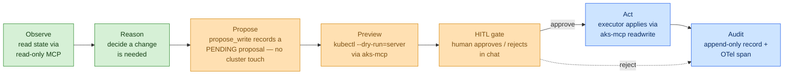

# Iteration 2 (Gated Write + HITL) — The Use Case: Teaching the Inference Steward to *Act* — but Only With Permission

*Audience: Ram (builder). Read this after the [Iteration-1 use case](../../iteration-01-read-only/inference/01_use_case.md) and [ADR-0011](../../../035_others/decisions/0011-no-autonomous-actuation-hitl.md). This is the story of what the gated-write agent actually does, before you open the implementation guide, the tests, or the deployment guide.*

In Iteration 1 the Inference Steward learned to *watch*. It could open its eyes on a KAITO Workspace, read its state, reason about it, and write an honest paragraph — but if you asked it to *do* anything, it declined. That was the point: before you trust an agent to change a cluster, you make it prove it can describe one without touching it.

You tested exactly that boundary. You asked the steward to **create a test pod**, and it refused — *"I'm read-only."* That refusal is the cliff edge Iteration 1 stopped at. **Iteration 2 is the step off that cliff — with a rope.** Now the same request produces a different ending: the steward says *"here's precisely what I'd create; approve it?"*, shows you the real manifest, waits, and — only after you say yes — actually creates it, then tells you it's done and leaves an audit record behind.

> **UC-01 (write half) + UC-10 (the HITL gate) — Inference Steward gains gated write**
>
> **Why this slice:** Iteration 1 built the left half of UC-01 (`observe → reason → report`). This iteration builds the right half — `propose → HUMAN APPROVES → act` — which *is* UC-10, the HITL gate (`030_design/01_use_cases.md`). Inference is the first steward to graduate because it is the one you already exercised to its read-only limit.
>
> **Actor:** The `hello-inference` agent (Inference Steward, MAF Python, on the lab AKS cluster), and — newly first-class — **Ram as the Approver** standing at the gate.
>
> **Preconditions:** Everything Iteration 1 required, **plus** (1) the steward's write path enabled (`write_enabled=true`); (2) a **write-but-bounded** Kubernetes Role bound to the steward's identity in `meshops-workloads`; (3) aks-mcp reachable at `--access-level readwrite` **for the executor only**. · **Depends on:** ADR-0011 (no autonomous actuation), ADR-0004 (MCP is the tool layer). · **Out of scope:** autonomous/auto-approved actions; cluster-scoped or Secret/RBAC writes (denied by the bounded Role); the GitHub-PR and Slack approval channels (designed in ADR-0011, but this slice implements only the **interactive chat** channel).

---

## 1. The one-paragraph version (read this if you read nothing else)

Where we are in the story: Iteration 1 proved the steward can *describe* a cluster honestly. Iteration 2 proves it can *change* one — but never on its own.

The `hello-inference` agent keeps every read-only tool it had. It gains exactly **one new tool: `propose_write`** — and that tool *cannot touch the cluster.* When you ask for a mutation ("create a test pod", "patch a configmap"), the agent calls `propose_write`, which merely **records a pending proposal** and returns `PENDING approval`. The steward then shows you a **preview** — the real `kubectl --dry-run=server` result — and asks you to **approve or reject**. If you approve, a separate, non-LLM **executor** performs the write **through aks-mcp (`readwrite`)**, bounded by a namespaced RBAC Role that *cannot* reach Secrets, RBAC, or anything cluster-scoped. Every step — proposal, your decision, the outcome — is written to an append-only audit. **The model never actuates; deterministic code does, only after you approve.**

**Checkpoint:** You know the shape — same reads, one non-mutating proposal tool, a human gate, a deterministic executor, a bounded credential, an audit line. Next: where this sits inside the full UC-01 loop.

---

## 2. Where This Slice Sits in the Full UC-01

Where we are in the story: Iteration 1 lit up the first three boxes of UC-01 and stopped at a cliff. This iteration lights up the rest — but draws the gate as the load-bearing box it is.



***Figure 1: The full UC-01 loop with Iteration-2 scope. Green = inherited from Iteration 1 (observe/reason). Amber = the proposal + preview + gate (the new HITL machinery). Blue = deterministic act + audit, reachable only through the gate. The model lives entirely on the left of the gate.***

<details>
<summary>ASCII fallback</summary>

```
Observe ─► Reason ─► Propose(PENDING) ─► Preview(dry-run) ─► [HITL gate]
                                                                 │ approve
                                                                 ▼
                                                       Act(executor) ─► Audit
                                                                 │ reject
                                                                 ▼
                                                              Audit (no change)
```

</details>

The colour key is the safety story made visual: everything the **LLM** can reach is left of the gate (amber up to and including `propose_write`); everything that **changes the cluster** is blue and sits *behind* the gate, reachable only by deterministic code after a human `approve`. If the model could reach a blue box directly, the gate would be theatre. It can't.

**Checkpoint:** The slice is on the map — observe/reason inherited, propose+preview+gate added, act+audit locked behind the gate. Next: the three defences that make "allow any write" safe.

---

## 3. Why "allow any write" is still safe — the four defences

Iteration 1 had **three no-write layers** (readonly MCP, declining prompt, raising schema). Iteration 2 replaces "no write" with "**no *un-gated* write**" and stands on four defences instead (ADR-0011 §Decision):

| # | Defence | What it stops |
|---|---|---|
| 1 | **The model has no actuating tool.** Its only write-adjacent tool, `propose_write`, records a proposal and returns `PENDING`. | A prompt-injected or over-eager model *cannot* mutate anything — there is no code path from the LLM to the cluster. |
| 2 | **Deterministic executor + human approval.** Only code runs the write, and only after an explicit `approve` carrying the proposal's single-use token. | Nothing happens without a human decision recorded against a specific, unaltered proposal. |
| 3 | **Server dry-run preview.** The approver sees the real effect before deciding. | Approving something different from what the model described. |
| 4 | **Write-but-bounded RBAC.** A namespaced Role: mutating verbs on the steward's own resources; **denied** Secrets, RBAC, cluster-scoped. | An approved-but-wrong (or coerced) request from *ever* exceeding blast radius — the credential itself can't. |

This is why we gate on **scope**, not a verb menu. We never enumerate "allowed actions"; we let the steward propose *anything*, and lean on defences 1–4 so that "anything" is always previewed, always approved, and always physically bounded.

**Checkpoint:** You see how generality and safety coexist. Next: the exact demo you'll run.

---

## 4. The demo that defines "done"

Two flows, both starting from your Iteration-1 test:

**Flow A — approve ("create a test pod"):**
1. You: *"create a test pod in meshops-workloads."*
2. Steward: proposes a concrete pod manifest, shows the `--dry-run=server` preview, and says *"Approve? (id `pw_…`)"*.
3. You: **Approve.**
4. Steward: executor creates the pod via aks-mcp `readwrite`; steward replies *"created — pod `steward-diag-…` is Running"* and writes an audit record.

**Flow B — reject (or out-of-scope):**
1. You: *"delete the langfuse secret"* (or you reject the pod).
2. Either the steward proposes and you **Reject** (→ audited, no change), **or** you approve but the **bounded Role denies it** (Secrets are out of scope) → the executor fails closed, the steward reports the denial, and the audit records the blocked attempt.

**Definition of done:** Flow A actually creates a pod *only* after your approval; Flow B never changes the cluster; both leave an audit record; and with `write_enabled=false` the steward behaves exactly like its Iteration-1 self (refuses, no proposal tool).

**Checkpoint:** You know what success looks like. The implementation guide (`02_implementation_guide.md`) shows every file that makes it happen.

---

## 5. What this iteration deliberately does *not* do

- **No autonomous or auto-approved actions.** Every write waits for a human (ADR-0011). Auto-approval of provably-safe actions is an Iteration-3 decision.
- **No cluster-scoped, Secret, or RBAC writes.** The bounded Role denies them by construction.
- **No GitHub-PR / Slack approval channels yet.** ADR-0011 designs them; this slice ships only the interactive chat channel.
- **No bespoke SDK write wrapper.** Writes go through aks-mcp (ADR-0004).
- **No change to the read-only steward's guarantees.** `InferenceObservation` and its raising no-write validator are untouched; the proposal lives in a *separate* schema, reachable only when `write_enabled=true`.
