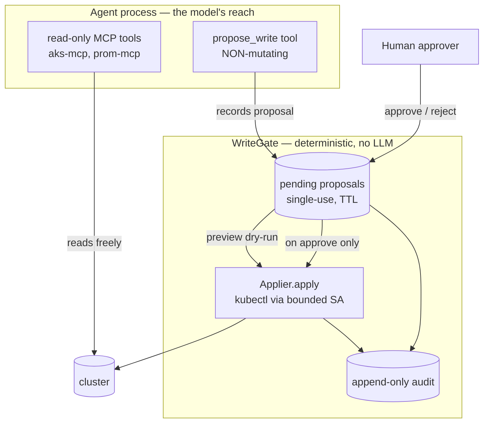

# Iteration 2 (Gated Write + HITL) — Implementation Guide: Every File Behind the Gate

*Audience: Ram (builder). Read [`01_use_case.md`](01_use_case.md) and [ADR-0011](../../../035_others/decisions/0011-no-autonomous-actuation-hitl.md) first. This guide walks every file added or changed to turn the read-only Inference Steward into a gated writer, with the real committed code. It mirrors the read-only [`../../iteration-01-read-only/inference/02_implementation_guide.md`](../../iteration-01-read-only/inference/02_implementation_guide.md) house style: for each file — path, purpose, code, and what it buys you.*

## What Iteration 2 adds, in one diagram



The model can reach only the left box. Nothing crosses into `apply` without a human `approve`. Everything below is how that is built.

---

## 1. `src/stewards/inference/settings.py` — the capability flag

*Purpose: add the master `write_enabled` switch (off by default) plus the write bounds. Off = the steward is byte-for-byte its Iteration-1 self.*

```python
    # ---- Iteration 2: gated write (HITL) -------------------------------------
    write_enabled: bool = Field(
        False,
        description="Enable the gated-write path (propose -> HITL approve -> act). Off = read-only.",
    )
    write_namespace: str = Field(
        "meshops-workloads",
        description="Only namespace the executor may mutate. Backstopped by a namespaced RBAC Role.",
    )
    write_proposal_ttl_seconds: int = Field(
        900, ge=30,
        description="Seconds a pending write proposal stays approvable before it expires.",
    )
    kubectl_binary: str = Field(
        "kubectl", description="Path to kubectl used by the deterministic write executor.",
    )
```

**What this buys you:** one boolean is the entire difference between "read-only steward" and "gated writer." Because it defaults to `False`, deploying this code changes *nothing* until you opt in — and even then it only makes the gate *reachable*, never optional.

---

## 2. `src/stewards/inference/write_gate.py` — the gate itself

*Purpose: the executable form of ADR-0011. Pure Python, no LLM/agent imports, so it is unit-testable in isolation. Holds pending proposals and is the only object that can turn one into an executed mutation — and only via `approve()`.*

### 2.1 The proposal schema (shape-validated per operation)

```python
class WriteOperation(enum.StrEnum):
    CREATE = "create"; APPLY = "apply"; PATCH = "patch"; SCALE = "scale"; DELETE = "delete"

class ProposalStatus(enum.StrEnum):
    PENDING = "pending"; EXECUTED = "executed"; FAILED = "failed"
    REJECTED = "rejected"; DENIED = "denied"; EXPIRED = "expired"

class WriteProposal(BaseModel):
    id: str
    operation: WriteOperation
    resource_kind: str = Field(..., min_length=1)
    namespace: str = Field(..., min_length=1)
    name: str | None = None
    manifest: dict | None = None
    patch: dict | None = None
    replicas: int | None = Field(None, ge=MIN_REPLICAS, le=MAX_REPLICAS)
    rationale: str = Field(..., min_length=10, max_length=800)
    status: ProposalStatus = ProposalStatus.PENDING
    created_at: float = Field(default_factory=time.time)
    preview: str | None = None
    outcome: str | None = None
    session_id: str | None = None
    approver: str | None = None

    @model_validator(mode="after")
    def _shape_matches_operation(self) -> Self:
        op = self.operation
        if op in (WriteOperation.CREATE, WriteOperation.APPLY) and not self.manifest:
            raise ValueError(f"operation '{op.value}' requires a 'manifest'.")
        if op == WriteOperation.PATCH and (not self.patch or not self.name):
            raise ValueError("operation 'patch' requires a 'patch' body and target 'name'.")
        if op == WriteOperation.SCALE and (self.replicas is None or not self.name):
            raise ValueError("operation 'scale' requires 'name' and 'replicas'.")
        if op == WriteOperation.DELETE and not self.name:
            raise ValueError("operation 'delete' requires a target 'name'.")
        return self
```

**What this buys you:** the proposal can express *any* mutation (that is the scope-based model — not a verb menu), but each shape is validated so a malformed intent is rejected before it ever reaches a human or the cluster. `replicas` is bounded exactly like the read-only `InferenceObservation.replica_count`.

### 2.2 The applier — deterministic actuation via kubectl

```python
class Applier(Protocol):
    def preview(self, proposal: WriteProposal) -> str: ...
    def apply(self, proposal: WriteProposal) -> str: ...

class KubectlApplier:
    def _argv(self, proposal, dry_run):
        ns = ["-n", proposal.namespace]; op = proposal.operation; stdin = None
        if op in (WriteOperation.CREATE, WriteOperation.APPLY):
            argv = [self._kubectl, "apply", "-f", "-", *ns, "-o", "name"]; stdin = json.dumps(proposal.manifest)
        elif op == WriteOperation.PATCH:
            argv = [self._kubectl, "patch", proposal.resource_kind, proposal.name, *ns,
                    "--type", "merge", "-p", json.dumps(proposal.patch)]
        elif op == WriteOperation.SCALE:
            argv = [self._kubectl, "scale", f"{proposal.resource_kind}/{proposal.name}", *ns,
                    f"--replicas={proposal.replicas}"]
        elif op == WriteOperation.DELETE:
            argv = [self._kubectl, "delete", proposal.resource_kind, proposal.name, *ns]
        if dry_run:
            argv.append("--dry-run=server" if op != WriteOperation.SCALE else "--dry-run=client")
        return argv, stdin
```

On a non-zero exit, `KubectlApplier` raises `ApplyError(err, denied="forbidden" in err)` — so an RBAC rejection becomes a first-class *denied* outcome rather than a crash.

**What this buys you:** the write goes through `kubectl` — the same actuation aks-mcp performs (ADR-0004) — run by *deterministic code* under the pod's bounded ServiceAccount token. The RBAC Role (§7) is therefore the hard cap on blast radius. `preview` uses `--dry-run=server` so the human sees the real effect.

### 2.3 `WriteGate` — propose / approve / reject

```python
class WriteGate:
    def propose(self, *, operation, resource_kind, namespace, rationale, session_id=None, **kw) -> WriteProposal:
        if namespace != self._allowed_ns:                     # app-level twin of RBAC
            denied = WriteProposal(..., status=ProposalStatus.DENIED,
                                   outcome=f"namespace '{namespace}' is out of scope; only '{self._allowed_ns}' is writable.")
            self._audit_event("denied", denied); return denied
        proposal = WriteProposal(id=self._token(), ..., created_at=self._clock())
        try:
            proposal.preview = self._applier.preview(proposal)  # dry-run only
        except ApplyError as exc:
            proposal.preview = f"(dry-run failed) {exc}"        # keep pending; human judges
        self._store[proposal.id] = proposal
        self._audit_event("proposed", proposal); return proposal

    def approve(self, token: str, approver: str) -> WriteProposal:
        proposal = self._require_pending(token)                 # exists + pending + not expired
        proposal.approver = approver
        try:
            proposal.outcome = self._applier.apply(proposal)    # <-- the ONLY call that mutates
            proposal.status = ProposalStatus.EXECUTED; self._audit_event("executed", proposal)
        except ApplyError as exc:
            proposal.status = ProposalStatus.DENIED if exc.denied else ProposalStatus.FAILED
            proposal.outcome = str(exc); self._audit_event("denied" if exc.denied else "failed", proposal)
        return proposal

    def reject(self, token: str, approver: str) -> WriteProposal:
        proposal = self._require_pending(token)
        proposal.approver = approver; proposal.status = ProposalStatus.REJECTED
        proposal.outcome = "rejected by approver; no change made."
        self._audit_event("rejected", proposal); return proposal
```

`_require_pending` raises if a token is unknown, expired, or already terminal — which makes approval **single-use** and **TTL-bounded**. `pending_for_session` powers the chat approval card.

**What this buys you:** there is exactly one line in the whole codebase that mutates the cluster — `self._applier.apply(proposal)` inside `approve()`. It cannot run without a prior human `approve` call carrying a live, single-use token. That is the invariant ADR-0011 is built on, in one place you can point at.

### 2.4 The audit sink

```python
class LoggingAuditSink:
    def record(self, event: dict) -> None:
        self._log.info("AUDIT %s", json.dumps(event, sort_keys=True, default=str))
```

Every transition (`proposed`, `executed`, `denied`, `failed`, `rejected`, `expired`) emits one structured line with proposal id, operation, target, approver, and outcome. **What this buys you:** a complete, greppable trail today, and a drop-in seam for the immutable Azure Storage sink ADR-0011 requires — the gate depends only on the `AuditSink` protocol.

---

## 3. `src/stewards/inference/write_tool.py` — the one tool the LLM may hold

*Purpose: expose `propose_write` to the agent. Calling it records a proposal and returns `PENDING` — it never touches the cluster.*

```python
current_session_id: contextvars.ContextVar[str | None] = contextvars.ContextVar("current_session_id", default=None)

def build_propose_write_tool(gate: WriteGate, allowed_namespace: str):
    def propose_write(operation, resource_kind, rationale, namespace=None,
                      name=None, manifest=None, patch=None, replicas=None) -> str:
        """Propose a single cluster mutation for human approval. Does NOT execute. ..."""
        proposal = gate.propose(operation=operation, resource_kind=resource_kind,
                                namespace=namespace or allowed_namespace, rationale=rationale,
                                name=name, manifest=manifest, patch=patch, replicas=replicas,
                                session_id=current_session_id.get())
        if proposal.status == ProposalStatus.DENIED:
            return f"PROPOSAL DENIED: {proposal.outcome} No change was or will be made."
        return (f"PROPOSAL {proposal.id} recorded and is PENDING human approval — nothing has been changed.\n"
                f"Intent: {proposal.human_summary()}\n... ask them to Approve or Reject ... Do NOT say it is done.")
    return propose_write
```

**What this buys you:** the model's *only* write-adjacent capability is a function whose worst case is "record a row and return a string." There is no code path from the LLM to `kubectl`. The `ContextVar` carries the chat session id (function tools don't get session context otherwise) so the resulting proposal can be matched back to the conversation and surfaced as an approval card.

---

## 4. `src/stewards/inference/serve.py` — wiring the gate into chat

*Purpose: when `write_enabled`, load the gated-write persona, hand the agent `propose_write`, build the gate, and add the human decision endpoints + approval cards. When not, behave exactly as Iteration 1.*

### 4.1 Startup — conditional on the capability flag

```python
tools: list[Any] = [aks_tool, prom_tool]
if settings.write_enabled:
    gate = WriteGate(KubectlApplier(kubectl_binary=settings.kubectl_binary),
                     allowed_namespace=settings.write_namespace,
                     ttl_seconds=settings.write_proposal_ttl_seconds)
    state["gate"] = gate
    tools.append(build_propose_write_tool(gate, settings.write_namespace))
    persona = agent_module._read_prompt("inference-steward.gated-write.chat.md")
else:
    state["gate"] = None
    persona = agent_module._read_prompt("inference-steward.chat.md")
agent = chat.as_agent(name="hello-inference-chat", id="hello-inference-chat",
                      instructions=persona, tools=tools)
```

### 4.2 Chat endpoint — set the session context, surface pending proposals

```python
gate: WriteGate | None = state.get("gate")
token = current_session_id.set(session_id)
try:
    result = await agent.run(req.message, session=session)
    ...
finally:
    current_session_id.reset(token)

pending = None
if gate is not None:
    pending = [{"id": p.id, "summary": p.human_summary(), "preview": p.preview}
               for p in gate.pending_for_session(session_id)] or None
return ChatReply(reply=reply.strip(), session_id=session_id, trace_id=trace_hex, pending=pending)
```

### 4.3 The human decision endpoints

```python
@app.post("/approve")
async def approve_endpoint(req: DecisionRequest): return _decide(state, req, approve=True)

@app.post("/reject")
async def reject_endpoint(req: DecisionRequest): return _decide(state, req, approve=False)

def _decide(state, req, *, approve):
    gate = state.get("gate")
    if gate is None:
        return {"status": "error", "reply": "This steward is read-only; there is nothing to approve."}
    proposal = gate.approve(req.proposal_id, "operator (chat)") if approve \
               else gate.reject(req.proposal_id, "operator (chat)")
    # -> ✅ executed / 🚫 rejected / ⛔ denied by RBAC / ⚠️ failed
```

The chat page renders an **approval card** (Approve / Reject buttons + the dry-run preview) whenever `ChatReply.pending` is populated; the buttons POST to `/approve` and `/reject`.

**What this buys you:** the two-turn HITL loop — propose in one turn, approve out-of-band in the next — works in a stateless chat, and the read-only deployment is provably unaffected because every write branch is behind `if settings.write_enabled`.

---

## 5. `prompts/inference-steward.gated-write.chat.md` — the propose-only persona

*Purpose: instruct the steward that reads are free, every write goes through `propose_write`, and it must never claim a change is done before approval.*

Key clauses: *"you do **not** do it yourself … Call the `propose_write` tool … relay the proposal … **Wait.** You must **never** claim the change has been made."* Only `meshops-workloads` is writable; Secrets/RBAC/cluster-scoped are explicitly out of bounds; "create a test pod" maps to a minimal, self-cleaning diagnostic Pod.

**What this buys you:** the prompt is the *second* defence (after "no write tool"), aligning the model's behaviour with the structural gate so the conversation reads honestly.

---

## 6. `helm/stewards/values.yaml` + `deployment.yaml` — deploy-time flag

*Purpose: surface `writeEnabled`/`writeNamespace`, inject `WRITE_ENABLED`/`WRITE_NAMESPACE`, and ship the gated-write persona in the prompts ConfigMap — all conditional.*

```yaml
# values.yaml
writeEnabled: false
writeNamespace: meshops-workloads
```

```yaml
# deployment.yaml (excerpts)
{{- if .Values.writeEnabled }}
  inference-steward.gated-write.chat.md: |-
{{ .Files.Get "prompts/inference-steward.gated-write.chat.md" | indent 4 }}
{{- end }}
...
{{- if .Values.writeEnabled }}
            - name: WRITE_ENABLED
              value: "true"
            - name: WRITE_NAMESPACE
              value: {{ .Values.writeNamespace | quote }}
{{- end }}
```

**What this buys you:** `helm template` with the flag off renders **zero** write surface (verified); with it on, the persona, env, and RBAC (next) all appear together.

---

## 7. `helm/stewards/templates/write-rbac.yaml` — the hard backstop

*Purpose: a namespaced, write-but-bounded Role — the credential-level cap under the gate. Created only when `writeEnabled`.*

```yaml
kind: Role                       # NAMESPACED -> cannot touch cluster-scoped resources at all
metadata: { name: hello-inference-writer, namespace: {{ .Values.writeNamespace }} }
rules:
  - apiGroups: [""]
    resources: ["pods", "configmaps"]
    verbs: ["get","list","create","patch","update","delete"]
  - apiGroups: ["apps"]
    resources: ["deployments","statefulsets","replicasets","deployments/scale","statefulsets/scale"]
    verbs: ["get","list","patch","update"]
  - apiGroups: ["kaito.sh"]
    resources: ["workspaces"]
    verbs: ["get","list","patch","update"]
  # secrets, rbac.authorization.k8s.io, and ALL cluster-scoped resources are intentionally absent.
```

**What this buys you:** even if the model were compromised *and* a human wrongly approved, the executor's token physically cannot read/mutate Secrets, escalate via RBAC, or touch anything cluster-scoped. Safety stops depending on a verb menu and starts depending on a credential — the pattern real platforms use.

---

## 8. `tests/unit/test_write_gate.py` — proving the invariants

*Purpose: exercise the gate with a `FakeApplier` and a controllable clock — no cluster, no LLM.*

| Test | Invariant proven |
|---|---|
| `test_nothing_executes_without_approval` | proposing alone never calls `apply` |
| `test_approve_executes_once_then_single_use` | approve runs `apply`; second approve raises |
| `test_reject_makes_no_change` | reject never calls `apply` |
| `test_propose_out_of_scope_namespace_is_denied_not_stored` | wrong namespace → DENIED, never approvable |
| `test_rbac_denied_apply_fails_closed` | `ApplyError(denied=True)` → DENIED, no crash |
| `test_apply_failure_marks_failed` | transient failure → FAILED |
| `test_expired_proposal_cannot_be_approved` | past TTL → EXPIRED, approve raises |
| `test_pending_scoped_to_session` | approval cards don't leak across sessions |
| `test_create_requires_manifest` / `_scale_requires_name_and_replicas` / `_replicas_out_of_bounds_rejected` | schema shape validation |
| `test_propose_write_tool_*` | the LLM tool records + returns PENDING / DENIED |

**What this buys you:** the safety story is regression-tested, not just asserted in prose. `pytest -q` → **68 passed** (47 read-only + 14 gate + 7 channels).

---

## 9. `src/stewards/inference/approval_channels.py` — pluggable HITL channels

*Purpose: decouple **how a human says "yes"** from the gate. Every channel feeds the same `WriteGate.approve`/`reject`, so the same deterministic executor and the same bounded RBAC run regardless of channel. Selected by `write_approval_channel` (`chat` | `github_pr`).*

```python
class ApprovalChannel(Protocol):
    name: str
    def open(self, proposal: WriteProposal) -> None: ...          # publish for decision
    def sync(self, gate: WriteGate) -> list[WriteProposal]: ...    # reconcile decisions

class ChatApprovalChannel:      # synchronous: /approve,/reject drive the gate -> no-op here
    name = "chat"

class GitHubPRChannel:          # asynchronous: MERGE = approve, CLOSE = reject
    def open(self, proposal):   # create branch + proposal file + PR; record external_ref/id
    def sync(self, gate):       # poll each pending PR; merged -> gate.approve(merged_by),
                                #                        closed  -> gate.reject("github-close")
```

**The GitHub-PR flow, end to end:**

1. The LLM calls the non-mutating `propose_write` tool → the gate stores a **PENDING** proposal and computes its server dry-run preview (unchanged from the chat path).
2. After `agent.run`, `serve.py` calls `channel.open(proposal)` off the event loop (`asyncio.to_thread`). `GhCliClient` shells `gh api` to: read the base-branch SHA, create branch `hitl/<id>`, PUT the proposal file (`hitl-proposals/<id>.md`, body = **dry-run preview + proposal JSON**), and open a PR. The PR URL is stored on `proposal.external_ref`; the PR number on `proposal.external_id`.
3. A human reviews the PR. **Merge = approve; close-unmerged = reject.** No credentials for the cluster are ever handed to GitHub.
4. A background poll loop (`github_poll_seconds`) — and an on-demand `POST /reconcile` — call `channel.sync(gate)`, which reads each open proposal PR's state and drives `gate.approve(id, merged_by)` or `gate.reject(id, "github-close")`. The **in-process** `KubectlApplier` then applies the write under the bounded ServiceAccount, exactly as in the chat path.

**Why the PR is only the *signal*, not the actuator:** merging a PR does **not** run any CI `kubectl apply`. The steward's own deterministic executor performs the mutation under its namespaced, write-but-bounded Role. So the RBAC backstop is identical whether a human clicked *Approve* in chat or merged a PR — the approval channel changes *who is asked and how*, never *what is allowed*.

**Testability:** `GitHubClient` is a protocol; the real `GhCliClient` uses `gh api`, and tests inject a `FakeGitHubClient` (no network, no `gh`). Proposal TTL is auto-bumped to ≥ 7 days for the PR channel (async review outlives the chat channel's minutes).

---

## File → Purpose map

| File | Purpose |
|---|---|
| `src/stewards/inference/settings.py` | `write_enabled` capability flag + write bounds + `write_approval_channel` / `github_*` |
| `src/stewards/inference/write_gate.py` | proposal schema, gate (single-use/TTL), applier, audit, `pending_all()` |
| `src/stewards/inference/write_tool.py` | `propose_write` — the one non-mutating LLM tool |
| `src/stewards/inference/approval_channels.py` | pluggable HITL channels (chat no-op + GitHub-PR) on the shared gate |
| `src/stewards/inference/serve.py` | flag-gated wiring, `/approve` + `/reject`, `/reconcile`, poll loop, approval cards / PR links |
| `prompts/inference-steward.gated-write.chat.md` | propose-only persona (Iteration 2) |
| `helm/stewards/values.yaml`, `deployment.yaml` | deploy-time flag, env (incl. `GH_TOKEN`), persona ConfigMap |
| `helm/stewards/templates/write-rbac.yaml` | namespaced write-but-bounded Role/RoleBinding |
| `tests/unit/test_write_gate.py` | 14 tests proving the gate invariants |
| `tests/unit/test_approval_channels.py` | 7 tests: PR open/merge/close/idempotency with a fake GitHub |

## Limitations / next

- **Approval identity** is `"operator (chat)"` for the chat channel; the GitHub-PR channel records the **PR merger's login** as the approver. Real auth (Entra) on the chat channel is future work; the audit field already exists.
- **Audit sink** is the logging default; the immutable Azure Storage sink is a follow-up (interface is ready).
- **Approval channels:** the interactive **chat** and asynchronous **GitHub-PR** channels are implemented; Slack remains designed in ADR-0011. PR-state detection is poll-based; a GitHub webhook driving `/reconcile` is future work.
- **kubectl** must be present in the image (the read-only steward already ships it for aks-mcp's kubectl component). The `gh` CLI + a `GH_TOKEN` (repo scope) are required in the pod only for the GitHub-PR channel.

## Sources

- Repo: `src/stewards/inference/{settings,write_gate,write_tool,approval_channels,serve}.py`, `prompts/inference-steward.gated-write.chat.md`, `helm/stewards/{values.yaml,templates/deployment.yaml,templates/write-rbac.yaml}`, `tests/unit/{test_write_gate,test_approval_channels}.py`.
- [ADR-0011 — no autonomous actuation](../../../035_others/decisions/0011-no-autonomous-actuation-hitl.md); [ADR-0004 — MCP as the tool layer](../../../035_others/decisions/0004-mcp-as-tool-layer.md).
- [Kubernetes RBAC](https://kubernetes.io/docs/reference/access-authn-authz/rbac/); [kubectl server-side dry-run](https://kubernetes.io/docs/reference/using-api/server-side-apply/).
