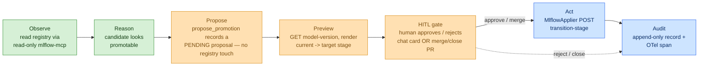

# Iteration 2 (Gated Write + HITL) — The Use Case: Teaching the Pipeline Steward to *Promote* — but Only With Approval

*Audience: Ram (builder). Read this after the [Iteration-1 Pipeline use case](../../iteration-01-read-only/pipeline/01_use_case.md), the [Inference gated-write use case](../inference/01_use_case.md) (the pattern this mirrors), and [ADR-0011](../../../035_others/decisions/0011-no-autonomous-actuation-hitl.md). This is the story of what the gated-write Pipeline Steward actually does, before you open the implementation guide, the tests, or the deployment guide.*

In Iteration 1 the Pipeline Steward learned to *watch the registry*. It could open its eyes on the **MLflow Model Registry**, read every version of `phi-4-mini-meshops`, see which one sat in `Staging` vs `Production`, compare eval accuracies, and reason out loud about whether a candidate *looked* promotable — but if you asked it to actually promote one, it declined. That was the point: before you trust an agent to move a model into production, you make it prove it can read the registry honestly without touching it.

You tested exactly that boundary. You asked *"should we promote v3 from Staging to Production?"* and the steward reasoned through the delta (+0.03 accuracy) but ended with *"I observe and explain … I do not make or propose changes myself."* That refusal is the cliff edge Iteration 1 stopped at. **Iteration 2 is the step off that cliff — with a rope.** Now the same request produces a different ending: the steward says *"here's precisely the transition I'd make; approve it?"*, opens a **pull request** carrying the real dry-run preview, waits, and — only after you **merge** — actually calls the MLflow transition, then tells you it's done and leaves an audit record behind.

> **UC-03 (write half) + UC-10 (the HITL gate) — Pipeline Steward gains gated write**
>
> **Why this slice:** Iteration 1 built the left half of UC-03 (`observe → reason → report`). This iteration builds the right half — `propose → HUMAN APPROVES → act` — which *is* UC-10, the HITL gate. Pipeline is the second steward to graduate (after Inference), because a model promotion is the canonical MLOps decision a human must sign off on.
>
> **Actor:** The `hello-pipeline` agent (Pipeline Steward, MAF Python, on the lab AKS cluster), and — newly first-class — **Ram as the Approver** standing at the gate (here, as a PR reviewer).
>
> **Preconditions:** Everything Iteration 1 required, **plus** (1) the steward's write path enabled (`write_enabled=true`); (2) an MLflow tracking/registry endpoint reachable for **writes** (the `transition-stage` REST call), scoped to the one registered model; (3) for the PR channel: a `GH_TOKEN` (repo scope) and `github.repo` set. · **Depends on:** ADR-0011 (no autonomous actuation), ADR-0004 (MCP is the read tool layer). · **Out of scope:** autonomous/auto-approved promotions; touching any model other than `registered_model_name`; creating/deleting registered models or runs; the Slack approval channel (designed in ADR-0011, not built here).

---

## 1. The one-paragraph version (read this if you read nothing else)

Where we are in the story: Iteration 1 proved the steward can *describe* the registry honestly. Iteration 2 proves it can *change* it — but never on its own, and never beyond one model.

The `hello-pipeline` agent keeps every read-only MLflow tool it had. It gains exactly **one new tool: `propose_promotion`** — and that tool *cannot touch the registry.* When you ask for a transition ("promote v3 to Production", "archive v1", "roll Production back to v2"), the agent calls `propose_promotion`, which merely **records a pending proposal** and returns `PENDING approval`. The steward then shows you a **preview** — the real *"v3: Staging → Production (archive_existing=True). No change made (dry-run)"* — and asks you to **approve or reject** (in chat, or by merging/closing a PR). If you approve, a separate, non-LLM **`MlflowApplier`** performs the write via the MLflow REST API, **hard-bounded to the single registered model** so it *cannot* transition any other model even if wrongly approved. Every step — proposal, your decision, the outcome — is written to an append-only audit. **The model never actuates; deterministic code does, only after you approve.**

**Checkpoint:** You know the shape — same reads, one non-mutating proposal tool, a human gate, a deterministic applier, a single-model bound, an audit line. Next: where this sits inside the full UC-03 loop.

---

## 2. Where This Slice Sits in the Full UC-03

***Figure 1: The full UC-03 loop with Iteration-2 scope. Green = inherited from Iteration 1 (observe/reason). Amber = the proposal + preview + gate (the shared HITL machinery). Blue = deterministic act + audit, reachable only through the gate. The model lives entirely on the left of the gate.***

The colour key is the safety story made visual: everything the **LLM** can reach is left of the gate (amber up to and including `propose_promotion`); everything that **changes the registry** is blue and sits *behind* the gate, reachable only by deterministic code after a human approval. If the model could reach a blue box directly, the gate would be theatre. It can't.

**Checkpoint:** The slice is on the map. Next: the defences that make "allow a promotion" safe.

---

## 3. Why "allow a promotion" is still safe — the four defences

Iteration 1 had no-write layers (read-only MCP, declining prompt). Iteration 2 replaces "no write" with "**no *un-gated* write**" and stands on four defences (ADR-0011 §Decision):

| # | Defence | What it stops |
|---|---|---|
| 1 | **The model has no actuating tool.** Its only write-adjacent tool, `propose_promotion`, records a proposal and returns `PENDING`. | A prompt-injected or over-eager model *cannot* transition anything — there is no code path from the LLM to the registry. |
| 2 | **Deterministic executor + human approval.** Only `MlflowApplier.apply` runs the write, and only after an explicit `approve` (chat) or **PR merge** carrying the proposal's single-use token. | Nothing happens without a human decision recorded against a specific, unaltered proposal. |
| 3 | **Server dry-run preview.** The approver sees the real *current -> target* stage (read back from MLflow) before deciding. | Approving something different from what the model described. |
| 4 | **Single-model bound.** `MlflowApplier` is constructed with `allowed_model` and denies any proposal naming another model — at both preview and apply. | An approved-but-wrong request from *ever* touching a different registered model — the executor itself can't. This is the Pipeline analogue of the Inference steward's namespaced RBAC Role. |

This is why we gate on **scope**, not a verb menu. The steward may propose any transition (`Staging`/`Production`/`Archived`/`None`) on *its* model, and lean on defences 1–4 so that "any transition" is always previewed, always approved, and always bounded to one model.

**Checkpoint:** You see how flexibility and safety coexist. Next: the exact demo you'll run.

---

## 4. The demo that defines "done"

Two flows, both starting from your Iteration-1 test:

**Flow A — approve ("promote v3 to Production"):**
1. You: *"promote phi-4-mini-meshops v3 from Staging to Production; it scores higher."*
2. Steward: calls `propose_promotion`, shows the dry-run preview *"v3: Staging -> Production (archive_existing=True). No change made (dry-run)"*, a proposal id `pw_…`, and (PR channel) a **"Review & merge PR to approve"** link.
3. You: **Merge the PR** (or click Approve in chat).
4. Steward: `MlflowApplier` POSTs `transition-stage`; within a poll cycle the steward reports *"v3 is now in stage Production"* and writes an audit record. v2 is archived.

**Flow B — reject / out-of-scope:**
1. You: **Close** the PR unmerged (or click Reject) -> audited, no change; or
2. The model is coaxed to target a *different* model -> the applier's single-model guard returns **DENIED** and nothing transitions.

**Definition of done:** Flow A transitions v3 *only* after your approval; Flow B never changes the registry; both leave an audit record; and with `write_enabled=false` the steward behaves exactly like its Iteration-1 self (observes, refuses, no proposal tool).

**Checkpoint:** You know what success looks like. The implementation guide (`02_implementation_guide.md`) shows every file that makes it happen.

---

## 5. What this iteration deliberately does *not* do

- **No autonomous or auto-approved promotions.** Every transition waits for a human (ADR-0011). Auto-approval of provably-safe promotions is an Iteration-3 decision.
- **No writes beyond one model's stage.** The applier cannot create/delete models or runs, edit metrics, or touch any other registered model.
- **No Slack approval channel yet.** ADR-0011 designs it; this slice ships the interactive **chat** and asynchronous **GitHub-PR** channels.
- **No bespoke MLflow SDK write wrapper.** Writes go through the documented MLflow REST 2.0 `transition-stage` endpoint.
- **No change to the read-only steward's guarantees.** The read path (mlflow-mcp) and its persona are untouched; the proposal lives in a *separate* schema, reachable only when `write_enabled=true`.
