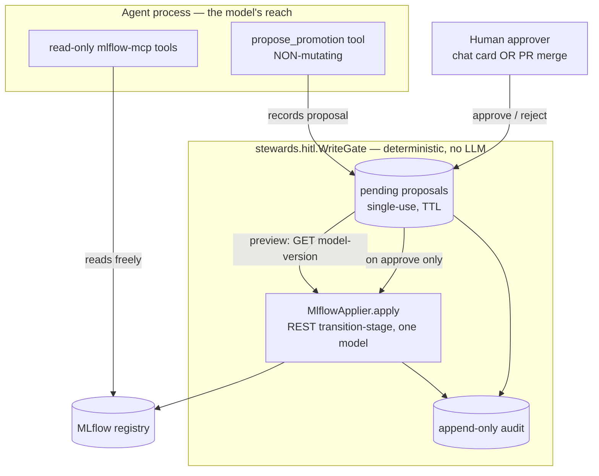

# Iteration 2 (Gated Write + HITL) — Implementation Guide: Every File Behind the Gate (Pipeline)

*Audience: Ram (builder). Read [`01_use_case.md`](01_use_case.md) and [ADR-0011](../../../035_others/decisions/0011-no-autonomous-actuation-hitl.md) first. This guide walks every file added or changed to turn the read-only Pipeline Steward into a gated writer, with the real committed code. It mirrors the [inference gated-write guide](../inference/02_implementation_guide.md) — but the Pipeline steward is the **second** writer, so it reuses a new **shared HITL package** instead of its own copy of the gate.*

## What Iteration 2 adds, in one diagram



The model can reach only the left box. Nothing crosses into `apply` without a human approval. Everything below is how that is built.

## The key architectural decision: a *shared* HITL spine

Inference (the first writer) grew its gate inside `src/stewards/inference/{write_gate,write_tool,approval_channels}.py`. Rather than copy-paste that into pipeline **and** quality, Iteration 2 extracts the domain-agnostic machinery into a new package **`src/stewards/hitl/`**, and each steward supplies only its two domain pieces:

| Layer | Inference (iter-2, original) | **Shared** `stewards.hitl` | Pipeline supplies |
|---|---|---|---|
| Proposal schema | `WriteProposal` (k8s ops) | `Proposal` base (id/rationale/status/preview/…) | `PromotionProposal(model_name, version, to_stage, archive_existing)` |
| Gate | `WriteGate` | **`WriteGate`** (submit/deny/approve/reject, single-use, TTL) | — (reused verbatim) |
| Executor | `KubectlApplier` | `Applier` protocol + `ApplyError(denied)` | `MlflowApplier(tracking_uri, allowed_model)` |
| Channels | `approval_channels.py` | **`channels.py`** (chat no-op + `GitHubPRChannel` + `GhCliClient` + `build_channel`) | — (reused verbatim) |
| HTTP/UI glue | in `serve.py` | **`serve_support.py`** (`ChatRequest`/`ChatReply`, `PROPOSAL_JS`, `poll_loop`, `pending_payload`, `decide`) | — (reused verbatim) |
| The one LLM tool | `propose_write` | — | `propose_promotion` |

The inference steward's own iter-2 files are left **untouched** (zero regression risk to the live steward); a future cleanup can migrate it onto `hitl`.

---

## 1. `src/stewards/hitl/` — the shared, domain-agnostic gate

*Purpose: the executable form of ADR-0011, with **no** Kubernetes/MLflow/Langfuse specifics. Pure Python, no LLM/agent imports, unit-testable in isolation.*

### 1.1 `gate.py` — `Proposal`, `WriteGate`, `Applier`, `AuditSink`

```python
class Proposal(BaseModel):
    id: str = Field("", description="Single-use token, e.g. 'pw_ab12cd34'. Assigned by the gate.")
    rationale: str = Field(..., min_length=10, max_length=800)
    status: ProposalStatus = ProposalStatus.PENDING
    created_at: float = Field(default_factory=time.time)
    preview: str | None = None
    outcome: str | None = None
    session_id: str | None = None
    approver: str | None = None
    external_ref: str | None = None   # PR URL (display)
    external_id: str | None = None    # PR number (the channel polls this)

    # -- subclass contract (a steward overrides these) --
    def human_summary(self) -> str: raise NotImplementedError
    def spec_dict(self) -> dict:     raise NotImplementedError
    def audit_kind(self) -> str:     return type(self).__name__
```

The gate has two proposal-creation paths and two decision paths:

```python
class WriteGate:
    def submit(self, proposal: Proposal) -> Proposal:
        proposal.id = proposal.id or self._token()          # pw_<hex>
        proposal.created_at = self._clock()
        try:
            proposal.preview = self._applier.preview(proposal)   # dry-run ONLY
        except ApplyError as exc:
            proposal.preview = f"(dry-run failed) {exc}"          # keep pending; human judges
        self._store[proposal.id] = proposal
        self._audit_event("proposed", proposal); return proposal

    def deny(self, proposal, reason) -> Proposal:               # domain-guard refusal
        proposal.status = ProposalStatus.DENIED; proposal.outcome = reason
        self._audit_event("denied", proposal); return proposal   # never stored pending

    def approve(self, token, approver) -> Proposal:
        proposal = self._require_pending(token)                 # exists + pending + not expired
        proposal.approver = approver
        try:
            proposal.outcome = self._applier.apply(proposal)    # <-- the ONLY line that mutates
            proposal.status = ProposalStatus.EXECUTED; self._audit_event("executed", proposal)
        except ApplyError as exc:
            proposal.status = ProposalStatus.DENIED if exc.denied else ProposalStatus.FAILED
            proposal.outcome = str(exc); self._audit_event("denied" if exc.denied else "failed", proposal)
        return proposal

    def reject(self, token, approver) -> Proposal:
        proposal = self._require_pending(token)
        proposal.status = ProposalStatus.REJECTED
        proposal.outcome = "rejected by approver; no change made."
        self._audit_event("rejected", proposal); return proposal
```

`_require_pending` raises if a token is unknown, expired, or already terminal — making approval **single-use** and **TTL-bounded**. `pending_for_session` powers the chat card; `pending_all` powers the PR reconcile loop.

**What this buys you:** there is exactly one line in the whole codebase that mutates any substrate — `self._applier.apply(proposal)` inside `approve()`. It cannot run without a prior human `approve` call carrying a live, single-use token. That invariant is now shared by *every* steward, not re-implemented per steward.

### 1.2 `channels.py` — pluggable approval channels (reused verbatim)

`ChatApprovalChannel` (synchronous no-op; the `/approve`,`/reject` endpoints drive the gate) and `GitHubPRChannel` (**merge = approve, close = reject**). `GitHubPRChannel.open` renders the PR body generically from `proposal.human_summary()` + `proposal.spec_dict()`, so it works for a promotion or an annotation with no channel changes. `build_channel(settings, gate)` selects by `write_approval_channel`.

### 1.3 `serve_support.py` + `session.py`

Shared FastAPI models (`ChatRequest`, `ChatReply` with a `pending` field, `DecisionRequest`), the browser proposal-card JS (`PROPOSAL_JS`), the async `poll_loop`, `pending_payload`, and `decide` helper. `session.py` holds `current_session_id` (a `ContextVar`) so a function tool can tag its proposal with the chat session. `PR_CHANNEL_MIN_TTL_SECONDS` = 7 days (async review outlives the chat channel's minutes).

---

## 2. `src/stewards/pipeline/write.py` — the two domain pieces + the one LLM tool

*Purpose: everything MLflow-specific. Supplies the `PromotionProposal`, the `MlflowApplier`, and the non-mutating `propose_promotion` tool.*

### 2.1 `PromotionProposal` — the intent

```python
class PromotionProposal(Proposal):
    model_name: str = Field(..., min_length=1)
    version: int = Field(..., ge=1)
    to_stage: Stage                                   # Literal["Staging","Production","Archived","None"]
    archive_existing: bool = Field(True, ...)         # MLflow's archive_existing_versions

    def human_summary(self) -> str:
        return f"promote {self.model_name} v{self.version} → {self.to_stage}"
    def spec_dict(self) -> dict:
        return {"model_name": ..., "version": ..., "to_stage": ..., "archive_existing": ...}
    def audit_kind(self) -> str:
        return "registry-promotion"
```

### 2.2 `MlflowApplier` — deterministic actuation, bounded to one model

```python
class MlflowApplier:
    def __init__(self, tracking_uri, allowed_model, timeout_seconds=15.0):
        self._base = tracking_uri.rstrip("/") + "/api/2.0/mlflow"
        self._allowed = allowed_model

    def _guard(self, proposal):                        # the hard bound
        if proposal.model_name != self._allowed:
            raise ApplyError(f"model '{proposal.model_name}' is out of scope; "
                             f"only '{self._allowed}' is writable.", denied=True)

    def preview(self, proposal) -> str:                # dry-run: GET the version, render the diff
        self._guard(proposal)
        mv = self._get_version(proposal.model_name, proposal.version)   # GET model-versions/get
        current = mv.get("current_stage", "unknown")
        return (f"model-version {proposal.model_name} v{proposal.version}: "
                f"{current} → {proposal.to_stage} (archive_existing={proposal.archive_existing}). "
                f"No change made (dry-run).")

    def apply(self, proposal) -> str:                  # POST model-versions/transition-stage
        self._guard(proposal)
        body = {"name": proposal.model_name, "version": str(proposal.version),
                "stage": proposal.to_stage, "archive_existing_versions": proposal.archive_existing}
        # ... httpx.Client POST; 401/403 -> ApplyError(denied=True) ...
        return f"{proposal.model_name} v{proposal.version} is now in stage {stage}"
```

**What this buys you:** the write is a single documented REST call, run by *deterministic code*. `_guard` runs at **both** preview and apply, so the single-model bound is the hard cap on blast radius — the Pipeline analogue of the inference steward's namespaced RBAC Role. `preview` reads the *real* current stage back from MLflow so the human sees the true diff. Auth failures become a first-class `denied` outcome, not a crash.

### 2.3 `propose_promotion` — the one tool the LLM may hold

```python
def build_propose_promotion_tool(gate: WriteGate, allowed_model: str):
    def propose_promotion(version, to_stage, rationale, archive_existing=True) -> str:
        """Propose promoting a model version to a new registry stage. Does NOT execute. ..."""
        if to_stage not in _VALID_STAGES:
            return f"PROPOSAL REJECTED (not recorded): to_stage must be one of ..."
        proposal = PromotionProposal(model_name=allowed_model, version=version, to_stage=to_stage,
                                     archive_existing=archive_existing, rationale=rationale,
                                     session_id=current_session_id.get())
        proposal = gate.submit(proposal)
        if proposal.status == ProposalStatus.DENIED:
            return f"PROPOSAL DENIED: {proposal.outcome} No change was or will be made."
        return (f"PROPOSAL {proposal.id} recorded and is PENDING human approval — nothing has been "
                f"changed.\nIntent: {proposal.human_summary()}\n... Do NOT say it is done.")
    return propose_promotion
```

**What this buys you:** the model's *only* write-adjacent capability is a function whose worst case is "record a row and return a string." **`model_name` is fixed to `allowed_model` inside the closure** — the LLM literally cannot name a different model. The `ContextVar` carries the chat session id so the proposal surfaces as the right approval card.

---

## 3. `src/stewards/pipeline/serve.py` — wiring the gate into chat

*Purpose: when `write_enabled`, load the gated-write persona, hand the agent `propose_promotion`, build the gate + channel, and add the decision endpoints + poll loop. When not, behave exactly as Iteration 1.*

```python
tools: list[Any] = [mlflow_tool]
if settings.write_enabled:
    ttl = settings.write_proposal_ttl_seconds
    if settings.write_approval_channel == "github_pr":
        ttl = max(ttl, PR_CHANNEL_MIN_TTL_SECONDS)
    gate = WriteGate(MlflowApplier(settings.mlflow_tracking_uri, settings.registered_model_name),
                     ttl_seconds=ttl)
    channel = build_channel(settings, gate)
    tools.append(build_propose_promotion_tool(gate, settings.registered_model_name))
    persona = agent_module._read_prompt("pipeline-steward.gated-write.chat.md")
    LOG.info("[chat] WRITE-ENABLED: HITL gate armed for model '%s' via '%s' channel",
             settings.registered_model_name, channel.name)
    if channel.name == "github_pr":
        state["poll_task"] = asyncio.create_task(poll_loop(channel, gate, settings.github_poll_seconds))
else:
    gate = None; channel = None
    persona = agent_module._read_prompt("pipeline-steward.chat.md")
```

The `/chat` endpoint sets the session `ContextVar` around `agent.run`, then attaches `pending_payload(gate, session_id)` to the reply so the browser renders the approval card (chat channel) or the "Review & merge PR" link (PR channel). `/approve`, `/reject`, and `/reconcile` call the shared `decide`/`poll_loop`.

**What this buys you:** the two-turn HITL loop works in a stateless chat, and the read-only deployment is provably unaffected because every write branch is behind `if settings.write_enabled`. The startup log line is your one-glance proof the gate is armed.

---

## 4. `src/stewards/pipeline/settings.py` — the capability flag + bounds

```python
write_enabled: bool = Field(False, description="Enable propose -> HITL approve -> act. Off = read-only.")
write_proposal_ttl_seconds: int = Field(900, ge=30, ...)
write_approval_channel: str = Field("chat", description="'chat' or 'github_pr'.")
github_repo: str = Field("", ...); github_base_branch: str = Field("main", ...)
github_proposals_dir: str = Field("hitl-proposals", ...); github_poll_seconds: int = Field(20, ge=5, ...)
```

Note there is **no** `write_namespace`/`kubectl_binary` (those are k8s-specific to inference). The MLflow endpoint reuses the existing `mlflow_tracking_uri`, and the write bound is `registered_model_name` — both already present for the read path. **Enabling write adds no new substrate; it only makes the gate reachable.**

---

## 5. `prompts/pipeline-steward.gated-write.chat.md` — the propose-only persona

*Purpose: instruct the steward that reads are free, every promotion goes through `propose_promotion`, and it must never claim a transition is done before approval.*

Key clauses: *"you may **propose one kind of change — a model-version stage transition (promotion)** — but **every promotion requires a human's approval at the gate before it happens.** You never transition a version yourself."* The identity/voice/read-scope sections are inherited verbatim from the read-only persona (v1.1.0).

**What this buys you:** the prompt is the *second* defence (after "no actuating tool"), aligning the model's behaviour with the structural gate so the conversation reads honestly.

---

## 6. `helm/pipeline/{values.yaml, templates/deployment.yaml}` — deploy-time flag

```yaml
# values.yaml
writeEnabled: false
writeProposalTtlSeconds: 900
writeApprovalChannel: chat
github:
  repo: ""
  baseBranch: main
  proposalsDir: hitl-proposals
  pollSeconds: 20
```

`deployment.yaml` adds, all conditional on `writeEnabled`: the gated-write persona ConfigMap key, and the `WRITE_ENABLED`/`WRITE_PROPOSAL_TTL_SECONDS`/`WRITE_APPROVAL_CHANNEL`/`GITHUB_*` env; the `github_pr` block (incl. `GH_TOKEN` from the `github-token` Secret + `GH_CONFIG_DIR`) is further gated by `{{- if eq .Values.writeApprovalChannel "github_pr" }}`. **No** `write-rbac.yaml` is needed — writes go to MLflow over HTTP, bounded by the scoped model, not by a k8s Role.

**What this buys you:** `helm template` with the flag off renders **zero** write surface; with it on (chat or github_pr) the persona + env all appear together. Verified with `helm lint` + `helm template` both ways.

---

## File → Purpose map

| File | Purpose |
|---|---|
| `src/stewards/hitl/gate.py` | shared `Proposal`/`WriteGate`/`Applier`/`AuditSink` (single-use, TTL) |
| `src/stewards/hitl/channels.py` | shared chat no-op + `GitHubPRChannel` + `GhCliClient` + `build_channel` |
| `src/stewards/hitl/serve_support.py`, `session.py` | shared FastAPI models, proposal-card JS, poll loop, session ContextVar |
| `src/stewards/pipeline/write.py` | `PromotionProposal` + `MlflowApplier` (one-model bound) + `propose_promotion` |
| `src/stewards/pipeline/serve.py` | flag-gated wiring, `/approve` + `/reject` + `/reconcile`, poll loop, cards / PR links |
| `src/stewards/pipeline/settings.py` | `write_enabled` + TTL + channel + `github_*` |
| `prompts/pipeline-steward.gated-write.chat.md` | propose-only persona (Iteration 2) |
| `helm/pipeline/values.yaml`, `templates/deployment.yaml` | deploy-time flag, env (incl. `GH_TOKEN`), persona ConfigMap |
| `tests/unit/test_hitl_gate.py` | 20 tests — gate invariants, PR channel, **both** domain appliers/tools |

## Limitations / next

- **Approval identity** is `"operator (chat)"` for the chat channel; the GitHub-PR channel records the **PR merger's login**.
- **Audit sink** is the logging default; the immutable Azure Storage sink is a follow-up (the `AuditSink` protocol is ready).
- **`gh` CLI + `GH_TOKEN`** (repo scope) are required in the pod only for the GitHub-PR channel; the single `Dockerfile` already bakes `gh` for all stewards.
- A future cleanup can migrate the inference steward onto `stewards.hitl` (today it keeps its own copy for zero-regression).

## Sources

- Repo: `src/stewards/hitl/*.py`, `src/stewards/pipeline/{write,serve,settings}.py`, `prompts/pipeline-steward.gated-write.chat.md`, `helm/pipeline/{values.yaml,templates/deployment.yaml}`, `tests/unit/test_hitl_gate.py`.
- [ADR-0011 — no autonomous actuation](../../../035_others/decisions/0011-no-autonomous-actuation-hitl.md); [ADR-0004 — MCP as the tool layer](../../../035_others/decisions/0004-mcp-as-tool-layer.md).
- [MLflow Model Registry REST — transition-stage](https://mlflow.org/docs/latest/rest-api.html#transition-modelversion-stage).
