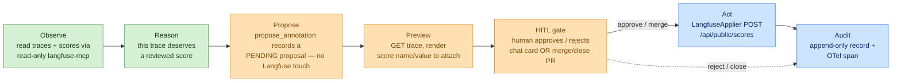

# Iteration 2 (Gated Write + HITL) — The Use Case: Teaching the Quality Steward to *Annotate* — but Only With Approval

*Audience: Ram (builder). Read this after the [Iteration-1 Quality use case](../../iteration-01-read-only/quality/01_use_case.md), the [Inference gated-write use case](../inference/01_use_case.md) (the pattern this mirrors), and [ADR-0011](../../../035_others/decisions/0011-no-autonomous-actuation-hitl.md). This is the story of what the gated-write Quality Steward actually does, before you open the implementation guide, the tests, or the deployment guide.*

In Iteration 1 the Quality Steward learned to *watch the traces*. It could open its eyes on the **Langfuse** project, read recent LLM traces and their eval scores (`relevance`, `faithfulness`), spot a downward drift, and reason out loud about whether output quality was healthy — but if you asked it to actually *record* a judgement, it declined. That was the point: before you trust an agent to write scores that downstream systems weigh, you make it prove it can read the evidence honestly without touching it.

You tested exactly that boundary. You asked it to summarize scores, flag low-scoring traces, and say what backs the production model — and it did, but it always ended on *"I do not take action — I simply monitor and report."* That refusal is the cliff edge Iteration 1 stopped at. **Iteration 2 is the step off that cliff — with a rope.** Now, when a human reviewer decides a specific trace deserves a recorded judgement ("this answer is poorly grounded — log a `human_review` of 0.2"), the same steward says *"here's precisely the score I'd attach; approve it?"*, opens a **pull request** carrying the real dry-run preview, waits, and — only after you **merge** — actually writes the score to Langfuse, then tells you it's done and leaves an audit record behind.

> **UC-10 (the HITL gate) applied to quality write-back — Quality Steward gains gated write**
>
> **Why this slice:** Iteration 1 built the observe/reason half of the quality loop. This iteration builds the write-back half — `propose → HUMAN APPROVES → act` — which *is* UC-10, the HITL gate. Quality is the third steward to graduate (after Inference and Pipeline). Its one mutation — a reviewed score next to the evidence — closes the loop the Pipeline steward reads from when it reasons about a promotion.
>
> **Actor:** The `hello-quality` agent (Quality Steward, MAF Python, on the lab AKS cluster), and — newly first-class — **Ram as the Approver / reviewer** standing at the gate.
>
> **Preconditions:** Everything Iteration 1 required, **plus** (1) the steward's write path enabled (`write_enabled=true`); (2) Langfuse reachable for **writes** (`POST /api/public/scores`) with the project's public/secret key pair (already used for reads); (3) for the PR channel: a `GH_TOKEN` (repo scope) and `github.repo` set. · **Depends on:** ADR-0011 (no autonomous actuation), ADR-0004 (MCP is the read tool layer). · **Out of scope:** autonomous/auto-approved scoring; deleting traces/scores; editing prompts, datasets, or any other Langfuse object; writing to a different project than the credentials scope; the Slack approval channel.

---

## 1. The one-paragraph version (read this if you read nothing else)

Where we are in the story: Iteration 1 proved the steward can *describe* quality honestly. Iteration 2 proves it can *record a reviewed judgement* — but never on its own, and never beyond one score on one trace.

The `hello-quality` agent keeps every read-only Langfuse tool it had. It gains exactly **one new tool: `propose_annotation`** — and that tool *cannot touch Langfuse.* When a reviewer asks to flag/rate a specific trace ("attach `human_review`=0.2 to trace `abc…`"), the agent calls `propose_annotation`, which merely **records a pending proposal** and returns `PENDING approval`. The steward then shows you a **preview** — the real *"trace abc… (pipeline.steward.chat): will attach NUMERIC score 'human_review'=0.2. No change made (dry-run)"* — and asks you to **approve or reject** (in chat, or by merging/closing a PR). If you approve, a separate, non-LLM **`LangfuseApplier`** performs the write via the Langfuse public API, **bounded by the project's Basic-auth credentials** so it *cannot* write outside that one project. Every step — proposal, your decision, the outcome — is written to an append-only audit. **The model never actuates; deterministic code does, only after you approve.**

**Checkpoint:** You know the shape — same reads, one non-mutating proposal tool, a human gate, a deterministic applier, a project-scoped bound, an audit line. Next: where this sits in the quality loop.

---

## 2. Where This Slice Sits in the Quality Loop

***Figure 1: The quality write-back loop with Iteration-2 scope. Green = inherited from Iteration 1 (observe/reason). Amber = the proposal + preview + gate (the shared HITL machinery). Blue = deterministic act + audit, reachable only through the gate. The model lives entirely on the left of the gate.***

Everything the **LLM** can reach is left of the gate (amber up to and including `propose_annotation`); everything that **writes to Langfuse** is blue and sits *behind* the gate, reachable only by deterministic code after a human approval.

**Checkpoint:** The slice is on the map. Next: the defences that make "allow a score write" safe.

---

## 3. Why "allow a score write" is still safe — the four defences

| # | Defence | What it stops |
|---|---|---|
| 1 | **The model has no actuating tool.** Its only write-adjacent tool, `propose_annotation`, records a proposal and returns `PENDING`. | A prompt-injected or over-eager model *cannot* write a score — there is no code path from the LLM to Langfuse. |
| 2 | **Deterministic executor + human approval.** Only `LangfuseApplier.apply` runs the write, and only after an explicit `approve` (chat) or **PR merge** carrying the proposal's single-use token. | Nothing happens without a human decision recorded against a specific, unaltered proposal. |
| 3 | **Server dry-run preview.** The approver sees the real trace (read back from Langfuse) and the exact score to be attached before deciding. | Approving a score on the wrong trace, or a value different from what the model described. |
| 4 | **Project-scoped credential + value bound.** `LangfuseApplier` authenticates with the project's public/secret key, so it can only write into that one project; and `AnnotationProposal.score_value` is validated to `0.0–1.0`. | An approved-but-wrong request from *ever* writing outside the project or an out-of-range value — the credential/schema won't allow it. This is the Quality analogue of the Inference steward's namespaced RBAC Role. |

We gate on **scope**, not a verb menu: the steward may propose any numeric score on any trace *in its project*, and defences 1–4 keep "any score" previewed, approved, and bounded.

**Checkpoint:** Next: the exact demo you'll run.

---

## 4. The demo that defines "done"

**Flow A — approve ("flag this low-quality trace"):**
1. You: *"attach a faithfulness score of 0.55 to the most recent trace — it's poorly grounded."*
2. Steward: calls `propose_annotation`, shows the dry-run preview *"trace d214… : will attach NUMERIC score 'faithfulness'=0.55. No change made (dry-run)"*, a proposal id `pw_…`, and (PR channel) a **"Review & merge PR to approve"** link.
3. You: **Merge the PR** (or click Approve in chat).
4. Steward: `LangfuseApplier` POSTs the score; the steward reports *"score 'faithfulness'=0.55 attached to trace d214… (score id …)"* and writes an audit record. The score now shows on that trace in Langfuse.

**Flow B — reject / bad input:**
1. You: **Close** the PR unmerged (or click Reject) → audited, no change; or
2. The model is coaxed to a value outside 0.0–1.0 → the proposal is **rejected before it's recorded** and nothing is written.

**Definition of done:** Flow A writes the score *only* after your approval; Flow B never changes Langfuse; both leave an audit record; and with `write_enabled=false` the steward behaves exactly like its Iteration-1 self (observes, refuses, no proposal tool).

---

## 5. What this iteration deliberately does *not* do

- **No autonomous or auto-approved scoring.** Every annotation waits for a human (ADR-0011).
- **No writes beyond one numeric score on one trace.** The applier cannot delete traces/scores, edit prompts/datasets, or write to another project.
- **No Slack approval channel yet.** ADR-0011 designs it; this slice ships the interactive **chat** and asynchronous **GitHub-PR** channels.
- **No bespoke Langfuse SDK write wrapper.** Writes go through the documented Langfuse public REST endpoint (`POST /api/public/scores`).
- **No change to the read-only steward's guarantees.** The read path (langfuse-mcp) and its persona are untouched; the proposal lives in a *separate* schema, reachable only when `write_enabled=true`.
