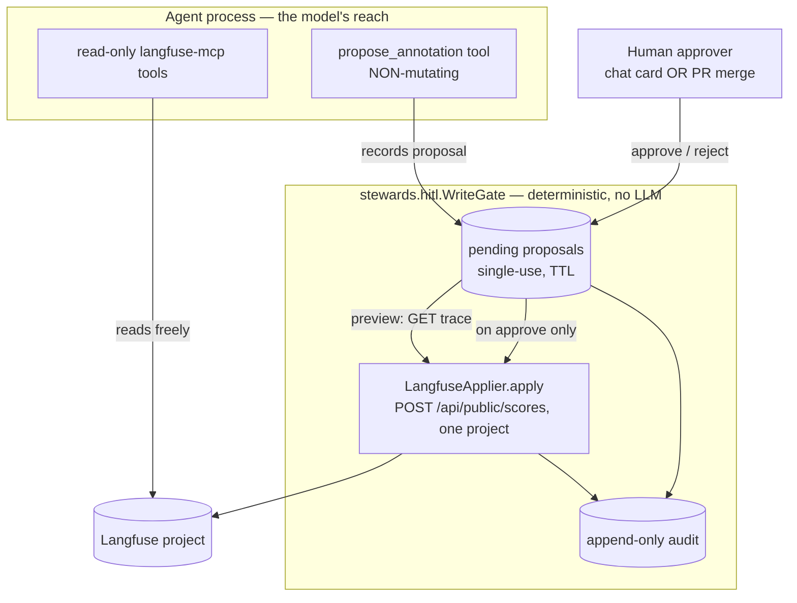

# Iteration 2 (Gated Write + HITL) — Implementation Guide: Every File Behind the Gate (Quality)

*Audience: Ram (builder). Read [`01_use_case.md`](01_use_case.md) and [ADR-0011](../../../035_others/decisions/0011-no-autonomous-actuation-hitl.md) first. This guide walks every file added or changed to turn the read-only Quality Steward into a gated writer, with the real committed code. It mirrors the [inference gated-write guide](../inference/02_implementation_guide.md), and — like the [pipeline guide](../pipeline/02_implementation_guide.md) — it reuses the **shared HITL package** rather than its own copy of the gate.*

## What Iteration 2 adds, in one diagram



The model can reach only the left box. Nothing crosses into `apply` without a human approval.

## The shared HITL spine (same as pipeline)

Quality is the **third** writer, so — exactly like pipeline — it reuses `src/stewards/hitl/` (the domain-agnostic `Proposal`/`WriteGate`/`Applier`/`AuditSink`, `channels.py`, `serve_support.py`, `session.py`) and supplies only its two domain pieces. See the [pipeline implementation guide §1](../pipeline/02_implementation_guide.md) for the full `hitl` package walkthrough — it is identical here. This guide focuses on the Quality-specific code.

| Layer | **Shared** `stewards.hitl` | Quality supplies |
|---|---|---|
| Proposal schema | `Proposal` base | `AnnotationProposal(trace_id, score_name, score_value, comment)` |
| Gate | `WriteGate` (submit/deny/approve/reject, single-use, TTL) | — (reused verbatim) |
| Executor | `Applier` protocol + `ApplyError(denied)` | `LangfuseApplier(host, public_key, secret_key)` |
| Channels / UI glue | `channels.py` + `serve_support.py` | — (reused verbatim) |
| The one LLM tool | — | `propose_annotation` |

---

## 1. `src/stewards/quality/write.py` — the two domain pieces + the one LLM tool

### 1.1 `AnnotationProposal` — the intent

```python
class AnnotationProposal(Proposal):
    trace_id: str = Field(..., min_length=8)
    score_name: str = Field(..., min_length=1, max_length=64)
    score_value: float = Field(..., ge=0.0, le=1.0)          # value bound
    comment: str | None = Field(None, max_length=500)

    def human_summary(self) -> str:
        return f"annotate trace {self.trace_id[:12]}… with {self.score_name}={self.score_value}"
    def spec_dict(self) -> dict:
        return {"trace_id": ..., "score_name": ..., "score_value": ..., "comment": ...}
    def audit_kind(self) -> str:
        return "trace-annotation"
```

**What this buys you:** the `score_value` bound (`0.0–1.0`) and `trace_id` min-length are enforced by Pydantic *before* a proposal is ever recorded — a malformed intent is rejected at the tool boundary, never reaching a human or Langfuse.

### 1.2 `LangfuseApplier` — deterministic actuation, project-scoped

```python
class LangfuseApplier:
    def __init__(self, host, public_key, secret_key, timeout_seconds=15.0):
        self._base = host.rstrip("/") + "/api/public"
        self._auth = httpx.BasicAuth(public_key, secret_key)     # scopes to ONE project

    def preview(self, proposal) -> str:                          # dry-run: GET the trace
        trace = self._get_trace(proposal.trace_id)               # 404 -> ApplyError; 401/403 -> denied
        return (f"trace {proposal.trace_id} ({trace.get('name','?')}): will attach NUMERIC score "
                f"'{proposal.score_name}'={proposal.score_value}. No change made (dry-run).")

    def apply(self, proposal) -> str:                            # POST /api/public/scores
        body = {"traceId": proposal.trace_id, "name": proposal.score_name,
                "value": proposal.score_value, "dataType": "NUMERIC"}
        if proposal.comment: body["comment"] = proposal.comment
        # ... httpx.Client(auth=self._auth) POST; 401/403 -> ApplyError(denied=True) ...
        return f"score '{proposal.score_name}'={proposal.score_value} attached to trace {proposal.trace_id} (score id {score_id})"
```

**What this buys you:** the write is a single documented REST call, run by *deterministic code* under the project's Basic-auth credentials — which are the hard cap on blast radius (the Quality analogue of a namespaced RBAC Role). `preview` reads the *real* trace back so the approver confirms the right target. A `404` becomes a clean "trace not found"; `401/403` becomes a first-class `denied` outcome, not a crash.

### 1.3 `propose_annotation` — the one tool the LLM may hold

```python
def build_propose_annotation_tool(gate: WriteGate):
    def propose_annotation(trace_id, score_name, score_value, rationale, comment=None) -> str:
        """Propose attaching a numeric eval score to a trace. Does NOT execute. ..."""
        try:
            proposal = AnnotationProposal(trace_id=trace_id, score_name=score_name,
                                          score_value=score_value, comment=comment,
                                          rationale=rationale, session_id=current_session_id.get())
        except Exception as exc:                                  # schema violation (e.g. value > 1.0)
            return f"PROPOSAL REJECTED (not recorded): {exc}"
        proposal = gate.submit(proposal)
        if proposal.status == ProposalStatus.DENIED:
            return f"PROPOSAL DENIED: {proposal.outcome} No change was or will be made."
        return (f"PROPOSAL {proposal.id} recorded and is PENDING human approval — nothing has been "
                f"changed.\nIntent: {proposal.human_summary()}\n... Do NOT say it is done.")
    return propose_annotation
```

**What this buys you:** the model's *only* write-adjacent capability is a function whose worst case is "record a row and return a string." An out-of-range value (`score_value > 1.0`) is caught by the `AnnotationProposal` validator and returned as `PROPOSAL REJECTED (not recorded)` — never stored, never approvable.

---

## 2. `src/stewards/quality/serve.py` — wiring the gate into chat

*Purpose: when `write_enabled`, load the gated-write persona, hand the agent `propose_annotation`, build the gate + channel, and add the decision endpoints + poll loop. When not, behave exactly as Iteration 1.*

```python
tools: list[Any] = [langfuse_tool]
if settings.write_enabled:
    ttl = settings.write_proposal_ttl_seconds
    if settings.write_approval_channel == "github_pr":
        ttl = max(ttl, PR_CHANNEL_MIN_TTL_SECONDS)
    gate = WriteGate(LangfuseApplier(settings.langfuse_host, settings.langfuse_public_key,
                                     settings.langfuse_secret_key), ttl_seconds=ttl)
    channel = build_channel(settings, gate)
    tools.append(build_propose_annotation_tool(gate))
    persona = agent_module._read_prompt("quality-steward.gated-write.chat.md")
    LOG.info("[chat] WRITE-ENABLED: HITL gate armed for Langfuse annotations via '%s' channel",
             channel.name)
    if channel.name == "github_pr":
        state["poll_task"] = asyncio.create_task(poll_loop(channel, gate, settings.github_poll_seconds))
else:
    gate = None; channel = None
    persona = agent_module._read_prompt("quality-steward.chat.md")
```

The `/chat`, `/approve`, `/reject`, `/reconcile` wiring is identical to pipeline (shared `serve_support`). The read-only deployment is provably unaffected because every write branch is behind `if settings.write_enabled`.

---

## 3. `src/stewards/quality/settings.py` — the capability flag + bounds

```python
write_enabled: bool = Field(False, ...)
write_proposal_ttl_seconds: int = Field(900, ge=30, ...)
write_approval_channel: str = Field("chat", description="'chat' or 'github_pr'.")
github_repo / github_base_branch / github_proposals_dir / github_poll_seconds  # same as pipeline
```

The Langfuse write reuses the existing `langfuse_host` + `langfuse_public_key` + `langfuse_secret_key` (already present for the read path and pulled from Key Vault via CSI). **Enabling write adds no new substrate or credential; it only makes the gate reachable.**

---

## 4. `prompts/quality-steward.gated-write.chat.md` — the propose-only persona

Key clauses: *"you may **propose one kind of change — attaching a numeric evaluation score to a specific trace (a human-review annotation)** — but **every annotation requires a human's approval at the gate before it happens.** You never write a score yourself."* Identity/voice/read-scope inherited verbatim from the read-only persona (v1.1.0).

---

## 5. `helm/quality/{values.yaml, templates/deployment.yaml}` — deploy-time flag

```yaml
# values.yaml
writeEnabled: false
writeProposalTtlSeconds: 900
writeApprovalChannel: chat
github: { repo: "", baseBranch: main, proposalsDir: hitl-proposals, pollSeconds: 20 }
```

`deployment.yaml` adds (all conditional on `writeEnabled`): the gated-write persona ConfigMap key and `WRITE_*`/`GITHUB_*` env; the `github_pr` block (incl. `GH_TOKEN` from the `github-token` Secret + `GH_CONFIG_DIR`) is further gated by `writeApprovalChannel == "github_pr"`. The Langfuse write credentials (`LANGFUSE_PUBLIC_KEY`/`LANGFUSE_SECRET_KEY`) are already wired for the read path. **No** `write-rbac.yaml` — writes go to Langfuse over HTTP, bounded by the project credential.

---

## File → Purpose map

| File | Purpose |
|---|---|
| `src/stewards/hitl/*` | shared gate/channels/serve_support/session (see [pipeline guide §1](../pipeline/02_implementation_guide.md)) |
| `src/stewards/quality/write.py` | `AnnotationProposal` + `LangfuseApplier` (project-scoped) + `propose_annotation` |
| `src/stewards/quality/serve.py` | flag-gated wiring, `/approve` + `/reject` + `/reconcile`, poll loop, cards / PR links |
| `src/stewards/quality/settings.py` | `write_enabled` + TTL + channel + `github_*` |
| `prompts/quality-steward.gated-write.chat.md` | propose-only persona (Iteration 2) |
| `helm/quality/values.yaml`, `templates/deployment.yaml` | deploy-time flag, env (incl. `GH_TOKEN`), persona ConfigMap |
| `tests/unit/test_hitl_gate.py` | 20 tests — gate invariants, PR channel, **both** domain appliers/tools |

## Limitations / next

- **Approval identity**: `operator (chat)` (chat) or the **PR merger's login** (github_pr).
- **Audit sink** is the logging default (`kind":"trace-annotation"`); immutable Azure Storage is a follow-up.
- **`gh` CLI + `GH_TOKEN`** required in the pod only for the github_pr channel (the single `Dockerfile` bakes `gh` for all stewards).

## Sources

- Repo: `src/stewards/hitl/*.py`, `src/stewards/quality/{write,serve,settings}.py`, `prompts/quality-steward.gated-write.chat.md`, `helm/quality/{values.yaml,templates/deployment.yaml}`, `tests/unit/test_hitl_gate.py`.
- [ADR-0011 — no autonomous actuation](../../../035_others/decisions/0011-no-autonomous-actuation-hitl.md); [ADR-0004 — MCP as the tool layer](../../../035_others/decisions/0004-mcp-as-tool-layer.md).
- [Langfuse public API — scores](https://langfuse.com/docs/api).
