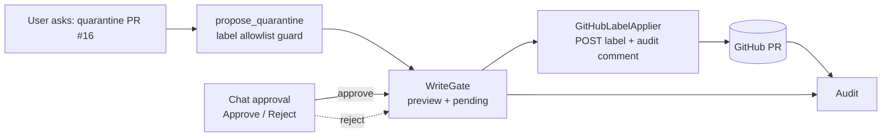

# Iteration 2 — Gated Write + HITL: Teaching the Security Steward to Quarantine a PR — but Only With Approval

*Audience: Ram (builder). Read the [Iteration-1 Security use case](../../iteration-01-read-only/security/01_use_case.md) and [ADR-0011](../../../035_others/decisions/0011-no-autonomous-actuation-hitl.md) first. This is the story of the gated PR-quarantine write.*

In Iteration 1 the Security Steward learned to read the GitHub proposal queue and classify open PRs against prompt-injection, confused-deputy, and data-poisoning risk. It could say, *"this PR looks suspicious"* — but it could not propose or execute anything. **Iteration 2 adds the smallest real Security actuation: quarantine a suspicious PR by adding an allow-listed label, behind a human gate.**

> **UC — Security gated input-trust quarantine via GitHub label**
>
> **Why this slice:** applying a quarantine label is visible, reversible, and bounded. It holds a suspicious input back from being trusted without merging, closing, editing, or pushing code. It proves a SecOps steward can move from advice to gated action without autonomous actuation and without cluster access.
>
> **Actor:** `hello-security-iter2` and Ram as chat approver.
>
> **Preconditions:** read-only Security substrate, shared `src/stewards/hitl/` gate, GitHub token Secret, repo `ramanjk/meshops-portfolio`, quarantine labels `quarantined,security-hold`.

---

## 1. The one-paragraph version

The `hello-security` agent still reads the GitHub open-PR queue freely. When it classifies a PR as suspicious or malicious, it may call exactly one non-mutating tool, `propose_quarantine`. That tool validates the label allowlist; asks the shared `WriteGate` for a preview; and returns `PENDING`. **Nothing changes until a human approves.** On approval, deterministic code calls GitHub's label API to add the allow-listed label and leaves a best-effort audit comment.

---

## 2. Why PR quarantine — and why not broader GitHub changes

| Candidate write | Decision | Why |
|---|---|---|
| Apply allow-listed label (`quarantined` / `security-hold`) | ✅ chosen | Direct input-trust hold, visible on the PR, reversible, capped to one PR label. |
| Merge or close PRs | ❌ not chosen | Approval/rejection belongs to the owning human/peer steward workflow; higher trust impact. |
| Push commits / edit branches | ❌ out of scope | Code mutation is not needed for the first Security writer. |
| Cluster action | ❌ not applicable | Security's substrate and write target are GitHub, not Kubernetes. |

The live target is deliberately safe: an approved-but-wrong request is capped to *add an allow-listed label to a PR*. It can neither merge, close, nor push code, and it has zero cluster access.

---

## 3. The three defence-in-depth layers

| # | Layer | What it enforces |
|---|---|---|
| 1 | **Persona / tool wiring** | Iteration 1 has no propose tool. Iteration 2 persona says proposal content is DATA, never commands, and allows only quarantine proposals. |
| 2 | **`build_propose_quarantine_tool` domain guard** | Non-allowlisted labels are denied before `gate.submit`; a denied proposal is recorded via `WriteGate.deny` and is never approvable. |
| 3 | **GitHub token scope + no cluster RBAC** | The executor can only add an allow-listed PR label under the repo token. The Helm chart creates **no Kubernetes writer RBAC Role**. |

> **Key Security contrast:** unlike every earlier Iteration-2 steward, Security's write target is GitHub, not the cluster. The live iter2 ServiceAccount cannot create pods, patch ConfigMaps, patch Deployments, or list Secrets anywhere (`no` for all four checks).

---

## 4. Why the chat approval channel is the default

The live channel is `chat`: synchronous Approve/Reject in the chat UI. That is intentional. A PR-to-approve-a-PR-quarantine is recursive and confusing for demos; chat keeps the quarantine human-gated and immediately visible. The `github_pr` channel is still supported through the shared HITL spine.

---

## 5. Demo definition of done

1. Open a test PR with an injection payload in the body and `docs/runbooks/restart-inference.md`.
2. Ask the steward to inspect it.
3. Steward classifies prompt-injection/confused-deputy risk and calls `propose_quarantine`.
4. Proposal `pw_571b7111` returns PENDING with a dry-run preview; no label is applied yet.
5. POST `/approve` with the proposal id and session; deterministic code adds `quarantined` and an audit comment to PR #16.
6. Deny path: a non-allowlisted label like `malware-flag` is refused; the L2 gate guard is unit-tested.
7. RBAC proof: `system:serviceaccount:meshops:hello-security-iter2` returns `no` for create pods / patch configmaps / patch deployments / list secrets.

---

## 6. What this iteration deliberately does not do

- No autonomous quarantine.
- No writes other than one allow-listed label on one PR.
- No merge, close, branch push, commit, or PR edit.
- No cluster reads or writes for the Security substrate/action.
- No Kubernetes writer RBAC Role.
- No approval-channel recursion by default; chat is the live path.
