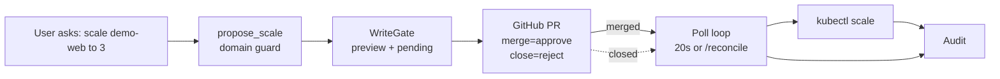

# Iteration 2 (Gated Write + HITL) — The Use Case: Teaching the SRE Steward to Scale — but Only With Approval

*Audience: Ram (builder). Read the [Iteration-1 SRE use case](../../iteration-01-read-only/sre/01_use_case.md) and [ADR-0011](../../../035_others/decisions/0011-no-autonomous-actuation-hitl.md) first. This is the story of the gated Deployment-scale write.*

In Iteration 1 the SRE Steward learned to correlate Prometheus metrics, AKS state, and Langfuse traces into an incident picture. It could say, *"this looks like saturation; a human should consider scaling"* — but it could not propose or execute anything. **Iteration 2 adds the smallest real SRE actuation: scale a Deployment's replica count, behind a human gate.**

> **UC — SRE gated remediation via Deployment scale**
>
> **Why this slice:** scaling a Deployment is a real, common SRE remediation. It is visible, reversible, low-cost in the lab, and bounded by namespace/RBAC. It proves the correlation steward can move from advice to gated action without autonomous actuation.
>
> **Actor:** `hello-sre-iter2` and Ram as PR approver.
>
> **Preconditions:** read-only SRE substrates, shared `src/stewards/hitl/` gate, GitHub token Secret, demo target `Deployment/demo-web` in namespace `meshops-workloads`.

---

## 1. The one-paragraph version

The `hello-sre` agent still reads Prometheus, AKS, and Langfuse freely. When asked to scale an allowed Deployment, it may call exactly one non-mutating tool, `propose_scale`. That tool validates namespace, deployment allowlist, and replica bounds; asks the shared `WriteGate` for a preview; opens a GitHub PR; and returns `PENDING`. **Nothing changes until a human merges the PR.** The in-pod poll loop reconciles the merge and deterministic code runs `kubectl scale` under the steward ServiceAccount.

---

## 2. Why Deployment scale — and why not KAITO Workspace count

| Candidate write | Decision | Why |
|---|---|---|
| Kubernetes Deployment replica scale | ✅ chosen | Clean SRE remediation, reversible, visible in `kubectl get deploy`, supported by `kubectl scale`. |
| KAITO Workspace `resource.count` | ❌ not chosen | `resource.count` is immutable on a Workspace; the admission webhook `validation.workspace.kaito.sh` denies count changes. |
| Restart/delete/patch pods | ❌ out of scope | Higher blast radius and less clean as a first writer. |

The demo target is deliberately safe: `Deployment/demo-web` in `meshops-workloads`, normally `1` replica, defined in `helm/sre/extras/demo-workload.yaml`.

---

## 3. The three defence-in-depth layers

| # | Layer | What it enforces |
|---|---|---|
| 1 | **Persona / tool wiring** | Iteration 1 has no propose tool. Iteration 2 persona says the steward may propose only Deployment scale and must never claim execution. |
| 2 | **`build_propose_scale_tool` domain guard** | Out-of-scope namespace, non-allowlisted deployment, or replica count outside `[min,max]` is denied before `gate.submit`; a denied proposal is never approvable. |
| 3 | **Namespaced writer RBAC** | The executor uses the pod ServiceAccount in `writeNamespace`; `SCALE_NAMESPACE` must equal `writeNamespace` so app guard and Kubernetes RBAC agree. |

> **Repo note:** the intended live bound is Deployment scale in `meshops-workloads`. The current chart template should be reviewed before hardening production because `helm/sre/templates/write-rbac.yaml` in this checkout contains broader namespaced verbs than the prose target.

---

## 4. The GitHub-PR approval channel

The channel is `github_pr`: the pod opens a PR, merge approves, close rejects, and `/reconcile` can force a poll. TTL is auto-bumped to at least 7 days for async review. The `github-token` Secret already exists in namespace `meshops`.

---

## 5. Demo definition of done

1. Ask: *"Scale demo-web to 3"*.
2. Steward returns proposal `pw_98e97111`, preview `replicas 1 -> 3`, opens PR #14, and leaves `demo-web` unchanged.
3. Bad asks are denied: `99` replicas (`max=5`) and non-allowlisted `coredns`.
4. Merge PR #14. Within one poll interval, `kubectl scale` applies and `demo-web` becomes `3/3` ready.
5. Audit logs `event":"executed"`, `kind":"deployment-scale"`, `approver":"ramanjk"`.
6. Reset `demo-web` to `1` replica.

---

## 6. What this iteration deliberately does not do

- No autonomous scale.
- No writes other than one Deployment replica count.
- No KAITO Workspace scaling.
- No write through `aks-mcp`; the read tool stays read-only.
- No multi-resource plans; one Deployment per proposal.
