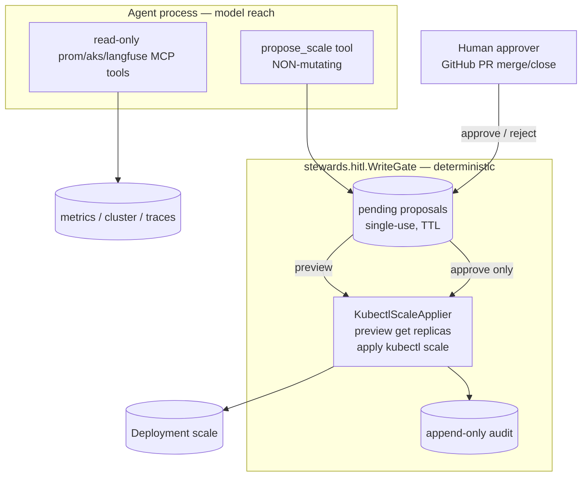

# Iteration 2 (Gated Write + HITL) — Implementation Guide: Every File Behind the Gate (SRE)

*Audience: Ram (builder). Read [`01_use_case.md`](01_use_case.md) and [ADR-0011](../../../035_others/decisions/0011-no-autonomous-actuation-hitl.md) first. This guide mirrors Quality: it references the shared HITL spine documented in the [pipeline guide](../pipeline/02_implementation_guide.md) and focuses on the SRE-specific domain code.*

## What Iteration 2 adds, in one diagram



## The shared HITL spine (same as pipeline / quality)

SRE reuses `src/stewards/hitl/` — `Proposal`, `WriteGate`, `Applier`, `AuditSink`, `channels.py`, `serve_support.py`, and `session.py`. See the [pipeline implementation guide §1](../pipeline/02_implementation_guide.md) for the full walkthrough. SRE supplies only:

| Layer | Shared `stewards.hitl` | SRE supplies |
|---|---|---|
| Proposal schema | `Proposal` base | `ScaleProposal(namespace, deployment, replicas)` |
| Gate | `WriteGate` | reused verbatim |
| Executor | `Applier` + `ApplyError` | `KubectlScaleApplier` |
| Channels | chat / GitHub PR | reused verbatim (`github_pr` live) |
| LLM tool | — | `propose_scale` |

---

## 1. `src/stewards/sre/write.py` — the domain pieces + the one LLM tool

### 1.1 `ScaleProposal` — the intent

```python
class ScaleProposal(Proposal):
    namespace: str = Field(..., min_length=1, max_length=63)
    deployment: str = Field(..., min_length=1, max_length=253)
    replicas: int = Field(..., ge=0, le=1000)

    def human_summary(self) -> str:
        return (
            f"scale Deployment/{self.deployment} in ns/{self.namespace} "
            f"to {self.replicas} replica(s)"
        )

    def spec_dict(self) -> dict:
        return {"kind": "Deployment", "namespace": self.namespace,
                "name": self.deployment, "replicas": self.replicas}

    def audit_kind(self) -> str:
        return "deployment-scale"
```

**What this buys you:** every pending proposal has the exact Kubernetes target and target replica count in structured form; audit lines can say `kind":"deployment-scale"`.

### 1.2 `KubectlScaleApplier` — deterministic preview and act

```python
class KubectlScaleApplier:
    def preview(self, proposal: Proposal) -> str:
        proposal = _as_scale(proposal)
        argv = [self._kubectl, "get", "deployment", proposal.deployment,
                "-n", proposal.namespace, "-o", "jsonpath={.spec.replicas}"]
        proc = subprocess.run(argv, capture_output=True, text=True, timeout=self._timeout)
        if proc.returncode != 0:
            err = (proc.stderr or proc.stdout or "").strip()
            denied = "forbidden" in err.lower() or "cannot " in err.lower()
            raise ApplyError(err or f"kubectl exited {proc.returncode}", denied=denied)
        current = (proc.stdout or "").strip() or "?"
        return (f"Deployment/{proposal.deployment} in ns/{proposal.namespace}: "
                f"replicas {current} -> {proposal.replicas}. No change made (dry-run).")

    def apply(self, proposal: Proposal) -> str:
        proposal = _as_scale(proposal)
        argv = [self._kubectl, "scale", f"deployment/{proposal.deployment}",
                "-n", proposal.namespace, f"--replicas={proposal.replicas}"]
        proc = subprocess.run(argv, capture_output=True, text=True, timeout=self._timeout)
        if proc.returncode != 0:
            err = (proc.stderr or proc.stdout or "").strip()
            denied = "forbidden" in err.lower() or "cannot " in err.lower()
            raise ApplyError(err or f"kubectl exited {proc.returncode}", denied=denied)
        return (f"scaled Deployment/{proposal.deployment} in ns/{proposal.namespace} "
                f"to {proposal.replicas} replica(s): {(proc.stdout or 'ok').strip()}")
```

**What this buys you:** `kubectl scale` has no server-side dry-run, so preview reads live `.spec.replicas` with `jsonpath` and reports `N -> M`. `apply` is the only mutating path and runs deterministic `kubectl scale`. `forbidden` / `cannot ` become `ApplyError(denied=True)`.

### 1.3 `build_propose_scale_tool` — guard before gate

```python
def build_propose_scale_tool(gate: WriteGate, *, allowed_namespace: str,
                             allowed_deployments: set[str], min_replicas: int,
                             max_replicas: int):
    def propose_scale(deployment: str, replicas: int, rationale: str,
                      namespace: str | None = None) -> str:
        target_ns = namespace or allowed_namespace
        proposal = ScaleProposal(namespace=target_ns, deployment=deployment,
                                 replicas=replicas, rationale=rationale,
                                 session_id=current_session_id.get())
        guard_reason = None
        if target_ns != allowed_namespace:
            guard_reason = f"namespace '{target_ns}' is out of scope; ..."
        elif allowed_deployments and deployment not in allowed_deployments:
            guard_reason = f"Deployment '{deployment}' is not in the scale allowlist (...)."
        elif not (min_replicas <= replicas <= max_replicas):
            guard_reason = f"replica count {replicas} is outside the allowed range [{min_replicas}, {max_replicas}]."
        if guard_reason is not None:
            proposal = gate.deny(proposal, guard_reason)
            return f"PROPOSAL DENIED: {guard_reason} No change was or will be made."

        proposal = gate.submit(proposal)
        return (f"PROPOSAL {proposal.id} recorded and is PENDING human approval — "
                f"nothing has been changed.\nIntent: {proposal.human_summary()}\n"
                f"Rationale: {proposal.rationale}\nDry-run preview:\n{proposal.preview}\n\n"
                f"Tell the user exactly what will happen and ask them to Approve or Reject...")
```

**What this buys you:** out-of-scope proposals are recorded as denied and never become pending/approvable. Live config: `allowedDeployments=demo-web`, `min=0`, `max=5`, namespace `meshops-workloads`.

---

## 2. `src/stewards/sre/serve.py` — wiring the gate into chat

```python
tools: list[Any] = [aks_tool, prom_tool, langfuse_tool]
if settings.write_enabled:
    ttl = settings.write_proposal_ttl_seconds
    if settings.write_approval_channel == "github_pr":
        ttl = max(ttl, PR_CHANNEL_MIN_TTL_SECONDS)
    gate = WriteGate(KubectlScaleApplier(settings.kubectl_binary), ttl_seconds=ttl)
    channel = build_channel(settings, gate)
    tools.append(build_propose_scale_tool(
        gate,
        allowed_namespace=settings.scale_namespace,
        allowed_deployments=settings.allowed_deployment_set(),
        min_replicas=settings.scale_min_replicas,
        max_replicas=settings.scale_max_replicas,
    ))
    persona = agent_module._read_prompt("sre-steward.gated-write.chat.md")
    LOG.info("[chat] WRITE-ENABLED: HITL gate armed for Deployment scale in ns/%s via '%s' channel",
             settings.scale_namespace, channel.name)
    if channel.name == "github_pr":
        state["poll_task"] = asyncio.create_task(poll_loop(channel, gate, settings.github_poll_seconds))
else:
    persona = agent_module._read_prompt("sre-steward.chat.md")
```

**What this buys you:** write is a deploy-time capability flag. With `writeEnabled=false`, no tool, no gated persona, no poll loop. With `github_pr`, TTL is bumped for async review and a 20s poll loop reconciles PR state.

---

## 3. `src/stewards/sre/settings.py` — bounds and channels

```python
write_enabled: bool = Field(False)
write_proposal_ttl_seconds: int = Field(900, ge=30)
write_approval_channel: str = Field("chat")
scale_namespace: str = Field("meshops-workloads")
scale_allowed_deployments: str = Field("")
scale_min_replicas: int = Field(0, ge=0)
scale_max_replicas: int = Field(10, ge=1)
kubectl_binary: str = Field("kubectl")
github_repo: str = Field("")
github_base_branch: str = Field("main")
github_proposals_dir: str = Field("hitl-proposals")
github_poll_seconds: int = Field(20, ge=5)

def allowed_deployment_set(self) -> set[str]:
    return {d.strip() for d in self.scale_allowed_deployments.split(",") if d.strip()}
```

**Invariant:** Helm sets both `WRITE_NAMESPACE`'s RBAC namespace and `SCALE_NAMESPACE` from the same `writeNamespace` value. In app terms, `SCALE_NAMESPACE == writeNamespace` is the contract that makes the guard and Kubernetes Role agree.

---

## 4. `prompts/sre-steward.gated-write.chat.md` — propose-only persona

```markdown
In this iteration you can **read anything** the platform exposes and you may
**propose one kind of change — scaling a Deployment's replica count** ... but
**every scale requires a human's approval at the gate before it happens.**
You never scale anything yourself.
```

Key clauses: read first, call `propose_scale`, relay the preview/proposal id, wait, never claim the scale happened, decline all non-Deployment-scale writes.

---

## 5. Helm — values, deployment, and write RBAC

### 5.1 `helm/sre/values.yaml`

```yaml
writeEnabled: false
writeNamespace: meshops-workloads
writeApprovalChannel: chat
scale:
  allowedDeployments: ""
  minReplicas: 0
  maxReplicas: 10
github:
  repo: ""
  baseBranch: main
  proposalsDir: hitl-proposals
  pollSeconds: 20
```

### 5.2 `helm/sre/templates/deployment.yaml`

```yaml
- name: WRITE_ENABLED
  value: "true"
- name: WRITE_APPROVAL_CHANNEL
  value: {{ .Values.writeApprovalChannel | quote }}
- name: SCALE_NAMESPACE
  value: {{ .Values.writeNamespace | quote }}
- name: SCALE_ALLOWED_DEPLOYMENTS
  value: {{ .Values.scale.allowedDeployments | quote }}
- name: SCALE_MIN_REPLICAS
  value: {{ .Values.scale.minReplicas | quote }}
- name: SCALE_MAX_REPLICAS
  value: {{ .Values.scale.maxReplicas | quote }}
```

### 5.3 `helm/sre/templates/write-rbac.yaml`

The write Role is rendered only when `writeEnabled=true`, in `.Values.writeNamespace`, and is bound to the steward ServiceAccount. It is bounded to exactly the SRE steward's one gated write: read `deployments` (for the replica-count preview) and mutate the `deployments/scale` subresource in `meshops-workloads` — nothing else (no pods, configmaps, statefulsets, KAITO Workspaces, secrets, or cluster-scoped resources). This is the layer-3 backstop: even an approved-but-wrong request is physically capped at scaling a Deployment.

```yaml
{{- if .Values.writeEnabled }}
kind: Role
metadata:
  namespace: {{ .Values.writeNamespace }}
---
kind: RoleBinding
subjects:
  - kind: ServiceAccount
    name: {{ .Values.serviceAccount.name }}
    namespace: {{ .Values.namespace }}
{{- end }}
```

---

## File → Purpose map

| File | Purpose |
|---|---|
| `src/stewards/hitl/*` | shared gate/channels/serve_support/session (see [pipeline guide §1](../pipeline/02_implementation_guide.md)) |
| `src/stewards/sre/write.py` | `ScaleProposal` + `KubectlScaleApplier` + guarded `propose_scale` |
| `src/stewards/sre/serve.py` | flag-gated wiring, PR channel, `/approve`/`/reject`/`/reconcile`, poll loop |
| `src/stewards/sre/settings.py` | write flag, namespace, allowlist, replica bounds, GitHub PR settings |
| `prompts/sre-steward.gated-write.chat.md` | propose-only persona |
| `helm/sre/values.yaml`, `templates/deployment.yaml` | deploy-time flag and env; `SCALE_NAMESPACE` from `writeNamespace` |
| `helm/sre/templates/write-rbac.yaml` | namespaced writer Role/RoleBinding for approved scale execution |
| `helm/sre/extras/demo-workload.yaml` | safe `demo-web` target, normally 1 replica |
| `tests/unit/test_sre_write.py` | domain guard and scale proposal lifecycle |

## Limitations / next

- Approval identity is the PR merger's login (`github_pr`) or `operator (chat)`.
- Audit is the logging sink (`kind":"deployment-scale"`); immutable storage remains follow-up.
- No KAITO Workspace scale; `resource.count` is immutable.

## Sources

- Repo: `src/stewards/sre/{write,serve,settings}.py`, `prompts/sre-steward.gated-write.chat.md`, `helm/sre/{values.yaml,templates/deployment.yaml,templates/write-rbac.yaml,extras/demo-workload.yaml}`, `tests/unit/test_sre_write.py`.
- Shared gate: `src/stewards/hitl/*`; [pipeline implementation guide](../pipeline/02_implementation_guide.md).
- [ADR-0011 — no autonomous actuation](../../../035_others/decisions/0011-no-autonomous-actuation-hitl.md).
