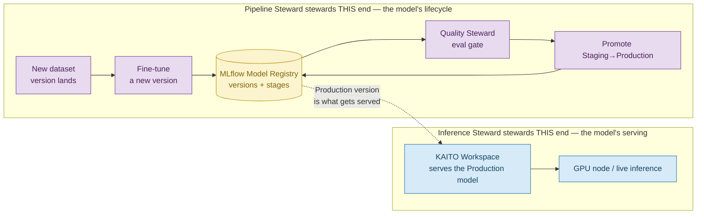

# Iteration-02 — The Use Case: Teaching the Pipeline Steward to Watch the Registry

*Audience: Ram (builder). Read this first — it is the story of what iteration-02's agent actually does, and — because this is the question you asked — **how it relates to the Inference Steward you already understand.** Read it before the implementation guide, the tests, or the deployment guide.*

You already know the Inference Steward. It sits beside a running GPU node, opens its eyes every so often, looks at a **live KAITO Workspace**, and reports how the *serving* looks. It answers the question *"is the model that's deployed healthy right now?"*

The Pipeline Steward answers a **different question, one step upstream**: *"which version of the model should be deployed at all — and is the next candidate ready to be promoted?"* It never looks at the GPU node. It looks at the **MLflow Model Registry** — the ledger that records every trained version of a model and what lifecycle stage each one is in (`None → Staging → Production → Archived`). Where the Inference Steward stewards *serving*, the Pipeline Steward stewards *promotion*.

This iteration builds only the **read-only half** of the Pipeline Steward — the same disciplined `observe → reason → report` slice you built for Inference — so you get a second, differently-shaped agent without any blast radius, and you get to see how two stewards that watch two different substrates are actually watching **two ends of the same model's life**.

> **UC-03 — Pipeline runs a fine-tune and proposes a promotion (read-only `observe → reason → report` slice)**
>
> **Why this slice:** UC-03 (`030_design/01_use_cases.md` §UC-03) is the MLOps steward. The *full* UC-03 is a multi-stage loop — fine-tune → hand off to Quality for an eval gate → **propose** a registry promotion → human approves → the write lands in MLflow. Iteration-02 deliberately implements only the **observe → reason → report** left-half: the steward *reads* the registry and *explains* promotion-readiness, but proposes nothing and writes nothing. This proves the second steward's shape (a new substrate, a new MCP tool, a new schema) while reusing the entire observability + identity spine from iteration-01.
>
> **Actor:** The `hello-pipeline` agent (the Pipeline Steward, MAF Python, on the lab AKS cluster), triggered by Ram (the Operator) or a periodic cycle.
>
> **Preconditions:** An in-cluster MLflow tracking + registry server, a seeded registered model (`phi-4-mini-meshops`) with versions across stages, Workload Identity federated to the agent's ServiceAccount, Langfuse in-cluster, and an Azure OpenAI `gpt-4.1` deployment. · **Out of scope:** any *write* — no stage transition, no model registration, no HITL gate crossed, no write-capable MCP tool enabled. Those (and the Quality handoff) land in a later iteration.

---

## 1. The one-paragraph version (read this if you read nothing else)

The `hello-pipeline` agent — a single MAF-hosted Pipeline Steward — observes **one registered model** (`phi-4-mini-meshops`) in an in-cluster **MLflow Model Registry** by calling a read-only **MLflow-MCP** shim over the MLflow REST API. It reasons over what it reads using **Azure OpenAI `gpt-4.1`** — *how many versions exist, which is in Staging, which is in Production, which candidate is waiting to be promoted* — and emits a plain-English status (or a structured `PipelineObservation` JSON line), while a Langfuse trace records every step. **No promotion is proposed, no HITL gate is crossed, no write tool exists.** It is the Inference Steward's discipline applied to a completely different substrate.

**Checkpoint:** One agent, one registry, a handful of reads, one reasoning call, one report, zero writes — the same shape as Inference, pointed at the model's *lifecycle* instead of its *serving*.

---

## 2. What Is an MLflow Model Registry (the substrate, in plain English)

Where we are in the story: the Inference Steward's substrate — a KAITO Workspace — was familiar ground for you. The Pipeline Steward's substrate is the *new* ground, so we slow down here.

When a team trains a model, they don't just get "the model" — they get a **stream of candidate versions** over time: v1 trained on last month's data, v2 with a better recipe, v3 on this week's dataset. The **Model Registry** is the filing cabinet that keeps all of them and, crucially, tags each with a **lifecycle stage**:

| Stage | Meaning |
|---|---|
| `None` | Freshly registered. Nobody has decided anything about it yet. |
| `Staging` | Under validation — the candidate being considered for release. |
| `Production` | The blessed version. This is what should be serving live. |
| `Archived` | Retired. Was once relevant, now superseded. |

A healthy pipeline moves a version **forward one stage at a time**: a new v3 lands in `Staging`, gets validated, and is promoted to `Production`, at which point the old `Production` version is `Archived`. The registry is therefore the **single source of truth for "which version is the chosen one."**

Our lab registry is seeded with exactly that shape for `phi-4-mini-meshops`:

```
phi-4-mini-meshops
  ├─ v1  Archived     (eval_accuracy 0.71)   ← the old release, retired
  ├─ v2  Production   (eval_accuracy 0.83)   ← what should be serving now
  └─ v3  Staging      (eval_accuracy 0.86)   ← the candidate awaiting promotion
```

**Checkpoint:** The registry is a versioned ledger with stages. "Promotion-readiness" — the Pipeline Steward's whole job — is just reasoning about whether the `Staging` candidate (v3) looks ready to become the new `Production`.

---

## 3. How the Two Stewards Connect (the part you asked about)

Where we are in the story: this is the heart of your question — *how do Inference and Pipeline work together?* The short answer: **they steward two ends of the same model's life, and the registry is the handoff point between them.**

Think of the whole platform as an assembly line for one model, `phi-4-mini`:



***Figure 1: The two stewards sit at opposite ends of one model's life. The Pipeline Steward watches how versions move through the registry (upstream); the Inference Steward watches how the chosen version serves on the GPU node (downstream). The registry's `Production` stage is the contract between them.***

Read it as a sentence:

> The **Pipeline Steward** decides *which* version of `phi-4-mini` deserves to be live (by watching the registry). The **Inference Steward** watches *how well that live version is actually serving* (by watching the KAITO Workspace). The **registry's `Production` tag** is the baton passed from one to the other.

Concretely, they connect through **one shared model, `phi-4-mini-meshops`**:

- The Pipeline Steward's registry entry `phi-4-mini-meshops` v2 is tagged `Production`. That is the *statement of intent*: "v2 is the version that should be serving."
- The Inference Steward's KAITO Workspace `lab-phi-4-mini-eus2-01` is *serving* a phi-4-mini model on a GPU node. That is the *fact on the ground*: "here is what's actually running."
- In the **full** mesh (later iterations), a promotion in the registry (Pipeline's world) would eventually flow through to a redeploy of the KAITO Workspace (Inference's world). Today, in the **read-only** iterations, neither steward acts — but you can already stand them side by side and ask each its half of the story.

### Same skeleton, different organ

The reason building the second steward was fast is that it is the **same agent skeleton** as the first, with three parts swapped:

| Part | Inference Steward | Pipeline Steward |
|---|---|---|
| **Substrate** (what it watches) | KAITO Workspace (Kubernetes) | MLflow Model Registry (REST) |
| **Tool** (how it reads) | `aks-mcp` + `prom-mcp` | `mlflow-mcp` |
| **Schema** (what it reports) | `InferenceObservation` (replicas, GPU%) | `PipelineObservation` (versions, stages) |
| **Reasoning model** | Azure OpenAI `gpt-4.1` | *same* |
| **Tracing / identity / chat UI** | Langfuse + Workload Identity + FastAPI | *same* |
| **Discipline** | read-only, 3 no-write guarantees | *same* |

**Checkpoint:** Two stewards, one model, one baton (the registry's `Production` tag). Inference = serving health (downstream). Pipeline = promotion readiness (upstream). Everything except the substrate/tool/schema is shared machinery you already understand.

---

## 4. Where This Slice Sits in the Full UC-03

Where we are in the story: just like iteration-01 stopped at a cliff edge before the agent's first *opinion about what to do*, iteration-02 stops at the same edge — it reads and explains the registry, but never proposes a promotion.

```mermaid
flowchart LR
    classDef done fill:#D6F0D6,stroke:#2E8B2E,color:#143F14
    classDef gate fill:#FFE0B2,stroke:#D68910,color:#7B4F12
    classDef cut fill:#FFD6D6,stroke:#B22222,color:#5A0F0F

    O[Observe<br/>read registered model +<br/>versions/stages via MLflow-MCP]:::done
    R[Reason<br/>is the Staging candidate<br/>promotion-ready?]:::done
    Rep[Report<br/>plain-English status +<br/>Langfuse trace]:::done
    Q[Quality handoff<br/>eval gate suite]:::gate
    P[Propose<br/>promote Staging→Production]:::gate
    G[HITL gate<br/>human approves]:::gate
    A[Act<br/>write stage transition<br/>to MLflow]:::cut

    O --> R --> Rep
    Rep -.->|later iteration extends here| Q --> P --> G --> A
```



***Figure 2: The full UC-03 loop. Iteration-02 builds only the three green boxes (observe → reason → report). The Quality handoff, the promotion proposal, the HITL gate, and the registry write are all deliberately deferred so the agent has no way to change the registry yet.***

**Checkpoint:** Read-only observe slice today; propose/gate/act (and the Pipeline→Quality handoff) later — the exact same staging strategy as iteration-01.

---

## 5. The Three No-Write Guarantees (identical philosophy to iteration-01)

The Pipeline Steward *cannot* change the registry, and this is enforced three independent ways — the same defence-in-depth you built for Inference:

1. **Tools.** The `mlflow-mcp` shim exposes only read verbs — `list_registered_models`, `get_registered_model`, `list_model_versions`. There is literally no function it can call that transitions a stage, registers a version, or deletes anything.
2. **Persona.** The system and chat prompts forbid any registry write and instruct the steward to *decline* promotion requests and explain that it is read-only.
3. **Schema.** The `PipelineObservation` output has no field capable of expressing a write, and its `requires_hitl` validator hard-fails if the model ever tries to set it `True`.

Any one of these would stop a write. All three together mean a prompt-injection or a confused model still cannot mutate the registry.

**Checkpoint:** Tools can't, persona won't, schema forbids. Three locks, one door.

---

## 6. Acceptance Criteria (what "done" means for this slice)

| # | Criterion |
|---|---|
| AC-1 | Boots under Workload Identity (no smuggled key); resolves Azure OpenAI + Langfuse. |
| AC-2 | Connects the `mlflow-mcp` tool and reads `phi-4-mini-meshops` from the live registry. |
| AC-3 | Correctly reports version counts and stages (v1 Archived, v2 Production, v3 Staging). |
| AC-4 | Identifies v3 (Staging) as the candidate awaiting promotion, grounded in real registry data. |
| AC-5 | **No-write:** declines any promotion/transition/delete request; explains it is read-only. |
| AC-6 | Self-identifies as the *Pipeline Steward*, never as a generic assistant or model name. |
| AC-7 | Emits a Langfuse trace (with `trace_id`) for every observe cycle and every chat turn. |
| AC-8 | Schema `requires_hitl=True` is rejected (third no-write layer). |

The manual walkthrough in `03_test_cases_manual.md` gives you a prompt for each of these.

---

## 7. What You'll Read Next

- **`02_implementation_guide.md`** — how the code is built (module, MLflow-MCP shim, chart, MLflow substrate).
- **`03_test_cases_manual.md`** — **the hands-on prompt playbook** you asked for: exact prompts to paste into the chat, and what a correct answer looks like for each.
- **`05_deployment_guide.md`** — deploy + teardown steps, including the cost note.
