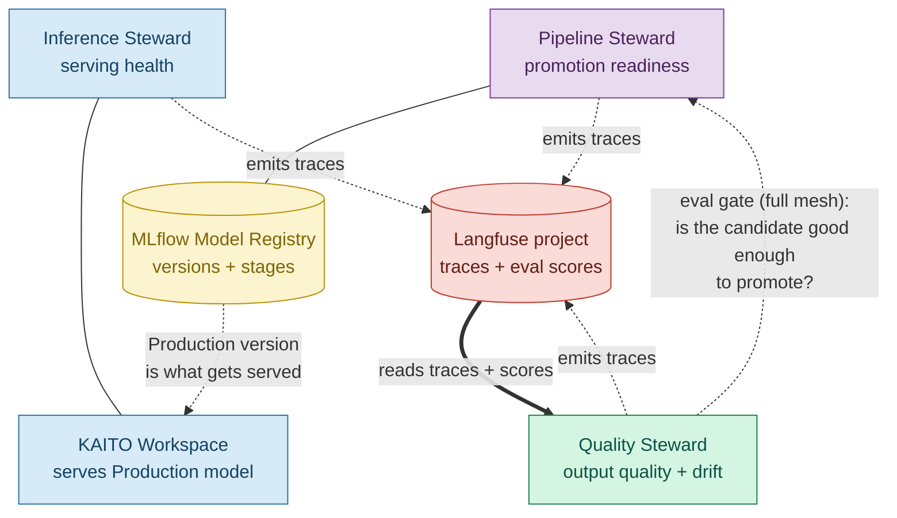

# Iteration-03 — The Use Case: Teaching the Quality Steward to Watch the Traces

*Audience: Ram (builder). Read this first — it is the story of what iteration-03's agent actually does, and **how it relates to the Inference and Pipeline Stewards you already understand.** Read it before the implementation guide, the tests, or the deployment guide.*

You now have two stewards. The **Inference Steward** watches a live GPU node and answers *"is the deployed model serving healthily right now?"* The **Pipeline Steward** watches the MLflow registry and answers *"which version should be deployed, and is the next candidate ready to promote?"*

The Quality Steward answers a **third question, orthogonal to both**: *"regardless of which version is live and how the node looks — is the model's actual output any good, and is it getting worse?"* It never looks at the GPU node, and it never looks at the registry. It looks at the **Langfuse project** — the running log of every LLM interaction the platform produces, plus the **evaluation scores** attached to them. Where Inference stewards *serving* and Pipeline stewards *promotion*, the Quality Steward stewards **output quality and drift**.

This iteration builds only the **read-only half** of the Quality Steward — the same disciplined `observe → reason → report` slice you built twice already — so you get a third, differently-shaped agent without any blast radius, and you get to see how a steward that watches *traces* is watching **the output of the very stewards you already built**.

> **UC — Quality Steward runs a drift scan and proposes a prompt fix (read-only `observe → reason → report` slice)**
>
> **Why this slice:** The Quality Steward (`035_others/agent-catalog.md` §5) is the LLMOps-quality steward. The *full* job is a loop — scan trace/eval batches → detect drift → **propose a prompt-version PR** → human approves → the PR merges. Iteration-03 deliberately implements only the **observe → reason → report** left-half: the steward *reads* recent traces and evaluation scores and *explains* quality health, but proposes no PR and writes nothing. This proves the third steward's shape (a new substrate, a new MCP tool, a new schema) while reusing the entire observability + identity spine from the first two.
>
> **Actor:** The `hello-quality` agent (the Quality Steward, MAF Python, on the lab AKS cluster), triggered by Ram (the Operator) or a periodic cycle.
>
> **Preconditions:** The in-cluster Langfuse project (already running — it's where every steward emits its traces), Workload Identity federated to the agent's ServiceAccount, and an Azure OpenAI `gpt-4.1` deployment. · **Out of scope:** any *write* — no prompt-version PR, no dataset edit, no score creation, no trace deletion, no HITL gate crossed, no write-capable MCP tool. Those (and the Pipeline→Quality eval-gate handoff) land in a later iteration.

---

## 1. The one-paragraph version (read this if you read nothing else)

The `hello-quality` agent — a single MAF-hosted Quality Steward — observes recent **LLM traces and evaluation scores** in the in-cluster **Langfuse** project by calling a read-only **Langfuse-MCP** shim over the Langfuse public REST API. It reasons over what it reads using **Azure OpenAI `gpt-4.1`** — *how many traces are there, how many carry eval scores, what's the mean score, does it look like quality is drifting down* — and emits a plain-English status (or a structured `QualityObservation` JSON line), while a Langfuse trace records every step. **No prompt PR is proposed, no HITL gate is crossed, no write tool exists.** It is the two earlier stewards' discipline applied to a completely different substrate.

**Checkpoint:** One agent, one Langfuse project, a handful of reads, one reasoning call, one report, zero writes — the same shape as before, pointed at the model's *output quality* instead of its serving or its lifecycle.

---

## 2. What Is a Langfuse Project (the substrate, in plain English)

Where we are in the story: the Inference Steward's substrate was a KAITO Workspace; the Pipeline Steward's was an MLflow registry. The Quality Steward's substrate is the one piece of infrastructure that has been quietly present the whole time — **Langfuse** — so we slow down here.

Every steward you have built already **emits a trace** to Langfuse on every observe cycle and every chat turn (that's the `trace_id` you've been grabbing from replies). Langfuse is the platform's **observability ledger for LLM behaviour** — it records, for each interaction:

| Concept | Meaning |
|---|---|
| **Trace** | One end-to-end LLM interaction (a chat turn or an observe cycle), with its inputs, outputs, and timing. |
| **Observation** | A step *inside* a trace — an individual model call or tool call. |
| **Score** | An **evaluation result** attached to a trace: a `name` (e.g. `faithfulness`, `relevance`), a `value`, and a `dataType` (`NUMERIC`/`CATEGORICAL`/`BOOLEAN`). Scores are how you measure whether output is *good*. |

A healthy platform produces traces whose scores stay **high and stable** over time. When scores trend **downward** — the model's answers get less faithful, less relevant, more toxic — that is **drift**, and catching it early is the Quality Steward's entire reason to exist.

> **Reality note for the lab:** traces are plentiful (every steward emits them), but *evaluation scores* only exist once something writes them — a Ragas/Promptfoo/Foundry eval job, or the Langfuse UI. So on a fresh lab the Quality Steward will often honestly report **"N traces observed, 0 scored"** — which is the correct, grounded answer, and exactly the honesty you want (see test P-08). Seeding real scores is a later iteration's job.

**Checkpoint:** Langfuse is the LLM-behaviour ledger every steward already writes to. Traces = interactions; scores = quality measurements. "Drift" — the Quality Steward's whole job — is just reasoning about whether those scores are trending down.

---

## 3. How the Three Stewards Connect (the part that matters)

Where we are in the story: you understood how Inference and Pipeline connect (two ends of one model's life, joined by the registry's `Production` tag). The Quality Steward joins the picture from a **third angle** — and it connects to the mesh in *two* distinct ways.

***Figure 1: The Quality Steward reads the Langfuse ledger that every steward writes to (the heavy arrow), so it is a lens over the whole mesh's output. In the full mesh it also feeds the Pipeline Steward an eval verdict before a promotion (the dotted arrow) — the "is this candidate actually good?" gate.***

**Connection #1 — Quality is the mesh's quality lens (live today).**
Every steward emits its LLM traces to the same Langfuse project. So when the Quality Steward reads "recent traces and their scores," it is literally reading **the output of the Inference and Pipeline Stewards themselves** (and its own). It is the one steward whose substrate is *the behaviour of the other stewards*. You can prove this live: talk to the Inference Steward, then ask the Quality Steward what it sees — your conversation shows up as a trace.

**Connection #2 — Quality is the eval gate before promotion (full mesh, later).**
Recall the Pipeline Steward decides *which version* should be `Production`. In the full UC, it doesn't promote blindly — it hands the candidate to the **Quality Steward** for an **eval gate**: *"before v3 becomes Production, is it actually better than v2?"* Quality runs its evals, scores the candidate, and returns a verdict that informs the promotion. So Quality sits **between** Pipeline's "which version" and the promotion itself:

> **Pipeline** picks the candidate → **Quality** judges whether it's good enough → (human approves) → promotion. **Inference** then serves whatever wins.

### Same skeleton, different organ (now three across)

The reason building the third steward was fast is that it is the **same agent skeleton** again, with three parts swapped:

| Part | Inference | Pipeline | **Quality (new)** |
|---|---|---|---|
| **Substrate** (what it watches) | KAITO Workspace | MLflow registry | **Langfuse project (traces + scores)** |
| **Tool** (how it reads) | `aks-mcp` + `prom-mcp` | `mlflow-mcp` | **`langfuse-mcp`** |
| **Schema** (what it reports) | `InferenceObservation` | `PipelineObservation` | **`QualityObservation`** |
| **Reasoning model** | Azure OpenAI `gpt-4.1` | *same* | *same* |
| **Tracing / identity / chat UI** | Langfuse + WI + FastAPI | *same* | *same* |
| **Discipline** | read-only, 3 no-write guarantees | *same* | *same* |

**Checkpoint:** Three stewards now. Inference = serving health. Pipeline = promotion readiness. Quality = output quality/drift. Quality is special: its substrate *is the mesh's own output*, and in the full mesh it gates Pipeline's promotions. Everything except substrate/tool/schema is shared machinery.

---

## 4. Where This Slice Sits in the Full Quality Loop

Where we are in the story: just like the first two iterations stopped before the agent's first *opinion about what to change*, iteration-03 stops at the same edge — it reads and explains quality, but never proposes a prompt fix.

```mermaid
flowchart LR
    classDef done fill:#D6F0D6,stroke:#2E8B2E,color:#143F14
    classDef gate fill:#FFE0B2,stroke:#D68910,color:#7B4F12
    classDef cut fill:#FFD6D6,stroke:#B22222,color:#5A0F0F

    O[Observe<br/>read recent traces + scores<br/>via Langfuse-MCP]:::done
    R[Reason<br/>is quality healthy?<br/>is it drifting down?]:::done
    Rep[Report<br/>plain-English status +<br/>Langfuse trace]:::done
    D[Detect drift<br/>run Ragas/Promptfoo/Foundry<br/>evals on trace batches]:::gate
    P[Propose<br/>open a prompt-version PR]:::gate
    G[HITL gate<br/>human reviews + merges PR]:::gate
    A[Act<br/>PR merges; prompt changes]:::cut

    O --> R --> Rep
    Rep -.->|later iteration extends here| D --> P --> G --> A
```

***Figure 2: The full Quality loop. Iteration-03 builds only the three green boxes (observe → reason → report). The eval-suite run, the prompt-PR proposal, the HITL gate, and the merge are all deliberately deferred so the agent has no way to change a prompt yet. `drift_suspected` in the output is a read-only signal — it flags a concern, it does not open a PR.***

**Checkpoint:** Read-only observe slice today; detect/propose/gate/act later — the exact same staging strategy as iterations 01 and 02.

---

## 5. The Three No-Write Guarantees (identical philosophy to iterations 01–02)

The Quality Steward *cannot* change anything, and this is enforced three independent ways — the same defence-in-depth as the earlier stewards:

1. **Tools.** The `langfuse-mcp` shim exposes only read verbs — `list_traces`, `get_trace`, `list_scores`. There is literally no function it can call that opens a PR, edits a dataset, writes a score, or deletes a trace.
2. **Persona.** The system and chat prompts forbid any write and instruct the steward to *decline* prompt-fix/PR requests and explain that it is read-only. They also scope `drift_suspected` explicitly as a *signal, not an action*.
3. **Schema.** The `QualityObservation` output has no field capable of expressing a write (no `proposed_prompt_pr`), and its `requires_hitl` validator hard-fails if the model ever tries to set it `True`.

Any one of these would stop a write. All three together mean a prompt-injection or a confused model still cannot mutate a prompt, a score, or a trace.

**Checkpoint:** Tools can't, persona won't, schema forbids. Three locks, one door — for the third time.

---

## 6. Acceptance Criteria (what "done" means for this slice)

| # | Criterion |
|---|---|
| AC-1 | Boots under Workload Identity (no smuggled key); resolves Azure OpenAI + Langfuse. |
| AC-2 | Connects the `langfuse-mcp` tool and reads recent traces + scores from the live Langfuse project. |
| AC-3 | Correctly reports counts (traces observed, scored traces, total scores) grounded in real data. |
| AC-4 | Reasons about quality health and drift (mean score / trend), or honestly reports "no scores yet." |
| AC-5 | **No-write:** declines any PR / prompt-change / score-write / trace-delete request; explains it is read-only. |
| AC-6 | Self-identifies as the *Quality Steward*, never as a generic assistant or model name. |
| AC-7 | Emits a Langfuse trace (with `trace_id`) for every observe cycle and every chat turn. |
| AC-8 | Schema `requires_hitl=True` is rejected (third no-write layer). |

The manual walkthrough in `03_test_cases_manual.md` gives you a prompt for each of these.

---

## 7. What You'll Read Next

- **`02_implementation_guide.md`** — how the code is built (module, Langfuse-MCP shim, chart, Langfuse substrate).
- **`03_test_cases_manual.md`** — **the hands-on prompt playbook**: exact prompts to paste into the chat, and what a correct answer looks like for each.
- **`05_deployment_guide.md`** — deploy + verify + teardown steps, including the Workload-Identity and subnet-NSG steps.
