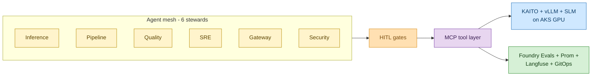

# MeshOps

> **Multi-agent mesh runs AKS LLMOps, MLOps, AIOps, security autonomously.**

A career-portfolio project: a *mesh-based operations discipline* in which six specialist AI stewards — built on Microsoft Agent Framework + Azure AI Foundry, reaching Azure Kubernetes Service via Model Context Protocol (MCP) servers — autonomously operate a production LLM/SLM platform on AKS.



<details>
<summary>ASCII fallback</summary>

```
   ┌─────────────────────────────────────┐
   │   Agent mesh (6 stewards)           │
   │   Inference  Pipeline  Quality      │
   │   SRE        Gateway   Security     │
   └────────────────┬────────────────────┘
                    │
                    ▼
             ┌─────────────┐
             │  HITL gates │
             └──────┬──────┘
                    │
                    ▼
             ┌─────────────┐
             │  MCP layer  │
             └──┬───────┬──┘
                │       │
                ▼       ▼
       ┌──────────┐  ┌─────────────────┐
       │ KAITO +  │  │ Foundry Evals + │
       │ vLLM +   │  │ Prom +          │
       │ SLM/AKS  │  │ Langfuse +      │
       └──────────┘  │ GitOps          │
                     └─────────────────┘
```

</details>

**Author:** Kuruva Ramanjaneyulu (Ram) · **Status:** iteration 1 — planning docs only, no code yet · **Visibility:** public from day 1

---

## The six stewards

| Steward | Owns | -Ops surface |
|---|---|---|
| **Inference** | KAITO Workspace lifecycle, vLLM parallelism tuning, KV-cache routing, LLM↔SLM variant selection | LLMOps (serving) |
| **Pipeline** | Fine-tune → eval → registry promotion via Foundry Prompt Flow / Kubeflow on AKS | MLOps |
| **Quality** | Ragas / Promptfoo / Foundry-eval suites, drift detection, prompt-version PRs | LLMOps (quality) |
| **SRE** | Prometheus + Langfuse correlation, scaler tuning, postmortem drafting | AIOps |
| **Gateway** | LiteLLM / Envoy AI Gateway config, A/B routes, cost budgets, fallback chains | LLMOps (routing/cost) |
| **Security** | Prompt-injection-through-cluster-state detection, MCP confused-deputy defense, RAG poisoning checks, cross-agent trust | SecOps |

---

## Start here (reading order)

**Proposal & design layer** — the standardized portfolio format:

1. [Project proposal](020_project_proposal/proposal.md) — the personal MeshOps proposal
2. [Design · Use cases](030_design/01_use_cases.md) — **canonical** UC-01…UC-16 catalog
3. [Design · PRD](030_design/02_prd.md) — FR-01…FR-14, NFR-01…NFR-10, MVP vs roadmap
4. [Design · Architecture](030_design/03_architecture.md) — **canonical** planes, steward loop, MAF topology, end-to-end flows
5. [Design · Tech stack](030_design/04_tech_stack.md) — design-altitude stack justification

**Context & deep reference** (`035_others/`):

6. [Vision](035_others/vision.md) — mission, audience, success criteria, why-this-for-Ram
7. [AI career roadmap](035_others/ai-career-roadmap.md) — phase plan, AI-300 cert milestone (P3/P4), KAITO PR track
8. [Agent catalog](035_others/agent-catalog.md) — one page per steward: prompt, MCP tools, KPIs, escalation rules
9. [Planes and MCP](035_others/planes-and-mcp.md) — MCP server set, plane-to-resource access matrix
10. [Eval and LLMOps](035_others/eval-and-llmops.md) — eval frameworks, drift signals, prompt-as-code PR flow
11. [Threat model](035_others/threat-model.md) — OWASP LLM Top-10 + multi-agent-system (MAS) extensions
12. [Related work](035_others/related-work.md) — position vs HolmesGPT, K8sGPT, KAITO-only, llm-d, AgentOps refs
13. [Cost and deployment](035_others/cost-and-deployment.md) — Azure topology, GPU spot strategy, budget projection
14. [Tech stack (exhaustive)](035_others/tech-stack.md) — every named technology across P0–P4 + Advanced, per-library pins, phase-introduced column
15. [Glossary](035_others/glossary.md) — DevOps↔AI collision terms, agentic + MCP + project-specific
16. [ADRs](035_others/decisions/) — architectural decision records, numbered 0001-NNNN

**Build:**

17. [Iterations](040_iterations/) — per-iteration deliverable bundles. Current: [iteration-01 (P0 Foundations)](040_iterations/iteration-01/)

> **Consolidation note:** the proposal and the use-cases/architecture/tech-stack
> design docs are now canonical under `020_project_proposal/` and `030_design/`.
> `035_others/use-cases.md` and `035_others/architecture.md` are thin forward-pointers to their
> `030_design/` equivalents, and the old one-page exec proposal summary at `035_others/proposal.md`
> was retired (recover it from git history if a recruiter one-pager is needed). The remaining
> `035_others/` docs — vision, roadmap, agent catalog, planes/MCP, eval, threat model, related work,
> cost, exhaustive tech-stack, glossary, and the ADRs — stay canonical.

---

## Stack at a glance

| Layer | Choice | Rationale |
|---|---|---|
| Agent runtime | Microsoft Agent Framework + Semantic Kernel + LangGraph (mixed) | ADR-0003 |
| One managed steward | Azure AI Foundry Agent Service | ADR-0004 |
| Inference substrate | KAITO + vLLM (LLMs); KAITO + Phi family (SLMs) on AKS GPU | ADR-0005 |
| Tool layer | MCP servers — AKS-MCP, GitHub MCP, Azure MCP slice, Prometheus MCP, Langfuse MCP | ADR-0006 |
| Eval | Ragas + Promptfoo + Foundry Evaluations | ADR-0007 |
| Gateway | LiteLLM + Envoy AI Gateway (KV-cache-aware via InferencePool/EPP) | ADR-0008 |
| Observability | Prometheus + Grafana + Langfuse, OpenTelemetry across MCP calls | ADR-0010 |
| HITL policy | No autonomous actuation — all write actions go through human gates | ADR-0011 |
| Identity | Microsoft Entra ID (Entra Agent ID for stewards in advanced track) | post-P4 |

---

## Audience

**Primary:** recruiters and hiring managers screening for AI Platform Engineer / MLOps / LLMOps Engineer roles, especially within Microsoft.

**Secondary:** Microsoft internal contacts considering Ram for transfer into MAI / Azure AI / AKS / Foundry teams.

**Tertiary:** future-Ram revisiting his own design rationale after the build is shipped.

---

## License

License TBD — to be added as part of Phase 0 kickoff. See [CLAUDE.md §Confidentiality](CLAUDE.md) for content restrictions (no proprietary Microsoft day-job content).
